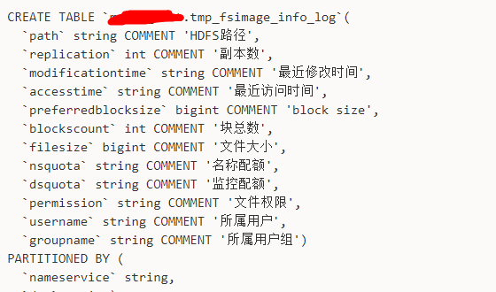

# 0.数据治理体系概述

## 0.1数据治理概述

1. 为什么要做数据治理? 

   > - 公司有哪些资产？
   > - 数据从哪里来？用到哪些地方？
   > - 所有数据的使用是否均符合规范和制度？
   > - 数据属于哪些部门、业务线？数据的成本和价值比如何？

    **数据治理的核心工作：在企业的数据建设进程中，保障企业的数据资产得到正确有效的管理。最大化保障企业数据的采集、存储、计算和使用过程的可控和可追溯**

   ``` mermaid
   flowchart TB
   	%% subgraph用来定义外部方框  方框名称
   	subgraph 数据治理定位
   		%% 定义方向
   		direction TB
           id1>数据开发] --> |产生问题|数据从产生到应用全流程
           subgraph 数据从产生到应用全流程
           	a1(数据产生)-->a2(数据采集)-->a3(数据生产)-->a4(数据存储)-->a5(数据应用)-->a6(数据销毁)
               %% a2到a5设计方框格式
               style a2 fill:#f9f,stroke:#333,stroke-width:4px
               style a3 fill:#f9f,stroke:#333,stroke-width:4px
               style a4 fill:#f9f,stroke:#333,stroke-width:4px
               style a5 fill:#f9f,stroke:#333,stroke-width:4px
               %% 为a1添加链接
               %% click a1 "http://www.baidu.com" "这是一个链接"
           end
           数据从产生到应用全流程 --- |消除问题|d2>数据治理]
       end
   ```

2. 数据治理治理什么以及价值？

   **数据治理是一种数据管理概念**，确保组织能在数据的**全生命周期**中具有**高质量的数据质量能力**，并且实现对数据的完全管理，以**支持业务**的目标。

   所以数据治理的目标有以下几点：

   - 最大化数据的价值
   - 管理数据的风险
   - 降低数据的成本

   数据治理是一个比较大的概念，包括政策、规则、组织结构、治理过程，以及一些技术支持。它的领域包括数据质量、数据成本、数据可用性以及数据安全等方面。所以影响数据治理计划的驱动因素是多样的，如法律法规、隐私政策的限制、数据质量良莠不齐、数据治理成本高、资源受限等。

   > 面试题：数据治理的价值有哪些？
   >
   > 核心就是提高数据质量，降本增效，具体可拆解如下：
   >
   > 1. 降低业务运营成本
   > 2. 提升业务处理效率
   > 3. 改善数据质量
   > 4. 控制数据风险
   > 5. 增强数据安全
   > 6. 赋能管理决策

3. 谁参加数据治理工作？

   数据生产方（业务系统方+业务系统运维人员）+数据加工方（大数据开发+大数据运维）+数据使用方（大数据开发+业务方）

4. 如何展开数据治理？

   - 第一：我有什么？比如我的计算任务，资产的存储，数据质量的一些规则，SLA的承诺或者一些异常报警，哪些是属于我的
   - 第二：清晰知晓治理目标。知道我要去治理什么，从哪些开始下手，哪些资产是有问题的，一些规则的设置是否合理
   - 第三：怎么治理。比如面临一个具体的治理问题时，别人是如何治理的，是不是有相关经验可以借鉴；在具体的实施过程里，如何去提效治理
   - 第四：衡量治理效果。即治理是否达到目标。或者获得哪些收益。
   - 最后：总结复盘。做完整个治理链路流程之后的总结，如经验总结、问题归纳等

5. 什么时候展开数据治理？

6. 数据治理做到那种程度，成熟度如何？


## 0.2数据治理维度与治理体系

## 03.数据治理如何展开


# 1.数据模型管理与治理

模型治理主要做两件事：

- 模型的规范化推进落地
- 模型的管理，从各种维度对模型进行管理，分析

## 1.1数据模型概述与建模

### 数据模型的定义？

数据模型（schema，Data Model）是对数据特征的描述。

数据模型三要素：**数据结构、数据操作、数据约束**。

1. 数据结构用于描述系统的静态特征，包括数据类型、内容、性质及数据之间的联系等。它是数据模型的基础，也是刻画数据模型性质的最重要的因素。在数据库系统中，通常按照数据结构的类型来命名数据模型。例如，层次模型和关系模型的数据结构分别是层次结构和关系结构。**比如表结构，就是数据结构**
2. 数据操作用于描述系统的动态特征，包括数据的插入、修改、删除和查询等。数据模型必须确定这些操作的确切含义、操作符号、操作规则及实现操作的语言。**总结一句话，对模型的操作**
3. 数据的约束条件实际上是一组完整性规则的集合。完整性规则是指给定数据模型中的数据及其联系做具有的制约和存储规则，用以限定符合数据模型的数据库及其状态变化以保证数据的正确性、有效性和相容性。例如限制表中的客户编号不能重复或者姓名不能为空都属于完整性规则。**比如数据库模型的3NF**。

### 数据模型的三种类型？（熟悉）

数据模型是对数据对象、不同数据对象之间的关联、规则三者之间的概念表示。

按照不同的应用层次，数据模型主要分为以下三种类型：

- **概念模型**
  - 三要素：实体、属性、关系
- 逻辑模型
- 物理模型


## 1.2企业数据模型规范与模型管理

### 数据模型开发规范治理


## 1.3某中大厂模型开发管理模型规范参考

## 1.4某中大厂企业数仓模型开发管理规范

## 1.5企业数据模型治理综合实践

### 企业模型治理会有哪些问题？

主要问题归纳为七点：

- 模型命名不规范
- 公共层过度设计
- ADS重复建设
- ADS跨集市依赖
- ADS共性未下沉
- ADS穿透依赖ODS
- 临时表过多，只增不减，污染数据体系，影响数据治理；


治理的主要是公共层和应用层


## 1.6数仓模型设计与工具概述

实体建模法认为客观世界由一个个实体，以及实体与实体之间的关系组成。在数据仓库的建模过程中引入这个抽象的方法，将整个业务环节或分析场景中实体甄别出来，以及实体之间的关系，并对关系说明，就是数据建模方法论。抽象归纳出三个部分：

1. 实体：生产数据或承载数据的实体，例如：订单、运单、人员、网点、车辆等。在ER图中，实体通常使用矩形表示，一般为名词。
2. 关系：实体间的关系描述，例如：归属、揽收、派件、运输、分拣等。在ER图中，关系通常使用菱形表示，一般为动词。鉴于顺丰复杂的业务流程，具体实体关系（如归属、揽收）在ER图的设计阶段可酌情体现，但ER图中实体间的映射基数（cardinality，如1对1、1对多、多对多）须加以体现。
3. 属性：实体本身的特征，例如：下单时间、订单状态、产品类型、运输方式等。在ER图中，属性通常使用椭圆形表示，一般为名词。

**采用实体建模法，能够实现业务模型的划分和拆解，因此，在逻辑建模阶段，实体建模法有着广泛的应用。通过梳理业务的流程和分析场景，进行逻辑模型的划分，抽象出具体的业务概念，结合用户的使用特点，创建出一个符合本企业的数据仓库模型。
实体建模法是一种抽象客观世界的方法，用在业务逻辑建模阶段。与之相应物理建模阶段，则是使用范式建模或者维度建模实现。**

Internally, Confluence's built-in Gliff tool is used to draw logical ER diagrams for team collaboration. The usage method is as follows:

Create a new Confluence document, click the Insert button, and select Gliff.

The "More Shape" in the bottom left corner allows you to select the ER diagram component and save it to the Confluence document after completing the drawing.

If the Gliff tool needs to be exported to a third-party tool for editing, it can be exported as a Gliff format file and then imported through the drawIO tool (address: https://draw.io ）Finally, export to vsdx (visio) format through drawIO

The SF Data Platform Modeling Tool will be launched in the later stage, which can batch import modeling data from Excel and automatically complete physical modeling in BDP.

ER Diagram, also known as Entity Relationship Diagram, presents the logical structure of a data warehouse in a graphical manner. The content should include the three basic elements mentioned above (entities, core attributes of entities, and relationships between entities). The core of an ER diagram is to display entities and their interrelationships, and should not be confused with a business process diagram:


## 1.7企业模型管理参考考核


# 2.元数据管理与治理

## 2.1企业元数据管理理论概述

 **企业需要知道它们拥有什么数据，数据在哪里、由谁负责，数据中的值意味着什么，数据的生命周期是什么，哪些数据安全性和隐私性需要保护，以及谁便用了数据，用于什么业务目的，数据的质量怎么样，等等。这些问题都需要通过元数据管理解决问题**

比如HDFS的元数据，解析完以后就是如下结果：



> **/user/hive/warehouse/dm_dataengine_mapping.db/dm_device_mapping_sec_inc/day=20220506/plat=1/part-01721-39cbc8fb-88a1-4180-ae59-22a80f1c194d-c000 2 dm_dataengine_mapping.db dm_device_mapping_sec_inc day=20220506 plat=1 /part-01721-39cbc8fb-88a1-4180-ae59-22a80f1c194d-c000 2022-05-07 2022-05-07 256 1 16.19291 0.01581 dataengine dataengine 20220718**

### 2.1.1元数据的类型与作用？

业务元数据

技术元数据

操作元数据

**总结：元数据的主要作用就是对数据对象进行描述，定位，检索，管理，评估和交互**

```MERMAID
graph LR
	A(元数据分类) --> B(业务元数据)
	A --> C(技术元数据)
	A -->D(操纵元数据)
	B-->B1(1.业务定义，业务术语解释等)
	B-->B2(2.业务指标名称，计算口径，衍生指标等)
	B-->B3(3.业务引擎的规则（比如身份证校验规则），数据\n质量的检测规则（非空要求）数据挖掘算法等)
	B-->B4(4.数据的安全等级，数据的分级，脱敏等)
	C-->C1(1.数仓的数据库表名称，列名称，字段类型，长度，约束信息，数据依赖关系等)
	C-->C2(2.数据存储类型，数据存储位置，数据存储格式，数据是否压缩，压缩格式等)
	C-->C3(3.库表字段及血缘关系，SQL脚本信息，ETL信息，接口信息等)
	C-->C4(4.调度依靠关系，调度信息，任务进度，数据更新频率等)
	D-->D1(1.数据所有者，归属，使用者，\n比如那些人申请了读写权限？)
	D-->D2(2.数据的访问方式，访问时间，访问限制，变更记录)
	D-->D3(3.数据的访问权限，组和角色关系等)
	D-->D4(4.数据处理作业的结果，系统运行日志等)
	D-->D5(5.数据备份，归档，归档人，归档时间)
```

### 2.1.2元数据的管理

#### 为什么企业需要元数据管理？

**元数据的管理本质是为了更加有效地利用企业数据资产，企业降本增效同时可以更大化地利用数据的价值。**

1. 技术角度：
2. 业务角度：
3. 应用角度：

#### 元数据管理的发展阶段

1. 手动元数据管理阶段，比如Excel管理
2. 元数据中央存储、仓库阶段（平台化维护元数据，元数据打通）
3. 智能化元数据管理阶段：实现元数据的自动化采集、整合、元数据维护

#### 元数据管理目标？

1. 元数据指标解释体系（元数据管理平台）
2. 提高数据的追溯能力（元数据分析平台）
3. 元数据的数据质量稽核体系（元数据应用）

#### 元数据管理（治理）包括哪些维度？（重要）

**注意元数据的管理的维度都需要大量工程化工具化的平台支撑**，通过这些管理工具能够对企业分散的元数据进行统一、集中化管理，帮助企业绘制数据地图、统一数据口径、标明数据方位、控制模型变更。利用元数据管理工具能更好地获取、共享、理解和应用企业的数据信息，降低数据集成和管理成本，提高资产资产的透明度。


### 2.1.3元数据管理与数据治理相关面试题

1. **元数据在数据治理中的作用？（面试题）**

   **元数据管理是数据治理的基础它用于定义和描述数据、数据之间的关系，以及数据如何管理、如何使用。元数据在数据治理中的主要应用如下:**

   1. 定义和描述业务域、业务主题和数据实体;
   2. 描述数据结构和数据关系;
   3. 描述源系统、目标系统、表、视图、存储过程和字段属性;
   4. 定义和描述数据资产目录;
   5. 定义和描述主数据模型的属性;
   6. 管理数据标准:
   7. 描述数据质量规则和数据质量检核结果;
   8. 识别和定义数据集中的敏感数据、敏感属性;
   9. 血缘分析和影响分析;
   10. 描述数据流向，数据来自哪里、流向哪里;
   11. 描述数据管理，谁负责管理数据、在哪里管理;
   12. 描述数据的使用，谁有权使用数据、在哪里使用。

2. **元数据在数据仓库中的应用如下（面试题）**

   1.  描述数据源的库表结构、数据关系以及每个数据项的定义：
   2.  描述数据源中每个数据项的值域范围和更新频率;
   3. 描述数据源与数据仓库之间的数据映射关系:
   4. 描述数据仓库中有哪些数据以及它们来自哪里
   5. 描述数据在数据仓库各层中的加工处理过程;
   6. 元数据管理工具为数据管理者和使用者提供了理解和查询数据的一致语言;
   7. 利用元数据管理工具的元数据变更和版本管理功能，管理数据仓库的数据模型，支持将元数据恢复到某一版本:
   8. 利用元数据管理工具的血缘分析、影响分析等功能，对数据仓库中的数据问题快速定位、快速查找;
   9. 利用元数据管理工具的开放式元数据交换标准，实现数据仓库中数据的交换和共享。


## 2.2企业元数据与资产管理实践

### 2.2.1元数据管理平台架构

元数据的管理基本上围绕了数据的全生命周期，所以元数据管理平台的模块设计也围绕这个生命周期展开，主要包括了元数据采集服务、元数据管理服务、元数据访问和分析服务。

**元数据管理平台分为3个模块建设：**

1.  **元数据采集层
   能够适应异构环境，支持从传统关系数据库和大数据平台中采集从数据生成系统到数据处理系统到数据应用报表系统的全量元数据，包括过程中的数据实体和数据实体处理过程中的逻辑。**

2.  **元数据管理层**

    **实现元数据的元模型定义和存储，将功能层包装成各种元数据功能，最终提供应用和展示；提供元数据分类建模、血缘关系和影响分析，方便数据跟踪和追溯；提供元数据权限管理**

3.  **元数据应用层
   元数据访问服务是元数据管理软件提供的元数据访问接口服务，一般支持 REST 或 Webservice 等接口协议，其中元数据的应用一般包括数据地图、血缘分析、影响分析、全链分析等。**

### 2.2.2企业数据全链路流程管理

**对数据进行抽象成表和任务进行统一管理，完成了从业务到业务的闭环，数据全链路实现了：**

1. **数据类型全**
2. **任务类型全**
3. **平台类型全**
4. **元数据类型全**
5. **血缘类型全**


##  2.3元数据管理之血缘关系管理

### 2.3.1为什么数仓需要血缘分析系统？

1.**日益庞大的数据开发导致表间关系混乱，管理成本与使用成本激增**

数据血缘产生最本质的需求。大数据开发作为数据汇集与数据服务提供方，庞大的数据与混乱的数据依赖导致管理成本与使用成本飙升。

2、数据价值评估，数据质量难以推进

表的优先级划分，计算资源的倾斜，表级数据质量监控，如何制定一个明确且科学的标准。

3.表|任务的的数据治理，变更等操作参考依据**（确定影响范围）**

什么表该删，什么表不能删，表修改下线的影响参考，业务库，数仓库，中间库，开发库，测试库等众多库表，是否存在数据冗余（一定存在）。以及存储资源如何释放？你改了一张表的字段，第二天醒来发现邮件里一堆任务异常告警。

4.ETL任务的调度管理，异常归因分析、影响分析、恢复参考依据**（追踪溯源）**

任务异常或者ETL故障，我们如何定位异常原因，并且进行影响分析，以及下游受影响节点的快速恢复。数据依赖混乱必然会带来调度任务的依赖混乱，如何构建一个健壮的调度依赖。

5.数据安全审计难以开展

针对银行、保险、政府等对安全关注度较高的行业，数据安全-数据泄露-数据合规性需要重点关注。由于数据存在ETL链路操作，下游表的数据来源于上游表，所以需要基于数据全链路来进行安全审计，否则可能会出现下游数据安全等级较低，导致上游部分核心数据泄露。

### 2.3.2 血缘管理与血缘价值（了解）

- **数据溯源：数据的血缘关系，体现了数据的来龙去脉，能帮助追踪数据的来源，追踪数据处理过程。**
- **评估数据价值：数据的价值在数据交易领域非常重要，数据血缘关系，可以从数据受众、数据更新量级、数据更新频次几方面来给数据价值的评估提供依据。**
- **数据质量评估：从数据质量评估角度来看，清晰的数据源和加工处理方法，可以明确每个节点数据质量的好坏。从数据的血缘关系图上，可以方便地看到数据清洗的标准清单。**
- **数据归档、销毁的参考：从数据生命周期管理角度来看，数据的血缘关系有助于判断数据的生命周期，是数据的归档和销毁操作的参考。**

==**数据血缘的系统边界是：从 RDS 和 MQ 开始，一路途径各种计算和存储，最终汇入指标、报表和数据服务系统。**==

**数据血缘是在数据的==加工、流转==过程产生的数据与数据之间的关系。提供一种==探查数据关系==的手段，用于跟踪数据流经路径**


# 3.企业数仓开发标准与规范 

**数仓的数据标准治理本质就是通过规范设计和开发来预防问题的发生**。核心框架： 《指标定义规范》、《模型设计规范》、《数据开发规范》

## 3.1数仓开发流程规范SOP

**SOP:标准作业流程**

1. 数据业务开发流转过程
2.   企业数仓需求开发流程SOP

### 3.1.1代码评审参考案例

 

## 3.2企业数仓架构|层级规范与治理实践

## 3.3企业数仓模型命名与标准规范

## 3.4企业数仓模型设计方法论与规范

## 3.5企业指标定义与管理规范治理

## 3.6企业模型与代码开发管理规范

## 3.7集群任务部署开发管理规范

## 3.8数据标准与规范治理常见面试题？


# 4.企业数据质量建设与实战

🛫**数据质量如何学习？**

1. 什么是数据质量？
2. 有哪些评估维度？
3. 质量如何测量？
4. 数据质量如何落地？

🛫**关于数据质量与数据治理需要掌握哪些？**


## 4.1数据质量基础概述

 **数据质量在大数据中是很重要的一环，是数据治理版块的核心部分，数据质量同时也依赖底层统一元数据服务和任务调度。**


## 4.2数据质量设计与工程化

## 4.3数据质量企业实操演示

## 4.4数据质量企业实践总结

## 4.5数据质量体系与架构建设

## 4.0数据质量简历编写与面试

# 5.企业数据安全治理


# 6.企业主数据治理系列

# 7.数据治理成熟度与管理


# 问题汇总

## 1.主题域和数据域的区别？