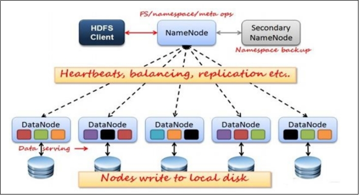
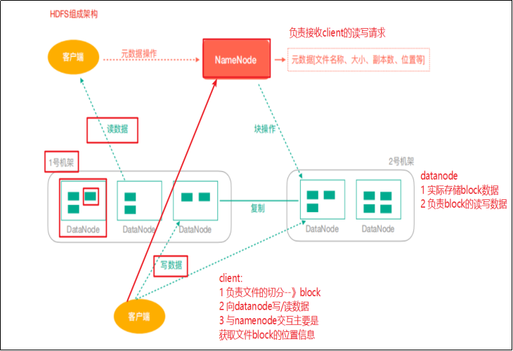
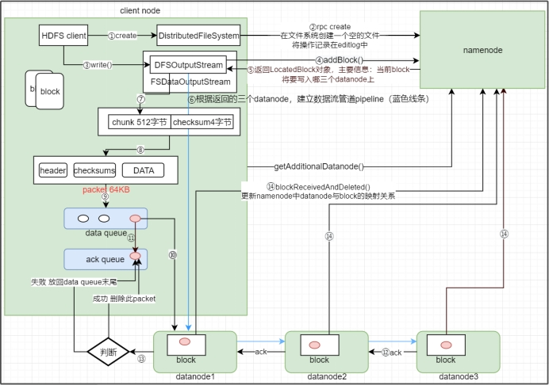

# Hadoop Distributed File System

## 产出背景、定义

`谈谈对HDFS的理解，讲讲HDFS/MR/YARN之间的关系`

hadoop相当于一个处理大数据的工具包，每个组件相当于其具体功能，就像一个多功能的工具扳手。可以安装一个组件，也可以安装多个 ，可以独立使用。

hadoop是一个分布式系统的基础架构。

## 基本操作

`掌握ls、cat等命令`了解即可，用的时候去查

## hdfs组成架构

`掌握Client、NameNode、DataNode和Secondary NameNode概念`

**HDFS分布式文件系统架构也是借鉴了图书管理的思想：目录+实体对应关系的形式。只是HDFS给其抽象落地到应用了。**

**HDFS主从结构模式：Master/Slave（元数据管理+业务数据）**

 

 **如上图：HDFS主要由HDFS Client、NameNode、DataNode和Secondary NameNode四个模块组成。**

1. NameNode管理文件系统的元数据，主要负责文件位置的分配与管理，以及文件名空间的维护等。

2. DataNode则负责实际的数据存储，与NameNode和客户端交互。

3. secondaryNameNode主要能用于hadoop当中元数据信息的辅助管理（辅助NameNode的），这个其实一般生产用的不多，直接HA模式，这个大家简单了解，可忽略不计。

4. Client 提供一些命令来管理 和访问HDFS，比如启动或者关闭HDFS，主要给用户使用操作HDFS。总结来说就是客户端代表用户通过与namenode和datanode交互来访问整个HDFS文件系统

组成原理

hdfs的文件块block和副本机制（先了解）

## hdfs读写流程

`背下来`

写数据：

1. 客户端向分布式文件系统发送写数据请求
2. dfs将请求转达到namenode
3. nn检查请求权限，并返回是否可以上传。不能则直接抛出
4. 客户端请求上传第一个block，询问上传服务器
5. NN返回DN节点
6. 通过请求建立pipeline
7. 客户端创建数据输入流对象，将数据通过pipeline写入DN1，
8. 数据写入完成后，关闭输入流，并向客户端反馈写入完成信息
9. DN向nn反馈信息，更新元数据

容错机制（有DN宕机）：

读数据：

1. 客户端通过Distributed FileSystem向NameNode请求下载文件，NameNode通过查询元数据，找到文件块所在的DataNode地址。

2. 挑选一台DataNode（就近原则，然后随机）服务器，请求读取数据。

3. DataNode开始传输数据给客户端（从磁盘里面读取数据输入流，以Packet为单位来做校验）。

4. 客户端以Packet为单位接收，先在本地缓存，然后写入目标文件

## HDFS的块机制和副本

`掌握概念`

## HDFS的联邦

## HDFS的HA机制

掌握

## HDFS回收站

知道概念

## HDFS优缺点

背下来

HDFS的优点：
1）数据冗余、硬件容错
文件以block的方式，多副本存储在集群的节点上，保证硬件的容错，当某一机器损坏时，不至于数据丢失
2）处理流式的数据访问
流式：一次写入，多次读取的操作
3）适合存储大文件
4）可构建在廉价的机器上

缺点：
1）低延迟的数据访问
数据大，想在秒级别做数据的检索不现实
2）小文件索引
不管数据在1M还是127M，都应该对应元数据存放在NameNode上，如果小文件很多，也就意味着所占用的内存信息也越大，那么对于hdfs的NameNode的压力也就越大
------------------------------------------------
