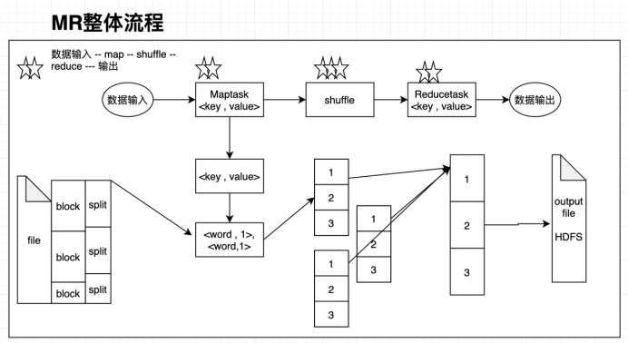
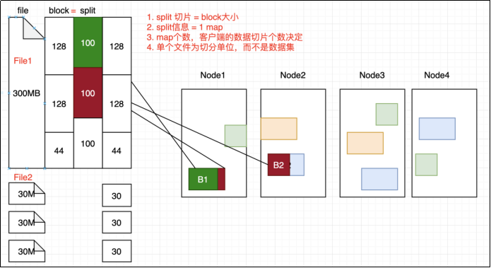
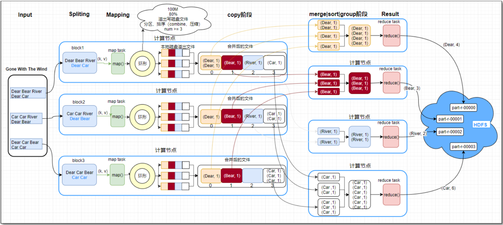
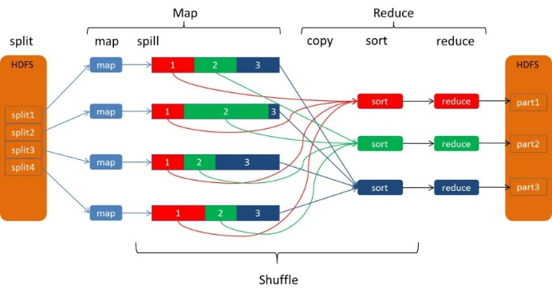
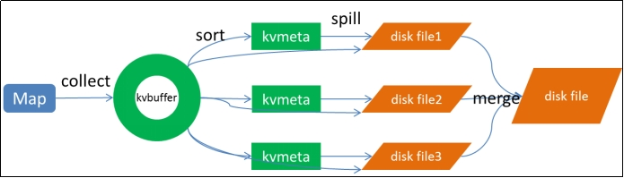

# MapReduce

## MR概念

掌握基本概念

1. **MRAppMaster**：负责整个程序过程调度及状态协调

2. **MapTask**：负责map阶段整个数据处理流程

3. **ReduceTask**：负责reduce阶段整个数据处理流程

## 运行流程

`掌握inputFormat/map()/shuffle()/reduce()过程`

**数据输入**：

先指定文件，在对文件进行切片

在进行map阶段之间需要对文件进行切片（split），这便涉及到几种切片机制

切片机制：FileInputFormat：按文件内容长度；TextInputFormat:按行读，数据结构为键值对，键是起始字节偏移量；KeyValue：按分隔符；……

**map阶段**

maptask本质上是一个程序，里面是程序员编写的数据处理逻辑

**shuffle阶段**

1、maptask收集我们的map()方法输出的kv对，先进入分区方法，把数据标记好分区，然后把数据发送到内存缓冲区

2、当环形缓冲区达到80%时，进行溢写，从内存缓冲区不断溢出本地磁盘文件，可能会溢出多个文件 

3、多个溢出文件会被合并成大的溢出文件，对溢写的文件也可以进行combiner

4、在溢出过程中，及合并的过程中，都要调用partitoner进行分组和针对key进行排序

5、reducetask根据自己的分区号，去各个maptask机器上取相应的结果分区数据，拉取的数据先存储在内存中，内存不够了，再存储到磁盘。

6、reducetask会取到同一个分区的来自不同maptask的结果文件，reducetask会将这些文件再进行合并

7、合并成大文件后，shuffle的过程也就结束了，后面进入reducetask的逻辑运算过程（从文件中取出一个一个的键值对group，调用用户自定义的reduce()方法）

Shuffle中的缓冲区大小会影响到mapreduce程序的执行效率，原则上说，缓冲区越大，磁盘io的次数越少，执行速度就越快
缓冲区的大小可以通过参数调整, 参数：io.sort.mb 默认100M

第一次是在内存缓冲区做的排序，使用的算法是快速排序，第二次排序和第三次排序都是在文件合并阶段发生的，使用的是归并排序。

**reduce阶段**

数据输出（了解）

## MR分区

知道分区方法

## MR的Combiner

知道聚合方法

## MR的数据倾斜

掌握概念及解决方法

## 优化MR操作

优化流程背下来

1.Map阶段
    map阶段将要处理的任务切分成一个个的MapTask，每个MapTask各自计算自己负责计算的内容，也就是将计算分布式。

   map阶段有两步：

​           1.设置TextInputFormat类，将数据切分为<k1,v1>,输入到第二步。

​            2.自定义Map逻辑，将第一步的结果转化为<k2,v2>，输出结果。

2.Shuffle阶段
         1.对输出的<k2,v2>进行分区

​         2.对不同分区的数据按照相同的key排序

​         3.对分组的数据初步规约，降低数据的网络拷贝

​        4.对数据分组，相同的key的value放在一个集合中

3.Reduce阶段
   Reduce将上面的MapTask和Shuffle的计算结果进行整合得到最终输出。

   Reduce有两步：

​                1.对多个 Map 任务的结果进行排序以及合并, 编写 Reduce 函数实现自己的逻辑, 对输 入的 Key-Value 进行处理, 转为新的 Key-Value（K3和V3）输出。

​                2.设置 TextOutputFormat 处理并保存 Reduce 输出的 Key-Value 数据