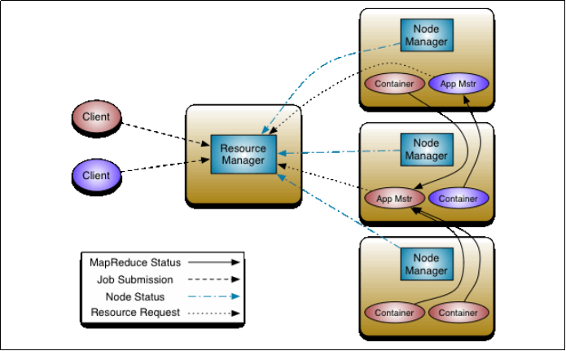
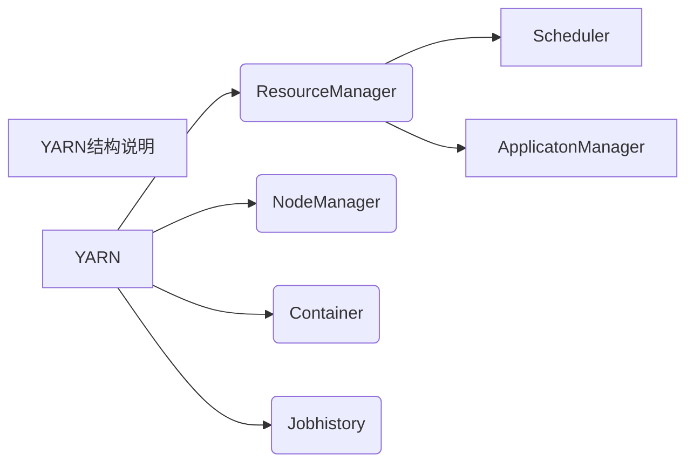

# YARN

## 概念

掌握基本概念

yarn是hadoop集群当中的资源管理系统模块，yarn可为各类计算框架提供==资源的管理和调度==,主要用于管理集群当中的资源（主要是服务器的各种硬件资源，包括CPU，内存，磁盘，网络IO等）以及调度运行在yarn上面的各种任务。

## YARN架构

知道有几个组件，每个组件的作用

==ResourceManager==有两个主要组件：**调度器**（Scheduler ）和**应用程序管理器**（ApplicationsManager）

==NodeManager==是Hadoop Yarn在每个计算节点上的代理，它会定时地向ResourceManager汇报本节点上的**资源使用**情况和各个**Container的运行状态**；同时会接收并处理来自ApplicationMaster 的Container 启动/停止等请求。

用户提交的应用程序均包含一个ApplicationMaster ，负责应用的监控，跟踪应用执行状态，重启失败任务等。ApplicationMaster是应用框架，它负责向ResourceManager协调资源，并且与NodeManager协同工作完成Task的执行和监控。

==Container==是YARN中的资源抽象，它封装了某个节点上的多维度资源，如内存、CPU、磁盘、网络等，当ApplicationMaster向ResourceManager申请资源时，ResourceManager为ApplicationMaster 返回的资源便是用Container 表示的。

==jobhistory==用于记录已经运行完的MaprReduce作业信息到HDFS的目录上（默认是不开启的）

## YARN的任务运行流程

掌握任务怎么运行

## YARN调度器

掌握FIFO Scheduler,Capacity,Scheduler,Fair Scheduler用法