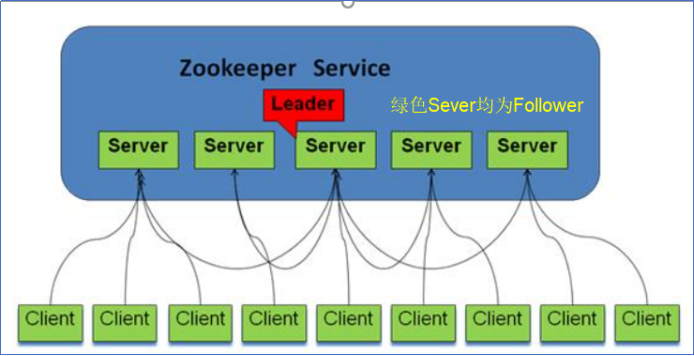
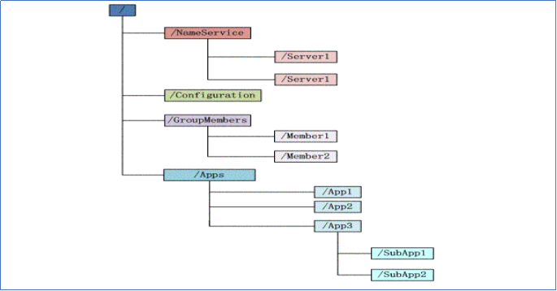
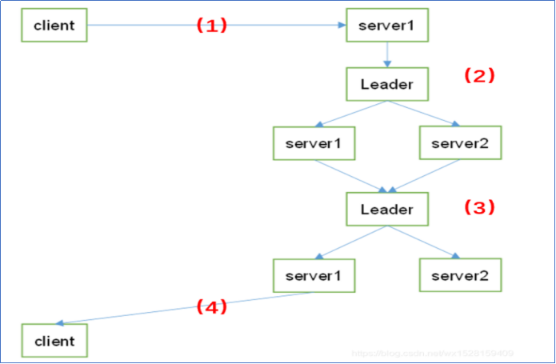

# ZooKeeper（简单了解）

学习重点：`选举理论`

****

## 概念

作用：搭建大数据集群需要使用，很多组件依赖它实现高可用和服务协调管理。

诞生原因：**解决分布式协调系统的分布式单点问题**，便创建一个通用的无单点问题的分布式协调框架。

zookeeper是一个分布式协调服务的开源框架，主要用来解决分布式集群中应用系统的一致性问题。

****

## 架构

角色有：

1. **领导者（leader）：**负责进行投票的发起和决议，更新系统状态。**事务请求（写操作）的唯一调度和处理者**，保证集群事务处理的顺序性；集群内部各个服务器的调度者。

2. **跟随者（follower）：**用于接收客户端请求并给客户端返回结果，本质是处理客户端非事务（读操作）请求，转发事务请求给 Leader；在选主过程中进行投票。

3. **观察者（observer**）：zk3.3.0，**版本以后引入的一个服务器角色**。可以接受客户端连接，将写请求转发给 leader，但是observer 不参加投票的过程，只是为了扩展系统，提高读取的速度。

**本质上Zookeeper能够提供这些功能都是靠两个模块：文件系统和通知机制。**

**所以简单来说Zookeeper**：**==zookeeper=文件系统+注册通知机制==。**

****

## 文件系统

- **每个子目录项如 NameService 都被称作为 $znode$**，和文件系统唯一的不同在于znode是可以存储数据的(大小有限制，一般小于1M)。znode是一个跟Unix文件系统路径相似的节点，可以往这个节点存储或获取数据
- **ZooKeeper 可以理解成一个==高可用的分布式文件存储系统==**（**只是这个文件系统中没有文件和目录**。而是统一使用节点znode，它即可当做容器存放数据，也可以当做子znode的父目录)提供基于类似于文件系统的目录树方式的数据存储，并且可以对树中的节点进行有效管理。从而用来维护和监控你存储的数据的状态变化。
- 通过监控这些数据状态的变化，从而可以达到基于数据的集群管理。诸如：统一命名服务、分布式配置管理、分布式消息队列、分布式锁、分布式协调等功能

$Zookeeper$中有**四种类型的znode**（先了解)
如果在创建znode时Flag设置如下是四种情况：

1. **$PERSISTENT$-持久化目录节点**：客户端与zookeeper断开连接后，该节点依旧存在
2.  **PERSISTENT_SEQUENTIAL-持久化顺序编号目录节点**：客户端与zookeeper断开连接后，该节点依旧存在，只是Zookeeper给该节点名称进行顺序编号
3. **EPHEMERAL-临时目录节点**：客户端与zookeeper断开连接后，该节点被删除
4. **EPHEMERAL_SEQUENTIAL-临时顺序编号目录节点**：客户端与zookeeper断开连接后，该节点被删除，只是Zookeeper给该节点名称进行顺序编号

****

## 注册通知机制
本质很简单，**客户端向zk服务端注册自己需要监听关心的目录节点$Znode$，当目录节点发生变化（数据改变、被删除、子目录节点增加删除）时，zookeeper会通知客户端。**

****

## zk客户端常用命令

****

## 内部结构与原理
### 选举理论

默认算法：$FastLeaderElection$：投票数大于半数者胜出

#### 全新选举(第一次启动)

初启动（顺序启动、乱序启动）：server启动后先投自己一票、然后对外通知，然后比较myid，ID大的获得全部投票，在判断是否超过半数，若没有则进入下一轮。

假设目前有三台服务器，分别是1号、2号、3号；
首先1号启动，启动一次选举，1号投给自己一票，由于其他服务器没有启动，无法收到1号的投票信息，此时1号处于Looking（竞选状态）；
2号启动，启动选举，2号给自己投一票，并且与1号交换信息，此时1号发现2号的myId比自己投票服务器（服务器1）的myId大，此时1号0票，2号2票，2>(3/2)，服务器2的票数最多，超过半数，那么2号当选leader，1号更改状态为following，2号更改状态为leading；
3号启动，启动选举，给自己投一票，此时与之前启动的1号、2号交换信息，此时1号、2号并没有处于Looking（竞选中）状态，不会更改选举状态，3号一票，服从多数，此时3号更改状态为following；
注意：当集群服务器有5台时，前面的服务器1和服务器2，都是LOOKING，服务器1票数为0，服务器2票数为2，当启动第三台服务器时，服务器3的myid大，服务器2会把票数给服务器3，（服务器启动会给自己投一票）这时服务器3票数为3选为Leader，其他的都是follow，之后启动的服务器也是follow；

#### 非全新选举（非第一次启动）

zxid =$ zookeeper$$ transaction $$id$    交易ID

宕机状态或运行中状态:**比较$zxid$（通常那台服务器上的数据越新，成为leader的可能性越大，也就越能保证数据的恢复）**,能更快的对外服务

如果leader服务器挂了，那么整个集群将暂停对外服务，进入新一轮leader选举，其过程和启动时期的leader选举过程基本一致。Leader挂掉后，余下的服务器都将自己的服务器状态变更为looking，然后开始进入Leader选举过程。服务器1号、2号、3号，此时2号是Leader，如果2号停电挂掉之后，1号、3号无法连接到Leader，知道Leader挂了，他们就知道必须选出一个新的 Leader，于是纷纷将自己的状态都修改为 LOOKING 状态：
比如1号的ZXID（事物id）为：77，Epoch（任期代号）为：1，myid（服务器id）：1；3号的ZXID（事物id）为：80，Epoch（任期代号）为：1，myid（服务器id）：3；此时3号为leader。

如果follow挂掉了，此时集群还是可以对外提供服务，挂掉一个是达到整个集群总数的半数以上的，如果挂掉的follow恢复之后，还是以 Follower 的身份加入到集群中来，并且仍然以当前 Leader 的信息来同步，即使它的Epoch大于其他的服务器。

### 节点特征和类型
上面有

### 读写流程

写：
（1）$Client$向$Zookeeper$的$server1$发送一个写请求，客户端写数据到$Server1$上；
（2）如果$server1$不是$Leader$，那么$server1$会把接收到的写请求转发给$Leader$；然后$Leader$会将写请求转发给每个$server$；
               i.$server1$和$server2$负责写数据，并且两个$Follower$的写入数据是一致的，保存相同的数据副本；
               ii.$server1$和$server2$写数据成功后，通知$Leader$；
（3）当$Leader$收到集群半数以上的节点写成功的消息后，说明该写操作执行成功；
         因为$client$访问的是$server1$，所以$Leader$会告知$server1$集群中数据写成功；
（4)被访问的$server1$进一步通知$client$数据写成功，这时，客户端就知道整个写操作成功了。

读：因为每台server中数据一致性都一样，所以随便访问哪台server读数据就行；

****

## 应用

ZK操作形式：客户端命令行、API

API操作ZK集群：

在命令行启动zk     执行：./zkServer.sh start   在/opt/ds_bigdata/zookeeper/bin下执行

****

## ZAB协议（先了解）
ZAB ，Zookeeper Atomic Broadcast，zk 原子消息广播协议，是专为 ZooKeeper 设计的一 种支持崩溃恢复的原子广播协议。在 Zookeeper 中，基于该协议，ZooKeeper 实现了一种主从模式的系统架构来保持集群中各个副本之间的数据一致性。

## 状态同步（先了解）
Zookeeper 的核心是原子广播机制，这个机制保证了各个 server 之间的同步。 实现这个机制的协议叫做 Zab 协议。Zab 协议有两种模式，它们分别是恢复模式和广播模式。

