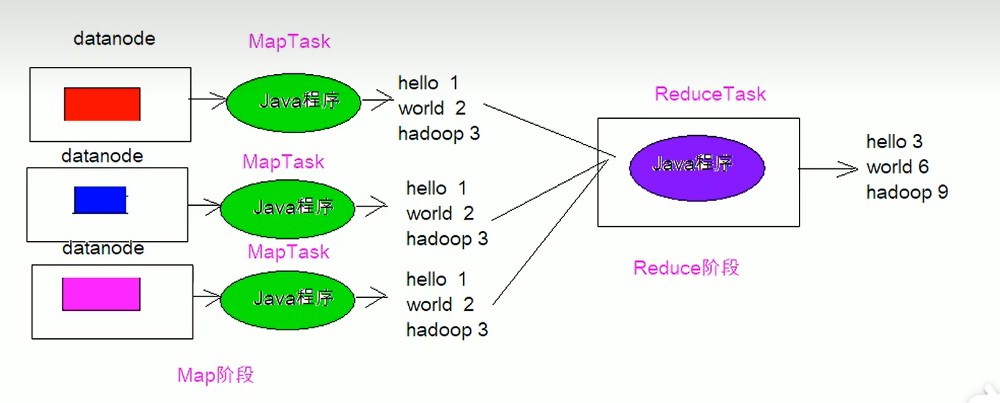

> 所谓的小白的**讲人话**

# 宏观理解

## 关于大数据 

`version 1.0 ` /`2023.05.21`

数据量较大、且价值较低的数据。在获得较大量的数据后最先遇到的问题即存储，接着是是数据的操作、分析，提取其中价值，在处理数据的过程中还会遇到数据的传输问题。处理GB级别的数据和PB级别的数据本身是两种概念。大数据学习的主从、主备概念

****

# Hadoop

## 对hadoop本身的理解：

`version 1.0`/`2023.05.21`

大数据处理架构hadoop是处理大数据的一种工具、一种方法。是一个分布式系统的基础架构。

功能和架构角度：Hadoop的框架最核心的设计是：HDFS+MapReduce+YARN

大数据发行版本有很多，各个厂商都在推出自己的产品和规范，现有公认的可以分为以下三类：存开源的Apache Hadoop；半商业半免费的CDH/HDP/**CDP**；商业性质的各种云。

hadoop实现了一个分布式文件系统(Distributed File System)，其中一个组件是HDFS。hadoop本身只是一个框架

`version 2.0`/`2023.06.02`

## 对hadoop组件的理解：

`version 1.0`/`2023.05.21`

常见的组件如hdfs、MapReduce、Yarn，hadoop相当于一个处理大数据的工具包，每个组件相当于其具体功能，就像一个多功能的工具扳手。可以安装一个组件，也可以安装多个 ，可以独立使用。

分布式的思想：把一个较大的文件拆分成小块分布到集群上

## 关于Zookeeper

`version 1.0`/`2023.05.21`

了解zookeeper的思想、了解选举等部分

学习的原因：贯穿大数据组件的应用；

zk本质上不是用来存储数据的。**zookeeper=分布式文件系统+注册通知机制**（高可用的分布式文件系统）

分布式文件系统：将多台机器拼接为一个文件系统，解决单点故障。多台机器中的内容相同。把所以机器当成一台机器去存储。  

监听器部分 watch ；监听机制原理（代码层面）

投票机制：

初启动（顺序启动、乱序启动）：server启动后先投自己一票、然后对外通知，然后比较myid，ID大的获得全部投票，在判断是否超过半数，若没有则进入下一轮。

、宕机状态或运行中状态:比较zxid（通常那台服务器上的数据越新，成为leader的可能性越大，也就越能保证数据的恢复）,能更快的对外服务

为什么会出现脑裂？如何防止脑裂？

临时节点不能有子节点，

stat结构体：查看节点信息

ZK读写流程？理解Leader的角色？如何判断写数据成功？（超过半数） 

ZK的读数据流程相比写数据流程，读数据流程就简单很多；因为每台server中数据一致性都一样，所以访问一台server读数据就行；没有写数据流程中请求转发、数据同步、成功通知这些步骤。

写流程数据?

ZK操作形式：客户端命令行、API

API操作ZK集群：

在命令行启动zk     执行：./zkServer.sh start   在/opt/ds_bigdata/zookeeper/bin下执行

`version 2.0`\ `2023.5.24`

1. 诞生的原因？
   解决分布式协调系统的分布式单点问题，便创建一个通用的无单点问题的分布式协调框架。
2. ZK中有什么角色？
3. 

## HDFS组件

为海量的数据提供存储

Hadoop Distributed File System。HDFS有高容错性的特点，并且设计用来部署在低廉的（low-cost）硬件上；而且它提供高吞吐量（high throughput）来访问应用程序的数据，适合那些有着超大数据集（large data set）的应用程序。HDFS放宽了（relax）POSIX的要求，可以以流的形式访问（streaming access）文件系统中的数据。

课程组成部分：集群安装部署、常见操作、数据读写（重点）

rack:机架伺服器

Hadoop的元数据主要作用是维护HDFS文件系统中文件和目录相关信息。

元数据的存储形式主要有3类：内存镜像、磁盘镜像(FSImage)、日志(EditLog)。

hadoop给出HDFS的高可用HA方案（high availability）：active状态和standby状态。

## MapReduce组件

`version 1.0`/`2023.05.21`

重点：MR读写、计算流程； 

业务逻辑                                                 

是什么？

本身是一种编程模型，也是一套分布式计算引擎，相当于提供一套特有的数据处理模版来处理数据。本身也是部署在HDFS上的。

技术特点？

能实现的功能？

核心功能：将用户编写的业务逻辑代码和自带默认组件整合成一个完整的分布式运算程序，并发运行在一个Hadoop集群上

现状？

学习重点：MR框架原理（重点：MapTask、Shuffle、ReduceTask）、序列化、综合案例

MR的基本思想：

MR编程规范（流程）：

`MR的开发共有8个步骤`

详细描述：

Map阶段2个步骤：

设置InputFormat类，将数据切分为Key-Value(k1和v1)对，输入到第二步；

自定义Map逻辑，将第一步的结果转换成另外的Key-Value(k2和v2)对，输出结果

shuffle阶段4个步骤：

对输出的Key-Value进行分区；

对不同分区的数据按照相同的key排序；

（可选）对分组过的数据初步规约，降低数据的网络拷贝；

对数据进行分组，相同key的value放入一个集合中

reduce阶段：

对多个map任务的结果进行排序以及合并，编写reduce函数实现自己的逻辑，对输入的Key-Value进行处理，转为新的Key-Value（k3和v3）输出；

设置OutputFormat处理并保存Reduce输出的Key-Value数据

## YARN组件

`version 1.0`/`2023.05.21`

开发学习重点：

**客户端命令client；监控-Web UI的Application;**

怎么查看日志，任务日志

把MR程序写好，扔上去，能运行，能查看工作日志，对yarn来说就够了

使用组件;用于给分布式计算引擎协调资源，进行集群资源的统一管理与分配。

****

## Hive

`version 1.0`/`2023.05.22`

Hadoop的子项目（08已脱离） 

# 会议记录

2.Hadoop集群安装:阿里云环境使用

3.阿里云只能运行客户端命令

4.hdfs读写流程 ，，副本存放策略

5.mr：新闻案例：改爬虫；；

6.案例：wordcount官网代码敲一遍(确实6，必须搞)；流程

7.yarn任务提交流程；调度器

8.企业管理：安装运维侧：异常处理案例（生产异常）
