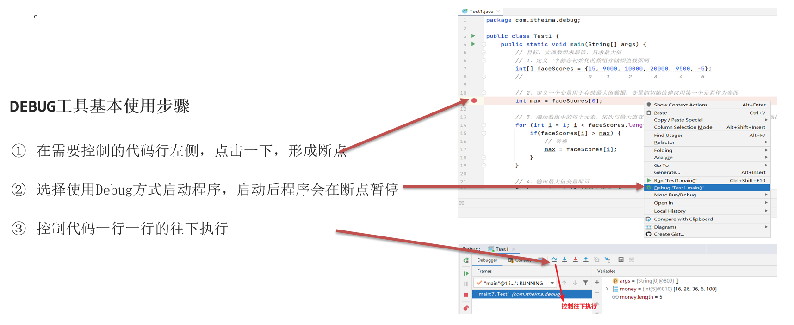
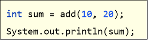
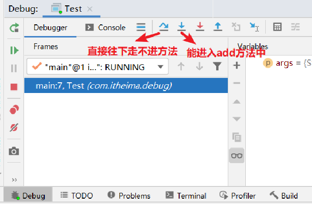
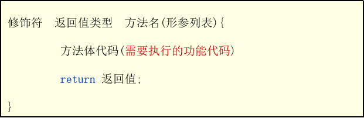
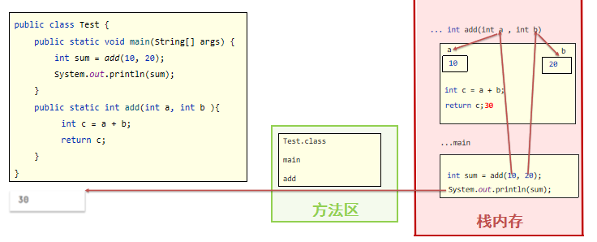
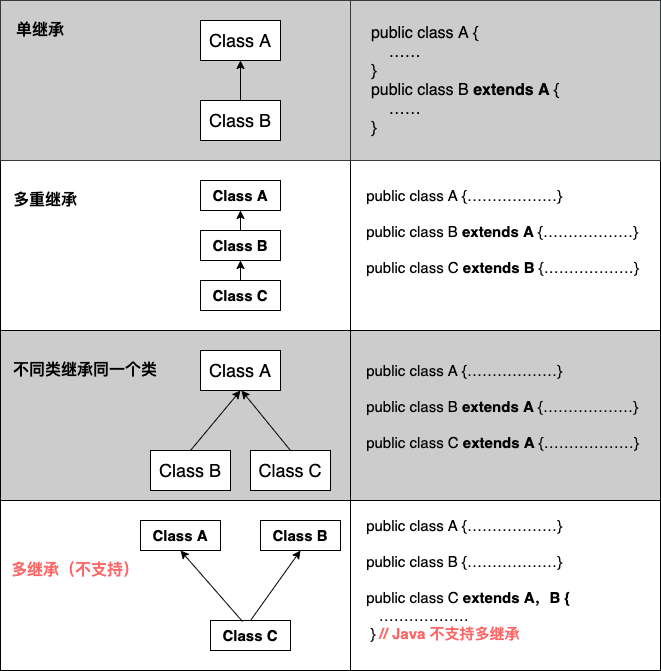
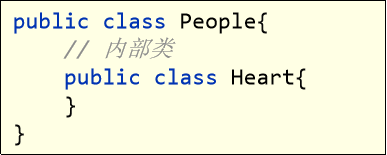
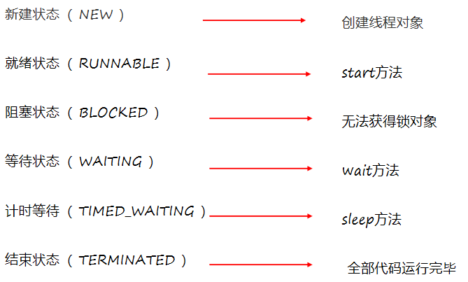

# 《JAVA基础》

从类和对象入手

1. 定义一个类需要属性和方法
   1. 属性-->定义属性涉及到名字、年龄等等，以此引出数据类型包含整型、浮点型、字符串等等
   2. 方法：


# 1.Java基础常识

## a.开发环境命令

- javac 编译语言
- java 执行命令

## b.命令行窗口常用命令

1. 盘符：（切换到某一盘符下：D：，C:）
2. dir  (查看当前路径下的文件信息)
3. cd  
4. cls (清屏)

## 代码编写基本要求

- 文件名称后缀为.java
- 文件名称必须与代码的类名称一致

## 常见错误

1. Windows的文件扩展名没有勾选
2. 代码写了，但是忘记保存了
3. 文件名和类名不一致。
4. 大小写错误，单词拼写错误，存在中文符号，找不到main方法。
5. 括号不配对。
6. 编译或执行工具使用不当。
7. …

## JDK组成


## path


## 项目结构


## 快捷键

|                      main/psvm、sout、…                      |         快速键入相关代码         |
| :----------------------------------------------------------: | :------------------------------: |
|                          alt+enter                           |           ==万能提示==           |
| 直接右键、Generate、Getter and Setter、shift键+点击下方（全选）、OK |  setter和getter方法（自动生成）  |
|                                                              |             批量更改             |
|                    ctrl + -   /  ctrl + +                    |         代码块折叠/打开          |
| 直接右键、Generate、Constructor、shift键+点击下方（全选）\select None、OK |        构造器（自动生成）        |
|                          ctrl+alt+t                          |       将某段代码放入循环里       |
|                           Ctrl + D                           |      复制当前行数据到下一行      |
|                           Ctrl + Y                           |    删除所在行，建议用Ctrl + X    |
|                        Ctrl + ALT + L                        |            格式化代码            |
|              ALT + SHIFT + ↑ , ALT + SHIFT + ↓               |         上下移动当前代码         |
|                 Ctrl + / , Ctrl + Shift + /                  | 对代码进行注释(讲注释的时候再说) |
|                         数组名.fori                          |             数组遍历             |

*************


# 2.Java基础语法

`一个 Java 程序可以认为是一系列对象的集合，而这些对象通过调用彼此的方法来协同工作。`

下面简要介绍下类、对象、方法和实例变量的概念。

- **对象**：对象是类的一个实例，有属性和行为。例如，一条狗是一个对象，它的状态有：颜色、名字、品种；行为有：摇尾巴、叫、吃等。
- **类**：类是一个模板，它描述一类对象的行为和状态。
- **方法**：方法就是行为，一个类可以有很多方法。逻辑运算、数据修改以及所有动作都是在方法中完成的。
- **实例变量**：每个对象都有独特的实例变量，对象的状态由这些实例变量的值决定。

## a.基础语法

编写Java程序的注意事项：

- **大小写敏感**：例如，标识符Hello和hello是不同的
- **类名**：所有类的类名首字母应该大写。若是单词组合，每个单词的首字母大写，例如MyFirstJavaClass
- **方法名**：所有方法名都以小写字母开头，若是单词组合，则后面的每个单词首字母大写
- **源文件名**：源文件名必须和类名相同
  - **主方法入口**:所有Java程序由public static void main(String[] args)方法开始执行。


## b.注释

- 单行注释：//
- 多行注释：/* */
- 文档注释：/** */     注意：文档注释的内容可以提取到程序说明书中


## c.字面量

字面量：数据在程序中的书写格式

| **常用数据** | **程序中的写法**           | **说明**                                     |
| ------------ | -------------------------- | -------------------------------------------- |
| 整数         | 666，-88                   | 写法一致                                     |
| 小数         | 13.14，-5.21               | 写法一致                                     |
| 字符         | ‘A’，‘0’， ‘我’            | 程序中必须使用单引号，有且仅能一个字符       |
| 字符串       | “HelloWorld”，“黑马程序员” | 程序中必须使用双引号，内容可有可无           |
| 布尔值       | true 、false               | 只有两个值：true：代表真，false：代表假      |
| 空值         | 值是：null                 | 一个特殊的值，空值(后面会讲解作用，暂时不管) |

*****


## d.变量类型

定义格式：`数据类型  变量名称 = 初始值；`

- **局部变量**(Local Variables）：在方法、构造方法或者语句块中定义的变量被称为局部变量。变量的声明和初始化都是在方法中，方法结束后局部变量自动销毁
- **成员变量**(Instance Variables)：也称**实例变量**定义在类中，方法体之外的变量。这种变量在创建对象的时候实例化。成员变量可以被类中方法、构造方法和特定 类的语句块访问。
- **静态变量**(Class Variables)：也称**类变量**类变量也声明在类中，方法体之外，但必须声明为static类型
- **参数变量**(Parameters):方法定义时声明的变量，作为调用该方法时传递给该方法的值。参数变量的作用域只限于方法内部

```java
实例：
public class RunoobTest {
    // 成员变量
    private int instanceVar;
    // 静态变量
    private static int staticVar;
    
    public void method(int paramVar) {
        // 局部变量
        int localVar = 10;
        
        // 使用变量
        instanceVar = localVar;
        staticVar = paramVar;
        
        System.out.println("成员变量: " + instanceVar);
        System.out.println("静态变量: " + staticVar);
        System.out.println("参数变量: " + paramVar);
        System.out.println("局部变量: " + localVar);
    }
    
    public static void main(String[] args) {
        RunoobTest v = new RunoobTest();
        v.method(20);
    }
}

```


### 参数变量

`在方法或构造函数中声明的变量,用于接收传递给方法或构造函数的值。参数变量与局部变量类似，但它只在方法或构造函数被调用时存在，并且只能在方法或构造函数内部使用`

- Java语法的声明方法
  ```java
  accessModifier returnType methodName(parameterType parameterName1, ……){
      // 方法体
  }
  ```

  - parameterType--参数变量的类型
  - parameterName--参数变量的名称
  - accessModifier--访问修饰符

- 值传递的两种方式

  - **值传递**：在方法调用时，传递的是<u>实际参数的值的副本</u>，当参数变量被赋予新值时，只会修改副本的值，不会影响原始值。（传递基本数据类型）
  - **引用传递**：在方法调用时，传递的是<u>实际参数的引用地址</u>（即内存地址）。当参数变量被赋予新的值时，会修改原始值的内容。（Java中的对象类型采用引用传递方式传递参数变量的值）

### 成员变量

### 局部变量

### 静态变量

### 变量的注意事项

1. 先声明在使用
2. 变量类型不能改变
3. 变量有效范围：从定义开始到“}”截止
4. 定义时可以没有初始值，使用的时候必须有初始值

### 变量的底层原理

- ==计算机最小组成单位==：使用8个二进制位为一组，来保存数据，称为一个字节（byte,简称B）

- 其中每个二进制位称为一位（bit,简称b）,1byte=8bit,简称1B=8b

  

- java中书写二进制、八进制、十六进制，分别要以0B或0b、0、0X或0x开头

****


## e.数据类型

地址：[详细介绍]([Java八种基本类型（byte、short、int、long、浮点数、char、boolean、基本类型转换）_byte 类型_xiaoyun8989的博客-CSDN博客](https://blog.csdn.net/xiaoyun8989/article/details/78054648))

1. 引用数据类型（除基础数据类型之外的）

   1. String

2. 基础数据类型：

   | 数据类型 | 关键字  |   名称   |      取值范围      | 内存占用（字节数） |
   | :------: | :-----: | :------: | :----------------: | :----------------: |
   |   整数   |  byte   | 字节整型 |      -128~127      |         1          |
   |          |  short  |  短整型  |    -32768~32767    |         2          |
   |          |   int   |   整型   |  （==默认==10位）  |         4          |
   |          |  long   |  长整型  |      （19位）      |         8          |
   |  浮点数  |  float  |  单精度  |     范围相对小     |         4          |
   |          | double  |  双精度  | 范围大（==默认==） |         8          |
   |   字符   |  char   |          |      0-65535       |         2          |
   |   布尔   | boolean |          |     true,false     |         1          |


==注意==：

- 随便写一个整数字面量默认是Int类型，1242415142545325666虽然没有超过long的范围，但是他**超过了本身int的范围**，如果希望写一个整数字面量当成long类型，需要在其后加L/l
- `java中规定，任何一个浮点型数据默认被当做double来处理。如果想让浮点型字面量被当做float类型的来处理，要在字面量后加F/f`

****


## f.修饰符

### 访问修饰符

- **default**
- **private**
- **public**
- **protected**

| 修饰符      | 当前类 | 同一包内 | 子孙类(同一包) | 子孙类(不同包)                                               | 其他包 |
| :---------- | :----- | :------- | :------------- | :----------------------------------------------------------- | :----- |
| `public`    | Y      | Y        | Y              | Y                                                            | Y      |
| `protected` | Y      | Y        | Y              | Y/N（[说明](https://www.runoob.com/java/java-modifier-types.html#protected-desc)） | N      |
| `default`   | Y      | Y        | Y              | N                                                            | N      |
| `private`   | Y      | N        | N              | N                                                            | N      |

### 非访问修饰符

- **static**
- **final**
- **abstract**
- **synchronized**
- **transient**
- **volatile**

## g.关键字、标志符

- 关键字：不能用于常量、变量、和任何标识符的名称。

- | **abstract**   | **assert**       | **boolean**   | **break**      | **byte**   |
  | -------------- | ---------------- | ------------- | -------------- | ---------- |
  | **case**       | **catch**        | **char**      | **class**      | **const**  |
  | **continue**   | **default**      | **do**        | **double**     | **else**   |
  | **enum**       | **extends**      | **final**     | **finally**    | **float**  |
  | **for**        | **goto**         | **if**        | **implements** | **import** |
  | **instanceof** | **int**          | **interface** | **long**       | **native** |
  | **new**        | **package**      | **private**   | **protected**  | **public** |
  | **return**     | **strictfp**     | **short**     | **static**     | **super**  |
  | **switch**     | **synchronized** | **this**      | **throw**      | **throws** |
  | **transient**  | **try**          | **void**      | **volatile**   | **while**  |

- 标识符：类、方法、变量等的名称
  - 相关已知

*****


## h.**类型转换**

### 自动类型转换

- 类型范围小的变量，赋值给范围大的变量

- 原因：存在不同类型的变量赋值给其他类型的变量

- ob二进制，0八进制，ox十六进制

  

### 表达式的自动类型转换

1. 在表达式中，小范围类型的变量会自动转换成当前辽大范围的类型在运算。

   > byte、short、char——int——long——float——double


注意事项：

- 最终结果类型有表达式中的最高类型决定
- 表达式中，==byte、short、char是直接转换成int类型直接参与运算==

### 强制类型转换

- 出现场景：范围大的变量或类型，赋值变量小的变量，会报错
- 转换方法：`数据类型 变量2 = （数据类型）变量1、数据`


注意事项：

- 强制类型转换可能造成**数据(丢失)溢出**；
- 浮点型强转成整型，**直接丢掉小数部分，保留整数部分返回**。

****


## i.运算符

### 基本算数运算符

| 符号 | 作用 | 说明                                                         |
| ---- | ---- | ------------------------------------------------------------ |
| +    | 加   |                                                              |
| -    | 减   |                                                              |
| *    | 乘   |                                                              |
| /    | 除   | 与“÷”相同，注意：在Java中两个整数相除结果还是整数。（方法：分母*1.0,结果输出为小数） |
| %    | 取余 | 获取的是两个数据做除法的余数                                 |


### +符号做连接符

- “+”符号与字符串运算的时候是用作连接符的，其结果依然是一个字符串。
- ==能算则算，不能算则拼接==


- 字符（码表）+数字能算，带字符串不能算

### 自增自减运算符

| 符号 | 作用 | 说明            |
| ---- | ---- | --------------- |
| ++   | 自增 | 变量自身的值加1 |
| --   | 自减 | 变量自身的值减1 |

- ++ 和 -- 既可以放在变量的后边，也可以放在变量的前边。
- ++ 、-- 只能操作变量，不能操作字面量的。


注意事项：

- ++、--如果不是单独使用（如在表达式中、或者同时有其它操作），放在变量前后会存在明显区别放
  - 在变量的前面，先对变量进行+1、-1，再拿变量的值进行运算。
  - 放在变量的后面，先拿变量的值进行运算，再对变量的值进行+1、-1 


案例：

- 运算技巧：实时更新。
- 结果:9、4、4

### 赋值运算符

| 符号 | 作用       | 说明                                                   |
| ---- | ---------- | ------------------------------------------------------ |
| +=   | 加后赋值   | a+=b 等价于 a = (a的数据类型)(a+b); 将a + b的值给a     |
| -=   | 减后赋值   | a-=b 等价于 a = (a的数据类型)(a-b); 将a - b的值给a     |
| *=   | 乘后赋值   | a*=b 等价于 a = (a的数据类型)(a*b); 将a ***** b的值给a |
| /=   | 除后赋值   | a/=b 等价于 a = (a的数据类型)(a/b); 将a **/** b的商给a |
| %=   | 取余后赋值 | a%=b 等价于 a = (a的数据类型)(a%b); 将a **%** b的商给a |

- 注意：扩展的赋值运算符==隐含了强制类型转换==。

### 关系运算符

| 符号 | 说明                                                    |
| ---- | ------------------------------------------------------- |
| ==   | a==b，判断a和b的值是否相等，成立为true，不成立为false   |
| !=   | a!=b，判断a和b的值是否不相等，成立为true，不成立为false |
| >    | a>b， 判断a是否大于b，成立为true，不成立为false         |
| >=   | a>=b，判断a是否大于等于b，成立为true，不成立为false     |
| <    | a<b， 判断a是否小于b，成立为true，不成立为false         |
| <=   | a<=b，判断a是否小于等于b，成立为true，不成立为false     |


### 逻辑运算符 8

- 可以把多个条件的布尔结果放在一起运算，最终返回一个布尔结果

| 符号 | 介绍     | 说明                                                         |
| ---- | -------- | ------------------------------------------------------------ |
| &    | 逻辑与   | 必须都是true，结果才是true; 只要有一个是false，结果一定是false。 |
| \|   | 逻辑或   | 只要有一个为true、结果就是true                               |
| ！   | 逻辑非   | 你真我假、你假我真。 !true=false 、 !false= true             |
| ^    | 逻辑异或 | 如果两个条件都是false或者都是true则结果是false。两个条件不同结果是true。 |


- 短路逻辑运算符

| 符号 | 介绍   | 说明                                                         |
| ---- | ------ | ------------------------------------------------------------ |
| &&   | 短路与 | 且的意思，必须前后都是true,结果才是true。过程是**左边为** **false** **，右边则不执行** |
| \|\| | 短路或 | 或的意思，有一个是true,结果就是true。过程是**左边为** **true** **，右边则不执行** |


注意事项：

- 逻辑与 “&” 、逻辑或“|”:   无论左边是 false还是 true，右边都要执行


### 三元运算符

- 格式：`条件表达式 ？ 值1 : 值2`
- 执行流程：首先计算关系表达式的值，如果值为true，返回值1，如果为false，返回值2。


### 运算符优先级


## j.案列：键盘录入技术

[API(application programming interface,应用程序编程接口)文档]([Java Development Kit 20 Documentation (oracle.com)](https://www.oracle.com/java/technologies/javase-jdk20-doc-downloads.html))


# 3.程序流程控制


## a.分支结构

### if

- if语句的格式：
  

### switch

- 也是匹配条件去执行分支, 适合做==值匹配==的分支选择，结构清晰，格式良好
  

- 执行流程：
  - 先执行表达式的值，拿着这个值去与case后的值进行匹配。

  - 匹配哪个case的值为true就执行哪个case，遇到break就跳出switch分支。

  - 如果case后的值都不匹配则执行==default==代码。

- 注意事项
  - 表达式类型只能是byte、short、int、char，JDK5开始支持枚举，JDK7开始支持String、不支持double（计算不精确）、float、long。

  - case给出的值不允许重复，且只能是字面量，不能是变量。

  - 不要忘记写break，否则会出现穿透现象。

- 穿透性
  -  如果代码执行到没有写break的case块，执行完后将直接进入下一个case块执行代码（而且不会进行任何匹配），==直到遇到break才跳出分支==，这就是switch的穿透性。


## b.循环结构

### for循环

- 流程图
  


### Java 增强 for 循环

Java 增强 for 循环语法格式如下:

```java
for(声明语句 : 表达式)
{  
    //代码句子 
}
```

**声明语句：**声明新的局部变量，该变量的类型必须和数组元素的类型匹配。其作用域限定在循环语句块，其值与此时数组元素的值相等。

**表达式：**表达式是要访问的数组名，或者是返回值为数组的方法。

#### 实例

#### Test.java 文件代码：

```java
public class Test {   
    public static void main(String[] args){ 
        int[] numbers = {10, 20, 30, 40, 50};  
        
        for(int x : numbers ){       
            System.out.print( x );       
            System.out.print(",");     
        } 
        
        System.out.print("\n");    
        String [] names ={"James", "Larry", "Tom", "Lacy"};    
        for( String name : names ) {         
            System.out.print( name );        
            System.out.print(",");     
        }  
    } 
}

```

以上实例编译运行结果如下：

```
10,20,30,40,50,
James,Larry,Tom,Lacy,
```

### while循环


### do-while循环


### 循环总结

- for循环 和 while循环（先判断后执行）

- do...while （第一次先执行后判断）


- for循环和while循环的执行流程是一模一样的。==如果已知循环次数建议使用for循环，如果不清楚要循环多少次建议使用while循环==。
- for循环中，控制循环的变量==只在循环中可以使用==。
- While循环中，控制循环的变量==在循环后==还可以继续使用。

### 死循环

- 一直执行下去
- 写法：

### 循环嵌套

🛫🛫🛫🛫🛫🛫🛫🛫🛫🛫🛫🛫🛫✈️✈️✈️✈️✈️✈️✈️✈️✈️✈️✈️✈️✈️✈️✈️✈️✈️🛬🛬🛬🛬🛬🛬🛬🛬🛬🛬🛬🛬🛬

## c.跳转关键字

- break   :  跳出并结束当前所在循环的执行。
- continue:  用于跳出当前循环的当次执行，进入下一次循环。
- return : 跳出并立即结束所在方法的执行

注意事项

- break : 只能用于结束所在循环, 或者结束所在switch分支的执行。
- continue : 只能在循环中进行使用。

## d.案例

### random


- 减加法（取到指定区间的随机数）：（Java有些指定的功能可以也实现）

****


# 4.数组（4.19）


## a.数组定义

- 存储同类数据的容器

### 静态初始化数组

- 定义数组的时候直接给数组赋值。
- 格式：
- 注意：数组变量名中存储的是数组在内存中的地址，数组是引用类型。


- ==数组访问==
- 注意事项

### 动态初始化数组

- 定义数组时只确定数组的类型和数组的长度，之后在存入具体数据

- 格式：

- 元素默认值

- 

- | 数据类型 |             明细             | 默认值 |
  | :------: | :--------------------------: | :----: |
  | 基本类型 | byte、short、char、int、long |   0    |
  |          |        float、double         |  0.0   |
  |          |           boolean            | false  |
  | 引用类型 |    类、接口、数组、String    |  null  |

## b.数组遍历

- 访问数组中的全部数据

- 数组遍历快捷键：`数组名.fori`

- | 数据类型      | 明细                         | 默认值 |
  | ------------- | ---------------------------- | ------ |
  | 基本类型      | byte、short、char、int、long | 0      |
  | float、double | 0.0                          |        |
  | boolean       | false                        |        |
  | 引用类型      | 类、接口、数组、String       | null   |

## 案例

- 冒泡排序


## 数组内存图

###  Java内存分配、数组内存图

java内存分配介绍
- 栈
- 堆
- 方法区
- 本地方法栈
- 寄存器


### 两个变量指向同一个数组


## 数组使用常见问题

- 问题1：如果访问的元素位置超过最大索引，执行时会出现ArrayIndexOutOfBoundsException(==数组索引越界异常==)
- 问题2：如果数组变量中没有存储数组的地址，而是null, 在访问数组信息时会出现NullPointerException(==空指针异常==)


## Debug工具的使用

- IDEA自带的断点调试(排错)工具，可以控制代码从断点开始一行一行的执行，然后详细观看程序执行的情况

  

# 方法

## 定义、调用

- 方法==定义格式==
  
  ```java
  修饰符 返回值类型 方法名（形参列表）{
      方法体       // 需要执行的代码
      return 返回值;
  }
  ```
  
  
  
  - 示例：两数求和
    ```java
    public static int add(int a, int b){
        int c = a + b;
        return c;
    }
    ```
- ==调用格式==：
  
  
  - 示例：
    
- 方法调用流程——debug
  
  
- 注意事项
  - 方法的修饰符：暂时都使用public static 修饰。
  - 方法申明了具体的返回值类型，内部必须使用return返回对应类型的数据。
  - 形参列表可以有多个，甚至可以没有； 如果有多个形参，多个形参必须用“，”隔开，且不能给初始化值。


- 方法的其他写法
  - 方法定义时：返回值类型、参数列表可以按照需求进行填写
    
  - 示例：
    
  - 注意事项
    - 如果方法不需要返回结果，返回值类型必须申明成==void（无返回值）==,  此时方法内部不可以使用return返回数据。
    - 方法如果没有参数，或者返回值类型申明为void可以称为无参数、无返回值的方法，依次类推。

## 使用的常见问题

- 方法的编写顺序无所谓。
- 方法与方法之间是平级关系，不能嵌套定义。
- 方法的返回值类型为void（无返回值），方法内则不能使用return返回数据，如果方法的返回值类型写了具体类型，方法内部则必须使用return返回对应类型的数据。
- return语句下面，不能编写代码，因为永远执行不到，属于无效的代码。
- 方法不调用就不执行,  调用时必须严格匹配方法的参数情况。
- 有返回值的方法调用时可以选择定义变量接收结果，或者直接输出调用，甚至直接调用；无返回值方法的调用只能直接调用。


## 调用的内存图

- 方法是放在方法区中的，被调用的时候需要进入到栈内存中运行
  （弹夹相当于方法区，弹道相当于栈内存）
  
  - 示例：
    

## 方法参数传递机制

- 基本类型的参数传递
  - 值传递：在传输实参给方法的形参的时候，并不是传输实参变量本身， 而是传输实参变量中存储的值，这就是值传递
    
- 引用类型的参数传递
  
- 基本类型和引用类型的参数在传递时的不同
  - 都是值传递
  - 基本类型的参数传输存储的==数据值==
  - 引用类型的参数传输存储的==地址值==


## 方法重载

- 方法重载的形式、作用
  - 定义：==同一个类==中，出现==多个方法名称相同==，但==形参列表是不同的==，这些方法就是方法重载
  - 可读性好，方法名称相同提示是同一类型的功能，通过形参不同实现功能差异化的选择，这是一种专业的代码设计
- 识别技巧
  - 只要是同一个类中，方法名称相同、形参列表不同，那么他们就是重载的方法，其他都不管！（如：修饰符，返回值类型都无所谓）
  - 形参列表不同指的是：形参的个数、类型、顺序不同，不关心形参的名称。

## 补充知识：单独使用return关键字

-   return; `跳出并立即结束所在方法的执行`
- break; `跳出并结束当前所在循环的执行`
- continue;` 结束当前所在循环的当次继续，进入下一次执行`


# 面向对象编程（oop）（重要）

`Object Oriented Programming`

`对象==实例`


## 设计对象并使用（类）

- 设计类，创建对象并使用
  - 定义
    - 类（设计图）：是对象共同特征的描述
    - 对象：是真实存在的具体实例
  -  类的使用
    - 类
      
      ```java
      public class 类名 {
          1.成员方法（代表属性，一般为名词）
          2.成员方法（代表行为，一般是动词）
          3.构造器
          4.代码块
          5.内部类    
      }
      ```
    - 获得类对象
      
    - 使用对象
      
  
- 定义类的注意事项

  - 类名首字母建议大写，且有意义，满足“驼峰模式”。

  - 一个Java文件中可以定义多个class类，但只能一个类是public修饰，而且==public修饰的类名必须成为代码文件名==。实际开发中建议还是一个文件定义一个class类。

  - 成员变量的完整定义格式是：`修饰符 数据类型 变量名称 = 初始化值； `一般无需指定初始化值，存在默认值。

  - 成员变量的默认值规则

  - | 数据类型      | 明细                         | 默认值 |
    | ------------- | ---------------------------- | ------ |
    | 基本类型      | byte、short、char、int、long | 0      |
    | float、double | 0.0                          |        |
    | boolean       | false                        |        |
    | 引用类型      | 类、接口、数组、String       | null   |


## 对象内存图

- 多个对象的内存图
  
  - 对象是放在堆内存中的
  - `Car c = new Car();`c变量名中存储的是对象在堆内存中的地址
  - 成员变量的数据放在对象中，存在与堆内存中 
- 两个变量指向同一个对象内存图
  - 
  - ==垃圾回收==：当堆内存中的对象，没有被任何变量引用（指向）时，就会被判定为内存中的“垃圾”。


## 构造器

- 定义：定义在类中的，可以初始化一个类的对象，并返回类的地址。

  - 构造器的本质

    > ==构造器是一种特殊的方法，方法的本质是类中的函数，所以构造器还是一种特殊的函数==

  - 构造器的作用

    > ==构造器是为类服务的，一个类是由属性和方法构成的，而方法是属性的调用==

  - 是不是构造器创造了整个对象呢？

    > 不是，构造器只是用来初始化变量的，初始化变量是指让某个变量在类创建后就存在

  - 那么谁创造了对象?

    > 简单来说，使用new关键词时对象就被创建了
    >
    > `Car c = new Car();`
    >
    > 执行这一句相当于：
    >
    > 创造对象Car并交给构造器初始化属性然后返回给对象(**返回的是对象的地址**)
    >
    > 接着把c和Car关联起来

- 格式：

- 调用构造器得到对象的格式：

- 分类和作用

  - 无参数构造器（默认存在的）：初始化对象时，成员变量的数据均采用默认值。
  - 有参数构造器：在初始化对象的时候，同时可以接收参数为对象进行赋值。

- 注意事项

  - 任何类定义出来，默认就自带了无参数构造器，写不写都有。
  - 一旦定义了有参数构造器，那么无参数构造器就没有了，如果还想用无参数构造器，此时就需要自己手写一个无参数构造器了
  - 构造器是**不能被调用的**
    - 原因：构造器**不允许显式return**，但自己**内部会有返回值** 返回的是该**类的实例** 


不能被类调用那传入构造器的参数是如何使用呢？

> 通过**this**将类中的实例变量与传入的参数关联起成为类的属性==(this.事先声明的全局变量="传入的参数")==,成为类的属性被其他方法调用

## this关键字

- 定义：
  - 可以出现在构造器和方法中
  - 代表当前对象的地址
- 作用：可以用于指定访问当前对象的成员变量和成员方法


> 如何正确设计对象的属性和方法？

## 封装（面向对象的特征）

`Encapsulation是指一种将抽象性函式接口的实现细节部分包装、隐藏起来的方法。`

- 封装思想概述
  - 封装原则：<u>**对象代表什么，就得封装对应的数据，并提供数据对应的行为**</u>
- 如何更好的封装
  - 一般对成员变量使用`private`（私有、隐藏）关键字,只能本类访问
  - 为每个成员变量提供配套的public修饰的`getter`、`setter`方法暴露取值和赋值
  - 采用this关键字可以解决实例变量（private String name)和局部变量(setName(String name)中的name变量)之间发生的同名的冲突。


## 继承 （面向对象的特征）

`继承可以使用 extends 和 implements 这两个关键字来实现继承，而且所有的类都是继承于 java.lang.Object，当一个类没有继承的两个关键字，则默认继承 Object（这个类在 **java.lang** 包中，所以不需要 **import**）祖先类。`

- 定义：继承就是子类继承父类的特征和行为，使得子类对象（实例）具有父类的实例域和方法，或子类从父类继承方法，使得子类具有父类相同的行为。

- 特点：继承需要符合的关系是：`is-a`，父类更通用，子类更具体。<u>`就近原则`</u>
  

- 特性

  - 子类拥有父类非 private 的属性、方法。
  - 子类可以拥有自己的属性和方法，即子类可以对父类进行扩展。
  - 子类可以用自己的方式实现父类的方法。
  - Java 的继承是单继承，但是可以多重继承，单继承就是一个子类只能继承一个父类，多重继承就是，例如 B 类继承 A 类，C 类继承 B 类，所以按照关系就是 B 类是 C 类的父类，A 类是 B 类的父类，这是 Java 继承区别于 C++ 继承的一个特性。
  - 提高了类之间的耦合性（继承的缺点，耦合度高就会造成代码之间的联系越紧密，代码独立性越差）。

- 关键字

  - <u>extends</u>：在 Java 中，类的继承是**单一继承**，也就是说，一个子类只能拥有一个父类，所以 extends 只能继承一个类。
  - <u>implements</u>: 使用 implements 关键字可以变相的使java具有**多继承**的特性，使用范围为类继承接口的情况，可以同时继承多个接口（接口跟接口之间采用逗号分隔）。

  

  - <u>super</u>：我们可以通过super关键字来**实现对父类成员的访问**，用来引用当前对象的父类。
  - <u>this</u>：指向自己的引用。

  | **关键字** | **访问成员变量**                  | **访问成员方法**                    | **访问构造方法**               |
  | ---------- | --------------------------------- | ----------------------------------- | ------------------------------ |
  | **this**   | this.成员变量    访问本类成员变量 | this.成员方法(…)  访问本类成员方法  | **this(…)**   **访问本类构器** |
  | **super**  | super.成员变量  访问父类成员变量  | super.成员方法(…)  访问父类成员方法 | super(…)  访问父类构造器       |

  

  - <u>final</u>: 可以用来修饰变量（包括类属性、对象属性、局部变量和形参）、方法（包括类方法和对象方法）和类。final 含义为 "最终的"。
       使用 final 关键字声明类，就是把类定义定义为**最终类**，不能被继承，或者用于修饰方法，该方法不能被子类重写：

    - > 声明类：final class 类名 {//类体}

    - > 声明方法：修饰符(public/private/default/protected) final 返回值类型 方法名(){//方法体}

- 关于构造器

  - 子类是不继承父类的构造器（构造方法或者构造函数）的，它`只是调用`（隐式或显式）。如果父类的构造器带有参数，则必须在子类的构造器中显式地通过 **super** 关键字调用父类的构造器并配以适当的参数列表。

  - 如果父类构造器没有参数，则在子类的构造器中不需要使用 **super** 关键字调用父类构造器，系统会自动调用父类的无参构造器。

     

## 多态 （面向对象的特征）

- 定义：==同类型的对象，执行同一个行为，会表现出不同的行为特征==

- 常见形式：
     ```  java
     父类类型 对象名称 = new 子类构造器
     ```

- 成员访问特点：方法调用：编译看左边、运行看右边
      变量调用：编译看左边、运行也看左边（多态侧重行为多态）
  （即支持调用方法，不支持调用变量，就算你在子类中定义了变量还是会调用父类变量）

- 多态存在的三个必要条件

  - 继承
  - 重写
  - 父类引用指向子类对象

- 多态的实现方式

  - 方式一：重写
  - 方式二：接口
  - 方式三：抽象类和抽象方法

  

  

  `产生问题：不能调用子类的独有功能`

- 自动类型转换（从子到父）：子类对象赋值给父类类型的变量指向。

- 强制类型转换（从父到子）：解决多态劣势，实现调用子类的多有功能

  - 格式：**子类 对象变量 = （子类）父类类型的变量**
  - 注意：如果转型后的类型和对象的真实类型不是同种类型，转换的时候会出现ClassCastException
    - Java建议强转之前使用Instanceof判断当前对象的真实类型，在进行强制性转换
      


## 重写（override）/重载(overload)  (learned)


## 接口

`接口是更加彻底的抽象`

- 格式：

  ```java
  public interface 接口名{
      // 常量
      // 抽象方法
  }
  ```
- 特点：
  - JDK8之前接口中只能是抽象方法和常量，没有其他成分了
  - 接口不能实例化
  - 接口中的成员都是public修饰的，写不写都是，因为规范的`目的是为了公开化`。
- 用法
  - 接口是用来被类`实现（implements）`的，实现接口的类称为`实现类`。<u>实现类可以理解成所谓的子类</u>。
    
  - 从上面可以看出，接口可以被类单实现，也可以被类多实现。
  - 接口实现的**注意事项**：==一个类实现接口，必须重写完全部接口的全部抽象方法，否则这个类需要定义成抽象类==。
- 接口与接口的多继承
  - 小结
    - 类和类的关系：单继承
    - 类和接口的关系：多实现
    - 接口和接口的关系：**多继承，一个接口可以同时继承多个接口**
  - 作用：规范合并，整合多个接口为同一个接口，便于子类实现。
- JDK8开始后新增了那些方法?
  - <u>默认方法</u>：default修饰，实现类对象调用。
  - <u>静态方法</u>：static修饰，必须用当前接口名调用
  - <u>私有方法</u>：private修饰，jdk9开始才有的，只能在接口内部被调用。
  - 他们都会默认被public修饰。

- 接口的注意事项
  - 1、接口不能创建对象
  - 2、一个类实现多个接口，多个接口中有同样的静态方法不冲突。
    原因：接口里的静态方法只能接口自己调用
  - 3、一个类继承了父类，同时又实现了接口，父类中和接口中有同名方法，`默认用父类的`。
  - 4、一个类实现了多个接口，多个接口中存在同名的默认方法，可以不冲突，这个类重写该方法即可。
  - 5、一个接口继承多个接口，是没有问题的，如果多个接口中存在规范冲突则不能多继承。

****


## 抽象类	(leared)

`面向对象中，所有对象都是通过类来描述的，但并不是所有类都是用来描述对象的。如果一个类中没有包含足够的信息描述一个具体的对象，这样的类就是抽象类`

==区别与联系==

- 与普通类的区别：抽象类不能实例化对象。其他功能相同，成员变量、成员方法和构造方法的访问方式和普通类相同。
- 与接口：
  - （不能为普通方法提供方法体）**接口里只能包含抽象方法，静态方法和默认方法（加default）**，不能为普通方法提供方法实现，抽象类则完全可以包含普通方法，接口中的普通方法默认为抽象方法。
  - (public static final 赋值)抽象类中的成员变量可以是各种类型的，而**接口中的成员变量只能是 public static final 类型的，并且必须赋值**，否则通不过编译。
  - （是否有构造器）**接口不能包含构造器，抽象类可以包含构造器**，抽象类里的构造器并不是用于创建对象，而是让其子类调用这些构造器来完成属于抽象类的初始化操作。
  - （不能包含初始化块）接口里不能包含初始化块，但抽象类里完全可以包含初始化块。
  - （继承一个抽象类、多个接口）一个类只能继承一个抽象类，而一个类却可以实现多个接口。

==几点注意==

- 抽象类中不一定包含抽象方法，但有抽象方法的必定是抽象类
- 构造方法，类方法（用static修饰的方法）不能声明为抽象方法。
- 抽象类的子类必须给出抽象类中的抽象方法的具体实现，除非该子类也是抽象类。

## 包（learned）


## 枚举（leared）


## 标准JavaBean

`JavaBean即所谓实体类（学生类、老师类、汽车类……）`

- 作用：**其对象可以用于在程序中封装数据**
- 标准JavaBean的书写要求：
  - 成员变量使用private修饰
  - 提供成员变量对应的setXxx()和getXxx()方法
  - 必须提供一个无参构造器；有参构造器可写可不写


## 成员变量、局部变量区别

|     区别     |                  成员变量                  |                    局部变量                    |
| :----------: | :----------------------------------------: | :--------------------------------------------: |
| 类中位置不同 |                类中，方法外                |                  常见于方法中                  |
| 初始化值不同 |            有默认值,无需初始化             |        没有默认值，使用之前需要完成赋值        |
| 内存位置不同 |                   堆内存                   |                     栈内存                     |
| 生命周期不同 | 随着对象的创建而存在，随着对象的消失而消失 | 随着方法的调用而存在，随着方法的运行结束而消失 |
|    作用域    |                                            |               在所归属的大括号中               |

- 成员变量在堆内存中的原因：成员变量是属于每一个对象的，而对象存储在堆内存中
- 局部变量在栈内存中的原因：局部变量是在方法中的，而方法是在栈内存中执行的


## 综合案例

- 数组中存储的元素并不是对象本身，而是对象的地址
  


# 常用API 

`API （Application Programming Interface,应用程序编程接口）`

`Java自己写好的程序，给程序员调用的，方便完成一些功能`

`API文档————程序使用说明书`


## String类（的操作）

### 概述

- java.lang.String 类代表字符串，String类定义的变量可以用于指向字符串对象，然后操作该字符串。
- Java 程序中的所有字符串文字（例如“abc”）都为此类的对象。
- 特点：String其实常被称为==不可变字符串类型==，它的对象在创建后不能被更改
- 不可变原因：String变量每次的修改其实都是`产生并指向了新的字符串对象`。

### 字符串内容比较

- 推荐使用String类提供的“equals”比较：只关心内容一样即可

  | 方法名                                                 | 说明                                                         |
  | ------------------------------------------------------ | ------------------------------------------------------------ |
  | public boolean equals (Object anObject)                | 将此字符串与指定对象进行比较。只关心字符内容是否一致！       |
  | public boolean equalsIgnoreCase (String anotherString) | 将此字符串与指定对象进行比较，忽略大小写比较字符串。只关心字符内容是否一致！ |

### 常用方法--遍历、替换、截取、分割操作

- String常用API

| 方法名                                                       | 说明                                                     |
| ------------------------------------------------------------ | -------------------------------------------------------- |
| public int length()                                          | 返回此字符串的==长度==                                   |
| public char charAt(int index)                                | 获取某个索引位置处的字符                                 |
| public char[] toCharArray()：                                | 将当前字符串转换成字符数组返回                           |
| public String substring(int beginIndex, int endIndex)        | 根据开始和结束索引进行截取，得到新的字符串（包前不包后） |
| public String substring(int beginIndex)                      | 从传入的索引处截取，截取到末尾，得到新的字符串           |
| public String replace(CharSequence target, CharSequence replacement) | 使用新值，将字符串中的旧值替换，得到新的字符串           |
| public String[] split(String regex)                          | 根据传入的规则切割字符串，得到字符串数组返回             |

### 创建对象的两种方式

`Java存在编译优化机制，程序在编译时： “a” + “b” + “c” 会直接转成 "abc"`

- 方式一：使用""来定义

- 方式二：通过String类的构造器创建对象

  - | 构造器                         | 说明                                   |
    | ------------------------------ | -------------------------------------- |
    | public String()                | 创建一个空白字符串对象，不含有任何内容 |
    | public String(String original) | 根据传入的字符串内容，来创建字符串对象 |
    | public String(char[] chs)      | 根据字符数组的内容，来创建字符串对象   |
    | public String(byte[] chs)      | 根据字节数组的内容，来创建字符串对象   |

- 二者区别
  - 以""方式给出的字符串对象， 在字符串`常量池`中存储，而且相同内容只会在其中存储一份
  - 通过构造器new对象，每new一次都会产生一个新对象，放在`堆内存`中


## ArrayList

### 集合概述

- 集合与数组类似，也是一种容器，用于封装数据的
- 特点：<u>**集合的大小不固定**</u>，启动后可以动态变化，类型也可以选择不固定

### ArrayList集合

- ArrayList是集合的一种，它支持索引

- ArrayList集合的对象创建

  | 构造器             | 说明                 |
  | ------------------ | -------------------- |
  | public ArrayList() | 创建一个空的集合对象 |

- ArrayList集合的元素添加方法

  | 方法名                               | 说明                               |
  | ------------------------------------ | ---------------------------------- |
  | public boolean add(E e)              | 将指定的元素追加到此集合的末尾     |
  | public void add(int index,E element) | 在此集合中的指定位置插入指定的元素 |

### ArrayList对泛型的支持

- ArrayList<E>：其实就是一个`泛型类`，可以在编译阶段约束集合对象只能操作某种数据类型
  - 示例：
    ArrayList<String> ：此集合只能操作字符串类型的元素。ArrayList<Integer>：此集合只能操作整数类型的元素。
  - 注意：泛型只能支持引用数据类型，不支持基本数据类型。

### ArrayList常用方法、遍历

- 常用API

  | 方法名称                          | 说明                                   |
  | --------------------------------- | -------------------------------------- |
  | public E get(int index)           | 返回指定索引处的元素                   |
  | public int size()                 | 返回集合中的元素的个数                 |
  | public E remove(int index)        | 删除指定索引处的元素，返回被删除的元素 |
  | public boolean remove(Object o)   | 删除指定的元素，返回删除是否成功       |
  | public E set(int index,E element) | 修改指定索引处的元素，返回被修改的元素 |

## Object类

​		`一个类要么默认继承了Object类，要么间接继承了Object类，Object类是Java中的祖宗类。Object作为所有类的父类，提供了很多常用的方法给每个子类对象拿来使用。`

| 方法名                          | 说明                                                         |
| ------------------------------- | ------------------------------------------------------------ |
| public String toString()        | 默认是返回当前对象在堆内存中的地址信息:**类的全限名@内存地址** |
| public boolean equals(Object o) | 默认是比较当前对象与另一个对象的地址是否相同，相同返回true，不同返回false |

### toString方法

- toString存在的意义：父类toString()方法存在的意义就是为了被子类重写，以便返回对象的内容信息，而不是地址信息！！

### equals方法

- equals存在的意义：为了被子类重写，以便子类自己来定制比较规则（比如比较对象内容）


## Objects类

| 方法名                                           | 说明                                                         |
| ------------------------------------------------ | ------------------------------------------------------------ |
| public static boolean equals(Object a, Object b) | 比较两个对象的，底层会先进行非空判断，从而可以避免空指针异常。再进行equals比较 |
| public static boolean isNull(Object obj)         | 判断变量是否为null ,为null返回true ,反之                     |

`对象进行内容比较的时候建议使用什么？为什么？`

- 建议使用Objects提供的equals方法。比较的结果是一样的，但是更安全(不容易抛异常)。


##  StringBuffer 和 StringBuilder 类


## Math类


## System类


## BigDecimal类

`用于解决浮点型运算精度失真的问题`


## 日期与时间


## Arrays类

- 数组操作工具类，专门用于操作数组元素的

| 方法名                                                       | 说明                                             |
| ------------------------------------------------------------ | ------------------------------------------------ |
| public static String toString(类型[] a)                      | 返回数组的内容（字符串形式）                     |
| public static void sort(类型[] a)                            | 对数组进行默认升序排序                           |
| public static <T> void sort(类型[] a, Comparator<? super T> c) | 使用比较器对象自定义排序                         |
| public static int binarySearch(int[] a, int key)             | 二分搜索数组中的数据，存在返回索引，不存在返回-1 |

- Arrays类的排序方法

| 方法名                                                       | 说明                     |
| ------------------------------------------------------------ | ------------------------ |
| public static void sort(类型[] a)                            | 对数组进行默认升序排序   |
| public static <T> void sort(类型[] a, Comparator<? super T> c) | 使用比较器对象自定义排序 |

- 自定义排序规则：**设置Comparator接口对应的比较器对象，来定制比较规则**
  

  

# ———————————————————————————


# 《JAVA进阶》

******

# static

> 什么时候定义静态成员？/如何判断成员需不需要被静态修饰？

- 成员变量：**数据共享时静态化**，成员变量的数据是否所有对象都相同:相同则该变量需要被静态修饰，因为是共享的数据，不相同说明变量是对象特有数据，存储到对象中
- 成员函数：**方法中没有调用特有数据时就定义成静态**，如何判断成员函数是否需要被静态修饰呢？只需参考函数内是否访问了对象中的可有数据：如果有访问特有数据，则方法不能被静态修饰，如果没有访问特有数据，则方法需要被静态修饰

## 静态关键字

### 定义

- static是静态的意思，可以用来修饰成员变量、成员方法。static修饰成员变量之后称为`静态成员变量`（类变量），修饰方法之后称为`静态方法`（类方法）。
- 特点：
  - static修饰后的成员变量，可以被类的所有对象共享（访问、修改)。
  - 静态成员变量可以直接被类名调用：`类名.静态方法`,也可以被对象调用
  - 静态随着类的加载而加载。而且<u>优先于对象存在</u>


### static修饰成员变量

- 用法
  - 静态成员变量（有static修饰，属于类、加载一次，内存中只有一份），访问格式
    
  - 实例成员变量（无static修饰，`属于对象`），访问格式：
    

- 内存原理


- 适用情形
  - 静态成员变量：表示在线人数等需要被类的所有对象共享的信息时。
  - 实例成员变量：属于每个对象，且每个对象的该信息不同时（如：name,age,money…）
    

### static修饰成员方法

- 用法
  - 静态成员方法（有static修饰，归属于`类`），建议用类名访问，也可以用对象访问。
    
  - 实例成员方法（无static修饰，归属于`对象`），只能用对象触发访问。
    
- 内存原理
  
- 使用情形
  - 表示对象自己的行为的，且方法中需要访问实例成员的，则该方法必须申明成实例方法。
  - 如果该方法是以执行一个共用功能为目的，则可以申明成静态方法。

### static的注意事项

- 静态方法只能访问静态的成员，不可以“直接”访问实例成员（可通过对象访问）。
- 实例方法可以访问静态的成员，也可以访问实例成员。
- <u>静态方法中是不可以出现this关键字的（**`this代表当前对象，而静态方法可以不用对象调用`**）。</u>this可以出现在实例方法中，因为示例方法本省就是用对象调用的 


## static应用知识

### 工具类

### 代码块

初始化顺序（执行优先级）：

1. 父类的静态代码块
2. 子类的静态代码块
3. 父类的普通代码块
4. 父类的构造方法
5. 子类的普通代码块
6. 子类的构造方法

### 单例(未掌握、了解)


*******

# 内部类


- 内部类就是定义在一个类里面的类，里面的类可以理解为（寄生），外部类可以理解为（宿主）
  
- 使用场景、作用：
  - 当一个事物的内部，还有一个部分需要一个完整的结构进行描述，而这个内部的完整的结构又只为外部事物提供服务，那么整个内部的完整结构可以选择使用内部类来设计
  - 内部类通常可以方便外部类的成员，包括私有的成员
  - 内部类提供了更好的封装性，内部类本身就可以用private protectecd等修饰，封装性可以做更多控制


`分类:静态内部类[了解]、成员内部类（非静态内部类） [了解]、局部内部类[了解]、匿名内部类（重点）`

### 静态内部类

- 有static修饰，属于外部类本身。它的特点和使用与普通类是完全一样的，类有的成分它都有，只是位置在别人里面而已。
- 格式：
- 创建对象格式：
- 常见问题
  - 静态内部类中是否可以直接访问外部类的静态成员？
     可以，**外部类的静态成员只有一份可以被共享访问**。
  - 静态内部类中是否可以直接访问外部类的实例成员？ 
    不可以的，外部类的实例成员必须用外部类对象访问。

### 成员内部类


- 拓展
  - 成员内部类中是否可以直接访问外部类的静态成员？ 
    可以，外部类的静态成员只有一份可以被共享访问。
  - 成员内部类的实例方法中是否可以直接访问外部类的实例成员？ 
    可以的，因为必须先有外部类对象，才能有成员内部类对象，所以可以直接访问外部类对象的实例成员。
- 注意：在成员内部类中访问所在外部类对象，格式：`外部类名.this`

### 局部内部类


### 匿名内部类（重要）

`本质上是一个没有名字的局部内部类，定义在方法中、代码块中等`

- 作用：方便创建子类对象，最终目的为了简化代码编写
- 格式：
  - 示例：
- 特点总结：
  - 匿名内部类是一个没有名字的内部类，同时也代表一个对象。
  - 匿名内部类产生的对象类型，相当于是**当前new的那个的类型的子类类型**。


*********


> 为什么提供包装类？

`Java为了实现一切皆对象，为8种基本类型提供了对应的引用类型。`

`后面的集合和泛型其实也只能支持包装类型，不支持基本数据类型。`

# 包装类

- `8种基本数据类型对应的引用类型`

| 基本数据类型 | 引用数据类型 |
| ------------ | ------------ |
| byte         | Byte         |
| short        | Short        |
| int          | Integer      |
| long         | Long         |
| char         | Character    |
| float        | Float        |
| double       | Double       |
| boolean      | Boolean      |

- 


**********************


# 正则表达式

​		`API文档中搜索Pattern--匹配规则`


- 定义：正则表达式可以用一些规定的字符来制定规则，并用来校验数据格式的合法性。

- 字符串对象提供了匹配正则表达式的方法

  - 
  - 

- 正则表达式在字符串方法中的使用

- | 方法名                                               | 说明                                                         |
  | ---------------------------------------------------- | ------------------------------------------------------------ |
  | public String replaceAll(String regex,String newStr) | 按照正则表达式匹配的内容进行替换                             |
  | public String[] split(String regex)：                | 按照正则表达式匹配的内容进行分割字符串，反回一个字符串数组。 |


***********************


# Lambda表达式

- 作用：简化匿名内部类的代码写法
- 简化格式：
- 注意：Lambda表达式`只能简化函数式接口`的匿名内部类的写法形式


> 什么是函数式接口？
>
> 首先必须是接口、其次接口中有且仅有一个抽象方法的形式


- **简化规则**：
  - 参数类型可以省略不写。
  - 如果只有一个参数，参数类型可以省略，同时()也可以省略。
  - 如果Lambda表达式的方法体代码只有一行代码。可以省略大括号不写,同时要省略分号！
  - 如果Lambda表达式的方法体代码只有一行代码。可以省略大括号不写。此时，如果这行代码是return语句，必须省略return不写，同时也必须省略";"不写


*************************************************

# 集合框架

集合大小可变

## Collection(集合)


## Map（图）

`除了集合，该框架也定义了几个 Map 接口和类。Map 里存储的是键/值对。尽管 Map 不是集合，但是它们完全整合在集合中。`


### 概述

### 特点

### 常用API

### 遍历方式

#### 键找值

#### 键值对

#### Lambda表达式

### 实现类

#### HashMap


#### LinkedHashMap

#### TreeMap

****


# 数据结构（learned)

****


# stream流（learned）

[总结网址]([Java Stream流（详解）_java stream()_肥兄的博客-CSDN博客](https://blog.csdn.net/m0_60489526/article/details/119984236))

`流只能使用一次`

## 概述

## 获取

## 常用API

## 收集Stream流

**************


# 异常

[异常]([Java 异常处理 | 菜鸟教程 (runoob.com)](https://www.runoob.com/java/java-exceptions.html))

**throw** 关键字用于在代码中抛出异常，而 **throws** 关键字用于在方法声明中指定可能会抛出的异常类型。

*************


# 日志框架(P146-P152)

`Logback`

`项目技术`

************


# File、方法递归（方法的内容）、IO流

`File类定义文件及操作文件本身`

`IO流读写文件数据`

- 递归：方法直接或间接调用自己的编程技巧


*****************


# 多线程

`从软件或硬件上实现多个线程并发执行的技术。具有多线程能力的计算机因有硬件支持而能够在同一时间执行多于一个线程，进而提升整体处理性能`

- 多线程是为了同步完成多项任务，是为了提高资源使用效率来提高系统的效率，不是为了提高运行效率。多线程是在同一时间需要完成多项任务的时候实现的

## 答辩相关：

- 多线程理解：==线程是程序中一个单一的顺序控制流程；而多线程就是在单个程序中同时运行多个线程来完成不同的工作==
- Runable和其它两种实现方式的区别：有返回值


> 不使用线程池会出现的问题？

`如果每个用户发起一个请求，后台就创建一个新线程来处理，下次新任务来了又要创建新线程，而创建新线程的开销是很大的，这样会严重影响系统的性能。`

## 线程池（重要）

### 概述

- 线程池就是一个可以复用线程的技术
- 工作原理：工作线程中的线程依次处理任务队列里的任务，

### 实现的API、参数说明

1. 谁代表线程池？
   - JDK 5.0起提供了代表线程池的接口：ExecutorService
2. 如何得到线程池对象
   - 方式一：使用ExecutorService的实现类ThreadPoolExecutor自创建一个线程池对象
   - 方式二：使用Executors（线程池的工具类）调用方法返回不同特点的线程池对象

3. ThreadPoolExecutor构造器的参数说明

   

   

   

4. 线程池常见面试题

   - 临时线程什么时候创建？
     `新任务提交时发现核心线程都在忙，任务队列也满了，并且还可以创建临时线程，此时才会创建临时线程。`

   - 什么时候拒绝线程？

     `核心线程和临时线程都在忙，任务队列也满了，新的任务过来的时候才会开始任务拒绝`

### 处理Runnable、Callable任务

- ThreadPoolExecutor创建线程池示例
  

- ExecutorService常用方法

  - | 方法名称                           | 说明                                                         |
    | ---------------------------------- | ------------------------------------------------------------ |
    | void execute(Runnable command)     | 执行任务/命令，没有返回值，一般用来执行 Runnable 任务        |
    | Future<T> submit(Callable<T> task) | 执行任务，返回未来任务对象获取线程结果，一般拿来执行 Callable 任务 |
    | void shutdown()                    | 等任务执行完毕后关闭线程池                                   |
    | List<Runnable> shutdownNow()       | 立刻关闭，停止正在执行的任务，并返回队列中未执行的任务       |

- 新任务拒绝策略

  - | 策略                                   | 详解                                                         |
    | -------------------------------------- | ------------------------------------------------------------ |
    | ThreadPoolExecutor.AbortPolicy         | 丢弃任务并抛出RejectedExecutionException异常。**是默认的策略** |
    | ThreadPoolExecutor.DiscardPolicy：     | 丢弃任务，但是不抛出异常 这是不推荐的做法                    |
    | ThreadPoolExecutor.DiscardOldestPolicy | 抛弃队列中等待最久的任务 然后把当前任务加入队列中            |
    | ThreadPoolExecutor.CallerRunsPolicy    | 由主线程负责调用任务的run()方法从而绕过线程池直接执行        |

### Executors工具类实现线程池

Executor得到线程池对象的常用方法

- Executor：线程池的工具类通过调用方法返回不同类型的线程池对象

- | 方法名称                                                     | 说明                                                         |
  | ------------------------------------------------------------ | ------------------------------------------------------------ |
  | public static ExecutorService newCachedThreadPool()          | 线程数量随着任务增加而增加，如果线程任务执行完毕且空闲了一段时间则会被回收掉。 |
  | public static ExecutorService newFixedThreadPool(int nThreads) | 创建固定线程数量的线程池，如果某个线程因为执行异常而结束，那么线程池会补充一个新线程替代它。 |
  | public static ExecutorService newSingleThreadExecutor ()     | 创建只有一个线程的线程池对象，如果该线程出现异常而结束，那么线程池会补充一个新线程。 |
  | public static ScheduledExecutorService newScheduledThreadPool(int corePoolSize) | 创建一个线程池，可以实现在给定的延迟后运行任务，或者定期执行任务。 |

- 注意：

  - Executors的底层其实也是基于线程池的实现类ThreadPoolExecutor创建线程池对象的。
  - 大型并发系统环境中使用Executors如果不注意可能会出现系统风险。（OOM-OutOfMemory）

| 方法名称                                                     | 存在问题                                                     |
| ------------------------------------------------------------ | ------------------------------------------------------------ |
| public static ExecutorService newFixedThreadPool(int nThreads) | 允许请求的任务队列长度是Integer.MAX_VALUE，可能出现OOM错误（ java.lang.OutOfMemoryError ） |
| public static ExecutorService newSingleThreadExecutor()      |                                                              |
| public static ExecutorService newCachedThreadPool()          | 创建的线程数量最大上限是Integer.MAX_VALUE，线程数可能会随着任务1:1增长，也可能出现OOM错误（ java.lang.OutOfMemoryError ） |
| public static ScheduledExecutorService newScheduledThreadPool(int corePoolSize) |                                                              |

### 补充：定时器

- 定义：一种控制任务延时调用，或者周期调用的技术

- 作用：闹钟、定时发送邮件

- 实现方式：

  - 方式一：Timer
    

  - 方式二：ScheduledExecutorService
    

    

### 补充：并发、并行

- 定义：正在运行的程序（软件）就是一个独立的进程，线程是属于进程的，多个线程其实是并发与并行同时进行的
- 并发的理解：
  - CPU同时处理线程的数量有限
  - CPU会**轮询为系统的每个线程服务**，由于CPU切换的速度很快，给我们的感觉这些线程在同时执行，这就是`并发`
- 并行的理解：
  - **在同一时刻上**，有多个线程在被CPU处理并执行

### 补充：线程的生命周期

- 线程的状态：也就是线程从生到死的过程，以及中间经历的各种状态及状态转换

- Java线程状态：总共6种状态，都定义在`Thread类的内部枚举类`中。
  

- 线程转换
  

- 状态总结

  - 线程的六种状态：

  - | 线程状态                | 描述                                                         |
    | ----------------------- | ------------------------------------------------------------ |
    | NEW(新建)               | 线程刚被创建，但是并未启动。                                 |
    | Runnable(可运行)        | 线程已经调用了start()等待CPU调度                             |
    | Blocked(锁阻塞)         | 线程在执行的时候未竞争到锁对象，则该线程进入Blocked状态；。  |
    | Waiting(无限等待)       | 一个线程进入Waiting状态，另一个线程调用notify或者notifyAll方法才能够唤醒 |
    | Timed Waiting(计时等待) | 同waiting状态，有几个方法有超时参数，调用他们将进入Timed Waiting状态。带有超时参数的常用方法有Thread.sleep 、Object.wait。 |
    | Teminated(被终止)       | 因为run方法正常退出而死亡，或者因为没有捕获的异常终止了run方法而死亡。 |

********************


# 网络编程

## 网络通信三要素

## UDP通信

## TCP通信


************************


# 单元测试

## 概述

- 定义：针对最小的功能单元编写测试代码，Java程序**最小的功能单元是方法**，因此，**单元测试就是针对Java方法的测试**，进而检查方法的正确性。

- `JUnit单元测试框架`

  - 优点：灵活，一键测试；生成测试报告；可选择哪些方法测试；测试互不影响

- 单元测试--大概步骤：

  

## 单元测试常用注解

（了解）

************************


# 反射

`核心思想和关键是：得到编译以后的Class文件对象`

`获取类中的各个成本并创建相应对象，并调用相关方法进行一定操作。获取方式以类名为基础`

## 概述

- 定义：对任何一个Class类，在“运行的时候”都可以直接得到这个类全部成分。
- 在运行时，可以直接得到这个类的**构造器对象：Constructor**
- 在运行时，可以直接得到这个类的**成员变量对象：Field**
- 在运行时，可以直接得到这个类的**成员方法对象：Method**
- 这种运行时动态获取类信息以及动态调用类中成分的能力称为Java语言的反射机制


## 反射获取类对象

- <u>反射第一步</u>：获取Class类对象，如此才可以解析类的全部成分
- 


## 获取构造器对象

使用反射技术获取构造器对象并使用：**反射的第一步是先得到类对象，然后从类对象中获取类的成分对象**。

- Class类中用于获取构造器的方法：   （获取构造器的作用依然是初始化一个对象返回）

  - | 方法                                                         | 说明                                       |
    | ------------------------------------------------------------ | ------------------------------------------ |
    | Constructor<?>[] getConstructors()                           | 返回所有构造器对象的数组（只能拿public的） |
    | Constructor<?>[] getDeclaredConstructors()                   | 返回所有构造器对象的数组，存在就能拿到     |
    | Constructor<T> getConstructor(Class<?>... parameterTypes)    | 返回单个构造器对象（只能拿public的）       |
    | Constructor<T> getDeclaredConstructor(Class<?>... parameterTypes) | 返回单个构造器对象，存在就能拿到           |

- Constrctor类中用于创造对象的方法：

  - | 符号                                    | 说明                                                         |
    | --------------------------------------- | ------------------------------------------------------------ |
    | T newInstance(Object... initargs)       | 根据指定的构造器创建对象                                     |
    | public void setAccessible(boolean flag) | 设置为true,表示取消访问检查，进行暴力反射<br/>（**破坏封装性，私有也可以执行**） |

## 获取成员变量对象


## 获取方法对象


## 反射的作用

### 绕过编译阶段为集合添加数据

### 通过框架的底层原理


******************


# 注解

************************


# 动态代理

****


# 设计模式

- 工厂模式：属于创建型模式，提供一种获取对象的方式
  - 核心思想：实现类与类之间的解耦操作
- 装饰模式：创建一个新类，包装原始类，从而在新类中提升原始类的功能
  - 作用：在不改变原类的基础上，动态地扩展一个类的功能


# —————————————————————————

# 经典案例

p185-TCP通信-即时


