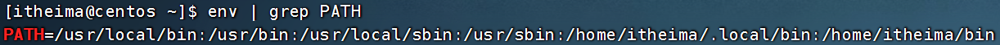

# Linux基础命令


## Linux的目录结构


- `/`，根目录是最顶级的目录了
- Linux只有一个顶级目录：`/`
- 路径描述的层次关系同样适用`/`来表示
- /home/itheima/a.txt，表示根目录下的home文件夹内有itheima文件夹，内有a.txt


## ls命令

功能：列出文件夹信息

语法：`ls [-l -h -a] [参数]`

- 参数：被查看的文件夹，不提供参数，表示查看当前工作目录
- -l，以列表形式查看
- -h，配合-l，以更加人性化的方式显示文件大小
- -a，显示隐藏文件


### 隐藏文件、文件夹

在Linux中以`.`开头的，均是隐藏的。

默认不显示出来，需要`-a`选项才可查看到。


## pwd命令

`print work directory`

功能：展示当前工作目录

语法：`pwd`


## cd命令

功能：切换工作目录

语法：`cd [目标目录]`

参数：目标目录，要切换去的地方，不提供默认切换到`当前登录用户HOME目录`


## HOME目录

每一个用户在Linux系统中都有自己的专属工作目录，称之为HOME目录。

- 普通用户的HOME目录，默认在：`/home/用户名`

- root用户的HOME目录，在：`/root`


FinalShell登陆终端后，默认的工作目录就是用户的HOME目录


## 相对路径、绝对路径

- 相对路径，==非==`/`开头的称之为相对路径

  相对路径表示以`当前目录`作为起点，去描述路径，如`test/a.txt`，表示当前工作目录内的test文件夹内的a.txt文件

- 绝对路径，==以==`/`开头的称之为绝对路径

  绝对路径从`根`开始描述路径


## 特殊路径符

- `.`，表示当前，比如./a.txt，表示当前文件夹内的`a.txt`文件
- `..`，表示上级目录，比如`../`表示上级目录，`../../`表示上级的上级目录
- `~`，表示用户的HOME目录，比如`cd ~`，即可切回用户HOME目录


## mkdir命令

功能：创建文件夹

语法：`mkdir [-p] 参数`

- 参数：被创建文件夹的路径
- 选项：-p，可选，表示创建前置路径


## touch命令

功能：创建文件

语法：`touch 参数`

- 参数：被创建的文件路径


## cat命令

功能：查看文件内容

语法：`cat 参数`

- 参数：被查看的文件路径


## more命令

功能：查看文件，可以支持==翻页查看==

语法：`more 参数`

- 参数：被查看的文件路径
- 在查看过程中：
  - `空格`键翻页
  - `q`退出查看


## cp命令

功能：复制文件、文件夹

语法：`cp [-r] 参数1 参数2`

- 参数1，被复制的
- 参数2，要复制去的地方
- 选项：-r，可选，复制文件夹使用

示例：

- cp a.txt b.txt，复制当前目录下a.txt为b.txt
- cp a.txt test/，复制当前目录a.txt到test文件夹内
- cp -r test test2，复制文件夹test到当前文件夹内为test2存在


## mv命令

功能：移动文件、文件夹

语法：`mv 参数1 参数2`

- 参数1：被移动的
- 参数2：要移动去的地方，参数2如果不存在，则会进行改名


## rm命令

功能：删除文件、文件夹     (remove)

语法：`rm [-r -f] 参数...参数`

- 参数：支持多个，每一个表示被删除的，空格进行分隔
- 选项：-r，删除文件夹使用
- 选项：-f，强制删除，不会给出确认提示，一般root用户会用到


> rm命令很危险，一定要注意，特别是切换到root用户的时候。


- rm命令支持通配符*，即匹配任意内容（包含空），示例：
  - test*,表示匹配任何以test开头的内容
  - *test, 表示匹配任何以test结尾的内容
  - *test *, 表示匹配任何包含test的内容


## which命令

功能：查看命令的程序本体文件路径

语法：`which 参数`

- 参数：被查看的命令


## find命令

功能：搜索文件

语法1 - 按文件名搜索：`find 路径 -name 参数`

- 路径，搜索的起始路径
- 参数，搜索的关键字（文件名），支持通配符*， 比如：`*`test表示搜索任意以test结尾的文件

语法2 - 按文件大小搜索：`find 起始路径 -size +|-n[kMG]`

- +、- 表示大于和小于
- n表示数字大小
- kMG表示大小的单位，k（小写字母）表示kb, M表示MB, G表示GB
  - 示例：查找小于10KB的文件：find / -size -10k


## grep命令

功能：过滤关键字

语法：`grep [-n] 关键字 文件路径`

- 选项-n，可选，表示在结果中显示匹配的行的行号。
- 参数，关键字，必填，表示过滤的关键字，带有空格或其它特殊符号，建议使用””将关键字包围起来
- 参数，文件路径，必填，表示要过滤内容的文件路径，可作为内容输入端口


> 参数文件路径，可以作为管道符的输入


## wc命令

功能：统计文件的行数、单词的数量

语法：`wc [-c -m -l -w] 文件路径`

- 选项，-c，统计bytes数量
- 选项，-m，统计字符数量
- 选项，-l，统计行数
- 选项，-w，统计单词数量
- 参数，文件路径，被统计的文件，可作为内容输入端口


> 参数文件路径，可作为管道符的输入


## 管道符|

写法：`|`

功能：将符号左边的结果，作为符号右边的输入（命令承接）

示例：

`cat a.txt | grep itheima`，将cat a.txt的结果，作为grep命令的输入，用来过滤`itheima`关键字


可以支持嵌套：

`cat a.txt | grep itheima | grep itcast`


## echo命令

功能：输出内容（在命令行内输出指定内容）

语法：`echo 参数`

- 参数：被输出的内容


## `反引号

功能：被两个反引号包围的内容，会`作为命令执行`

示例：

- echo \`pwd\`，会输出当前工作目录


## tail命令

功能：查看文件尾部内容

语法：`tail [-f -num] 参数`

- 参数：被查看的文件路径
- 选项：-f，持续跟踪文件修改 ；停止文件跟踪快捷键：ctrl+ c
- 选项：-num，表示查看尾部多少行，不填默认10行


## head命令

功能：查看文件头部内容

语法：`head [-n] 参数`

- 参数：被查看的文件
- 选项：-n，查看的行数


## 重定向符

功能：将符号左边的结果，输出到右边指定的文件中去

- `>`，表示==覆盖==输出
- `>>`，表示==追加==输出


## vi编辑器

### 命令模式快捷键


### 底线命令快捷键

按`:`键进入底线命令模式


## 命令的选项

我们学习的一系列Linux命令，它们所拥有的选项都是非常多的。

比如，简单的ls命令就有：-a -A -b -c -C -d -D -f -F -g -G -h -H -i -I -k -l -L -m -n -N -o -p -q -Q -r-R -s -S -t -T -u -U -v -w -x -X -1等选项，可以发现选项是极其多的。

课程中， 并不会将全部的选项都进行讲解，否则，一个ls命令就可能讲解2小时之久。

课程中，会对常见的选项进行讲解， 足够满足绝大多数的学习、工作场景。


### 查看命令的帮助

可以通过：`命令 --help`查看命令的帮助手册


### 查看命令的详细手册

可以通过：`man 命令`查看某命令的详细手册


# Linux常用操作

## 软件安装

- CentOS系统使用：
  - yum:RPM包软件管理器，用于自动化安装配置Linux软件，并可以自动解决依赖问题。
  - `yum [install remove search] [-y] 软件名称`
    - install 安装
    - remove 卸载
    - search 搜索
    - -y，自动确认

- Ubuntu系统使用
  - `apt [install remove search] [-y] 软件名称`
    - install 安装
    - remove 卸载
    - search 搜索
    - -y，自动确认

> *yum 和 apt 均需要root权限*


## systemctl

功能：控制系统服务的启动关闭等

能够被systemctl管理的软件，一般也称为服务。

语法：`systemctl start | stop | restart | disable | enable | status 服务名`

- start，启动
- stop，停止
- status，查看状态
- disable，关闭开机自启
- enable，开启开机自启
- restart，重启


## 软链接

功能：创建文件、文件夹软链接（类似快捷方式）

语法：`ln -s 参数1 参数2`

- -s选项，创建软连接

- 参数1：被链接的
- 参数2：要链接去的地方（快捷方式的名称和存放位置）


## 日期

语法：`date [-d] [+格式化字符串]`

- -d 按照给定的字符串显示日期，一般用于日期计算

- 格式化字符串：通过特定的字符串标记，来控制显示的日期格式
  - %Y   年%y   年份后两位数字 (00..99)
  - %m   月份 (01..12)
  - %d   日 (01..31)
  - %H   小时 (00..23)
  - %M   分钟 (00..59)
  - %S   秒 (00..60)
  - %s   自 1970-01-01 00:00:00 UTC 到现在的秒数


示例：

- 按照2022-01-01的格式显示日期

  

- 按照2022-01-01 10:00:00的格式显示日期

  

- -d选项日期计算

  

  - 支持的时间标记为：

    


## 时区

修改时区为中国时区


## ntp

功能：同步时间

安装：`yum install -y ntp`

启动管理：`systemctl start | stop | restart | status | disable | enable ntpd`


手动校准时间：`ntpdate -u ntp.aliyun.com`


## ip地址

格式：a.b.c.d

- abcd为0~255的数字


特殊IP：

- 127.0.0.1，表示本机
- 0.0.0.0
  - 可以表示本机
  - 也可以表示任意IP（看使用场景）


查看ip：`ifconfig`


## 主机名

功能：Linux系统的名称

查看：`hostname`

设置：`hostnamectl set-hostname 主机名`


## 域名解析

可以通过主机名找到对应计算机的IP地址，这就是主机名映射（域名解析）

先通过系统本地的记录去查找，如果找不到就联网去公开DNS服务器去查找

- 访问www.baidu.com的流程如下：
  - 
  - 即：
    - 先查看本机的记录（私人地址本）
      - ==Windows看：C:\Windows\System32\drivers\etc\hosts==
      - Linux看：/etc/hosts
    - 再联网去DNS服务器（如114.114.114.114，8.8.8.8等）询问


## 配置VMware固定IP

1. 修改VMware网络，参阅PPT，图太多

2. 设置Linux内部固定IP

   修改文件：`/etc/sysconfig/network-scripts/ifcfg-ens33`

   示例文件内容：

   ```shell
   TYPE="Ethernet"
   PROXY_METHOD="none"
   BROWSER_ONLY="no"
   BOOTPROTO="static"			# 改为static，固定IP
   DEFROUTE="yes"
   IPV4_FAILURE_FATAL="no"
   IPV6INIT="yes"
   IPV6_AUTOCONF="yes"
   IPV6_DEFROUTE="yes"
   IPV6_FAILURE_FATAL="no"
   IPV6_ADDR_GEN_MODE="stable-privacy"
   NAME="ens33"
   UUID="1b0011cb-0d2e-4eaa-8a11-af7d50ebc876"
   DEVICE="ens33"
   ONBOOT="yes"
   IPADDR="192.168.88.131"		# IP地址，自己设置，要匹配网络范围
   NETMASK="255.255.255.0"		# 子网掩码，固定写法255.255.255.0
   GATEWAY="192.168.88.2"		# 网关，要和VMware中配置的一致
   DNS1="192.168.88.2"			# DNS1服务器，和网关一致即可
   ```


## ps命令

功能：查看进程信息

语法：`ps -ef`，查看全部进程信息，可以搭配grep做过滤：`ps -ef | grep xxx`


## kill命令


## nmap命令


## netstat命令

功能：查看端口占用

用法：`netstat -anp | grep xxx`


## ping命令

测试网络是否联通

语法：`ping [-c num] 参数`


## wget命令


## curl命令


## top命令

功能：查看主机运行状态

语法：`top`，查看基础信息


可用选项：


交互式模式中，可用快捷键：


## df命令

查看磁盘占用


## iostat命令

查看CPU、磁盘的相关信息


## sar命令

查看网络统计


## 环境变量

- 临时设置：export 变量名=变量值
- 永久设置：
  - 针对用户，设置用户HOME目录内：`.bashrc`文件
  - 针对全局，设置`/etc/profile`


### PATH变量

记录了执行程序的搜索路径

可以将自定义路径加入PATH内，实现自定义命令在任意地方均可执行的效果


## $符号

可以取出指定的环境变量的值

语法：`$变量名`

示例：

`echo $PATH`，输出PATH环境变量的值

`echo ${PATH}ABC`，输出PATH环境变量的值以及ABC

如果变量名和其它内容混淆在一起，可以使用${}


## 压缩解压

### 压缩

`tar -zcvf 压缩包 被压缩1...被压缩2...被压缩N`

- -z表示使用gzip，可以不写


`zip [-r] 参数1 参数2 参数N`


### 解压

`tar -zxvf 被解压的文件 -C 要解压去的地方`

- -z表示使用gzip，可以省略
- -C，可以省略，指定要解压去的地方，不写解压到当前目录


`unzip [-d] 参数`


## su命令

切换用户

语法：`su [-] [用户]`


## sudo命令


比如：

```shell
itheima ALL=(ALL)       NOPASSWD: ALL
```

在visudo内配置如上内容，可以让itheima用户，无需密码直接使用`sudo`


## chmod命令

修改文件、文件夹权限


语法：`chmod [-R] 权限 参数`

- 权限，要设置的权限，比如755，表示：`rwxr-xr-x`

  

- 参数，被修改的文件、文件夹

- 选项-R，设置文件夹和其内部全部内容一样生效


## chown命令

修改文件、文件夹所属用户、组


语法：`chown [-R] [用户][:][用户组] 文件或文件夹`


## 用户组管理


## 用户管理


## getent

使用getent命令，可以查看当前系统中有哪些用户

语法：`getent passwd`


## genenv命令

- `getenv group`，查看系统全部的用户组

  

- `getenv passwd`，查看系统全部的用户

  


## env命令

查看系统全部的环境变量

语法：`env`


# 课程笔记

## 第一章：初始Linux

### 操作系统概述

- 计算机由硬件和软件两个部分组成
- 操作系统
  - 含义：配置在计算机硬件上的第一层软件，是对硬件系统的首次扩充，在此定义中，操作系统仅实现了硬件抽象、管理和拓展的核心，是`不包含周围应用`的。
  - 主要作用：协助用户调度硬件工作，充当用户和硬件之间的桥梁
- 常见的操作系统
  - PC端：Windows、Linux、MacOS
  - 移动端：Android、IOS、鸿蒙系统

### 初始Linux

- Linux系统的诞生
- Linux内核
  - 专业角度上的操作系统（不包含周围应用）
- Linux发行版
  - Linux内核+周围应用
  - 常见发行版：Ubuntu、RedHat、`CentOS`
- 开源
  - [Linux内核源码](https://www.kernel.org/)下载网址

### 虚拟机介绍

- 虚拟机
  - 含义：借助虚拟化技术，在电脑中通过软件模拟计算机硬件，并给虚拟硬件安装上真实的操作系统，即可得到一台虚拟的电脑。

- 使用虚拟机的原因
  - 以此在电脑中模拟出一个完整的电脑，以供学习Linux👍😍
  
    ​	

😁😁😁😁😁😁😁😁😁😁😁😁😁😁👍👍👍👍👍23.3.25👍👍👍👍👍👍👍👍👍👍👍👍👌👌👌👌👌👌👌👌👌👌


### VMware WorkStation软件

- 软件相关
  - 虚拟化软件，通过虚拟化软件获得`虚拟硬件的能力`
- 安装
  - [下载地址]( https://www.vmware.com/cn/products/workstation-pro.html)
- ==网络设置快捷键==
  - win+r 弹出运行框
  - 输入ncpa.cpl

### 在VMware上安装Linux

- [下载CentOS操作系统](https://vault.centos.org/7.6.1810/isos/x86_64/  )

- ==镜像网站==

  - [阿里开源镜像站](https://developer.aliyun.com/mirror/)

  - [清华大学开源镜像站](https://mirrors.tuna.tsinghua.edu.cn/)
  - [腾讯开源镜像站](https://mirrors.cloud.tencent.com/)

### 远程连接Linux系统

- 图形化、命令行
  - 图形化：使用操作系统提供的图形化页面，以获得图形化反馈的形式去使用操作系统。
  - 命令行：使用操作系统提供的各类命令，以获得字符反馈的形式去使用操作系统。
- 理解使用命令行操作Linux系统
  - 优势：效率高、更加直观、，并且资源占用低，程序运行稳定。
- 使用`FinalShell`软件连接Linux操作系统
  - 原因：使用VMware可以得到Linux虚拟机，但在VMware中操作Linux不太方便
    - 内容的复制、粘贴跨越VMware
    - 文件的上传、下载跨越VMware
    - 和Linux系统的各类交互，跨越VMware
  - 通过第三方软件FinalShell远程连接到Linux系统上，并通过FinalShell操作系统Linux
  - [FinalShell下载地址](http://www.hostbuf.com/downloads/finalshell_install.exe)
- 连接操作
  - 在Linux操作系统中，桌面空白右键点击：open in terminal
  - 输入ifconfig,即可查看IP地址
  - 在FinalShell中配置好IP地址，账号密码后，即可连接成功
    - 再次使用时若出现无法连接的情况，可能需要更新IP地址

### 拓展：WSL

- WSL(Windows Subsystem for Linux，是用于Windows系统之上的Linux子系统)

  - 主要目的：扩展知识面，更简单轻松的获得Linux操作系统环境

  - 作用：通过WSL获得Ubuntu发行版环境

  - `WSL可以无需单独虚拟一套硬件设备就可以直接使用主机的物理硬件，构建Linux操作系统，并不会影响Windows系统本身的运行`

  

- [WSL部署]([第一章-08-扩展-Win10配置WSL(Ubuntu)环境_哔哩哔哩_bilibili](https://www.bilibili.com/video/BV1n84y1i7td?p=9&vd_source=dc592a9a11a9bfa2f27b54bff3f83777))


### 扩展：虚拟机快照(备份)

- VMware虚拟机（Workstation）支持为虚拟机制作快照。
- 通过快照将当前虚拟机的状态保存下来，在以后`可以通过快照恢复虚拟机到保存状态`


- 具体操作
  - 关闭虚拟机
    - shut down guest
  - 右键虚拟机名称
  - 点击snapshot(快照)
  - `若出现文件丢失等情况`
    - 直接转到（go to)最近快照即可


## 第二章：Linux基础命令

### Linux目录结构

### Linux命令入门

- Linux命令基础

  ==学习Linux本质上是学习在命令行下 熟练使用Linux的各类命令==

  - 命令行：即Linux终端（Terminal），是一种命令提示符页面。以纯”字符“的形式操作系统，可以使用各种字符化命令对系统发出操作指令

  - 命令：即Linux程序。一个命令就是一个程序。命令没有图像化页面，可以在命令行（终端中）提供字符化的反馈

  

- Linux命令基础格式
  - 通用格式  ==command [-options] [parameter]==
    - command:命令本身
    - -options:[可选，非必填]命令的一些选项，可以通过选项控制命令的行为细节
    - parameter:[可选，非必填]命令的参数，多数用于`命令的指向目标`等
  - 示例
    - ls -l /home/itheima, ls是命令本身，-l是选项， /home/itheima是参数
      - 命令含义：以列表的形式，显示/home/itheima目录内的内容
    - cp -r test1 test2, cp是命令本身， -r是选项， test1和test2是参数
      - 命令含义：复制文件夹test1成为test2

- ls命令入门

  - 功能：列出文件夹信息

    语法：`ls [-l -h -a] [参数]`

    - 参数`（Linux路径)`：被查看的文件夹，不提供参数，表示查看当前工作目录
    - 选项
      - -l，以列表形式查看
      - -h，配合-l，以更加人性化的方式显示文件大小
      - -a，即all的意思，即列出全部文件包含（隐藏文件/文件夹）
        - `以.开头的文件或文件夹默认被隐藏`，需要-a才能显示出来
      - 可组合使用

- HOME目录、当前工作目录

  - HOME目录：每一个用户在Linux系统的专属目录，默认在：/home/用户名
  - 当前工作目录：Linux命令行在执行命令的时候，需要一个工作目录，打开命令行程序（终端）默认设置工作目录在用户的HOME 目录


😍😍😍😍😍😍😍😍😍😍😍😍😍😁😁😁😁23.3.26😁😁😁😁😁😁😊😊😊😊😊😊😊😊😊😊😊😊😊😊🌭🌭🌭🌭


### 目录切换相关命令（cd/pwd)

- cd 切换工作目录
  - cd-change directory
  - 语法
    - cd [Linux路径]
    - cd命令无需选项，只有参数，表示要切换到哪个目录下
    - cd命令直接执行，不写参数，表示回到用户的HOME目录

- pwd 展示当前工作目录

### 相对路径、绝对路径和特殊路径符

- 相对路径			
  - 概念：以`当前目录为起点`，描述路径的一种写法，路径描述无需以/开头						
  - 写法
- 绝对路径
  - 概念：以`根目录为起点`，描述路径的一中写法，路径描述以/开头
  - 写法
- 特殊路径表示符
  - `.`  表示当前目录，比如cd ./Desktop 表示切换到当前目录下的Desktop目录内，和cd Desktop效果一致
  - `..` 表示上一级目录，比如：cd .. 即可切换到上一级目录，cd ../.. 切换到上两级目录
  - `~`  表示HOME目录，比如：cd ~  即可切换到HOME目录或cd ~/Desktop, 切换到HOME目录内的Desktop目录

### 创建目录命令（mkdir）

功能：创建新目录（文件夹）

make directory

语法：`mkdir [-p] Linux路径`

- 参数==必填==，表示Linux路径，即要创建的文件夹的路径，相对路径或绝对路径
- -p选项可选，表示自动创建不存在的父目录，适用于创建连续多层级的目录

### 文件操作命令（touch、cat、more）

### 文件操作命令（cp、mv、rm）

### 查找命令（find、which）

### grep、wc和管道符

### echo和重定向符

### vi\vim编辑器

- 简介

  - vi\vim是visual interface的简称，是Linux中最经典的文本编辑器

  - 类似图形化界面中的文本编辑器，vi是命令行下对文本文件进行编辑的绝佳选择。

  - vim是vi的加强版，兼容vi的所有指令，能编辑文本、具有shell程序编辑的功能，可以用不同颜色的字辨别语法的正确性

- 三种工作模式

  - 命令模式（Command mode）
    - 命令模式下，所敲的按键编辑器都理解为命令，以命令驱动执行不同的功能。
    - 此模式下，不能自由进行文本编辑
  - 输入模式（insert mode）
    - 编辑模式、插入模式
    - 可以进行文本编辑
  - 底线命令模式（Last line mode）
    - 以：开始，通常用于文件的保存、退出


## 第三章：Linux用户和权限


### 认知root用户

- root用户（超级管理员）

  - 在Linux系统中，又有最大权限的账户名为：root(超级管理员)
  - 普通用户的权限，一般在HOME目录内不受限
  - 但出了HOME目录，大多数地方，普通用户仅有只读和执行权限

- ==用户切换命令==

  - su命令

    用于切换账户，来源于switch user

    语法：`su [-] [用户名]`

    - -符号是可选的，表示是否在切换用户后加载环境变量
    - 参数：用户名，表示要切换的用户，用户名可省略，省略表示切换到root

  - exit

    - 切换用户后，可以通过exit命令退回上一个用户，也可以是快捷键:ctrl+d

  - sudo命令

    可以使用sudo命令为普通命令授权，临时以root身份执行

    语法：`sudo 其他命令`

    - 使用sudo命令，需要为==普通用户配置sudo认证==：
      - su - 切换到root
      - 在root目录下输入：visudo
      - 按下o键，进入vi编辑器的输入模式
      - 在最后一行输入：`用户名 ALL=(ALL)      NOPASSWD`
      - 按esc键，退出输入模式，进入命令模式
      - 在输入命令 :`：wq`保存并退出

    

### 用户、用户组管理

Linux系统中可以：

- 配置多个用户

- 配置多个用户组

- 用户可以加入多个用户组中

Linux中关于权限的管控级别有2个级别，分别是：

- 针对用户的权限控制

- 针对用户组的权限控制


*用户组管理*（==需root用户执行==）

- 创建用户组：`groupadd 用户组名`
- 删除用户组：`groupdel 用户组名`


*用户管理*（==需root用户执行==）

- 创建用户：`useradd [-g -d] 用户名`
  - -g指定用户的组，不指定-g，会创建同名组并自动加入，指定-g需要组已经存在，若存在同名组，必须使用-g
  - -d指定用户HOME路径，不指定，HOEM目录默认在：/home/用户名
- 删除用户：`userdel [-r] 用户名`
  - -r，删除用户的HOME目录，不使用-r，删除用户时HOME目录保留
- 查看用户所属组：`id [用户名]`
  - 参数：用户名， 被查看的用户，不提供用户名则查看自身
- 修改用户所属组：`usermod -aG 用户组 用户名`
  - 将指定用户加入指定的用户组


*getent命令*

- 使用getent命令，可以`查看当前系统中有哪些用户`

- 语法：`getent passwd`
- 共有7份信息：
  - 用户名：密码（x）：用户ID：组ID：描述信息：HOME目录：执行终端（默认bash）
- 使用getent命令，可以查看当前系统有哪些组
- 语法：getent group
- 共有3份信息：
  - 组名称：组认证（显示为x）：组ID


👍👍👍👍👍👍👍👍👍👍👍👍👍👍👍👍👍😍😍😍23.3.27😍😍😍😍😍😍😍😍❤️❤️❤️❤️💕💕🤣🤣🤣🤣🤣🤣🤣


### 查看权限控制

- 查看Linux文件的权限管控信息

  - 通过ls -l 可以以列表形式查看内容，并显示权限细节

  

  - 序号位置含义

    - 序号1，表示文件、文件夹的权限控制信息			

    - 序号2，表示文件、文件夹所属用户

    - 序号3，表示文件、文件夹所属用户组		

  - 权限细节

    - 共10个槽位
    - 
    - 示例：drwxr-xr-x，表示：
      - 这是一个文件夹，首字母d表示
      - 所属用户(右上角图序号2)的权限是：有r有w有x，rwx
      - 所属用户组(右上角图序号3)的权限是：有r无w有x，r-x （-表示无此权限）
      - 其它用户的权限是：有r无w有x，r-x

- 读、写、执行三种权限的含义

  - rwx

    - r表示读权限：文件-查看文件内容；文件夹-查看文件夹内容，如ls命令

    - w表示写权限：文件-修改文件；文件夹-在文件夹内：创建、删除、改名等操作

    - x表示执行权限：文件-将文件作为程序执行；文件夹-可以更改工作目录到此文件夹，即cd进入

      ​	

### 修改权限控制 - chmod

- 使用chmod修改权限信息
  - ==只有文件、文件夹的所属用户或root用户可以修改==	
  - 语法：`chmod [-R] 权限 文件或文件夹`
    - 选项：-R，对文件夹内的全部内容应用同样的操作
  - 示例：
  - chmod u=rwx,g=rx,o=x hello.txt ，将文件权限修改为：rwxr-x--x
    - 其中：**u表示user所属用户权限，g表示group组权限，o表示other其它用户权限**
  - chmod -R u=rwx,g=rx,o=x test，将文件夹test以及文件夹内全部内容权限设置为：rwxr-x--x

- 使用数字序号标记权限信息
  - 权限可以用3位数字来代表，第一位数字表示用户权限，第二位表示用户组权限，第三位表示其它用户权限。
  - 数字的细节如下：r记为4，w记为2，x记为1，可以有：
    - 0：无任何权限，	即 ---
    - 1：仅有x权限，	即 --x
    - 2：仅有w权限	即 -w-
    - 3：有w和x权限	即 -wx
    - 4：仅有r权限	即 r--
    - 5：有r和x权限	即 r-x
    - 6：有r和w权限	即 rw-
    - 7：有全部权限	即 rwx

​             所以751表示： rwx(7) r-x(5) --x(1)

### 修改权限控制 - chown

- 使用chown修改所属用户、用户组   ==普通用户无法修改所属为其它用户或用户组，所以此命令只适用于root用户执行==
- 语法：`chown [-R] [用户] [:] [用户组] 文件或文件夹`
  - 选项，-R，同chmod，对文件夹内全部内容应用相同规则
  - 选项，用户，修改所属用户
  - 选项，用户组，修改所属用户组
  - :用于分隔用户和用户组
- 示例：
  - chown root hello.txt，将hello.txt所属用户修改为root
  - chown :root hello.txt，将hello.txt所属用户组修改为root
  - chown root:itheima hello.txt，将hello.txt所属用户修改为root，用户组修改为itheima
  - chown -R root test，将文件夹test的所属用户修改为root并对文件夹内全部内容应用同样规则


## 第四章：Linux实用操作

### 各类小技巧（快捷键）

- 强制停止：`ctrl+c`
  - 强制停止Linux某些程序运行
  - 命令输入错误，退出当前输入，重新输入
- 退出、登出:`ctrl + d`
  - 退出账户的登录
  - 退出某些程序的专属页面，如python页面
- 历史命令搜索：
  - `history`
  - `!命令前缀`，自动执行上一次匹配前缀的命令
  - `ctrl + r`，匹配历史命令
- 光标移动
- 清屏
  - `ctrl + l`,清空终端内容
  - `clear`


### 软件安装

- 使用yum为CentOS系统安装软件
- 使用apt为Ubuntu安装软件（扩展）


### systemctl


### 软连接


### 日期、时区

- `date`命令查看日期时间
- 修改Linux系统的时区
- 使用`ntp`进行时间同步和校准


### IP地址、主机名

- IP和主机名
- 虚拟机配置固定IP


### 网络传输

- 下载和网络请求

  - 使用`ping`命令检查服务器是否可联通
  - 使用`wget`命令下载文件
  - 使用`curl`命令发起网络请求

- 端口

  - 端口：是设备与外界通讯交流的出入口。可分为：物理端口和虚拟端口

    - 物理端口：又称为接口，是可见的端口，如USB接口、RJ45网口、HDMI端口等
    - 
    - 虚拟端口：是指计算机内部的端口，是不可见的，是用来操作系统和外部进行交互使用的
    - 

    - ==IP地址相当于小区地址，在小区内可以有许多住户（程序），而门牌号（端口）就是各个住户（程序）的联系地址==

  - Linux系统是一个超大号小区，可以支持65535个端口，这6万多个端口分为3类进行使用：
    - 公认端口：1 ~ 1023，通常用于一些系统内置或知名程序的预留使用，如SSH服务的22端口，HTTPS服务的443端口非特殊需要，不要占用这个范围的端口
    - 注册端口：1024 ~ 49151，通常可以随意使用，用于松散的绑定一些程序\服务
    - 动态端口：49152 ~ 65535，通常不会固定绑定程序，而是当程序对外进行网络链接时，用于临时使用。


如图中，计算机A的微信连接计算机B的微信，A使用的50001即动态端口，临时找一个端口作为出口计算机B的微信使用端口5678，即注册端口，长期绑定此端口等待别人连接

- nmap命令
- netstart命令

### 进程管理

- 进程
  - 为管理运行的程序，每一个程序在运行的时候，便被注册为系统中的一个：进程
  - 并会为每一个进程都分配一个独有的：进程ID（进程号）

- 查看进程

  - 语法：`ps [-e -f]`
  - 选项：-e,显示出全部 进程
  - 选项：-f,完全格式化的形式展示信息（展示全部信息）
  - 一般的固定用法就是：`ps -ef`列出全部进程的全部信息
  - 
    - UID：进程所属的用户ID
    - PID：进程的进程号ID
    - PPID：进程的父ID（启动此进程的其它进程）
    - C：此进程的CPU占用率（百分比）
    - STIME：进程的启动时间
    - TTY：启动此进程的终端序号，如显示?，表示非终端启动
    - TIME：进程占用CPU的时间
    - CMD：进程对应的名称或启动路径或启动命令

- 关闭进程

  - 语法：`kill [-9] 进程ID`

  - 选项：-9，表示强制关闭进程。不使用此选项会向进程发送信号要求其关闭，但是否关闭要看进程自身的处理机制。

    

### 主机状态

- 查看系统占用

  - `top命令`
    - 可以通过top命令查看CPU、内存使用情况，类似Windows的任务管理器默认每5秒刷新一次，

    - 语法:`直接输入top即可，按q或ctrl +c退出`

    - 


  - `top`命令详情

    - 第一行:top - 14:39:58 up 6 min,2 users，load average: 0.06，0.17，0.13
      top:命令名称，14:39:58:当前系统时间，up 6 min:启动了6分钟，2 users:2个用户登录，load: 1、5、15分钟负载


    - 第二行:Tasks: 175 total, 1 running，174 sleeping,0 stopped,0 zombie
      Tasks: 175个进程，1 running: 1个进程子在运行，174 sleeping: 174个进程睡眠，0个停止进程，0个僵尸进程
    
    - 第三行:%Cpu(s): 0.3 us,1.4 sy, 0.0 ni， 98.3 id，0.0 wa，0.0 hi,0.0 si,0.0 st
      %Cpu(s)：CPU使用率，us：用户CPU使用率，sy:系统CPU使用率，ni:高优先级进程占用CPU时间百分比，id:空闲CPU率，wa:IO等待CPU占用率，hi:CPU硬件中断率，si:CPU软件中断率，st:强制等待占用CPU率
    
    - 第四、五行: K1B Mem : 995892 total，187672 free, 394912 used, 413308 buff/cache used .391852avail Mem
      Kib Mem:物理内存，total:总量，free:空闲，used:使用，buff/cache: buff和cache占用
      Kib Swap:虚拟内存(交换空间)，total:总量，free:空闲，used:使用， buff/cache: buff和cache占用

  - `top`命令详情

    - 
    - PID：进程id
    - USER：进程所属用户
    - PR：进程优先级，越小越高
    - NI：负值表示高优先级，正表示低优先级
    - VIRT：进程使用虚拟内存，单位KB
    - RES：进程使用物理内存，单位KB
    - SHR：进程使用共享内存，单位KB
    - S：进程状态（S休眠，R运行，Z僵死状态，N负数优先级，I空闲状态）
    - %CPU：进程占用CPU率
    - %MEM：进程占用内存率
    - TIME+：进程使用CPU时间总计，单位10毫秒
    - COMMAND：进程的命令或名称或程序文件路径

  - top命令选项

    - 选项 功能

    - -p   只显示某个进程的信息
    - -d   设置刷新时间，默认是5s
    - -c    显示产生进程的完整命令，默认是进程名
    - -n   指定刷新次数，比如top -n 3，刷新输出3次后退出
    - -b   以非交互非全屏模式运行，以批次的方式执行top，一般配合-n指定输出几次统计信息，将输出重定向到指定文件，比如top -b -n 3 > /tmp/ top .tmp
    - -i    不显示任何闲置(idle)或无用(zombie)的进程
    - -u   查找特定用户启动的进程

  - top交互式选项

    - 

    

- 磁盘信息监控

  - `df`命令
    - 使用`df`命令，可以查看硬盘的使用情况

    - 语法：`df [-h]`

    - 选项：`-h`，以更加人性化的单位显示

  - `iostat`命令
    - 可以使用`iostat`查看CPU、磁盘的相关信息
    - 语法：`iostat [-x] [num1] [num2]`
    - 选项：`-x`，显示更多信息
    - `num1`：数字，刷新间隔
    - `num2`：数字，刷新几次
  - 命令信息
    - 
    - rKB/s：	每秒发送到设备的读取请求数
    - wKB/s：	每秒发送到设备的写入请求数
    - %util： 	磁盘利用率


- 网络状态监控

  - `sar`命令
    - 可以使用`sa`r命令查看网络的相关统计
    - 语法：`sar -n DEV num1 num2`
    - 选项：`-n`，查看网络，DEV表示查看网络接口
    - `num1`：刷新间隔（不填就查看一次结束）
    - `num2`：查看次数（不填无限次数）
    - ==信息解读==
      - 
      - IFACE 本地网卡接口的名称
      -  rxpck/s每秒钟接受的数据包
      -  txpck/s每秒钟发送的数据包
      - rxKB/S每秒钟接受的数据包大小，单位为KB
      -  txKB/S每秒钟发送的数据包大小，单位为KB
      - rxcmp/s每秒钟接受的压缩数据包
      -  txcmp/s每秒钟发送的压缩包
      - rxmcst/s每秒钟接收的多播数据包

  

### 环境变量

- 环境变量的作用
  - 环境变量
    - 环境变量是操作系统（Windows、Linux、Mac）在运行的时候，记录的一些关键性信息，用以辅助系统运行。
    - 在Linux系统中执行：`env命令`即可查看当前系统中记录的环境变量
    - 环境变量是一种==KeyValue型结构==，即名称和值
  - 环境变量：PATH
    - 无论当前工作目录是什么，都能执行/usr/bin/cd这个程序，这个就是借助环境变量中：PATH这个项目的值来做到的。
    - 
    - PATH记录了系统执行任何命令的搜索路径，如上图记录了（路径之间以:隔开）
- 符号$的作用
  - 在Linux系统中，符号被用于取”变量”的值。环境变量记录的信息，除了给操作系统自己使用外，如果我们想要取用，也可以使用。
  - 取得环境变量的值就可以通过语法：`$环境变量名`
    - 比如： `echo $PATH`就可以取得PATH这个环境变量的值，并通过echo语句输出出来。
    - 又或者：`echo ${PATH}ABC`当和其它内容混合在一起的时候，可以通过{}来标注取的变量是谁
- 在Linux中配置环境变量
  - 自行设置环境变量
    - 临时设置，语法：`export 变量名=变量值`
    - 永久生效
      - 针对当前用户生效，配置在当前用户的：	~/.bashrc文件中
      - 针对所有用户生效，配置在系统的：	/etc/profile文件中
      - 并通过语法：source 配置文件，进行立刻生效，或重新登录FinalShell生效
  - 自定义环境变量PATH
    - 环境变量PATH这个项目里面记录了系统执行命令的搜索路径。这些搜索路径我们也可以自行添加到PATH中去。
    - 测试：
      - 在当前HOME目录内创建文件夹，myenv,  在文件夹内创建文件mkhaha
      - 通过vim编辑器，在mkhaha文件内填入：echo 哈哈哈哈哈
      - 完成上述操作后，随意切换工作目录，执行mkhaha命令尝试一下，会发现无法执行
    - 修改PATH的值
      - 临时修改PATH：`export PATH=$PATH:/home/itheima/myenv`，再次执行mkhaha，无论在哪里都能执行了或将export PATH=$PATH:/home/itheima/myenv，填入用户环境变量文件或系统环境变量文件中去

### 上传、下载

- 方法一：在文件系统操作

- 方法二：FinallShell中操作

  - `rz`命令
    - rz、sz命令需要安装，可以通过：yum -y install lrzsz，即可安装
    - rz命令，进行上传，语法：`直接输入rz即可`

  - `sz命令`
    - sz命令进行下载，语法：sz 要下载的文件
    - 文件会自动下载到桌面的：fsdownload文件夹中

### 压缩、解压

- tar命令压缩或解压tar或gzip文件
  - 两种压缩格式
    - .tar，称之为tarball，归档文件，即简单的将文件组装到一个.tar的文件内，并没有太多文件体积的减少，仅仅是简单的封装
    - .gz，也常见为.tar.gz，gzip格式压缩文件，即使用gzip压缩算法将文件压缩到一个文件内，==可以极大的减少压缩后的体积==
  - tar命令
    - 语法：`tar [-c -v -x -f -z -C] 参数1 参数2 … `
    - -c，创建压缩文件，用于压缩模式
    - -v，显示压缩、解压过程，用于查看进度
    - -x，解压模式
    - -f，要创建的文件，或要解压的文件，-f选项必须在所有选项中位置处于最后一个
    - -z，gzip模式，不使用-z就是普通的tarball格式
    - -C，选择解压的目的地，用于解压模式
  - 示例1（压缩）
    - tar -cvf test.tar 1.txt 2.txt 3.txt
      - 将1.txt 2.txt 3.txt 压缩到test.tar文件内
    - tar -zcvf test.tar.gz 1.txt 2.txt 3.txt
      - 将1.txt 2.txt 3.txt 压缩到test.tar.gz文件内，使用gzip模式
    - *注意：-z选项如果使用的话，一般处于选项位第一个* ，*-f选项，必须在选项位最后一个*
  - 示例2（解压）
    - tar -xvf test.tar
      - 解压test.tar，将文件解压至当前目录
    - tar -xvf test.tar -C /home/itheima
      - 解压test.tar，将文件解压至指定目录（/home/itheima）
    - tar -zxvf test.tar.gz -C /home/itheima
      - 以Gzip模式解压test.tar.gz，将文件解压至指定目录（/home/itheima）
    - 注意：-f选项，必须在选项组合体的最后一位-z选项，建议在开头位置-C选项单独使用，和解压所需的其它参数分开
- zip、unzip命令压缩或解压zip文件
  - `zip命令`
    - 可以使用zip命令，压缩文件为zip压缩包
    - 语法：`zip [-r] 参数1 参数2 …`
    - -r，被压缩的包含文件夹的时候，需要使用-r选项，和rm、cp等命令的-r效果一致
  - 示例：
    - zip test.zip a.txt b.txt c.txt
      - 将a.txt b.txt c.txt 压缩到test.zip文件内
    - zip -r test.zip test itheima a.txt
      - 将test、itheima两个文件夹和a.txt文件，压缩到test.zip文件内
  -  unzip
    - 语法：`unzip [-d] 参数`
      - -d，指定要解压去的位置，同tar的-C选项
      - 参数，被解压的zip压缩包文件
  - 示例：
    - unzip test.zip，将test.zip解压到当前目录
    - unzip test.zip -d /home/itheima，将test.zip解压到指定文件夹内（/home/itheima）


****

# 涤生课程笔记补充


## 	命令补充

`man 命令名称`：查询某一命令的具体用途


