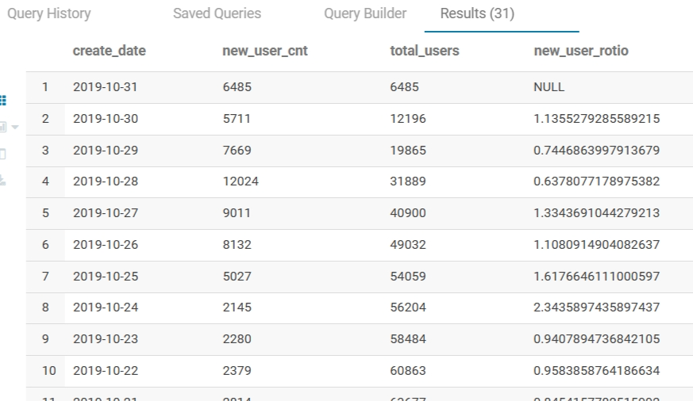
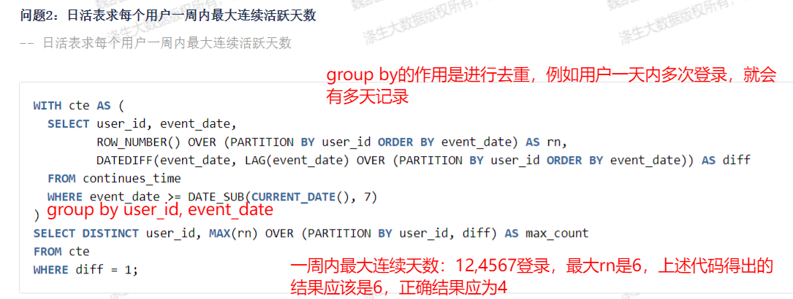

# SQL题型总结

## 0.题型核心点

**题目说明**：具体的题目内容

| 具体字段 | 具体字段 | 具体字段 |
| -------- | -------- | -------- |

**解题思路**：

方法一：……

方法二：……

**代码示例**：

```sql
-- 方法一
select * from table_name;
-- 方法二
```

**扩展**：……


## 1.分组TOPN问题

**题目说明**：如果是全局限制，例如限制输出条数，直接用order by 进行全局排序、limit关键字进行限制即可。但如果是需要在group by分组内做限制，limit便无法满足需求。例如游戏项目中要求求出每个城市的登录总时长的前三名。、

**解题思路**：先利用开窗函数进行组内排序，再嵌套一层对每组的排序数字大小进行限制

**代码示例**：

``` sql
-- 题型一示例
--------求每个分组内top问题
select t1.date_time,t1.user_id, t1.pass_count, t1.pass_rank
from (
    select 
        date1 as date_time
        ,user_id
        ,pass_count
        ,row_number() over(partition by date1 order by pass_count)  pass_rank
    from questions_pass_record_detail
    ) t1
where t1.pass_rank <= 2
;
-------题型扩展
-------查询每一科目成绩最高和最低分数的学生
-------原始数据在ods_game_dev库
SELECT year, school, class, subject, name, score 
FROM (
    SELECT year, school, class, subject, name, score,
        row_number() over (partition by subject order by score desc) as rank_a,
        row_number() over (partition by subject order by score asc) as rank_b
    FROM topn_scores
) subquery
WHERE rank_a = 1 or rank_b = 1;
```

## 2.判断字段不为空

**题目说明**：关于比较运算符 `< >` :用于检查两个值是否不相等的运算符

```sql
-- 按城市对客户进行排序，若城市为空，则按国家排序，返回全部字段
SELECT *
FROM customers_info
ORDER BY
  CASE
    -- 城市不为空，按城市排序
    WHEN city IS NOT NULL AND city <> '' THEN city
    -- 城市为空，按国家排序
    ELSE country
    END;
    
```


## 3.where关联与join的联系和区别、开窗函数dense_rank

知识点一：where、join进行关联的区别

--------使用where进行关联

``` sql
SELECT a.ID, b.Name, b.Date FROM Customers a, Sales b WHERE a.ID = b.ID;
```

缺点：该语句实际上创建两张表的笛卡尔积，所有组合都被创建。

--------避免产生笛卡尔积，应选用inner join进行关联

``` sql
SELECT a.ID, b.Name, b.Date FROM Customers a INNER JOIN Sales b ON a.ID = b.ID;
```

优点：使用inner join就只产生等于ID的结果，增加了查询效率

补充：有些数据库系统会识别出 WHERE连接并自动转换为 INNER JOIN。在这些数据库系统中，WHERE 连接与INNER JOIN 就没有性能差异。但 INNER JOIN 是所有数据库都能识别的


知识点二：rank()、dense_rank()、row_number()区别

- rank()：排序相同会重复，序号不连续、总数不变。示例：排序结果为1、1、3
- dense_rank()：排序相同会重复、序号连续、总数减少。示例：排序结果为1、1、2
- row_number()：排序相同不重复，序号连续。示例：排序结果为1、2、3


``` sql
----示例
-- 示例来源：涤生Wiki-第三阶段-SQL进阶提高
-- 需求：从exam_record数据表中计算所有用户完成SQL类别高难度试卷得分的截断平均值（去掉一个最大值和一个最小值后的平均值）
select ss.tag,ss.difficulty,avg(ss.score)
from (
     select tt.tag,tt.difficulty,tt.score
       ,dense_rank() over(partition by tt.tag order by tt.score) r1
       ,dense_rank() over(partition by tt.tag order by tt.score desc) r2
     from (
          select bb.tag,bb.difficulty,aa.score 
          from exam_record aa 
            inner join examination_info bb
            on aa.exam_id=bb.exam_id
          where bb.tag='SQL' 
            and bb.difficulty='hard'
            and aa.submit_time is not null
          ) tt
     ) ss
where ss.r1>1
and ss.r2>1
group by ss.tag,ss.difficulty
;
```


## 题型四：获取字段为空的个数的思想

``` sql
-- 字段为空个数
sum(case when submit_time is null then 1 else 0 end)
-- 字段非空个数
sum(case when submit_time is null then 0 else 1 end)
```


## 题型五：

``` sql
-- 需求：请从表中统计出 “当月均完成试卷数”不小于3的用户们爱作答的类别及作答次数，按次数降序输出.
SELECT * from exam_record;

-- 1.当月完成试卷数不小于3,按月和uid分组
select 
  uid
  ,date_format(start_time,'yyyy-MM') as month
  -- 完成试卷数
  ,sum(case when submit_time is null then 0 else 1 end) r1
from exam_record
group by uid,date_format(start_time,'yyyy-MM')
having r1>=3;

-- 2.添加exam_id字段
-- 2.1将第一步从exam_record过滤出的符合条件的数据再与exam_record表关联，用于添加exam_id字段
-- 2.2添加exam_id字段的原因是为了利用exam_id字段关联examination_info表从而添加tag字段
select t1.*,t2.exam_id
from
    (
    select 
      uid
      ,date_format(start_time,'yyyy-MM') as month
      -- 完成试卷数
      ,sum(case when submit_time is null then 0 else 1 end) r1
    from exam_record 
    group by uid,date_format(start_time,'yyyy-MM')
    having r1>=3
    ) t1
join exam_record t2
on t1.uid=t2.uid

-- 3.添加tag字段并按次数降序
select a2.tag,count(*) as tag_cnt
from
    (
    select t1.*,t2.exam_id
    from
        (
        select 
          uid
          ,date_format(start_time,'yyyy-MM') as month
          -- 完成试卷数
          ,sum(case when submit_time is null then 0 else 1 end) r1
        from exam_record 
        group by uid,date_format(start_time,'yyyy-MM')
        having r1>=3
        ) t1
    join exam_record t2
    on t1.uid=t2.uid
    ) a1
join examination_info a2
on a1.exam_id=a2.exam_id
group by a2.tag
order by tag_cnt desc
```


## 题型六：保留小数、datadiff、cast

``` sql
--------------------------过滤条件
-- 1.2021年
-- 至少两天作答试卷
SELECT 
  uid
  ,count(DISTINCT date_format(start_time,'yyyy-MM-dd')) as day_cnt
from exam_record
WHERE start_time BETWEEN '2021-01-01' AND '2021-12-31'
GROUP BY uid
HAVING day_cnt>=2;


-- 2.连续两次作答试卷的最大时间窗口
--------- 注意hive中datediff函数的使用
select 
  t1.uid
  ,max(datediff(t1.next_time,t1.start_time) + 1) as day_window
from
    (
    select
      uid
      ,start_time
      ,lead(start_time,1) OVER (PARTITION BY uid ORDER BY start_time) as next_time
    from exam_record
    group by uid,start_time
    ) t1
group by t1.uid;


-- 3.2021最大时间差下，平均每天做试卷数
select t2.uid,t2.exam_cnt/(datediff(t2.max_time,t2.min_time)+1) as avg_day_2021_max_time
from
    (
    SELECT 
      uid
      ,count(distinct exam_id) as exam_cnt
      ,MIN(start_time) AS min_time
      ,MAX(start_time) AS max_time 
    FROM exam_record 
    WHERE start_time BETWEEN '2021-01-01' AND '2021-12-31'
    GROUP BY uid
    ) t2
    
-- 最终代码
select aa1.uid,aa1.day_window,cast(aa1.day_window * aa2.avg_day_2021_max_time as decimal(10,2)) as avg_exam_cnt
from
    (
    select a1.uid,a2.day_window
    from
        (
        -- 2021年
        -- 至少两天作答试卷
        SELECT 
          uid
          ,count(DISTINCT date_format(start_time,'yyyy-MM-dd')) as day_cnt
        from exam_record
        WHERE start_time BETWEEN '2021-01-01' AND '2021-12-31'
        GROUP BY uid
        HAVING day_cnt>=2
        ) a1
    left join 
        (
        -- 连续两次作答试卷的最大时间窗口
        select 
          t1.uid
          ,max(datediff(t1.next_time,t1.start_time) + 1) as day_window
        from
            (
            select
              uid
              ,start_time
              ,lead(start_time,1) OVER (PARTITION BY uid ORDER BY start_time) as next_time
            from exam_record
            group by uid,start_time
            ) t1
        group by t1.uid
        ) a2
    on a1.uid = a2.uid
    ) aa1
left join
    (
    -- 2021最大时间差下，平均每天做试卷数
    select t2.uid,t2.exam_cnt/(datediff(t2.max_time,t2.min_time)+1) as avg_day_2021_max_time
    from
        (
        SELECT 
          uid
          ,count(distinct exam_id) as exam_cnt
          ,MIN(start_time) AS min_time
          ,MAX(start_time) AS max_time 
        FROM exam_record 
        WHERE start_time BETWEEN '2021-01-01' AND '2021-12-31'
        GROUP BY uid
        ) t2
    ) aa2    
on aa1.uid=aa2.uid
order by day_window,avg_exam_cnt desc
```

## 题型七：分组后如何求平均

``` SQL
-- 量化刷题第27题
-- 需求分析27：查询 2019-10-03当日，登录的玩家，不同的按钮类型、不同平台、渠道的点击总次数、平均总次数、各按钮类型 占 总按钮类型的比例。
-- 下列SQL出现错误：Error while compiling statement: FAILED: SemanticException [Error 10025]: line 98:2 Expression not in GROUP BY key 'plat_id'


-- 平均总次数？？？？
-- 各按钮类型 占 总按钮类型的比例
SELECT 
  a1.plat_id
  ,a1.channel_id
  ,a1.system_type
  ,a1.type_cnt/b1.cnt  as per
--   ,a1.type_cnt/count(a1.type_cnt) as avg_times
FROM 
    (
    -- 查询 2019-10-03当日，登录的玩家
    -- 不同的按钮类型、不同平台、渠道的点击总次数
    SELECT 
      a.plat_id
      ,a.channel_id
      ,b.system_type
      ,count(*) as type_cnt
    FROM ods_panel_op a
    LEFT JOIN ods_dim_game_button b
    on a.button_id=b.button_id
    WHERE part_date='2019-10-03'
    GROUP BY b.system_type,a.plat_id,a.channel_id
    )a1,
    (
    SELECT count(*) as cnt
    from ods_panel_op
    ) b1
```


## 题型八：连续登录问题（连续，间隔一天连续等）

### 1.连续（无间隔）

**方法一：差值计算（日期和排序序号作差）**

``` sql
 
SELECT 
    a1.user_id
    ,max(part_date) as end_date
    ,min(part_date) as start_date
    ,count(1) as times
FROM 
    (
    -- 2.使用活跃日期和排序rnk进行差值计算，得到的日期如果是相等的，就说明活跃日期是连续的
    SELECT 
        a.user_id
        ,a.part_date
        ,date_sub(part_date,rnk) as date_diff
    FROM 
        (
        -- 1.对用户数据进行分组，按照日期排序（去重：防止某一天有多次活跃记录）
        SELECT 
            user_id
            ,part_date
            ,row_number() OVER (PARTITION BY user_id ORDER BY part_date) as rnk
        from ods_user_login
        group by user_id,part_date
        ) a
    ) a1
GROUP BY a1.user_id,a1.date_diff
HAVING times=3
;
```


**方法二：lead或lag函数**

```sql
-- 3.user_id 去重，得到连续活跃3天的用户
select
	user_id
from
    (
    -- 2.过滤筛选出lead_part_date与part_date差值为2的；差值为2 -> 连续活跃三天
    select
        user_id,
        part_date,
        lead_part_date
    from
        (
        -- 1. 将part_date 上抬2行,不存在默认为'0'(计算连续活跃3天以上的, 上抬2行,n天上抬n-1行)(去重:防止有一天有多次活跃记录) 
        select
            user_id,
            part_date,
            lead(part_date, 2, 0) over(partition by user_id order by part_date) as lead_part_date
        from ods_user_login
        group by user_id,part_date
        ) a
    where lead_part_date != '0'
        and datediff(lead_part_date, part_date)
    ) b
group by user_id
```


### 2.间隔连续（间隔一天、两天等）

``` sql
select
    -- 加上初始的一天，求出用户的最大连续登录天数（允许间隔一天）
    user_id,
    max(days)+1 as days
from (
    select 
        user_id,groupid,
        datediff(max(part_date),min(part_date)) days
    from (
        -- 间隔时间为一天也算连续，相减后小于等于2都算连续
        -- 默认时间是‘1970-01-01’，所以分组内第一行相减一定大于2，即dtdiff大于2，则groupid为1
        -- 若分组内第二行和第三行都小于等于2，则相应的dtdiff小于等于2，相应的if(dtdiff>2,1,0)为0，sum过后2、3行的groupid也都为1
        -- 连续登录间隔大于2天，便更换连续登录组（dtdiff大于2的话就间断了，需要更换组别）
        select
            user_id,part_date,
            sum(if(dtdiff>2,1,0)) over(partition by user_id order by part_date) groupid
        from (
            -- 相邻登录时间相减
            select 
                user_id,part_date,
                datediff(part_date,lagdt) dtdiff
            from (
                -- 将上一行数据下移
                select
                    user_id,part_date,
                    lag(part_date,1,'1970-01-01') over(partition by user_id order by part_date) lagdt
                from ods_user_login     
            )t1
        )t2
    )t3
    group by user_id,groupid
)t4
group by user_id;
```


### 3.截止最后一天连续登录的天数

思路：按用户分组后，对时间进行倒序排序，当天的日期是最大的，则日期加序号值也是最大的，过滤出max值，再count一下

``` sql
with ori as(  --数据源（规定今天是2023-10-19）
	select '2023-10-14' as dt,'Tom' as user_id
	union all
	select '2023-10-15' as dt,'Tom' as user_id
	union all
	select '2023-10-17' as dt,'Tom' as user_id
	union all
	select '2023-10-18' as dt,'Tom' as user_id
	union all
	select '2023-10-19' as dt,'Tom' as user_id
	union all

	select '2023-10-10' as dt,'Jerry' as user_id
	union all
	select '2023-10-11' as dt,'Jerry' as user_id
	union all
	select '2023-10-14' as dt,'Jerry' as user_id
	union all
	select '2023-10-15' as dt,'Jerry' as user_id
	union all
	select '2023-10-16' as dt,'Jerry' as user_id
	union all
	select '2023-10-17' as dt,'Jerry' as user_id
	union all
	select '2023-10-18' as dt,'Jerry' as user_id
	union all
	select '2023-10-19' as dt,'Jerry' as user_id
)
select 
    user_id
    ,count(1) as login_times
from
    (
    SELECT
        user_id
        -- 相加后的日期进行二次排序
        ,rank() over (partition by user_id order by dt_plus desc) as dt_plus_rank
    from
        (
        -- 要求最后一天连续登录的天数，则最后一天肯定是最大日期
        -- 日期加序号所产生的最大值的个数 就是要求的截止到数据最后一天已经登录的天数
        select 
            user_id
            ,dt
            ,date_add(dt,rnk) as dt_plus
        from
            (
            -- 按用户分组，按时间倒序排序
            select
                user_id
                ,dt
                ,row_number() over (partition by user_id order by dt desc) as rnk
            from ori
            ) t1
        ) t2
    -- group by user_id
    ) t3
where dt_plus_rank=1
group by user_id
```

### 4.连续十天未登录的用户


## 题型九：JOSN 格式的数据处理


## 题型十：抽样类

## 题型十一：分组内累加

利用窗口函数范围指定，从起始行到当前行

``` sql
-- 示例
WITH t1 as (
SELECT 
    a.part_date as create_date
    ,count(DISTINCT a.user_id) as new_user_cnt
FROM ods_game_create a  
WHERE a.part_date>='2019-10-01' AND a.part_date<='2019-10-31'
GROUP BY a.part_date
)
,t2 as (
SELECT 
    create_date
    ,new_user_cnt
    -- 利用开窗函数，从开始行到当前行的范围指定
    ,sum(new_user_cnt) OVER(rows between unbounded preceding and current row) as total_users
    ,lag(new_user_cnt ,1) over() as last_new_user_cnt
FROM t1
)
SELECT
    create_date
    ,new_user_cnt
    ,total_users
    ,last_new_user_cnt/new_user_cnt as new_user_rotio
FROM t2

```

输出结果：




## 题型十二：同时在线的最大人数

**题目说明**：下列字段为游戏平台的用户登录和退出时间，根据该数据计算出平台最高峰同时在线人数

| id   | stt(开始时间) | edt（结束时间） |
| ---- | ------------- | --------------- |

**解题思路**：

1. 对数据进行列转行

2. 转化完成的数据，对stt和edt分别添加1和-1的数据标签列

3. 再利用窗口函数sum()，按时间进行顺序排序（注意窗口函数的特性，可到《知识点：窗口函数》中查看）

4. 最后选出最大值即可

**代码**：

   ``` sql
   -- 如果有直播间id的话，再按直播间id分组，并求max就行了
   SELECT
       -- dt,
       max(user_cnt)
   FROM  
       (
       SELECT
           id
           ,dt
           ,sum(flag) OVER(order by dt) as user_cnt
       FROM (
           -- 先行转列
           SELECT 
               id
               ,stt dt
               ,1 flag
           FROM 
               online_status
           UNION
           SELECT
               id
               ,edt dt
               ,-1 flag
           FROM 
               online_status
           ) a
       ) b
   -- GROUP BY dt
   ```

**扩展**：若求各直播间的的最大的同时在线人数

| id1（用户id） | id2(直播间id) | stt(开始时间) | edt（结束时间） |
| ------------- | ------------- | ------------- | --------------- |

解题思路：在上述思路的基础上在按直播间id进行分组就可以了


## 题型十三：取上一条非空记录，补全空值

**题型说明**：不为空的数据一直向下填充（若下面的数行数据为空），直到数据不为空时为止。

| user_id | time（访问时间） | url  |
| ------- | ---------------- | ---- |

**解题思路**：

1. 为空的数据添加flag为0，不为空的数据添加flag为1
2. 对flag字段，运用开窗函数，进行截止到当前行的累加。累加后得到的字段名为group_id
3. 填充相同的自然被分到同一个group_id,即group_id相同
4. 在外层再次嵌套开窗函数first_value(填充的字段名) over (partition by group_id)

**代码**：

``` sql
SELECT
    user_id
    ,time
    ,first_value(b.id) OVER(PARTITION BY group_id ORDER BY time) as id_plus
FROM  
    (
    SELECT
        *
        ,sum(a.flag) OVER(ORDER BY time ROWS BETWEEN UNBOUNDED PRECEDING AND CURRENT ROW) AS group_id
    FROM  
        (
        SELECT 
            *
            ,CASE
                WHEN id IS NULL THEN 0 
                WHEN id IS NOT NULL THEN 1 
                ELSE 0 
                END  AS flag
        FROM 
            event
        ) a 
    ) b  
;
```


## 题型十四：用户留存问题

**问题说明**：给定用户表users，求活跃用户数，次日留存用户数，次日留存率

**疑问**：如何从活跃用户中经过N天后提取留存的用户。因为还有当天还有其他类型的用户。 

**相关定义**：

1. 活跃用户数：某日活跃的去重用户
2. N日留存用户数：某日活跃的用户在之后的第N日活跃用户数
3. N日活跃留存率：N日留存用户数/某日活跃用户数


## 15. 行列转换

### 15.1 列转行

**题型说明**：

需求表movie

|     title     | category                 |
| :-----------: | ------------------------ |
| 《疑犯追踪》  | 悬疑,动作,科幻,剧情      |
| 《Lie to me》 | 悬疑,警匪,动作,心理,剧情 |
|  《战狼 2》   | 战争,动作,灾难           |

结果表：
| 影片名称    | 影片类型 |
|------------|--------|
| 《疑犯》    | 悬疑   |
| 《疑犯》    | 动作   |
| 《疑犯》    | 科幻   |
| 《疑犯》    | 爱情   |
| lie to me  | 悬疑   |
| lie to me  | 警匪   |
| lie to me  | 动作   |
| lie to me  | 心理   |
| lie to me  | 剧情   |
| 《战狼》    | 战争   |
| 《战狼》    | 动作   |
| 《战狼》    | 灾难   |

**相关概念说明**：

1. explode函数：处理map结构的字段，将数组转换成多行
2. lateral  view:
   - lateral view**用于和UDTF函数(explode,split)结合使用**
   - 首先通过UDTF函数将数据拆分成多行，再将多行结果组合成一个支持别名的虚拟表
   - 主要解决在select使用UDTF做查询过程中查询只能包含单个UDTF，不能包含其他字段以及多个UDTF的情况
   - 语法：`LATERAL VIEW udtf(expression) tableAlias AS columnAlias ;`        (columnAlias,‘,’)

**代码**

```sql
SELECT 
    title
    ,categorys 
FROM 
    movie 
LATERAL VIEW 
    explode(split(category,',')) movies as categorys
;
```


### 15.2 行转列

**题型说明**：类似即将学生的各单科成绩综合成一行表示学生的各科成绩

|      |      |      |
| ---- | ---- | ---- |

**


## 16. 多维组合查询

将分组称之为**统计的维度**。

Hive三种常用的多维聚合函数:**With Cube任意维度聚合**、**Grouping Sets指定维度聚合**、**With Rollup层级维度聚合**。

==grouping sets==

将不同维度的group by 结果进行union all操作；

==CUBE==

Cube简称数据魔方，可以实现hive多个任意维度的组合查询，cube(a,b,c)则首先会对(a,b,c)进行group by，然后依次是(a,b),(a,c),(a),(b,c),(b),(c),最后在对全表进行group by，他会统计所选列中值的所有组合的聚合

==ROLLUP==

Rollup可以实现从右到左的递减多级的统计，**显示统计某一层次结构的聚合**。
它**是CUBE的子集**，以最左侧的维度为主，从该维度进行层级聚合。


## 17. 拉链表的实现


## 18.节假日加到第一个工作日

**题目说明**：统计：按天统计 每个渠道的交易金额；条件：只统计工作日，  如果工作日前面是节假日，把工作日的数据累积到第一个工作日

| 订单表 |      |      |      |          |
| :----: | :--: | :--: | :--: | :------: |
| 订单id | 用户 | 渠道 | 金额 | 交易日期 |

|   维度表    |             |
| :---------: | :---------: |
| 1代表工作日 | 0代表节假日 |

**解题思路**：  

方法一：增加新的时间列，如果是工作日（flag=1）则dt依旧是原dt；如果是节假（flag=0）,通过if判断后输出为null且first_value第二个参数为true，会自动跳过null值。所以节假日的dt_new就是第一个工作日的dt,此时再按channel和dt_new进行分组，节假日就能只和节假日后的第一个工作日分到一组。再进行sum就能满足要求了。

**代码示例**：

```sql
-- 方法一
with t_data as (
    select stack(8
        ,1, 'A', '渠道1', 100, '2022-01-01', 0
        ,2, 'B', '渠道2', 150, '2022-01-02', 0
        ,3, 'C', '渠道1', 200, '2022-01-02', 0
        ,4, 'A', '渠道2', 120, '2022-01-03', 1
        ,5, 'B', '渠道1', 80, '2022-01-04', 1
        ,6, 'C', '渠道2', 90, '2022-01-04', 1
        ,7, 'A', '渠道1', 70, '2022-01-05', 1
        ,8, 'B', '渠道2', 110, '2022-01-06', 1
    ) as (oid, uid, channel, amt, dt, flag)
)
,t1 as (
    select
        channel
        ,amt
        ,first_value(if(flag=1, dt, null), true) over(partition by channel order by dt rows between current row and unbounded following) as dt_new
    from t_data
)
select
    dt_new
    ,channel
    ,sum(amt)
from t1
group by dt_new, channel;
```

**扩展**：……

## 19.交叉日期

**题目说明**：计算每个品牌总的打折销售天数，注意其中的交叉日期，比如 vivo 品牌，第一次活动时间为 2021-06-05 到 2021-06-15，第二次活动时间为 2021-06-09 到 2021-06-21 其中 9 号到 15 号为重复天数，只统计一次，即 vivo 总打折天数为 2021-06-05 到 2021-06-21 共计 17 天

| id   | stt        | edt        |
| ---- | ---------- | ---------- |
| oppo | 2021-06-05 | 2021-06-09 |
| oppo | 2021-06-11 | 2021-06-21 | 
| vivo | 2021-06-05 | 2021-06-15 | 
| vivo | 2021-06-09 | 2021-06-21 | 
| redmi | 2021-06-05 | 2021-06-21 | 
| redmi | 2021-06-09 | 2021-06-15 | 
| redmi | 2021-06-17 | 2021-06-26 | 
| huawei | 2021-06-05 | 2021-06-26  | 
| huawei | 2021-06-09 | 2021-06-15  | 
| huawei | 2021-06-17 | 2021-06-21  | 


**解题思路**：

方法一：将当前行以前的最大的edt放在当前行，作为maxEdt。将maxEdt和每行的stt作比较来判断两段日期是否有重复的情况。

方法二：将每次活动的日期全都打印出来成一列，然后进行去重，再将日期进行count。

**代码示例**：

```sql
-- 方法一
-- 以 Redmi 数据为例
-- 1) 将当前行以前的数据中最大的edt放置当前行
select id,
stt,
edt,
max(edt) over(partition by id order by stt rows between UNBOUNDED PRECEDING and 1 PRECEDING) maxEdt
from test4; 记为 t1
得到：
redmi 2021-06-05 2021-06-21 null
redmi 2021-06-09 2021-06-15 2021-06-21
redmi 2021-06-17 2021-06-26 2021-06-21

-- 2) 比较开始时间与移动下来的数据,如果开始时间大,则不需要操作（这种情况两段时间不重合）,
-- 反之则需要将移动下来的数据加一替换当前行的开始时间（这种情况有重合，数据替代的思路是用于去除重复的日期）
-- 如果是第一行数据,maxEDT为null,则不需要操作
select id,
if(maxEdt is null,stt,if(stt>maxEdt,stt,date_add(maxEdt,1))) stt,
edt
from t1; 记为 t2
得到：
redmi 2021-06-05 2021-06-21
redmi 2021-06-22 2021-06-15
redmi 2021-06-22 2021-06-26

-- 3) 将每行数据中的结束日期减去开始日期
select id,
datediff(edt,stt) days
from t2; 记为 t3
得到：
redmi 16
redmi -4
redmi 4

-- 4) 按照品牌分组,计算每条数据加一的总和
select id,
sum(if(days>=0,days+1,0)) days
from t3
group by
id;
得到：
redmi 22

-- 5) 最终SQL
select 
    id,
    sum(if(days>=0,days+1,0)) days
from
    ( 
    select 
        id,
        datediff(edt,stt) days
    from
        (
        select 
            id,
            if(maxEdt is null,stt,if(stt>maxEdt,stt,date_add(maxEdt,1))) stt,
            edt
        from
            ( 
            select 
                id,
                stt,
                edt,
                max(edt) over(partition by id order by stt rows between UNBOUNDED PRECEDING and 1 PRECEDING)  maxEdt
            from test4
            )t1
        )t2
    )t3
group by id


-- 方法二
-- 生成序列值或索引值一般采用posexplode()方法，posexplode()方法不仅可以将单行转成列，而且会针对每个生成的列添加索引（生成连续的id值）。根据时间差值生成相应的空格字符串，然后通过split()函数解析，最终根据posexplode()函数生成对应的索引值。由于split()函数解析的时候会生成多余的空串（''），所以具体操作的时候过滤掉为0的索引。
--  date_add(stt, pos-1)根据索引生成时间补齐所有时间段值；pos-1中的-1和求日期差值的作用正好是相反的，此处不-1会多算一天
select
    id,
    count(distinct date_add(stt, pos-1)) as day_count
from(
        select id,stt,edt from brand
    ) tmp lateral view posexplode(
        split(space(datediff(edt, stt)+1), '')
    ) t as pos, val
where t.pos <> 0
group by id 
```

**扩展**：……

# 常用内置函数

> 

## 0.函数总结说明

**网址**：阿里云函数查询网址：[aliyun](https://help.aliyun.com/zh/maxcompute/user-guide/array-distinct?spm=a2c4g.11186623.0.0.56cf8c29Rf288s)

**格式**：函数说明、函数整体格式、参数说明、返回值说明、案例

## 1.collect_set()、collect_list()、array_distinct()


## 2.unix_timestamp

**函数说明**：该函数只能有一个时间参数，两个时间相减的话可以分别嵌套该函数


## 3.regexp_replace

**函数说明**：字符串部分字串替换函数

**函数**：`regexp_replace(source,pattern,replace_string,occurrence)`

**参数说明**：

- source：string类型，要替换的原始的字段
- pattern：string，正则匹配模式。为空时会抛异常
- replace_string：string，要把pattern替换成的字段
- occurrence：bigint，表示第几次匹配到的进行替换，为0时表示替换所有匹配的字段

**案例**

1. 用`#`替换字符串中的所有数字
   - 代码：`select regexp_replace('1235adcjdk7989809','[0-9]','#')`
   - 结果：`####adcjdk#######`
2. 遇到**非**小写字母或者数字跳过，将匹配到的第4个值进行替换，替换为''
   - 代码：`SELECT regexp_replace('abcdefg123456ABC','[a-z0-9]','',4)`
   - 结果：`abcefg123456ABC`
3. 将字符用空格分隔开，0表示替换掉所有的匹配子串。==注：'\\1 ' 数字1后面有个空格！==
   - 代码：`SELECT regexp_replace('abcdefg123456ABC','(.)','\\1 ',0) ;`
   - 结果：`a b c d e f g 1 2 3 4 5 6 A B C`
     

## 4.concat

**函数说明**：将多个ARRAY数组中的所有元素连接在一起，生成一个新的ARRAY数组，或将多个字符串连接在一起，生成一个新的字符串。

**函数**：`array<T> concat(array<T> <a>, array<T> <b>[,...])` `string concat(string <str1>, string <str2>[,...])
`

**参数说明**：

- **a**、**b**：必填。ARRAY数组。`array<T>`中的`T`指代ARRAY数组元素的数据类型，数组中的元素可以为任意类型。**a**和**b**中元素的数据类型必须一致。数组中的元素为NULL值时会参与运算。
- **str1**、**str2**：必填。STRING类型。如果输入参数为BIGINT、DOUBLE、DECIMAL或DATETIME类型，则会隐式转换为STRING类型后参与运算，其他类型会返回报错。

**返回值说明**:

- 返回ARRAY类型。如果任一输入ARRAY数组为NULL，返回结果为NULL。
- 返回STRING类型。如果没有参数或任一参数为NULL，返回结果为NULL。

**案例**：

- 示例1：连接ARRAY数组`array(10, 20)`和`array(20, -20)`。命令示例如下

  ```plaintext
  --返回[10, 20, 20, -20]。
  select concat(array(10, 20), array(20, -20));
  ```

- 示例2：ARRAY数组元素包含NULL。命令示例如下

  ```plaintext
  --返回[10, NULL, 20, -20]。
  select concat(array(10, null), array(20, -20));
  ```

- 示例3：任一ARRAY数组为NULL。命令示例如下

  ```plaintext
  --返回NULL。
  select concat(array(10, 20), null);
  ```

## 5.concat_ws()

**函数说明**：**concat with separator**（分隔符），返回将参数中的所有字符串或ARRAY数组中的元素**按照指定的分隔符连接**在一起的结果

**函数**：

- `string concat_ws(string <separator>, string <str1>, string <str2>[,...])`
- `string concat_ws(string <separator>, array<string> <a>)`

**参数说明**：

- **separator**：必填。STRING类型的分隔符。
- **str1**、**str2**：至少要指定2个字符串。STRING类型。如果输入为BIGINT、DECIMAL、DOUBLE或DATETIME类型，则会隐式转换为STRING类型后参与运算。
- **a**：必填。ARRAY数组。数组中的元素为STRING类型。

**返回值说明**：返回STRING类型或STRUCT类型。返回规则如下：

- **str1**或**str2**非STRING、BIGINT、DECIMAL、DOUBLE或DATETIME类型时，返回报错。
- 如果没有输入参数或任一输入参数值为NULL，返回NULL。

**使用示例**：

- 示例1：将字符串`name`和`hanmeimei`通过`:`连接。命令示例如下

  ```plaintext
  --返回name:hanmeimei。
  select concat_ws(':','name','hanmeimei');
  ```

- 示例2：任一输入参数为NULL。命令示例如下。

  ```plaintext
  --返回NULL。
  select concat_ws(':','avg',null,'34');
  ```

- 示例3：将ARRAY数组`array('name', 'hanmeimei')`中的元素通过`:`连接。命令示例如下。

  ```plaintext
  --返回name:hanmeimei。
  select concat_ws(':',array('name', 'hanmeimei'));
  ```

## 6.substr()

**函数说明** ：返回字符串**str**从**start_position**开始，长度为**length**的子串。

**命令格式**：`string substr(string <str>, bigint <start_position>[, bigint <length>])`

**参数说明**：

- **str**：必填。STRING类型。如果输入为BIGINT、DECIMAL、DOUBLE或DATETIME类型，则会隐式转换为STRING类型后参与运算。

- **start_position**：必填。BIGINT类型，默认起始位置为1。

  - Hive兼容数据类型版本：当**start_position**为0时，与起始位置为1时相同。
  - 1.0和2.0数据类型版本：当**start_position**为0时，返回NULL。

- **length**：可选。BIGINT类型，表示子串的长度值。值必须大于0。

  > **重要**
  >
  > - 如果`setproject odps.function.strictmode=false`时：length值小于0时，会返回空白。
  > - 如果`setproject odps.function.strictmode=true`时：length值小于0时，会返回错误。

**返回值说明**：

- **str**非STRING、BIGINT、DECIMAL、DOUBLE或DATETIME类型时，返回报错。
- **length**非BIGINT类型或值小于等于0时，返回报错。
- 当**length**被省略时，返回到**str**结尾的子串。
- **str**、**start_position**或**length**值为NULL时，返回NULL

**案例**：

- 示例1：返回字符串`abc`从指定位置开始，指定长度的子串。命令示例如下

  ```plaintext
  --返回bc。
  select substr('abc', 2);
  --返回b。
  select substr('abc', 2, 1);
  --返回bc。
  select substr('abc',-2 , 2);
  ```

- 示例2：任一输入参数为NULL。命令示例如下

  ```plaintext
  --返回NULL。
  select substr('abc', null);
  ```


# 常见问题

## 1.not in的正确使用

可能出现的问题：

> 1.代码分段查询有结果，但通过not in查询却不存在
>
> 2.in和not in的结果不等于总数

原因：==hive的where条件中使用的not in或者in时，隐藏了is not null的条件==。同时，hive不支持where子句中的子查询

> 总数=not in的数量+in的数量+is null的数量


# 错题类型

## 0.错题汇总说明

- 错题类型/原因
- 示例
- 其它 

## 1.同时要求分组之间、分组内排序

**示例**：
        查询用户user_id，刷题日期date （每组按照date降序排列）和该用户的下一次刷题日期nextdate（若是没有则为None），==组之间按照user_id升序排序，每组内按照date升序排列==，查询返回结果名称和顺序为
user_id|date_time|nextdate

```sql
select 
    user_id
    ,date1 as date_time
    ,lead(date1,1) over (partition by user_id order by date1 desc) nextdate
from questions_pass_record_detail
ORDER BY user_id ASC, date_time DESC;
```


项目特色----养猪？？？名称上

第一个数仓建设，第二个基于数仓的用户画像项目？？


业务流程到底是啥？


支撑的应用，模型架构如何实现的，类目的分类对应的

标签开发，模型的架构、开发、管理

时效性优化、时效性保障

标签分类、



