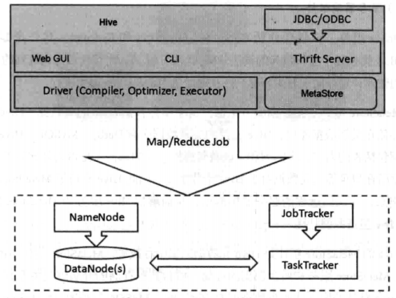
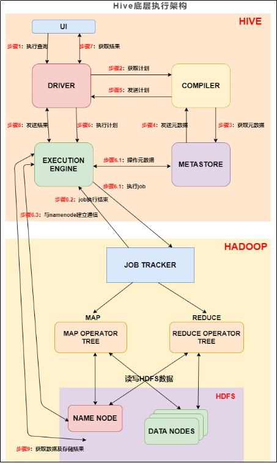
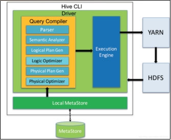
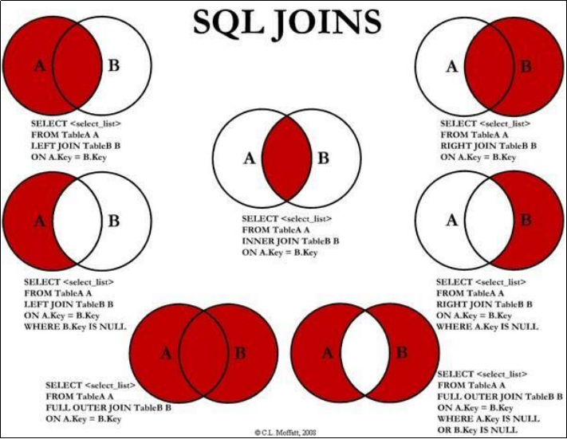
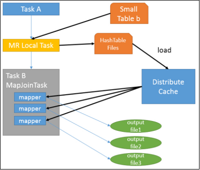
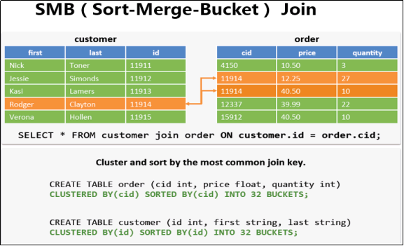
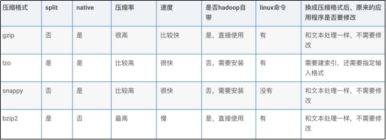

# 基础概念

`version 1.0`/`2023.06.05`

最重要的两部分是：元数据部分、SQL编译器

和传统数据库的区别是它不存储数据，编译SQL语言供MR使用

## hive基础认知

Hive是“蜂巢”的意思，其用意可能是**将Hive建成结构精良的数据仓库**。

==什么是Hive==?

Hive是**一种数据仓库工具**。首先要明确的是，Hive只是一种工具。

==是用来干什么的==?

<u>可以用Hive将结构化的数据文件**映射**为一张数据库表，并提供完整的SQL**查询**功能，可以将SQL**语句转换**为 MapReduce任务运行</u>。

所以Hive本身并<u>不具备存储功能</u>，要将它和数据库区分开后面我们还会详细区分。

==对hive的总体理解==

<u>三种角度的解读</u>

总体上看，
Hive有两个典型的特点:
其一Hive是建立在Hadoop上的数据仓库基础架构;
其二较低的学习代价便可以让用户在Hadoop中存储、查询和分析大规模数据。

简单地理解:
如果你只需完成大规模数据分析这件事情，那么，你只需有一套Hadoop环境加上一个Hive数据库，只要你懂SQL，而不必懂MapReduce程序如何编程及Hadoop底层如何工作，你的SQL需求将被自动编译到整个集群中去进行分布式计算，以提高分析效率。

**官网定义**：
Hive是一个基于Apache Hadoop的数据仓库。对于数据存储与处理，Hadoop提供了主要的扩展和容错能力。Hive设计的初衷是：**对于大量的数据，使得数据汇总，查询和分析更加简单**。它提供了SQL，允许用户更加简单地进行查询，汇总和数据分析。同时，Hive的SQL给予了用户多种方式来集成自己的功能，然后做定制化的查询，例如用户自定义函数（User Defined Functions，UDFs)。

****

****

## hive和数据库的区别

hive并不是数据库。

从结构上看，唯一相同点是类似的查询语言。

数据库可以在online的应用中，但是hive是为数据仓库而设计的。

==数据存储位置==：
hive建立在Hadoop之上，hive数据都存储在hdfs中；
数据库可将数据保存在块设备或本地文件系统中

==查询语言==：
类SQL查询语言HQL

==索引==：
Hive数据加载过程不进行任何处理、扫描，无法建立索引。可利用MR并行访问数据。不适合在线查询；

数据库会对一列或几列建立索引，因此对少量、特定条件的数据访问，数据库有很高的效率和较低的延迟。

==数据格式==
hive无专属数据格式，可由用户指定。
定义数据格式要指定三个属性：
列分隔符、
行分隔符、
读取文件数据的方法。
hive在加载数据过程中不需要数据格式转换，只是将数据复制或移动到hdfs目录。

不同数据库有不同的存储引擎，且定义专属的数据格式。所以会涉及的数据格式转换。

==执行==：
Hive查询通过MR实现；

数据库通常有自己的搜索引擎；

==数据更新==：
hive是针对数据仓库应用设计的，而数据仓库的内筒读多写少，因此，**hive不支持对数据的改写和添加**；

数据库中的数据通常需要修改。使用INSERT INTO VALUES添加数据，使用UPDATE···SET修改数据

==延迟==：
hive延迟高的因素：无索引、执行框架MR本身延迟高；数据规模超过数据库处理能力时，hive的**并行设计**更实用。

数据库在数据规模较小的条件下延迟低；

==可扩展性==：
hive建立在Hadoop之上。hive和Hadoop的扩展性一致；

数据库扩展性非常有限；

****

****

## Hive的组成(重要)



hive是建立在Hadoop上的，针对MR开发的技术。

组件有两大类：
==客户端组件==：
**CLI**(command line interface)：最常用客户端组件，启动CLI会同时启动一个hive脚本。Client是Hive的客户端，用于连接HiveServer。在启动 Client模式的时候，需要指出Hive Server所在的节点，并且在该节点启动Hive Server。Hive架构的许多客户端接口都是建立在Thrift客户端之上的，包括JDBC(java数据库连接)和ODBC接口。

**Web GUI**：网页端，接口对应组件为HWI(hive web interface)，使用前启动HWI服务。

==服务端组件==：
**Driver**：组件包括(compiler、optimizer、executor)编译、优化、执行。作用是完成HiveQL查询语句的词法分析、语法分析、编译、优化及查询计划的生成。生成的<u>查询计划</u>存储在hdfs中，并由MR调用执行。

**MetaStore**：
Hive元数据的集中存放地。
组件包括两部分：
MetaStore服务 (建立在后台数据存储介质之上，并可以和hive服务进行交互的服务组件)、
后台数据存储(介质是关系数据库)。

**Thrift Server**：
用来进行可扩展且跨语言服务的开发，HIVE集成该服务可让不同编程语言调用hive接口。

****

****

## hive执行过程（重要）

`为更好的理解Hive SQL编译过程，可查看原word文档编译示例`

目的：hive直接访问存储在hdfs中的文件，需要**理解hive底层是怎样将我们写的SQL转化为MapReduce等计算引擎可识别的程序**。 

### hive底层执行架构

hive的主要主要组件与Hadoop的交互过程：



1. UI：用户界面。可看作我们提交SQL语句的命令行界面。


2. DRIVER：驱动程序。接收查询的组件。
2. COMPILER：编译器。**负责将 SQL 转化为平台可执行的执行计划**。对不同的查询块和查询表达式进行语义分析，并最终借助表和从 metastore 查找的分区元数据来生成执行计划。
2. METASTORE：元数据库。存储 Hive 中各种表和分区的所有结构信息。
2. EXECUTION ENGINE：执行引擎。负责提交 COMPILER 阶段编译好的执行计划到不同的平台上。

****

### hive底层执行流程（重要）

上图的基本流程是：

**步骤1**：UI 调用 DRIVER 的接口；

**步骤2**：DRIVER 为查询创建会话句柄，并将查询发送到 COMPILER(编译器)生成执行计划；

**步骤3和4**：编译器从元数据存储中获取本次查询所需要的元数据，该元数据用于对查询树中的表达式进行类型检查，以及基于查询谓词修建分区；

**步骤5**：编译器生成的计划是分阶段的DAG，每个阶段要么是 map/reduce 作业，要么是一个元数据或者HDFS上的操作。将生成的计划发给 DRIVER。

如果是map/reduce作业，该计划包括map operator trees和一个reduce operator 	tree，执行引擎将会把这些作业发送给 MapReduce。

**步骤6、6.1、6.2和6.3**：执行引擎将这些阶段提交给适当的组件。在每个 task(mapper/reducer) 中，从HDFS文件中读取与表或中间输出相关联的数据，并通过相关算子树传递这些数据。最终这些数据通过序列化器写入到一个临时HDFS文件中（如果不需要 reduce 阶段，则在 map 中操作）。临时文件用于向计划中后面的 map/reduce 阶段提供数据。

**步骤7、8和9**：最终的临时文件将移动到表的位置，确保不读取脏数据(文件重命名在HDFS中是原子操作)。对于用户的查询，临时文件的内容由执行引擎直接从HDFS读取，然后通过Driver发送到UI。

****

### Hive SQL 编译过程

编译 SQL 的任务是在上节中介绍的 COMPILER（编译器组件）中完成的。Hive将SQL转化为MapReduce任务，整个编译过程分为六个阶段：

 

**【阶段1】**词法、语法解析: Antlr 定义 SQL 的语法规则，完成 SQL 词法，语法解析，将 SQL 转化为**抽象语法树 AST Tree**；

Antlr是一种语言识别的工具，可以用来构造领域语言。使用Antlr构造特定的语言只需要编写一

个语法文件，定义词法和语法替换规则即可，Antlr完成了词法分析、语法分析、语义分析、中间

代码生成的过程。 

【**阶段2**】语义解析: 遍历AST Tree，抽象出查询的基本组成单元QueryBlock；

【**阶段3**】生成逻辑执行计划: 遍历 QueryBlock，翻译为执行操作树OperatorTree；

【**阶段4**】优化逻辑执行计划: 逻辑层优化器进行 OperatorTree 变换，合并 Operator，达到减少MapReduce Job，减少数据传输及 shuffle 数据量；

【**阶段5**】生成物理执行计划: 遍历 OperatorTree，翻译为 MapReduce 任务；

【**阶段6**】优化物理执行计划: 物理层优化器进行 MapReduce 任务的变换，生成最终的执行计划。

****

****

****

# 元数据、原理进阶

元数据的具体存放信息相关

## hive的使用

1. 直接执行脚本：hive -e `脚本内容`
2. 文件执行
3. 通过客户端执行

****

## 	MySQL执行顺序

``` sql
(7)   SELECT  
(8)   DISTINCT <select_list> 
(1)   FROM <left_table> 
(2)   <join_type> JOIN <right_table> 
(3)   ON <join_condition> 
(4)   WHERE <where_condition> 
(5)   GROUP BY <group_by_list> 
(6)   HAVING <having_condition> 
(9)   ORDER BY <order_by_condition> 
(10)  LIMIT <limit_number> 
```

部分说明：
1.基本上每一步都有虚拟表的产生
2.distinct去重

==where与on的区别==：
先执行on，后执行where；
on是建立关联关系在生成临时表时候执行，where是在临时表生成后对数据进行筛选的

## Hive SQL语句执行顺序

两者底层运行原理不同，底层执行顺序和MySQL略有不同；

拆分成map和reduce两个阶段；

==Map阶段==：
``` sql
1. from：进行表的查找和加载
2. where：条件过滤与筛选
3. select：输出项的筛选
4. group by分组：描述分组后需要计算的函数
5. having
6. map端文件合并：map段本地写文件的合并操作，每个map最终形成一个临时文件。然后按列映射到对应的reduce阶段
```

==Reduce阶段==：
``` sql
1. group by：对map端发送过来的数据进行分组并进行计算
2. select：最后过滤列用于输出结果
3. limit：排序后进行结果输出到HDFS文件
```
****

## Hive SQL语句执行原理

join/group by /distinct的实现原理

****

****

****


# Hive数据模型

Hive无专属数据结构，故无索引。

## 四种数据模型

==Database==

相当于关系数据库里的命名空间（namespace），作用是将用户和数据库的应用隔离到不同的数据库或模式中。

==Table==

Table逻辑上由<u>存储的数据</u>和描述表格中的数据形式的<u>相关元数据</u>组成。表存储的数据存放在分布式文件系统里，例如HDFS，元数据存储在关系数据库里。

**内部表**：表的数据文件存储在hive数据仓库里；

**外部表**：表的数据文件可以存放在Hive数据仓库外部的分布式文件系统上，也可以放到Hive数据仓库里。在创建外部表时。在table之前要加关键字external，同时还要用location命令指定文件存储的路径。

**区别**：（5点区别）使用上的区别主要是drop命令。简单地说，删除内部表时，元数据与数据都会被删除；而删除外部表时，仅删除该链接。

==Partition==

Hive里Partition的概念是根据“分区列”的值对表的数据进行粗略划分的机制。在Hive存储上就体现在表的主目录(Hive的表实际显示就是一个文件夹)下的一个子目录，这个文件夹的名字就是我们定义的分区列的名字。没有实际操作经验的人可能会认为分区列是表的某个字段，其实不是这样的，<u>分区列不是表的某个字段，而是独立的列</u>，我们根据这个列来存储表中的数据文件。

**作用**：使用分区是为了加快数据的查询速度。

==Bucket==

Table和Partition都是**目录级别的拆分**数据，Bucket则是针对**数据源**数据文件本身来拆分数据的。

****

****

## 两种数据类型

`数据类型指的是表中**列的字段类型**`

==基础数据类型==

==集合数据类型==
ARRAY数组
MAP字典
STRUCT结构体
UNION

****

****

## 序列化和反序列化

二进制序列转换

作用：序列化的目的是Hive格式输出成为特定格式；反序列化的目的是HDFS格式读入Hive内存中

****

****

****

# DDL数据定义&分区分桶

## 数据表

==内部表（管理表）====外部表==

**区别**

（1）**内部表数据由Hive自身管理，外部表数据由HDFS管理**；

（2）**内部表的数据存储位置是hive.metastore.warehouse.dir，默认位置：/user/hive/warehouse，外部表数据的存储位置由自己制定**（如果没有LOCATION，Hive将在HDFS上的/user/hive/warehouse文件夹下以外部表的表名创建一个文件夹，并将属于这个表的数据存放在这里）；

（3）**删除内部表会直接删除元数据（metadata）及存储数据；删除外部表仅仅会删除元数据，HDFS上的文件并不会被删除**；

（4）**对内部表的修改会将修改直接同步给元数据，而对外部表的表结构和分区进行修改，则需要修复（MSCK REPAIR TABLE table_name;）**

**使用场景**

Ø 做etl处理时，通常会选择内部表做中间表，因为清理时，会将HDFS上的文件同时删除。ETL一共有三个阶段，分别是Extraction 抽取，Transformation 转换，Loading 加载。

Ø 如果怕误删数据，可以选择外部表，因为不会删除文件，方便恢复数据

Ø 如果对数据的处理都是通过hql语句完成，选择内部表，如果有其他工具一同处理，选择外部表。

Ø 每天采集的Nginx日志和埋点日志，在存储的时候建议使用外部表，因为日志数据是采集程序实时采集进来的，一旦被误删，恢复起来非常麻烦。而且外部表方便数据的共享。

Ø 抽取过来的业务数据，其实用外部表或者内部表问题都不大，就算被误删，恢复起来也是很快的，如果需要对数据内容和元数据进行紧凑的管理，那还是建议使用内部表。

Ø 在做统计分析时候用到的中间表，结果表可以使用内部表，因为这些数据不需要共享, 使用内部表更为合适。并且很多时候结果分区表我们只需要保留最近3天的数据，用外部表的时候删除分区时无法删除数据。

****

****

## 分区表&非分区表

==分区==

Hive实际是存储在HDFS上的抽象，Hive的**一个分区名对应一个目录名**，子分区名就是子目录名，并**不是一个实际字段**。

==分类==

两种类型的分区：**静态分区SP**（static partition）、**动态分区DP**（dynamic partition）。

静态分区与动态分区的主要区别在于：**静态分区是手动指定**，而**动态分区是通过数据来进行判断**。总的来说就是，静态分区的列是在编译时期通过用户传递来决定的；动态分区只有在SQL执行时才能确定。

按照分区的组织形式来分，hive分区表还可以分为2种：一种是**单分区**，也就是说在表文件夹目录下只有一级文件夹目录。另外一种是**多分区**，表文件夹下出现**多文件夹嵌套模式**。

****

****

## 分桶表

`基础语法：CLUSTERED BY (col_name)`

==基础定义==

分桶的**出现**：分区提供了一个隔离数据和优化查询的便利方式，不过并非所有的数据都可形成合理的分区，尤其是需要确定合适大小的分区划分方式。与分区的区别，分区表针对是目录，也就是存储路径，分桶表则针对的是文件，粒度更细，是另一种管理数据的方式。

数据分桶的**原理**:  与MR中的HashPartitioner的原理一模一样，MR中按照key的hash值去模除以reductTask的个数；Hive中按照分桶字段的hash值去模除以分桶的个数。

Hive也是针对某一列进行桶的组织。它的规则就是对分桶字段进行哈希，然后除以桶的个数求余数的方式来决定该条记录应该放到哪个桶中存储。默认规则是：Bucket编号= hash_function(分桶字段) mod 分桶数量。

==作用==

(1)获得更高的查询效率：全表查询或分区查询转换成桶查询。
(2)大表join:对于两张大表的join，执行reduce join(shuffle join)肯定不合适，只能做map join。但是reduce join只适合做小表和大表的join,**如何做大表间的join呢**？此时可以对两张大表的连接字段分桶，此时的join是按照桶来的，一个桶一个桶join，这样就完美解决了。
不过两个表的分桶数量上必须是倍数关系。确保对于连接条件的一致性。
解释：如果连接字段某一个值的hashcode为8，A表分4桶，B表分5桶，则该值在A表进入0号桶，在B表进入3号桶，此时join的连接条件就不一致了。
要想在map端执行桶join,必须设置hive.optimize.bucketmapjoin= true。
(3)抽样查询

****

****

## 视图

视图是用来简化操作的，它其实是一张虚表，在视图中不缓冲记录，也没有提高查询性能。

使用场景：

1. 将真实表中特定的列数据提供给用户，保护数据隐私。

2. 通过视图降低查询的复杂度，优化查询语句，减少代码复杂度，提高可读性。

****

****

****

# DML数据操作

## 四类排序操作

==order by==

**全局排序**；对输入数据排序，多个reducer无法保证全局有序，故此<u>只有一个reducer</u>。当数据规模较大时，需要较长的计算时间。

==sort by==

**非全局排序**；在数据进入<u>reducer前完成排序</u>；

当mapred.reduce.tasks>1时，只能保证每个reducer的输出有序，<u>不保证全局有序</u>；

==distribute by==

按照**指定的字段对数据进行划分输出到不同的reduce**中；后面不能跟desc、asc排序；

常和sort by一起使用，并且**distribute by必须在sort by前面**；

==cluster by==

相当于**distribute by+sort by**，只能**默认升序**，不能使用倒序；

****

****

## Join操作



left semi join？？？

****

****

## join的原理和机制

  ==Common Join（Reduce阶段完成join）==

如果**不指定Map Join或者不符合Map Join的条件，那么Hive解析器会将Join操作转换成Common Join**，即：在Reduce阶段完成join。

整个过程包含Map、Shuffle、Reduce阶段。

（1）Map阶段
Step1: 读取源表的数据，Map输出时候**以Join on条件中的列为key**，如果Join有多个关联键，则以这些关联键的组合作为key;
Step2: Map输出的**value为join之后所关心的(select或者where中需要用到的)列**；同时在value中还会包含表的**Tag信息**，用于标明此value对应哪个表；
Step3: 按照key进行排序。

（2）Shuffle阶段
**根据key的值进行hash**，并将key/value按照hash值推送至不同的reduce中，这样确保两个表中相同的key位于同一个reduce中。

（3）Reduce阶段
根据key的值完成join操作，期间通过Tag来识别不同表中的数据。

==Map Join（Map阶段完成join）==

`常用于大表join小表`



其执行过程如上图：

(1)首先是Task A，它是一个Local Task（在客户端本地执行的Task），负责扫描小表b的数据，将其转换成一个Hash Table的数据结构，并写入本地的文件中，之后将该文件加载到Distribute Cache中。

(2)接下来是Task B，该任务是一个**没有Reduce的MR**，启动Map Tasks扫描大表a，在Map阶段，根据a的每一条记录去和Distribute Cache中b表对应的Hash Table关联，并直接输出结果。

(3)由于Map Join没有Reduce，所以由Map直接输出结果文件，**有多少个Map Task，就有多少个结果文件。**

==SMB(Sort-Merge-Bucket) Join==

`大表join大表`

**原理**：在运行SMB Join的时候会重新创建两张表，当然这是在后台默认做的，不需要用户主动去创建，如下所示：



****

****

****

# 函数 

## 常用内置函数

****

****

## 用户自定义函数（重点）

`自定义函数的全流程？？？？（掌握）`

==定义与分类==

 **UDF**(User-Defined-Function)：用户自定义函数，一对一的输入输出。

**UDAF**(User-Defined Aggregation Funcation)：用户自定义聚合函数，多进一出。例如：count/max/min。

**UDTF**(User-Defined Table-Generating Functions):用户自定义表生成函数，一对多的输入输出。例如：lateral view explode。

==自定义函数使用方法==

在HIVE会话中add 自定义函数的jar文件，然后创建function继而使用函数。具体步骤如下：

1. 编写自定义函数。

2. 打包上传到集群机器中。

3. 进入hive客户端，添加jar包：hive> add jar /home/ds_teacher/hive_udf.jar。

4. 创建临时函数：
   hive> create temporary function getLen as 'com.ds.GetLength';

5.  使用临时函数：
   hive> select getLen('1234567');

6. 销毁临时函数：hive> drop temporary function getLen;

==数据类型==
hive自定义函数中有几类数据类型：
PrimitiveObjectInspector、ListObjectInspector、StructObjectInspector、MapObjectInspector等类型。三种自定义函数都会**首先进行参数个数和参数类型检查。

****

****

## 窗口函数（重点）

 ***\*【函数定义】：\****窗口函数又名开窗函数，属于分析函数的一种，用于**解决复杂报表统计需求**的功能强大的函数。窗口函数用来**计算基于组的某种聚合值**，它和聚合函数的不同之处是：**对于每个组返回多行**，而聚合函数对于每个组只返回一行。

***\*【三个概念】：\****开窗函数指定了分析函数工作的数据窗口大小，这个数据窗口大小可能会随着行的变化而变化。

SQL窗口查询引入了三个新的概念：窗口分区、窗口帧、以及窗口函数。

(类似分区、列和窗口处理方法)

窗口函数的**语法**分为四个部分：

（1）函数子句：指明具体操作，如sum-求和，first_value-取第一个值；

（2）partition by子句：指明分区字段，如果没有，则将所有数据作为一个分区；

（3）order by子句：指明了每个分区排序的字段和方式，也是可选的，没有就是按照表中的顺序；

（4）窗口子句：指明相对当前记录的计算范围，可以向上（preceding），可以向下（following），也可以使用between指明上下边界的值，没有的话默认为当前分区。以下是所有可能的窗口子句定义组合，语法如下：
``` sql
(ROWS | RANGE) BETWEEN (UNBOUNDED | [num]) PRECEDING AND ([num] PRECEDING | CURRENT ROW | (UNBOUNDED | [num]) FOLLOWING)  
(ROWS | RANGE) BETWEEN CURRENT ROW AND (CURRENT ROW | (UNBOUNDED | [num]) FOLLOWING)  
(ROWS | RANGE) BETWEEN [num] FOLLOWING AND (UNBOUNDED | [num]) FOLLOWING
```

****

****

****


# 数据压缩与存储

## 行列存储

## 文件存储类型

**TextFile**<u>每一行都是一条记录，每行都以换行符（\ n）结尾（可指定分隔符）。数据不做压缩，磁盘开销大，数据解析开销大。</u>可结合Gzip、Bzip2使用（系统自动检查，执行查询时自动解压），但使用这种方式，hive不会对数据进行切分，从而无法对数据进行并行操作。 

SequenceFile是Hadoop API提供的一种二进制文件支持，其具有使用方便、可分割、可压缩的特点。<u>将数据以<key,value>的形式序列化到文件中</u>。sequencefile文件不能直接查看，可以通过Hadoop fs -text查看。支持三种压缩选择：NONE, RECORD, BLOCK。 Record压缩率低，一般建议使用BLOCK压缩。

**RCFile**是一种<u>行列存储相结合的存储方式</u>。首先，其将数据按行分块，保证同一个record在一个块上，避免读一个记录需要读取多个block。其次，块数据列式存储，有利于数据压缩和快速的列存取。

**ORC文件格式**提供了一种将数	据存储在Hive表中的高效方法。这个文件系统实际上是为了克服其他Hive文件格式的限制而设计的。Hive从大型表读取，写入和处理数据时，使用ORC文件可以提高性能。

Parquet是一个面向列的二进制文件格式。Parquet<u>对于大型查询的类型是高效的</u>。对于扫描特定表格中的特定列的查询，Parquet特别有用。Parquet使用压缩Snappy，gzip;目前Snappy默认。<u>映射下推，谓词下推</u>

AVRO是开源项目，为Hadoop提供数据序列化和数据交换服务。Avro是一种用于支持数据密集型的二进制文件格式。它的文件格式更为紧凑，若要读取大量数据时，Avro能够提供更好的序列化和反序列化性能。

## 数据压缩



****

****

****


# 性能调优（很重要）

## 查看SQL执行计划

==explain==

查看执行计划、输出结果详细说明、使用场景

==explain dependency==

描述一段SQL需要的数据来源，输出json格式的数据。

使用场景：快速排除、理清表的输入

****

****

## 不同场景SQL执行计划

fetch operator抓取操作

查看原文件

****

****

## 性能调优（重点掌握）

 ==开启Fetch抓取(默认已开启)==

开启fetch后可以直接读取存储目录下的文件，并输出到控制台。这样查询时不会启动MR工作。大大提高效率。

==本地模式==

对小数据集，hive可通过本地模式在单台机器上处理所有任务。执行时间明显缩短。

==表的优化==

**小表join大表**

让key值相对分散的小表放在两边都可以，有效减少内存溢出几率。接着使用group让小表先进内存，在map端完成reduce。

**大表join大表**

空key过滤、空key转换

==MapJoin（默认已开启）==

符合mapjoin条件的尽量在此阶段完成join，**在reduce阶段完成join容易发生数据倾斜**，可用MapJoin把小表全部加载到内存在map端进行join，避免reducer处理。

==Group By优化==

默认是map根据key把数据分发给reduce

数据计算时，并不是所有的聚合操作都需要在reduce端完成，很多可在map端部分聚合，在reducer端得出最终结果。

第一个 MR Job中，Map 的输出结果会随机分布到Reduce中，每个 Reduce 做部分聚合操作，并输出结果，这样处理的结果是相同的 Group By Key 有可能被分发到不同的 Reduce中，从而达到负载均衡的目的；

第二个 MR Job 再根据预处理的数据结果按照Group By Key 分布到Reduce中（这个过程可以保证相同的 Group By Key 被分布到同一个 Reduce 中），最后完成最终的聚合操作。

==count（distinct）去重统计==

数据量较大时，COUNT DISTINCT 操作需要一个reduce task完成，此reduce处理的数据量太大，会导致job无法完成。

一般COUNT DISTINCT使用先GROUP BY再COUNT的方式替换。

==笛卡尔积==

==行列过滤==

==动态分区调整==

关系型数据库中， 对分区表 Insert 数据时候，数据库自动会<u>根据分区字段的值</u>，将数据插入到相应的分区中，Hive 中也提供了类似的机制，即**动态分区(Dynamic Partition)**，只不过使用Hive的动态分区，需要进行相应的配置。

****

****

## 数据倾斜问题（重点掌握）

### 现象

数据倾斜调优就是使用各种技术方案解决不同类型数据的数据倾斜问题。保证作业的性能。

**现象**：绝大多数task执行很快，但个别task执行极慢，进入任务的执行界面：reduce阶段卡在99.99%不动；各种container报错OOM（内存溢出）；读写数据量很大，超过其他正常reduce。

****

****

### 原理

进行shuffle时，必须将各节点上相同的key拉取到某个节点上的一个task进行处理。比如按照key进行聚合或join等操作。若某个key数据量很大就会发生数据倾斜。

发生数据倾斜的**原因在于Task的数据分配不均衡**。

两种情况：
数据本身倾斜，数据中某种数据出现的次数过多；
分区规则导致相同的数据都分配给同一个task，导致此task的数据量较大；

****

****

### 处理

==group by产生数据倾斜==

**场景**：某种类型数据量很多，其它类型的数据量很少。

**方法**：

1. 开启map端聚合参数设置；(在map端进行部分聚合，开启设置后产生两个MRjob，第一个是相同的 Group By Key 有可能被分发到不同的 Reduce中，从而达到负载均衡的目的；第二个再根据预处理的数据结果按照Group By Key 分布到Reduce中，完成最终聚合。)
2. 合理调整分组维度；

==count（distinct）产生数据倾斜==

**场景**：数据量非常大，执行如select a,count(distinct b) from t group by a;类型的SQL 时，会出现数据倾斜的问题。

**方法**

1. 使用 sum…group by 代替。如select a,sum(1) from (select a, b from t group by a,b) group by a;
2. 优化不明显时，可将倾斜数据单独拿出处理，最后union回去。

==大表和小表join产生数据倾斜==

**场景**：大表join小表

**方法**

1. 使用 mapjoin将小表加载到内存中

==空值产生数据倾斜==

**场景**：需要进行join但是关联字段有数据为空。

**方法**

1. ID为空的不参与关联：

   ``` sql
   select * from log a join users b  
    on a.user_id is not null and a.user_id = b.user_id  
   union all   
   select * from log a where a.user_id is null;  
   ```

2. 给空值分配随机key值：

   ``` sql
   select * from log a left outer join users b   
   on case when a.user_id is null then  
   concat('hive',rand() ) else a.user_id end = b.user_id; 
   ```

==合理设置map和reduce数，避免数据倾斜==

   **调整map数**

   1. 小文件合并，<u>减少map数</u>（默认开启）；
   2. 复杂文件<u>增加map数</u>

   **调整reduce数**

   1. 方法一

      ```sql
      #每个 Reduce 处理的数据量默认是 256MB  
      hive.exec.reducers.bytes.per.reducer=256000000  
      #每个任务最大的 reduce 数，默认为 1009  
      hive.exec.reducers.max=1009  
      #计算 reducer 数的公式：  
      N=min(hive.exec.reducers.max，总输入数据量/hive.exec.reducers.bytes.per.reducer) 
      ```

   2. 方法二

      ``` sql
      #在hadoop的mapred-default.xml文件中修改设置每个job的Reduce个数  
      set mapreduce.job.reduces = 15;  
      ```

      

****

****

****

# 面试要点

## 基础概念篇

1. 传统数据库和数据仓库的区别

   - 用途：传统数据库主要用于OLTP（即时的系统交互），数据仓库主要用于OLAP（联机分析处理）。
   - 建模：传统数据库主要使用范式建模，数据仓库可以根据需要采用范式建模或者星形模型等。
   - 使用技术：传统数据库一般使用关系型数据库，数据仓库目前互联网行业更多的是使用大数据技术。
   - 存储的数据：传统数据库只存储当前状态的数据，数据仓库需要存储历史状态的数据，用户对历史数据的回溯分析。

2. hive的体系架构及底层的运行原理

   Hive是建立在Apache Hadoop上的数据仓库解决方案。它提供了一个SQL样式查询语言的抽象层，以方便使用者对Hadoop文件系统中的数据进行查询、归档和分析。

   以下是Hive体系架构的组成：

   1. 客户端接口 - Hive提供了多种客户端接口，便于用户使用不同于Hive SQL的方式来与Hive数据库交互，包括CLI、JDBC/ODBC驱动、Web界面等。
   2. 元数据存储 - Hive的元数据存储在关系型数据库中，如MySQL，用于管理表结构和操作指南等信息。
   3. 驱动程序 - 驱动程序负责编译Hive SQL语句并执行运算。它将SQL语句转化为MapReduce任务或Spark任务进行处理。
   4. 查询编译器 - 查询编译器是将SQL语句解析和编译为MapReduce程序的模块。
   5. 执行引擎 - 执行引擎负责运行MapReduce或Spark任务，它是查询编译器和底层Hadoop软件栈之间的接口。

3. MR执行效率低？

## 元数据、原理进阶

1. 内嵌模式、本地模式、远程模式的差异？

   1. Embedded metastore：内嵌模式。
      其特点是：hive服务和metastore服务运行在同一个进程中，derby服务也运行在该进程中。该模式无需特殊配置。

   2. Local metastore：本地模式。
      其特点是：hive服务和metastore服务运行在同一个进程中，mysql是单独的进程，可以在同一台机器上，也可以在远程机器上。该模式只需将hive-site.xml中的ConnectionURL指向mysql，并配置好驱动名、数据库连接账号即可。

   3. Remote metastore：远程模式。

      其特点是：hive服务和metastore在不同的进程内，可能是不同的机器。 该模式需要将hive.metastore.local设置为false，并将hive.metastore.uris设置为metastore服务器URI，如有多个metastore服务器，URI之间用逗号分隔。metastore服务器URI的格式为thrift://host:port。

      

2. 阐述元数据数据库包含的具体内容（进阶）
   1. 是什么：本质上是用来存储hive中有哪些数据库，哪些表，及表的模式，目录，分区，索引及命名空间。
   2. 做什么：主要用作数据管理，包括查看数据表之间的血缘关系、查看数据存储、数据表的访问权限控制等

3. 清楚SQL语句各部分的执行顺序

4. ==清楚Hive SQL中的join、group by、distinct语句实现原理==

****

## 数据模型

1. 数据类型有哪些？
   1. TINYINT：一个带符号的字节（8位），范围是从-128到127。
   2. SMALLINT：一个带符号的短整型（16位），范围是从-32,768到32,767。
   3. INT：一个带符号的整数（32位），范围是从-2,147,483,648到2,147,483,647。
   4. BIGINT：一个带符号的长整型（64位），范围是从-9,223,372,036,854,775,808到9,223,372,036,854,775,807。
   5. BOOLEAN：布尔类型，true和false分别表示true和false。
   6. FLOAT：单精度浮点数（32位）。
   7. DOUBLE：双精度浮点数（64位）。
   8. STRING：字符串类型。 字符串长度可以为最多2 ^ 31-1个字符。
   9. TIMESTAMP：表示日期和时间戳的值（例如，2017-06-10 15:30:00）。
   10. DATE：仅表示日期（例如，2017-06-10）
2. 集合数据类型的应用场景
   1. 例如map类型常用来做扩展字段，避免多次修改表结构；而array类型常常出现在行列转化中。
3. 讲清楚Hive读写文件的机制

## DDL数据定义&分区分桶

1. 内部表与外部表的定义、区别、使用场景
2. 对分区、分桶的理解
3. 对静态分区、动态分区的理解
4. 如何处理大表join大表的问题

## DML数据操作

1. union和union all的区别

   | 比较参数      | UNION                                      | UNION ALL                          |
   | ------------- | ------------------------------------------ | ---------------------------------- |
   | Functionality | 不适用于具有文本数据类型的列               | 适用所有数据类型的列               |
   | 功能          | 组合多语句并提供不同值的结果               | 组合多个语句并提供包含所有值的结果 |
   | 专栏          | 具有从结果中消除相同语句的功能             | 没有任何消除相同语句的功能         |
   | 性能          | 性能很慢，因为需要时间来识别和删除重复语句 | 比较快                             |
   | 偏爱          | 用户倾向使用该关键字                       | 不倾向使用                         |

2. order by、sort by、distribute by、Cluster by的区别
3. left join、right join、inner join、left semi join关联结果的差异，描述它们各自的特性
4. 举例说一下join的MR实现过程。

## 函数

## 数据压缩与存储

1. 常见的存储格式，及特点（企业中大部分情况采用orc格式存储）
2. 常见的数据压缩格式，及特点


``` sql

SELECT 
   DATE_FORMAT(create_date, '%Y-%m-%d') AS create_date, 
   -- 产品类别
   cplb_zw,
   -- 产品名称
   english_product_name,
   -- 订单销量
   
FROM 
   (SELECT 
       -- 订单主键
       sales_order_key,
       DATE_FORMAT(create_date, '%Y-%m-%d') AS create_date, 
       cplb_zw, 
       english_product_name, 
       SUM(订单数量) AS 订单销量,
       RANK() OVER (PARTITION BY DATE_FORMAT(create_date, '%Y-%m-%d'), cplb_zw ORDER BY SUM(订单数量) DESC) as rank
    FROM 订单明细表 
    -- 将结果按照第1,2,3,4个阶段分组
    GROUP BY 1, 2, 3, 4
   ) t
WHERE
   t.rank <= 3;

假设源表名为 ods_sales_orders，包含以下字段：
sales_order_key：订单主键
customer_key：客户编号
create_date：下单日期
product_key：产品编号
cpzl_zw:产品子类
cplb_zw：产品类别
total_money：订单总金额
unit_price：产品单价
使用hiveSQL统计连续4天下单的客户，统计指标：客户编号，下单笔数，购买金额，平均每单购买金额
方法一
SELECT
    customer_key,
    COUNT(1) AS times,
    SUM(total_money) AS total_money,
    AVG(unit_price) AS avg_unit_price
FROM (
    SELECT
        customer_key,
        create_date,
        SUM(total_money) OVER (PARTITION BY customer_key, date_diff) AS total_money,
        AVG(unit_price) OVER (PARTITION BY customer_key, date_diff) AS unit_price,
        ROW_NUMBER() OVER (PARTITION BY customer_key, date_diff ORDER BY create_date) AS rn
    FROM (
        SELECT
            customer_key,
            create_date,
            total_money,
            unit_price,
            DATEDIFF(create_date, LAG(create_date, 1) OVER (PARTITION BY customer_key ORDER BY create_date)) AS date_diff
        FROM ods_sales_orders
    ) t1
    JOIN (
        SELECT DISTINCT
            customer_key,
            create_date,
            DATEDIFF(create_date, LAG(create_date, 1) OVER (PARTITION BY customer_key ORDER BY create_date)) AS date_diff
        FROM ods_sales_orders
    ) t2
    ON t1.customer_key = t2.customer_key AND t1.create_date = t2.create_date
) t3
WHERE rn >= 4
GROUP BY customer_key
HAVING COUNT(1) >= 4;

方法(2)
SELECT
    t3.customer_key,
    -- 下单总数
    t3.count(cplb_zw) as times1,
    sum(*) as total_money,
    AVG(unit_price)
FROM
(
    SELECT
       t2.customer_key,
       count(1) as times,
       t2.count(cplb_zw) as times1,
       t2.sum(*) as total_money,
       t2.AVG(unit_price),
       min(t2.create_date) as start_date,
       max(t2.create_date) as end_date
    FROM 
    (    
        SELECT
            t1.customer_key,
            t1.create_date,
            t1.count(cplb_zw) as times1,
            t1.sum(*) as total_money,
            t1.AVG(unit_price),
            date_sub(t1.create_date,rn) as date_diff
        FROM 
        (   
            SELECT
                customer_key,
                create_date,
                -- 下单数量
                count(cplb_zw) as times1,
            	sum(*) as total_money,
                AVG(unit_price),
                row_number() OVER(PARTITION BY customer_key ORDER BY create_date ASC) as rn
            FROM ods_sales_orders
        ) t1
            
    ) t2
    GROUP BY t2.customer_key, t2.date_diff
    HAVING times >= 4;
) t3   

```


``` sql
-- 行转列
select column1,column2,
concat_ws(` `,collect_list(column3)) as value
from tabel_name
group by column1,column2;

-- 列转行
SELECT str1, str2, num as id
FROM dataexchange_test1
LATERAL VIEW explode(split(str1, ',')) explodetable AS num;

```


``` sql
select userid,DATE_FORMAT(visitDate, 'yyyy-MM') AS month,
    sum(visitcount) as 小计,
    (
        SELECT SUM(visitCount) 
        FROM dws_user_action 
        group by userid
    ) AS 累计
from dws_user_action ua
group by userid,DATE_FORMAT(visitDate, 'yyyy-MM') AS month;
```

``` sql
(1)
SELECT
  province_name,
  city_name,
  area_name,
  SUM(people_cnt) AS total_people_cnt,
  SUM(amt) AS total_amt
FROM
  dwd_people
GROUP BY
  province_name,
  city_name,
  area_name
WITH CUBE;

(2)
--按照省份维度统计
SELECT
  province_name,
  SUM(people_cnt) AS total_people_cnt,
  SUM(amt) AS total_amt
FROM
  dwd_people
GROUP BY
  province_name;

--按照省份+城市维度统计
SELECT
  province_name,
  city_name,
  SUM(people_cnt) AS total_people_cnt,
  SUM(amt) AS total_amt
FROM
  dwd_people
GROUP BY
  province_name,
  city_name;

--按照城市+地区维度统计
SELECT
  city_name,
  area_name,
  SUM(people_cnt) AS total_people_cnt,
  SUM(amt) AS total_amt
FROM
  dwd_people
GROUP BY
  city_name,
  area_name;

```

 

