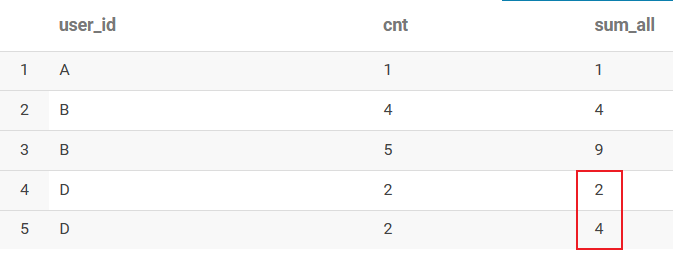

> 开窗函数是 hiveSQL中很基础、常见的部分，整理一下便于更好的记忆和理解


## 1.窗口函数概念

**窗口函数：在指定的数据滑动窗口中，实现各类统计分析的操作。窗口函数与分析函数一起使用， 或按照专用窗口函数使用，组成**

``` sql
常用的分析函数：sum()、max()、avg()、count()......
专用窗口函数：row_number()、rank()、dense_rank()......
```

**具体语法**

``` sql
分析函数/专用窗口函数 over(partition by 列名 order by 列名 rows between 开始位置 and 结束位置);
```


### partition by 字段

是对指定的字段进行分组，后续都会以组为单位，把每个分组单独作为一个窗口进行统计分析操作。划分的范围被称为窗口，这也是窗口函数的由来。

``` SQL

# 案例 01：对窗口中的数据求和，并把求和结果分别分发到对应窗口的每一条数据中

with temp as(
    select 'A' as col1,1 as col2
    union all 
    select 'A' as col1,1 as col2
    union all 
    select 'B' as col1,1 as col2
)
select
    col1
    ,sum(col2) over(partition by col1) as '对窗口中的数据求和'
from temp
输出结果：
col     对窗口中的数据求和
A       2
A       2
B       1

案例 02：对整体数据求和，并把求和结果分发到每一条数据中

with temp as(
    select 'A' as col1,1 as col2
    union all 
    select 'A' as col1,1 as col2
    union all 
    select 'B' as col1,1 as col2
)
select
    col1
    ,sum(col2) over() as '对整体数据求和'
from temp
输出结果：
col     对整体数据求和
A       3
A       3
B       3
```

注意：**聚合函数是将多条记录聚合为一条，窗口函数是每条记录都会执行，有几条记录执行完还是几条。**窗口函数兼具group by子句的分组功能以及order by子句的排序功能。<u>但是partition by子句并不具备group by 的汇总功能</u>。


### order by 字段

**情景一：order by 与 partition by 连用的时候，可以对各个分组内的数据，按照指定的字段进行排序。如果没有 partition by 指定分组字段，那么会对全局的数据进行排序。**

```sql

with temp as(
    select 'A' as col1,1 as col2
    union all 
    select 'C' as col1,1 as col2
    union all 
    select 'B' as col1,1 as col2
)

select col1,row_number() over(order by col1 desc) as 排序 from temp
输出结果：
col1     排序 
C        1
C        2
B        3
A        4
```


**情景二：当为聚合函数，如max，min，count等时，over中的order by不仅起到窗⼝内排序，还起到窗⼝内从当前⾏到之前所有⾏的聚合（多了⼀个范围）。**

```sql
案例 01：对数据进行全局排序

with temp_01 as(
    select 'A' as user_id,1 as cnt
    union all 
    select 'D' as user_id,2 as cnt
    union all 
    select 'D' as user_id,3 as cnt
    union all 
    select 'B' as user_id,4 as cnt
    union all 
    select 'B' as user_id,5 as cnt
)
select user_id,cnt,sum(cnt) over(partition by user_id) as sum_all from temp_01
输出结果：
user_id	cnt	sum_all
A	    1	   1
B	    5	   9
B	    4	   9
D	    3	   5
D	    2	   5

select user_id,cnt,sum(cnt) over(partition by user_id order by cnt) as sum_all from temp_01
输出结果：
user_id    cnt    sum_all
A          1       1
D          2       2
D          3       5
B          4       4
B          5       9

```


**情景三：当排序的维度不存在重复的情况下，即 order by 指定的字段，使用 order by + 分析函数 sum()，可以产生求整体累计数的效果。但是当 order by 指定的字段组合，数据存在重复的时候，会在不重复的数据中产生累计效果，而重复的数据中，也是会把整体的累计结果分发到每条重复的数据中。此示例也能体现窗口内从当前行到之前所有行的聚合。**

```SQL
with temp_01 as(
    select 'A' as user_id,1 as cnt
    union all 
    
    select 'D' as user_id,2 as cnt
    union all 
    select 'D' as user_id,3 as cnt
    union all 
    select 'D' as user_id,4 as cnt
    union all
    
    select 'B' as user_id,3 as cnt
    union all
    select 'B' as user_id,4 as cnt
    union all 
    select 'B' as user_id,4 as cnt
)
select user_id,sum(cnt) over(partition by user_id order by cnt) as sum_all from temp_01
输出结果：
user_id    cnt    sum_all

 	user_id	cnt	sum_all
1	A	1	1
2	B	3	3
3	B	4	11
4	B	4	11
5	D	2	2
6	D	3	5
7	D	4	9
 
```


### rows between 开始位置 and 结束位置

rows between 是指划分窗口中，函数具体的作用数据范围。rows between 常用的参数如下：

``` sql
n preceding：往前n行
n following：往后n行
current row：当前行
unbounded：起点（一般结合preceding，following使用）

###########
unbounded preceding：表示该窗口最前面的行（起点）
unbounded following：表示该窗口最后面的行（终点）
```

示例：

```sql
rows between unbounded preceding and current row (表示从起点到当前行的数据进行);
rows between current row and unbounded following (表示从当前行到终点的数据进行);
rows between unbounded preceding and unbounded following (表示起点到终点的数据);
```

**rows between unbounded preceding and current row与 partition by 、order by 连用，可以产生对窗口中的数据求累计数的效果**，无论order by的字段是否有重复

``` sql
with temp_01 as(
    select 'D' as user_id,2 as cnt
      union all 
    select 'D' as user_id,2 as cnt
      union all 
    select 'B' as user_id,4 as cnt
      union all 
    select 'B' as user_id,5 as cnt
      union all
    select 'A' as user_id,1 as cnt
)
select user_id,cnt,sum(cnt) over(partition by user_id  order by cnt  rows between unbounded preceding and current row) as sum_all from temp_01
输出结果：

```




## 2.窗口函数分类

#### 2.1排序窗口函数

- `row_number()` ：排序并产生自增编号，自增编号不重复且连续

- `rank()`：排序并产生自增编号，自增编号重复且不连续

- `dense_rank()`：排序且产生自增编号，自增编号重复且连续

  ``` sql
  with temp_01 as(
  select 'A' as user_id,1 as cnt
  union all 
  select 'D' as user_id,2 as cnt
  union all 
  select 'D' as user_id,3 as cnt
  union all 
  select 'B' as user_id,3 as cnt
  union all 
  select 'B' as user_id,4 as cnt
  )
  select 
      user_id
      ,cnt
      ,row_number() over(order by cnt) as sort_1
      ,rank() over(order by cnt) as sort_2
      ,dense_rank() over(order by cnt) as sort_3
  from temp_01
  
  输出结果： 
   	user_id	cnt	sort_1	sort_2	sort_3
  1	  A	    1	   1	   1	1
  2	  D	    2	   2	   2	2
  3	  B	    3	   3	   3	3
  4	  D	    3	   4	   3	3
  5	  B	    4	   5	   5	4
  ```

  

#### 2.2聚合窗口函数

**情景一：求窗口中的累计值函数sum()**

```sql
with temp_01 as(
select 'A' as user_id,1 as cnt
union all 
select 'A' as user_id,1 as cnt
union all 
select 'A' as user_id,1 as cnt
union all 
select 'B' as user_id,1 as cnt
union all 
select 'B' as user_id,1 as cnt
)
select 
    user_id
    ,sum(cnt) over(partition by user_id order by cnt desc rows between unbounded preceding and unbounded following) as sum_value_1
    ,sum(cnt) over(partition by user_id order by cnt desc rows between unbounded preceding and current row) as sum_value_2
from temp_01

输出结果：
 
 	user_id	sum_value_1	sum_value_2
1	A	3	1
2	A	3	2
3	A	3	3
4	B	2	1
5	B	2	2
```


**情景二：求窗口中3天的平均价格avg()**

```sql
```


**情景三：求分组中的最值**

```sql
max() over() as max_value
min() over() as min_value
```


**情景四：求分组中的记录总数count()**

```sql
```


#### 2.3位移窗口函数

#### 2.4极值窗口函数

#### 2.5分箱窗口函数


## 3.常见窗口函数

- FIRST_VALUE
  - 功能：取每个分区内某列的第一个值
  - 语法：FIRST_VALUE(col,true/false) over (partition by col1 order by col2)
  - 第二个参数为true，跳过空值（默认为false）
- LAST_VALUE
  - 功能：取每个分区内某列的最后一个值
  - 语法：LAST_VALUE(col,true/false) over (partition by col1 order by col2)
  - 第二个参数为true，跳过空值（默认为false）
- LAG
  - 功能：取每个分区内某列的前面的第N个值
  - 语法：LAG(col,N,defaultValue) over (partition by col1 order by col2)
- LEAD
  - 功能：取每个分区内某列的后面的第N个值
  - 语法：LEAD(col,N,defaultValue) over (partition by col1 order by col2)

