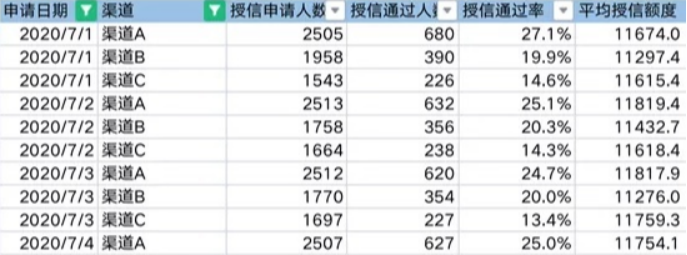

# 1. 金融信贷数仓项目案例

## 1.1 数据同步案例

### 1.1.1 全量同步

数仓中，全量表更为多见。

离线数仓中，全量同步是指每天拉取业务系统中的全量快照数据，落在ods层表相关分区中（以日期为分区字段）。

一般全量同步适合数据量不是很大的表（规范层面可以制定一亿条数据量以下可以选择全量同步，操作一亿增量同步 ）。

以天为单位的全量存储，以业务日期作为分区，每个分区存放截止到业务日期为止的全量业务数据。

> 例如：对于借款申请表，假设订单量在3000w级别，即可考虑全量同步的方式。对于ods的表按天存放历史截止到T-1日发生的借款申请数据，ods表每天新增一个分区用于存放。

```sql
-- sqoop/datax 全量抽数任务等价SQL
insert overwrite into ods_trd.ods_order_df
partition (pt_date = '2022-09-01')
select *
from trd.order
```


### 1.1.2 增量同步

离线数仓中，增量同步是指每天拉取业务系统中表的增量日期字段为T-1日的数据，落在ods表t-1分区中（所以理想状态下ods增量表全部分区组成业务系统对应表的所有数据）。

一般对于数据量过于庞大，或者业务系统中数据落表后不会更新的表，都可以采用增量同步的方式。

增量同步一般可以选择：创建时间/更新时间同步。

选择创建时间同步的数据一般都是业务系统中数据落表后不会更新的表，如日志表（额度变更日志表）或者记录表（风控流水记录表）。注意：对业务系统会表数据做归档的表，ods层也可配合**全改增脚本实现业务系统数据的积累，以供仓内任务重跑和数据回溯工作**

选择更新时间同步的数据一般都是业务系统中数据落表后会更新且数据量比较大的表，通过更新时间同步到ods第一层表后，配合增改全脚本的方式获取最新全量快照的数据。如授信申请表

```sql
- sqoop/datax增量抽数任务等价SQL
Inser overwrite into ods_trd.ods_order_created_time_di
partition (pt_date = '2022-09-02')
select *
from trd.order
where created_time >= ‘2022-09-02 00:00:00’
and created_time < ‘2022-09-03 00:00:00’
```

- **创建时间同步_增改全脚本**

  ```sql
  -- 主要应对大数据量业务系统表，或者业务系统做归档的表
  drop table if exists tmp.tmp_order_info_df;
  -- 01号之前的全量表和02号单日的增量数据进行合并（union all）
  create table tmp.tmp_order_info_df
  as 
  select
      id
      ,mobile
      ,cust_no
      ,order_no
      , order_time
      ,order_amount
      ,apply_status
      ,channel
      ,product_code
  from ods_trd.ods_order_info_df
  where pt_date='2022-09-01'
  union all
  select
      id
      ,mobile
      ,cust_no
      ,order_no
      , order_time
      ,order_amount
      ,apply_status
      ,channel
      ,product_code
  from ods_trd.ods_order_created_time_di
  where pt_date='2022-09-02';
  
  -- 插入到ods层的目标表中
  insert overwrite table ods_trd.ods_order_info_df -- 订单全量快照表
  partition (pt_date = '2022-09-02')
  select 
  	id
  	,mobile
  	,cust_no
  	,order_no
  	,order_time
  	,order_amount
  	,apply_status
  	,channel
  	,product_code
  from tmp.tmp_order_info_df
  
  -- 数据插入完成后，删除创建的临时表
  drop table if exists tmp.tmp_order_info_df;
  ```
  
- 更新时间同步_增改全脚本
  ``` sql
  drop table if exists tmp.tmp_order_info_df;
  
  create table tmp.tmp_order_info_df
  as 
  -- t-2之前未发生变化的数据 union all t-1当天发生变化的数据
  select
  	t.id
  	,t.mobile
  	,t.cust_no
  	,t.order_no
  	,t.order_time
  	,t.order_amount
  	,t.apply_status
  	,t.channel
  	,t.product_code
  from
  	(
          select
              id
              ,mobile
              ,cust_no
              ,order_no
              ,order_time
              ,order_amount
              ,apply_status
              ,channel
              ,product_code
          from ods_trd.ods_order_info_df
          where pt_date = '2022-09-01'
  	) t
  left join
  	(
          select
          	id
          from ods_trd.ods_order_update_time_di -- 更新时间增量接入订单表
          where pt_date = '2022-09-02'
      ) t1
  on t.id = t1.id
  where t1.id is null
  union all
  select 
      id
      ,mobile
      ,cust_no
      ,order_no
      , order_time
      ,order_amount
      ,apply_status
      ,channel
      ,product_code
  from ods_trd.ods_order_update_time_di
  where pt_date='2022-09-02';
  	
  insert overwrite table ods_trd.ods_order_info_df -- 订单全量快照表
  partition (pt_date = '2022-09-02')
  select
  	id
  	,cust_no
  	,order_no
  	,order_time
  	,order_amount
  	,apply_status
  	,channel
  	,product_code
  from tmp.tmp_order_info_df
  
  drop table if exists tmp.tmp_order_info_df;
  ```
  
  

## 1.2 DWD层数据加工案例

细粒度事实层（DWD)命名规范：`dwd_{数据域缩写}_{业务过程缩写}_{自定义表命名缩写}_{单分区增量全量标识}`

> loan_dw.dwd_trd_loan_apply_df（借款申请表，日刷新全量）
>
> loan_dw.dwd_credit_quota_adjust_log_di（额度调整流水增量表，日刷新增量）

- **DWD全量表**

  ``` sql
  insert overwrite table loan_dw.dwd_trd_loan_apply_df -- 订单全量快照表
  partition (dt_date = '2022-09-02')
  select
      a.id
      ,a.order_no
      ,b.are_code,
      ,b.are_name
      ,b.city_code
      ,b.city_name
      ,b.prov_code
      ,b.prov_name
  from
  	(
      select *
      from ods_trd.order_info_df
      where pt_date = '2022-09-02'
      and order_no is not null
      ) a
  left join
  	(
      select
          are_code,
          are_name,
          city_code,
          prov_code,
          prov_name
      from loan_dw.dim_city_map_df
      where pt_date = '2022-09-02'
      ) b
  on a.are_code = b.are_code
  ```

- **DWD增量表**

  ```sql
  insert overwrite table loan_dw. dwd_credit_quota_adjust_log_di  -额度调整流水增量表
  partition (pt_date = '2022-09-02')
  select  
      a. credit_quota_no
      ,b. mobile
      ,b.mobile_prov_code
      ,b.mobile_prov_name
      ,b. mobile_city_code
      ,b. mobile_city_name
      ,b. mobile_area_code
      ,b. mobile_area_name
      , a.pre_credit_amount
      ,a.curr_credit_amount
  from
      (
      select * 
      from ods_trd. credit_quota_log_created_at_di
      where pt_date='2022-09-02'
      ) a
  left join 
  (
      select 
          mobile
          , mobile_prov_code
          , mobile_prov_name
          , mobile_city_code
          , mobile_city_name
          ,mobile_area_code
          ,mobile_area_name 
      from loan_dw. dim_mobile_city_map_df
      where pt_date='2022-09-02'
  )  b
  on a. mobile =b.mobile;
  ```

  

## 1.3 DWS层模型案例

公共汇总事实表命名规范：`dws_{数据域缩写}_{主题}_{统计周期范围缩写}`

关于统计周期范围缩写，缺省情况下，离线计算应该包括最近1天（_1d），最近N天（_nd）和历史截至当天（_td）三个表。如果出现_nd的表字段过多需要拆分时，只允许以一个统计周期单元作为原子拆分。即一个统计周期拆分一个表，例如最近7天（_1w）拆分一个表。不允许拆分出来的一个表存储多个统计周期

``` sql
-- 维度：产品、城市
-- 统计周期：最近1天
-- 交易申请主题
insert overwrite table loan_dw. dws_trd_prod_city_apply_1d  
partition (pt_date = '2022-09-02')
select    
    a.apply_date
    ,a.prod_code
    ,a.prod_name,
    ,a.city_code
    ,a.city_name
    ,sum(order_amount) as loan_apply_order_amount  -- 借款申请金额
    ,sum(case when apply_status = ‘成功’  then order_amount end) as succe_loan_apply_order_amount -- 借款申请成功金额
    ,sum(case when apply_status = ‘失败’  then order_amount end) as fail_loan_apply_order_amount  -- 借款申请失败金额
    ,count(distinct cust_id) as loan_apply_num  -- 借款申请人数
    ,count(distinct case when apply_status = ‘成功’  then cust_id end) as succe_loan_apply_num  -- 借款申请成功人数
    ,count(distinct case when apply_status = ‘失败’  then cust_id end) as succe_loan_apply_num  -- 借款申请失败人数
    ,count(distinct order_id) as loan_apply_amount  -- 借款申请单数
    ,count(distinct case when apply_status = ‘成功’  then order_id end) as succe_loan_apply_cnt  -- 借款申请成功单数
    ,count(distinct case when apply_status = ‘失败’  then order_id end) as fail_loan_apply_cnt  -- 借款申请失败单数
from
    (
    select  
        cust_id,
        apply_date,
        apply_status,
        order_amount,
        order_id,
        prod_code,
        prod_name,
        city_code,
        city_name
    from loan_dw.dwd_trd_loan_apply_df
    where pt_date='2022-09-02'
    ) a
group by 
    a.apply_date
    ,a.prod_code
    ,a.prod_name
    ,a.city_code
    ,a.city_name
```


## 1.4 DIM维表模型案例

- **日期维表结构**

  ```sql
  CREATE EXTERNAL TABLE dim_calendar (
  	`date ` STRING COMMENT '日期字符串',
      `date_year` BIGINT COMMENT '年',
      `date_month` BIGINT COMMENT '月',
      `date_week` BIGINT COMMENT '周',
      `date_his_week` BIGINT COMMENT '历史以来的第几周（周一到周日算一周）',
      `date_his_week_fri` BIGINT COMMENT '历史以来的第几周（周五到周四算一周）',
      `date_his_week_sat` BIGINT COMMENT '历史以来的第几周（周六到周五算一周）',
      `date_his_week_sun` BIGINT COMMENT '历史以来的第几周（周日到周六算一周）',
      `date_season` BIGINT COMMENT '季',
      `weekday` BIGINT COMMENT '周几{周一:1,周二:2,周三:3,周四:4,周五:5,周六:6,周日:7}',
      `lunar_date` STRING COMMENT '农历'
  )
  STORED AS ORC LOCATION 'obs://yishou-test/yishou_data_qa_test/dim_calendar'
  ```

  

- **用户基本信息维表**

  ```sql
  insert overwrite table loan_dw. dim_user_base_info_df  --用户基本信息快照维表
  select
      user_id
      , user_name
      , password
      ,mobile
      ,idnt_no
      ,live_address
      ,age
      ,sex
      ,work_address
      , record_time
      , nano_time  
      , case
          when row_number_id = 1 then '1970-01-01 00:00:00'
          else start_date
        end as start_date
      , end_date
  from (
      select
          user_id
          , user_name
          , password
          ,mobile
          ,idnt_no
          ,live_address
          ,age
          ,sex
          ,work_address
          , record_time
          , nano_time  
          , from_unixtime(record_time / 1000, 'yyyy-MM-dd HH:mm:ss') as start_date
          , lead(from_unixtime(record_time / 1000, 'yyyy-MM-dd HH:mm:ss'), 1, '9999-99-99 00:00:00') over(partition by user_id order by record_time, nano_time) as end_date
          , row_number() over(partition by user_id order by record_time, nano_time) as row_number_id
      from ods_cust_center.ods_users_info_df
      where dt = ‘2022-10-20’
  )
  Where row_number_id =1
  ```


# 2. 报表开发案例

## 2.1授信通过率监控报表（贷前）

- 作用：监控新进用户的授信通过率情况和额度情况
- 指标及计算口径：
  - 授信通过率 = 授信通过人数/授信申请人数
  - 平均授信额度 = 总授信额度/授信通过人数
- 维度：申请时间（天、周、月），授信渠道
- 报表展示
  
- 分析角度：授信通过率和平均额度的高低能反应新客的质量，像优质渠道的通过率和额度都会比较高，另外也需要关注每天的申请人数，能反应渠道拉新的情况，以及业务对新客运营的策略方向。
