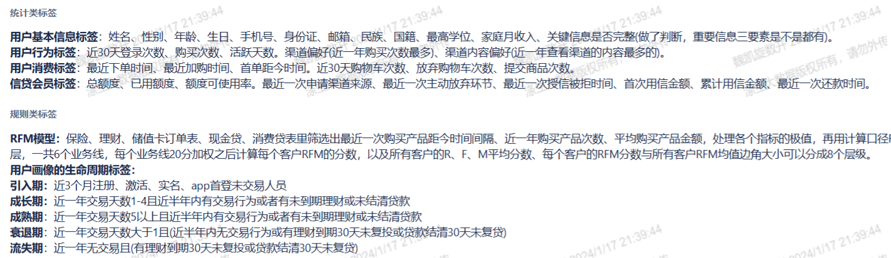
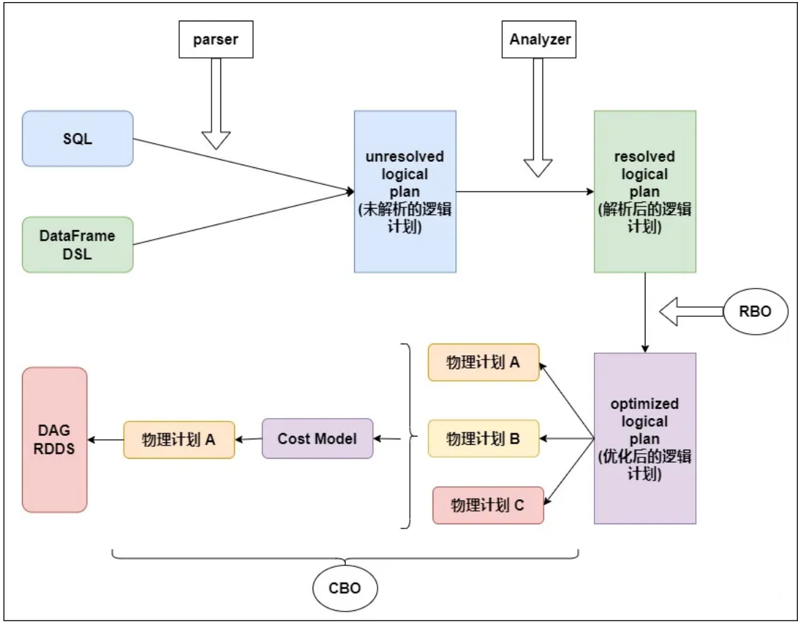
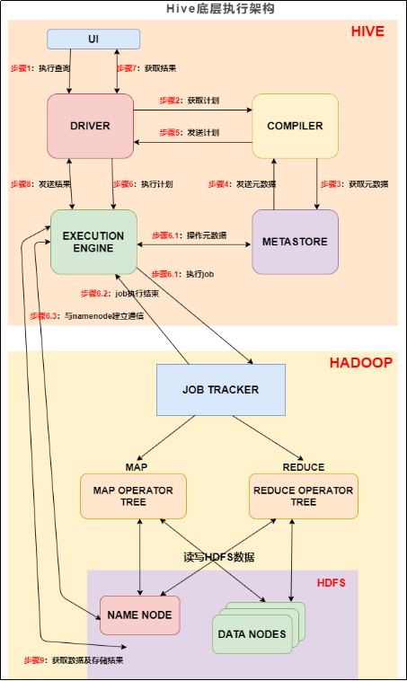
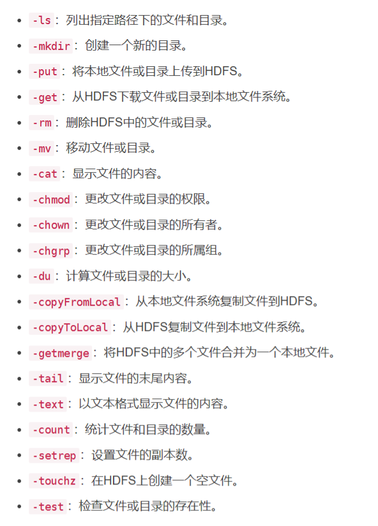

##  招聘平台打招呼

您好，我是魏凯旋，本科毕业于安徽工业大学应用数学专业，从事数仓开发工作两年，业务层面参与了消费金融相关的信贷数仓和用户画像项目，了解信贷指标体系以及消费金融标签体系，熟悉BI报表和标签管理维护。熟练掌握Hive，Spark等数据开发组件，企业级调优等。 熟悉hadoop生态圈常用组件的使用。希望能有和您进一步沟通交流的机会。

## 自我介绍

尊敬的面试官，您好，我是魏凯旋，本科毕业于安徽工业大学应用数学专业，至今有两年的数仓开发经验。

我经历的第一个项目是智慧数据信贷数仓项目，这个项目的大致背景是，随着上家公司数仓业务的拓展，项目出现多种数据源，从而带来的数据不一致、数据质量、数据管理等问题。这个项目是通过对进件、客户、风控、决策等多个系统的数据进行处理，并以hive+spark架构为基础来搭建数仓平台，来为下游的业务和决策提供数据支持。该项目使用的组件包括hive、spark、MySQL、datax和HBase。在这个项目中我主要负责数据的同步工作，包括部分的数据清洗工作，以及数仓模型中的指标的开发和维护，并且开发了监控类报表，比如《授信通过率监控报表》、《提额通过率监控报表》等，此外，我还参与了数据治理相关工作，主要包括数仓流程链路优化和小文件治理。这个项目也是我参与时间较长的项目。

我经历的第二个项目是数据智能信贷决策平台项目，做这个项目主要是公司在数据化运营和场景化分析等方面有需求，第一就是通过提高信贷风控的准确性，来降低信贷风险，同时降低后期坏账率，第二个目标是通过对用画像的构建，来对后期的精准营销和个性推荐提供数据支持。在这个项目中主要负责部分统计类和规则类标签的开发，包括标签后期的维护和无用标签的下架，同时我还做过部分任务链路的优化。

以上就是我参与过的项目的概述。期望能够在贵公司的认可。非常感谢！


## 1. 工作经验

### 1.1 项目一

1. 通过DataX组件抽取到ods层
   - 数据漂移
     在0DS层表，同一个业务数据日期包含了前天或者后天的数据，或者是丢失了当天的数据，这种现象叫数据漂移。
     数据漂移有可能出现的原因：业务系统遗忘同步更新时间，网络或者系统压力，更新时间正好卡在抽数的临界点。
     解决数据漂移：首先往前或者往后冗余数据保证只多不少，再在dwd层进行数据清洗，其次建立数据漂移监测机制，使用自定义脚本对比数据，及时发出告警，一旦发现数据漂移，需要采取措施修复
2. 对该数据进行包括空值处理、数据拆分、重复数据去重等的处理
   - 重复数据去重：删除、合并
   - 空值处理：删除、补充
   - 数据拆分：身份证的拆分
3. 用户域、授信域、交易域有哪些指标？指标的开发
   - dwd层：订单全量快照表，额度调整流水表

   - dws层：近一天维度为产品和城市的交易申请主题表：借款申请金额、成功/失败的金额、人数

   - 授信域：授信申请、额度审批、额度利率（业务过程）
     1. 授信金额、授信的笔数、授信的人数、授信成功率

   - 交易域：借款申请、借款审批
     1. 借款金额、借款申请数量、借款申请的人数、申请通过率等

4. 参与指标体系建设？指标是如何维护的：指标历史版本记录、指标数据的定时更新怎么做的？
5. 报表的开发：借贷业务日报表、用户日报表、风险评估日报表
   - 授信通过率监控报表：申请日期、渠道、授信申请人数、授信通过人数、授信通过率、平均授信额度
   - 提额通过率监控报表：申请日期、认证方式、申请用户数、申请用户数、提额通过用户数、通过率、平均提额额度

6. 监控规则？和质量稽核规则？告警机制？
   - 我们公司有专门的数据质量监控平台，直接在ui界面配置


### 1.2 项目二

1. 如何进行需求的对接？需求是如何拆分的？标签口径如何整理？
2. 统计、规则类标签的开发：具体的指标是如何开发的，每个能举出几个例子
   - 
3. 如何进行标签的变更维护？什么是无用标签且如何下架？建设画像标签资产门户？

   - 标签更新

     除了少数专用型标签可能仅使用一次之外，其他绝大部分其他标签都不是一锤子买卖，上线后必须持续进行更新，否则便成了僵尸标签。

     在标签的更新时效分类中提到，标签分为批量更新标签和实时更新标签。对于实时更新标签，一旦产生标签的数据发生了变化，就需立即更新该标签。比如最后一次登录APP的时间这个实时标签，只要用户登录了APP，就把标签值更新为此次登录时间。对于批量更新标签，不管是每天、每周还是每月更新，都是通过跑批方式进行。这里需要注意的有两点，一是为了更新方便，尽量把更新周期相同的标签放在同一个表中。二是标签更新会有先后顺序，对于特别强调逻辑一致性的业务来说，如果该业务相关的部分标签已经更新了，但另一部分还未更新，这时产出的数据结果是不准确。举个例子来说，如果想对近一个月登录过APP且发生了首次购买的客户进行营销，用到了两个标签，一个是用户最后一次登录APP的时间，另一个是用户首次购买的时间，假设这两个标签都是T+1更新的，如果第一个标签已经更新了，第二个标签还未更新，这时跑批产生的结果就会遗漏昨天发生首次购买的客户。
   - 标签逻辑修改

     随着业务的变化，经常要修改标签逻辑。如果该标签当前没有业务在用，直接修改就行了。但碰巧正好有业务在用，那更新标签逻辑就是件复杂的事。因为突然修改业务逻辑，会导致业务结果前后不一致。对于这种情况，需要和业务用户协商，协商的结果有三种可能性：

     可能一：业务用户能接受前后不一致，那就万事大吉。

     可能二：业务用户不能接受前后不一致，希望按之前的逻辑继续保持下去（干脆错到底）。

     可能三：业务用户不能接受前后不一致，希望使用新逻辑，而且按新逻辑更新之前的数据（在客户发现之前，赶紧改过来）。

     对于后两种可能性，一般不会直接修改标签逻辑，而是保持原有标签不变，按新逻辑产生一个新标签，等过段时间后再把原有标签下线。
   - 标签下线

     大一种是标签相关的业务已经终止了，另一种是标签逻辑发生了变化，有新标签替代该标签了。不管是哪种情况，都需要把标签下线，否则一旦用户用错了，可能导致严重后果。

     标签下线之前必须判断该标签当前是否有用户在用，如果有系统已经记录每个标签的使用情况，直接查询一下有没有人在用。但很多公司并没有这样的系统，需要通过邮件或其他方式通知大家。

     如果得知有用户正在使用，需要和用户协商一个缓冲期，给用户留有足够的时间修改逻辑，改用其他标签。

     接下来是对标签进行逻辑下线，把标签设置成不可访问，但物理上还是存在的。逻辑下线的好处在于，如果发现有问题，还可以回退。逻辑下线一段时间后，如果没有用户找你麻烦，说明该标签真的可以下线了。

4.  大数据平台链路优化工作保证任务及时产出
   - 链路优化问题，1点开跑，11点出数，将近10个小时，领导要求6点之前出数。当时是做了很多工作的，首先这个任务链非常老了，可能是以前做关系数据库的同时创建的，所以SQL写的比较原始复杂。首先**改变了存储格式**，textfile变ORC，列式存储压缩比高，数据量大大降低，然后ORC轻量索引读数更快，减少了1个小时，然后**发现整个任务是串行跑的**，然后根据集群资源把一个脚本拆成了3个脚本，这个时候基本就可以7点左右跑完了，最后又加大了一下shuffle并行度，事实表关联维表的那种大小表关联，调整一下join策略，最后保证了6点之前跑完。是一个涉及到用户行为的汇总宽表，用户粒度、时间维度的各种用户行为信息。

## 2. 技能特长

### 2.1 技术栈

==1.熟悉Hadoop的组织架构，MapReduce的shuffle原理，HDFS读写流程、YARN的任务提交流程==

- **Hadoop架构**
  :Hadoop最核心的框架有三个：分布式文件系统HDFS、分布式计算框架MapReduce、分布式资源调度框架YARN。

  - HDFS：最重要的是它的主从-主备的思想。主从架构是指一个HDFS集群是由一个NameNode和若干个DataNode组成的。NameNode作为主服务器，管理文件系统命名空间和客户端对文件的访问操作。DataNode管理存储的数据，NameNode是所有HDFS元数据的管理者。主备是实现HDFS的高可用，为避免核心角色namenode出现问题而导致HDFS不可用的情况，产生的辅助角色Secondarynamenode。还有hdfs的多副本机制。
  - MR是分布式计算框架：一个完整的MapReduce程序在分布式运行时有三类实例进程：MRAppMaster/MapTask/ReduceTask
  - YARN是分布式资源协调服务框架：YARN主要有四个组件，RM、NM、AM、Container
- **MapReduce的shuffle原理**（map方法之后，reduce方法之前为shuffle）

  - **read阶段**：客户端首先获取待处理文件信息，然后根据参数配置形成任务的分配规划。再调用submit()方法把要执行的jar包、Job.xml(Job信息)、Job.split（分片信息）等提交到hdfs集群。然后把程序提交到yarn集群运行，yarn会生成一个MrAppMaster（一个进程），用来控制maptask和reducetask的启动。因为分片信息已经提交到hdfs集群，那MrAppMaster就会去获取分片信息，计算出Maptask数量。MapTask通过用户编写的RecordReader，从输入InputSplit中解析出一个个key/value
  - **map阶段**：该节点将解析出的key/value交给用户编写的map()函数处理，并输出新的key/value
  - **collect阶段**：map将数据处理完成后调用collect输出结果，collect函数内部（**shuffle阶段开始**）会调用partitioner将生成的key/value分区，并写入一个环形缓冲区中，环形缓冲区的默认大小是100M.
  - **sort阶段**：把kvbuffer中的数据按照partition值和key进行升序排序。移动的只是索引数据,排序结果是kvmeta中数据以partition为单位聚集在一起，且同一partition内按照key有序。排序后可以合并（combine），注意将数据写入本地磁盘之前，先要对数据进行一个本地排序（原因：减轻reduce端排序的压力；元数据），并在必要时对数据进行规约、压缩、分区等操作
  - **spill阶段**：当环形缓冲区满80%后，就会打开流，将数据写到本地文件系统磁盘上，生成一个临时文件，然后关闭流。当环形缓冲区再满80%后，又会打开流开始溢写。所以可能生成多个临时文件。
  - **merge阶段**：所有数据处理完后，map task会对所有临时文件进行一次合并，确保最终只生成一个数据文件。文件合并过程中，maptask以分区为单位进行合并。
  - **copy阶段**：reducer通过http的方式向各个map任务拖取它所需要的数据。一般reduce是一边copy一边sort，两个阶段是分不开的
  - **merge阶段**：从map端复制来的数据先写到reduce缓存中，同样当缓存占用达到一定阈值后会将数据写到磁盘中，同样会进行partition、combine、排序操作等过程。若写了多个磁盘文件还会进行合并，最后一次合并的结果作为reduce的输入，不会写到磁盘中
  - **reduce阶段**：最后将合并后的结果作为输入传入reduce任务中。
- **HDFS读**
  1.客户端通过分布式文件系统向namenode提交读请求。
  2.namenode查看元数据是否存在，校验权限是否通过，都没问题就回复客户端数据所在的数据节点，
  3.客户端会就近访问第一个block所在的datanode
  4.datanode开始传输数据给client(以packet为单位
  5.客户端接收数据。
  6.数据块读取完毕后，继续访方问下一个block所在的最近的节点
  7.重复上面的流程直到所有数据块的数据接收完毕。

- **HDFS写**
  1.客户端向namenode提交写请求
  2.Namenode查看目标文件是否存在并检验权限，元数据都没有问题就返回给客户端一个block所在的3个节点
  3.客户端请求向第一个datanode.上传数据。
  4.Datanode接收请求后，建立与第二个和第三个节点的通信管道。
  5.客户端向第一个dataNode传输数据，第一个客户端接收数据后再传给第二个，第二个传给第三个。
  6.第一个block传输完成后，客户端继续向namenode请求上传第二个，直到所有的block上传完毕。

- **YARN**
  YARN是hadoop:集群的资源管理系统，主要管理服务器的硬件资源包括CPU、内存、磁盘、，网络。YARN主要有四个组件，RM、NM、AM、Container。
  RM是全局资源管理器，负责整个集群资源的分配和管理。
  NM是节点资源管理器，启动conrtaineri运行任务，监控节点资源使用情况，containeri运行情况上报给RM。
  AM是应用程序管理器，向RM申请资源，监控Container的整个运行过程。
  Container是YARN中的资源抽象，将任务运行资原进行抽象，相当于一个小的JVM。
  调度器：FIFO-顺序执行、容量调度器-小任务队列、fair-公平
- **yarn的任务提交流程**

  - 当向YARN提交一个应用程序之后，YARN将分两个阶段运行程序：一是启动ApplicationMaster；二是由ApplicationMaster创建应用程序，然后为他申请资源，监控程序的运行，直至结束。

    具体步骤：

    （1）用户向YARN提交一个应用程序，并指定ApploicationMaster程序；

    （2）ResourceManager为这个应用程序分配一个Container，并与对应的NodeManager通讯，在这个Container中启动ApplicationMaster。

    （3）ApplicationMaster向ResourceManager注册，然后拆分任务分配给内部，为各个拆分的任务申请资源，然后监控这些任务的运行，知道结束。

    （4）ApplicationMaster采用轮询的方式向RM申请资源。

    （5）AM申请到资源后，与对应的NodeManager通讯，以启动任务。

    （6）任务启动后，各个任务会向AM报告自己的状态和进度，以便任务失败时，AM可以重新申请资源重启任务。

    （7）任务完成后,AM向RM注销并关闭自己。

==2.熟悉Spark架构，Spark SQL任务的底层编译原理，shuffle工作原理、RDD的概念、常用的算子。==

- Spark 的框架的核心是一个计算引擎，Spark 是一个典型的 master slave 主从架构，有一些核心组件：Driver 和 Executor、Master 和 Worker、ApplicationMaster。

- spark on yarn
  1、在 YARN Cluster 模式下，Spark 任务提交之后会与 ResourceManager 建立通讯，并发出申请启动 ApplicationMaster 请求；

  2、ResourceManage 接收到这个 Job 时，会在集群中选一个合适的 NodeManager 并分配一个 Container；以及启动 ApplicationMaster ，此时的 ApplicationMaster 就是Driver ；

  3、ApplicationMaster 启动后向 ResourceManager 申请资源，ResourceManager 接到ApplicationMaster 的资源申请后会在合适（有资源的情况下）的 NodeManager 中分配Container；

  4、ApplicationMaster 对指定 NodeManager 分配的 Container 发出启动 Executor 进程请求；

  5、Executor 进程启动后会向 Driver 反向注册，Executor 全部注册完成后 Driver 开始执行执行 Job 任务；

  6、ApplicationMaster 中的 SparkContext 分配 Task 给 Executor 执行，Executor 运行 Task 并向 ApplicationMaster 汇报运行的状态、进度、以及最终的计算结果；让ApplicationMaster 随时掌握各个任务的运行状态，从而可以在任务失败时重新启动任务；

  7、应用程序运行完成后，ApplicationMaster 向 ResourceManager 申请注销并关闭自己；

- spark SQL底层的编译原理

  - 

- shuffle

  - spark 的 shuffle 是在 MapReduce shuffle 基础上进行的调优。其实就是对排序、合并逻辑做了一些优化。在 spark 中 shuffle write 相当于 MapReduce 的 map，shuffle read 相当于 MapReduce 的 reduce。

- RDD概念
  通常情况下我们说的 RDD的弹性有以下一些情况：

  弹性之一：自动的进行内存和磁盘数据存储的切换；

  弹性之二：基于 Lineage（血缘）的高效容错；

  弹性之三：Task 如果失败会自动进行特定次数的重试；

  弹性之四：Stage 如果失败会自动进行特定次数的重试，而且只会计算失败的分片；

  弹性之五：checkpoint 和 persist（持久化和检查点）；

  弹性之六：数据分片的高度弹性。

  然后我们再来谈谈分布式，前面我们学过 Hadoop 相关的知识可以了解到，什么叫分布式，同样 Spark 也是一样的，可以借助集群提供的统一资源，大大增加了自己的计算能力。

==3.熟悉Hive的架构原理、Hive SQL的底层执行过程==

- Hive组成原理
  hive的体系架构由两类组件构成，客户端组件和服务端组件。
  客户端组件有命令行接口、Veb GUl..
  服务瑞组件有Driver组件、Metastore组件，Thirft组件。
- HiveSql执行流程

  - 

  - ***\*步骤1\****：UI 调用 DRIVER 的接口；

    ***\*步骤2\****：DRIVER 为查询创建会话句柄，并将查询发送到 COMPILER(编译器)生成执行计划；

    ***\*步骤3和4\****：编译器从元数据存储中获取本次查询所需要的元数据，该元数据用于对查询树中的表达式进行类型检查，以及基于查询谓词修建分区；

    ***\*步骤5\****：编译器生成的计划是分阶段的DAG，每个阶段要么是 map/reduce 作业，要么是一个元数据或者HDFS上的操作。将生成的计划发给 DRIVER。

    如果是map/reduce作业，该计划包括map operator trees和一个reduce operator tree，执行引擎将会把这些作业发送给 MapReduce。

    ***\*步骤6、6.1、6.2和6.3\****：执行引擎将这些阶段提交给适当的组件。在每个 task(mapper/reducer) 中，从HDFS文件中读取与表或中间输出相关联的数据，并通过相关算子树传递这些数据。最终这些数据通过序列化器写入到一个临时HDFS文件中（如果不需要 reduce 阶段，则在 map 中操作）。临时文件用于向计划中后面的 map/reduce 阶段提供数据。

    ***\*步骤7、8和9\****：最终的临时文件将移动到表的位置，确保不读取脏数据(文件重命名在HDFS中是原子操作)。对于用户的查询，临时文件的内容由执行引擎直接从HDFS读取，然后通过Driver发送到UI。

==4.熟悉Hive调优原理，对Hive调优有一定的理解，如参数方面和代码方面的优化，包括小文件治理，数据倾斜治理等==

- Hive调优
  SQL调优主要从这几个方面：减少数据量、减少job数、避免数据倾斜。
  2.列裁剪：杜绝select*ORC和Parquet是列裁剪，可以直接读取列，列裁剪之后减低存储，如果是中间表可以节省计算资源。
  3.谓词下推：在hiveSQL中，在不影响结果的情况下，尽量将过滤条件提前执行，减少map端输出，减少数据传输，节省集群资源，提高任务性能。过滤条件写的位置也要注意，跟分区裁谫一样。
  4.joi表不易过多：一是如果出错，重跑成本过高，其次单个调度任务执行任务不能过长，可以拆分成冲间表，逻辑清晰简单。
  5.Join key一样的时候放在一起减少job数。
  6.全局的TOPN：对order by的优化
  7.groupBy代替count(distinct),大数据量有效，小数据量不需要，起多个job的进程启动和销毁也会耗时。
  8.使用with as提取公共子查询，避免更复计算。
  9.多表插入优化：如果是一个表经过不同的筛选条件插入不同的表，可以改写成multiple insert,底层是通过将多次扫表合并成一次扫表。
  10.开启动态分区，判断是否需要配置文件个数和文件大小，避免产生新的小文件问题
  11.Group byt优化开启map端预聚合和负载均衡打散key值旬、负载均衡有一些坑，会丢失数据
  12.还有一些其他参数：开启fetch抓取、开启严格模式、jvm重用uber模式有task个数和输入文件大小限制、向量化参数、mapjoin,小表大小限制、并行参数、推测执行参数。
  13.通过控制切片大小控制map个数、控制reduce处理数据大小控制reduce个数
  14.内存和cpu参数，慎用。
- 小文件治理
  - 来源：我们公司的小文件主要来自三个方面，一个是kafak抽取的流失增量文件、小窗口文件，几分钟一次文件小，还有就是MR任务，有的map-only和map-reduce都可能会造成大量的小文件，比如表的过度分区、动态分区都可能会造成大量的小文件。还有就是spark的任务并行度过度优化、spark分区越多，写入的文件就越多。还有就是文件的压缩和存储格式不合理，压缩文件有时候也会产生小文件。
  - 危害：小文件过多的话 namenode的负载过大，namenode存储一个文件大概有150bytes，小文件过多，占用内存能翻几十甚至几百倍，另外对计算性能浪费很大，另外对于datanode来说，节点上存在大量小文件。意味着就要花费更多的寻址时间，比读写的时间更多。对于mapreduce，默认一块是一个单独的map任务，大量的小文件造成了大量的map,即使开启了小文件合并，也要耗费大量时间建立节点连接、网络传输。
  - 治理方法：存量的小文件，hive小文件，设置小文件合并参数，通过hive的重写方式合并小文件。Spark小文件采取在后续配置一个hive任务合并小文件的方式。
- 数据倾斜治理
  - 数据倾斜现象就是个别reduce处理的数据量过大，整个job可能已经98%，一直执行不完，这种就是有大join key值，一种是空值多，一种是某些key值数据量很大。
  - 主要的处理方法：能用mapjoin就用mapjoin，不能用mapjoin的就是常规join分场景解决；
    - null值或空值或有规律的脏数据一般用随机值打散
    - 大热点值拆分：将大热点值拆分成一张临时表单独处理，再union all回去。难点：如何拆分，限制条件
  - 就是打散大join Key，空值的先判断是不是有因为隐式转换，然后使用随机数打散大key，正常业务场景确实存在的大joinkey。Groupby的时候可以开启负载均衡，inner join的时候使用sekewed.join。不过我在实际工作中都是做代码优化，之前有用groupby开启map聚合和skew 丢数据了，后面查了一下官网，这确实是个bug。

### 2.2 数仓建设

==1. 熟悉企业中数仓开发管理规范，如模型设计规范，元数据规范，指标体系规范、层级调用规范。==

1. 模型设计规范：

   - 高内聚、低耦合；核心模型和拓展模型分离；数据一致性；
   - 表的命名规范、字段命名、字段类型、字段注释
3. 层级调用规范：

   - ods层不能直接被应用层引用
   
   - cdm层任务的深度不宜过大（不建议超过10层）
   - 一个计算刷新任务只允许一个输出表，特殊情况除外
   - cdm汇总层优先调用cdm明细层，可累加指标计算。cdm汇总层尽量优先调用已经产出的粗粒度汇总层，避免大量汇总层数据直接从海量的明细数据层计算得出。
   - cdm明细层累计快照事实表优先调用cdm事务型事实表，保持数据的一致性产出
   
   - 有针对性的建设cdm公共汇总层，避免应用层的过度引用和依赖cdm层明细数据
   


## 3. 项目

### 3.1 智慧数据信贷数仓项目

#### 3.1.0数仓架构介绍

1. 数仓架构
   - 横向分层
     - 数据源：进件系统、客户系统、风控系统、决策系统、埋点系统、外部系统、核算系统
     - ods层包含结构化数据、日志数据、埋点数据、流量数据。数据从业务系统提取到ods层一般不做出处理，
   - 数据域（按业务过程划分）：展业域、用户域、授信域、风控域、交易域、催收域、担赔域

#### 3.1.1 项目描述

==查询和分析性能不高==：是什么原因？如何优化的？这种情况主要是处理大表时，主要是过滤效果比较差，会扫描一些非相关数据，导致查询分析时间较长。主要优化手段就是对大表进行拆分，让任务以并行的方式执行。

#### 3.1.2 职责

==1.将进件系统、客户系统、风控系统的业务数据通过DataX:组件抽取到ods层，并对该数据进行包括空值处理、数据拆分、重复数据
去重等的处理，并将处理的数据转化到dwd层；==

==2.基于hive SQL对用户域、授信域、交易域模型的开发和指标的开发，指标以授信申请、借款申请、借款审批等方面为主；==

==3.参与指标体系的建设，以及负责指标的维护，比如指标历史版本记录、指标数据的定时更新：==

==4.参与监控报表的开发，如借贷业务日报表，用户日报表，风险评估日报表等，反映业务状况及为业务提供参考和决策依据；==

==5.参与建立公司夜间任务运维保障机制，通过配置ETL任务运行监控规则以及数据质量稽查规则等对数仓任务运行进行监控，并通
过告警机制，对不同级别的异常情况进行及时的告警处理，以保障整个数仓任务产出的稳定性和时效性；==

### 3.2 数据智能信贷决策平台

1. 根据业务需求，明确用户的粒度、维度和指标，以更好地了解用户，并为用户构建各项画像标签，负责与业务方交互，需求的对接，进行需求的拆分，标签口径的整理；
2. 负责开发部分统计类标签，如用户基本属性标签、用户行为统计标签、内容消费统计标签等0多个标签，
3. 负责开发部分规则类标签，如用户活跃度评级、生命周期、用户R「M模型等30多个标签，提供有针对性用户像评估和个性化推荐
4. 负责画像的管理维护包括标签变更维护、无用标签扫描下架了20多个，建设画像标签数据资产门户；
5. 对开发过程中遇到的生产问题进行解决和优化，负责项目的后期维护和优化，如将标签链路产出任务提前2个左右小时，确保在资源紧缺时也能及时出数；


**最难的问题**

可能就是在各个平台没有建设或者不成熟的时候，推进数据质量和治理，靠人为规范和监控比较难，需要频繁组织各种会议。

另外就是一个链路优化问题，1点开跑，11点出数，将近10个小时，领导要求6点之前出数。当时是做了很多工作的，首先这个任务链非常老了，可能是以前做关系数据库的同时创建的，所以SQL写的比较原始复杂。首先改变了存储格式，textfile变ORC，列式存储压缩比高，数据量大大降低，然后ORC轻量索引读数更快，减少了1个小时，然后发现整个任务是串行跑的，然后根据集群资源把一个脚本拆成了3个脚本，这个时候基本就可以7点左右跑完了，最后又加大了一下shuffle并行度，事实表关联维表的那种大小表关联，调整一下join策略，最后保证了6点之前跑完。是一个涉及到用户行为的汇总宽表，用户粒度、时间维度的各种用户行为信息。


## 4. 公司

深圳市福田区水围村87栋102；；；杭州银行（开源支行），平海路

### 4.1 组织架构

- 数据部
  - 平台开发组
    - 产品经理
    - 测试工程师
    - 平台开发工程师
  - 数仓开发组
    - 产品经理
    - 测试工程师
    - 数仓开发工程师
  - 运维组  

### 4.2 集群情况

公司用的是CDH版本的集群;CDH版本5.7.6，对应的hadoop版本是2.6

公司有多少台服务器？你们数仓用到的有多少台？（稳哥：这个是运维的事情，开发一般太太清楚）

公司数据部有多少人？8人

数仓有多大？

### 4.3 数仓数据量

数仓数据量大概有多少？风控表、借款表的数据量

注册用户数：4000万

授信用户数：4000万

授信表记录量：8000万

借款申请记录量：8000万

放款流水表：2000万；借款成功率：20-30%

还款计划表：2000万*12=2.4亿 （平均贷款期限12个月）

还款流水表：2000万*12 * 10 =24亿（一篇还款计划，平均对应10笔流水，存在还款失败的情况）

催收订单：2000万*3%= 68万（放款2000万笔，逾期率为3%）

风控策略流水表：8000万 * 20 + 8000万 * 20 = 32亿；（以授信记录表为基础，贷前走一遍风控策略，每笔授信走的策略大概20，贷中风控大概也是20）

风控策略规则流水表：32亿 * 10 = 320亿 （一种风控策略大概10条规则）

 

公开资料显示，截止2022年末，消费金融公司贷款余额为1600亿元，公司累计授信客户8800万户，累计发放贷款1.7万亿元，平均贷款利率约为17%，其中某借贷类产品，贷款余额为1000亿，贷款笔数为2000万笔，笔均贷款金额为4600元，贷款平均期限为12.08月。

申请到放款的通过率在33%左右，部分优质渠道能达到40%左右（个位数的也有，波动比较大）

2020年逾期率为2.8%，2021年逾期率为3.4%，逾期60天以上的贷款达28亿；

按照逾期60天纳入不良的标准计算，2020至2022年不良率分别为1.7%、1.8%、2.2%；

2022年上半年，消费投诉量为2100件，全年客诉量5000件

平均贷款利率在7%--23.725%。广告年化利率低至7%左右，但往往最终放款的年化利率达23%


## 5. 英语介绍

Firstly,thank you for your interview. It's my great pleasure/honor to have this opportunity to take part in this second interview. My name is 魏凯旋. I’ve graduated from anhui University of Technology and my major is mathematic.

大四时在深圳的一家公司参加实习并顺利转正，从事数仓开发大概有两年的时间。在此期间我参与了信贷数仓和用户画像两个项目。并且我能熟练掌握Hive，Spark等数据开发组件，还熟悉hadoop生态圈常用组件的使用。

In my senior year, I participated in an internship in a company in Shenzhen and was successfully promoted to a regular position. I engaged in warehouse development for about two years. During this period, I participated in two projects: credit warehouse and user portrait. In addition, I am proficient in Hive, Spark and other data development components, as well as familiar with the use of common components in the hadoop ecosystem.

I firmly believe that my strength will contribute to the xxx(公司)if I get the job. Thank you for giving me this chance.


## 6. 常用命令

### 6.1 Linux常用命令

#### 针对数据开发的使用场景

#### 具体命令

### 6.1HDFS常用命令

``` text
hdfs dfs -ls /user/hadoop -- 列出指定路径下的文件和目录
hdfs dfs -mkdir /user/hadoop/new_directory -- 指定路径下创建目录
hdfs dfs -put local_file.txt /user/hadoop -- 将本地系统的数据上传到hdfs上
hdfs dfs -get /user/hadoop/file.txt local_directory/ -- 从hdfs上下载文件到本地系统
hdfs dfs -du /user/hadoop/file.txt -- 计算文件或目录大小
```



## 7. shell脚本


## 8. 报表

1. 开发过哪些报表？报表有哪些字段？
   - 授信通过率监控报表：申请日期、渠道、授信申请人数、授信通过人数、授信通过率、平均授信额度
   - 提额通过率监控报表：申请日期、认证方式、申请用户数、申请用户数、提额通过用户数、通过率、平均提额额度


## 9. 数据清洗

**ods层的数据清洗侧重点**

目的：保证与上游数据的一致性，避免数据重复或错误

流程：数据源⇨⇨抽取、传输⇨⇨文件格式转换、数据类型转换⇨⇨加载到临时数据区⇨⇨数据清洗⇨⇨写入正式数据区ods

清洗过程：

- 常规数据：数据类型转换、数据去重、空值处理、空格去除、敏感数据加密
- 脏数据：残缺、错误、重复、多个来源系统数据不一致、将过滤出的脏数据提交上游业务部门，决定剔除还是修复后重新抽取数据

**dwd层的数据清洗侧重点**

目的：增强数据的可用性，数据仓库整体数据的规范化

流程：ods⇨⇨数据清洗、计算、轻度汇总⇨⇨dwd

清洗过程：

- 剔除不可用数据：去重、去空、异常值处理、去除冗余字段
- 数据规范化：即数值统一、结合字典表（dim）映射转换、编码（标识符ID）、名称、boolean值统一，单位统一


1. 整体的数据量有多大？

2. 组件架构选型？

3. 我来的话工作做哪些？

4. 有大佬带我，数仓规范之类的我这边有可能比较成熟的方案，带我的导师是阿里的大佬

5. hive、spark的功能比较丰富

   