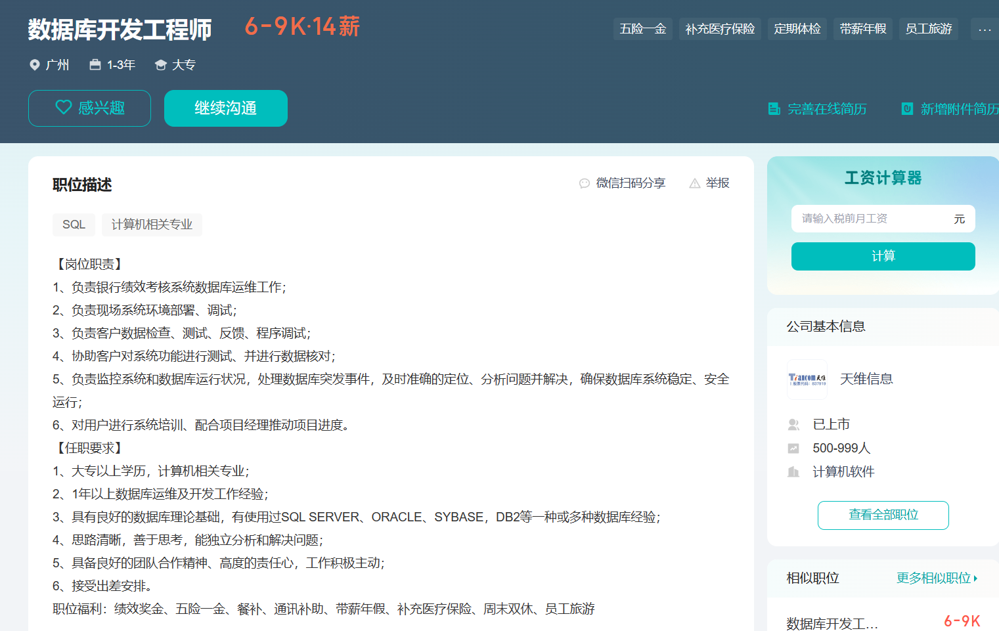

# 0119-青岛

sql 不同部门销售前30的员工、行列转换（在hive中是怎么做的？？？）、窗口函数的累加问题、连续登录问题（还有其他方法吗）

分桶和分区的理解

hive中按照时间排序需要注意的点有哪些

拉链表熟悉吗？讲一讲？

项目的架构介绍一下

ads层有哪些东西

数仓的拓展和维护是如何做的？具体做了哪些工作？ 

面试时间不到20分钟，面试官好像很急

叙述可能不清晰，有点紧张，流畅度不太好

sql都在经典面试题范围内，只不过都问还有其他思路吗？有些我只记了一种

sql的行列转换描述完以后，面试官又问行列转换在hive中是怎么做的，当时没反映过来，给直接跳过了

说我叙述的太理论化了，问具体做了哪些工作？这点我说的不太行

面试官问我最近做的是那个项目，我说第一个信贷数仓的项目。面试全程只涉及第一个项目

面试全程只问hive相关

# 宇哥模拟面

## 简历更改部分

任务运维保障： 参与建立公司夜间任务运维保障机制，通过配置 ETL 任务运行监控规则以及数据质量稽查规则等对数仓任务运行进行监控，并通过告警机制，对不同级别的异常情况进行及时的告警处理，以保障整个数仓任务产出的稳定性和时效性；

## 宇哥反馈

1.自我介绍不够熟练，面试题不够熟悉，问题回答不够顺畅；
2.项目细节掌握不足，例如：需求承接流程，数据接入策略等项目实操细节。
3.指标体系了解不足，工作内容无实际意义。
4.优化实操能力一般，偏重理论化，无优化体系思维。
5.对面试问题还是死记硬背的痕迹，并未理解深入。

# 0131-软通动力-HR邓丹

## 面试反馈

处理客户不合理诉求思路一般。

## 具体问题

1. 为什么要从数据开发转到数据支持？
2. 讲一讲Hadoop有哪些组件、有哪些功能？
3. MapReduce的工作流程
4. yarn的工作流程
5. 你可以讲一下数仓分层吗？数仓是分为哪几层呢？
6. 客户有一个需求反馈给你，需求也反馈过几次，你也给后端的产品提交过这个需求，然后产品给的回复是这个需求是一个不合理的需求没办法实现这个功能，你作为技术支持会怎么跟客户去沟通呢？

## 总结

岗位是大数据技术支持工程师，先问我为什么要从数据开发转到数据支持？ 我说数开工作重复性很高，想有新的发展（大概这样讲的）

问题回答的流畅度上有问题；

问题回答的太简单，Hadoop组件的功能和数仓分层都没展开讲；

问题6：大致讲的是去了解具体原因，去跟客户交流调整，（问题反馈过多次这个没考虑到，确实没思路）

# 0227-中软国际-腾讯外包-深圳-李女士

## HR还提前给透露的一点其他面试官面试题目

- 开窗函数有哪些？
- 区别？怎么用？
- 实时离线那个做得多？

## 面试要点

具体开发的模型咋开发的？需要一个具体的开发案例，从开始到应用

表模型的设计？字段：用户id、设备id、登录时间  要求一个月的uv如何进行模型设计，从日uv到月uv

SQL题知道怎么写，但熟练度太低了

# 0301-网新恒天软件-外派道富-徐琼

1. 查询和分析性能不高是什么原因？你们是如何优化的？
2. 数仓的分层，是如何分层的？
3. MapReduce的shuffle原理
4. sparksql 用Scala写的
5. hiveSQL的底层的执行过程：
6. hive的内部表和外部表的区别
7. spark惰性算子和行动算子举例
8. shell中 如何判断a> b ,-gt什么意思
9. Linux常用命令举例，给文件进行赋权
10. 对HBase和kafka有了解吗
11. 英文自我介绍

# 0306-广州

三个人面试，包括HR/技术总监/**总监；

### 技术总监问题

1. 简单描述一下你的工作范围和工作内容？
2. 现有一个很大的表格，时间周期有7年左右，现在只取其中3个月的数据，其他数据可以删除，时间限制在一个晚上，简单的delete肯定是执行不完的，问如何解决？
3. 现有一个员工表，包括A/B/C三个部分，现发生人员变动，A部门部分人员迁移到B部门，B全部人员迁移到C,C全部人员迁移到A，你如何进行处理？

### 其它问题

工作出差，离广州比较远，在市区；

好像要负责全链路的工作，从客户对接到后期运维貌似都要做

### 岗位信息

# 0314-羽实萧恩-厦门

自我介绍：只介绍完第一个信贷数仓项目，说介绍一个就行；

1.你在工作中都开发过哪些报表？

> 《授信通过率监控报表》、《提额通过率监控报表》、

2.开发的《授信监控报表》都有哪些字段？

> 日期、授信申请渠道、省份、城市、授信申请的状态

3.你在数仓都介入过哪些表?

> 比如用户的基本信息表、授信申请表、一些日志类数据等

4.你在数据清洗的时候做过哪些工作？

> 出现数据缺失的情况，和领导或者业务方去沟通，来确定缺失字段的数据是删除还是进行数据填充，再进行下一步处理。
>
> 数据拆分方面，是对身份证号的拆分，来获得用户的省市相关信息

5.在表中查某一个字段的重复数据，如何写SQL？

> 这个直接口述，按相应字段进行分组，再行进行count，再用having对count的值作限制

6.hiveSQL调优相关的你能讲讲吗？

> 讲了select相关的分区裁剪、列裁剪和谓词下推，大致讲通过对数据的精准读取来避免全表的扫描，生效情况；
>
> 数据聚合方面，以topN为示例讲的。

7.现在人在哪？工作地点能接受吗？到岗时间？最晚一周，看您要求我尽量配合；期望薪资？10

总结：回答的时候被4、6面试官的OK打断，就会问下一个问题；

1. 面试流畅上有问题，表述逻辑上有问题，知道怎么回答但在表达上有点结巴

   

# 20240315-深圳有伴

1. 做了两个项目，说一下你遇到印象比较深刻的问题

   > 任务链路优化

2. 追问：任务拆分进行并行执行，会不会增加集群资源的消耗？

3. 还有比较印象深刻的吗？

   > 模型优化

4. 数仓为什么要分层？每一层的目的是什么？

5. 为什么要建数仓？空间换时间

6. 大数据的历史了解过吗？

7. 在工作中有遇到数据漂移的问题吗？如何解决的？

8. 你有调优的经历吗？一般思路是什么？

   > 以一段SQL为例将的，数据读取阶段、数据join、聚合

9. 平时有写shell脚本吗？Java呢？Python呢？

10. 数据开发这块你们公司有几个人？数据部7人

11. 你在公司的定位是什么？有参与的业务方的交流中吗

12. 公司的服务器有多少台？

13. 开发有测试环境吗？

14. 如果要重新从0到1建一个数仓要多长时间，包括调优？

    > 九个月起步

15. 最快多久入职？

反问：

1. 日常会做哪些工作？
2. 新、老系统的技术架构是什么？
3. 老系统的数据后期要如何处理？
4. 如果能入职，在还有哪些需要去准备的？

# 顶点软件

## 企业背景：一面后发的PPT

全域金融

政、教、企

3+3+N

## 一面

HR面-之前有打电话聊过10多分钟，这次是视频面试；；面试时间大概20分钟

1. 离职原因？
2. 家人工作？在哪？
3. 聊了一下教育背景
4. 目前薪资？期望薪资?
5. 现在有其他offer吗？
6. 日常有和业务交流吗？
7. 顶点软件公司的介绍

## 二面-0325-郭总

1. 离职原因，为什么来上海发展
2. 主要工作是什么？数仓的模型建设、维护。报表开发
3. 主要那些语言？
4. 关系型数据库做的多吗？
5. 聊大学专业方面
6. 任务是如何划分的？
7. 有多少人？
8. 开发过哪些报表？我以授信通过率监控报表为例进行阐述的，表达的还行，面试官嫌逻辑简单
9. 有印象比较深刻的点吗？数仓任务链路的优化为例，包括存储格式优化，任务拆分并行优化，表连接优化
10. Linux：更改文件的所属
11. Java用的多吗？做udf开发，数据库连接一类的
12. 职业规划？

复杂逻辑的代码修改案例

# 中科软

## 一面

面试时间大概一个小时分钟

1. 问学校、专业

2. hive中有哪些表类型？

3. 有什么区别？

4. 你们的SQL是如何调用的？

5. 七个SQL题 

   > 1. 成绩的topN问题
   > 2. 去重问题，除了自动编号不同。是否保留id两种情况
   > 3. 行转列问题，数组的排序函数sort_array
   > 4. 每个市消费前10的人，每次消费记录一次？拓展：只考虑一天且只消费一次；
   >    考察rank、dens_rank、row_number的区别。
   > 5. row_number处理重复数据，如何保证每次执行都是一致的？
   > 6. hive的执行流程？
   > 7. in/exist的区别作用

6. 用过哪些开窗函数？业务场景有哪些？

   > rank、dens_rank、row_number
   >
   > lag/lead ，求连续登录天数
   >
   > max/min
   >
   > sum

7. 数据倾斜遇到过吗？如何处理的？

8. 离职吗？薪资情况？10k+补贴

9. 后面在聊天，聊环境、具体的教育背景之类的，有十多分钟

## 二面

我说上家薪资10.5，他直接说薪资9，试用期80%，很强势；

开着车面试，导航声音TM比啥声音都大，面着试车里还有孩子。

问题都听不清，几乎每次都确实问题是啥。我不太信他能听清我说的啥；

1. etl做过吗？

2. 主要工作是啥？开发过哪些模型？

3. 开发的逻辑比较复杂的标签介绍一下？

   > 我按用户的生命周期标签进行介绍的，说具体周期有哪些，用户生命周期的界定规则逐一解释的，具体的代码简单提了一下

现在薪资12，还有几百块钱的补贴，现在在职，月底项目到期没有项目了

外包都是驻场开发

知道行情差，期望跟现在差不多的薪资，能有涨幅更好

# 重庆淘然融资担保

1. 之前公司做什么的？信贷类业务，将公司的产品打包去驻场工作，去杭州银行。
2. 平时主要工作有哪些？
3. 数据供给决策，决策引擎，具体的决策是如何使用？
4. 规则类标签哪些印象比较深？
5. 贷后数据相关的了解吗？
6. 授信域有哪些比较重要的数据？
7. 数据倾斜的主要问题是什么？如何解决？
8. 信贷数仓加HBASE的目的是什么？
9. Java有用过嘛？写一些数据库，udf函数开发
10. 对公司有哪些了解？职业规划？
11. 最快多久到岗？
12. 期望薪资？

1. 日常会做哪些工作？

   > 目前数仓在从0到1进行开发，还未投入生产使用，数据质量可能比较差，主要是用MySQL
   >
   > 目前不太用hive和spark，未来会用。
   >
   > Java在兼职数据开发，很初期
   >
   > ods层的数据都同步完成了，下游的各层只有模型概念。做数据清晰、口径统一

   
