# 章节导学

# 第一章：基础概念

****

## 概念

数据仓库：是一个面向主题的、集成的、相对稳定的、反映历史变化的数据集合，用于支持管理决策。

它是 一个过程、一个解决方案、一套方法论，它不是一个具体的产品

****

## 特点（重点）

### 主题性

面向主题的

主题：抽象概念，简单说是**与业务相关的数据类别**，是指用户使用数据仓库进行决策时所关心的重点方面，每个主题对应一个宏观的分析领域。

概括描述：

- 数据仓库一般是从用户实际需求出发，将不同平台的数据源按设定主题进行划分整合，抽象性较高。
- 面向主题的数据组织方式，就是在较高层次对分析对象数据的一个完整、统一并一致的描述，能完整及统一地刻画各个分析对象所涉及的有关企业的各项数据，以及数据之间的关系

###  集成性

与面向主题密切相关

在各数据库的基础上进行整体分析，必须将多个分散的数据源统一成一致的，无歧义的数据格式后，再放置到数据仓库。能完成如产品命名冲突、计量单位不一致等问题，整合后的数据库便是集成的。

数仓数据来源：

- 数仓数据大部分来自传统数据库，且传统数据库中的数据一般都是有噪音的、不完整的或数据形式不统一的，因此数据导入前进行**预处理**。

数据面向转变：

- “脏数据”进入数仓之前必须进行抽取、清洗、转换，才能生成从**面向事务**转而**面向主题**的数据集合。
- 因为传统数仓是面向事务的，而数据仓库是面向主题的

### 相对稳定的

数仓主要供企业进行决策分析，**数据仓库一般有大量的查询操作，但修改和删除操作很少，通常只需要定期的加载、刷新。**

相比之下，操作型数据库中的数据是实时更新的，数据根据需要及时发生改变。

### 反映历史变化的

联机事务处理（OLTP）（On-Line Transaction Processing）：

- 反映当前时间点的数据情况
- 要求高性能、高并发、极短响应时间
- 因此，一般将数据按活跃程度分级，将历史数据迁移到归档数据库中

数据仓库：

- 关注的是数据随时间变化的情况，并且能反映在过去某个时间点的数据是怎样的==**数据仓库中的数据是反映了某一历史时间点的数据快照**
- **数据仓库数据会随时间变化而定期更新**，不可更新是针对应用而言，即用户分析处理时不更新数据
- 当数据超过数据仓库的存储期限，或对分析无用时，从数据仓库中**删除**这些数据
- 数据仓库中的数据通常**包含历史信息，系统记录了企业从过去某一时点(如开始应用数据仓库的时点)到目前的各个阶段的信息**，通过这些信息，可以对企业的发展历程和未来趋势做出定量分析和预测

****

## 数据仓库的设计目的

> 业务系统中的**数据形式各种各样**，可能是 oracle、mysql 等关系数据库的结构化数据，可能是文本、CSV 等文件或Word、Excel 文档中的非结构化数据，还可能是 HTML、XML 等自描述的半结构化数据。这些业务数据经过一系列的数据**抽取、转换、清洗**，最终以一种**统一的格式装载进数据仓库**。数据仓库里的数据作为分析用的数据源提供给后面的即席查询、分析系统、数据集市、报表系统、数据挖掘系统等。

为什么不能直接操作业务系统中的数据用于分析，而要使用数据仓库呢?

> 直接访问失败案例很多，先驱者已经试验过了
>
> 具体原因：
>
> ⚫ 某些业务数据由于**安全或其他因素**不能直接访问。
>
> ⚫ **业务系统的版本变更频繁**，每次变更都需要重写分析系统并重新测试。
>
> ⚫ 很难建立和维护汇总数据来源于多个业务系统版本的报表。
>
> ⚫ 业务系统的**列名通常是硬编码**，有时仅仅是无意义的字符串，这让编写分析系统更加困难。
>
> ⚫ 业务系统的**数据格式**，如日期、数字的格式不统一。
>
> ⚫ 业务系统的**表结构为事务处理性能而优化**，有时并不适合查询与分析，没有适当的方式将有价值的数据合并进特定应用的数据库。
>
> ⚫ 没有适当的位置存储元数据。
>
> ⚫ 用户需要看到的显示数据字段，有时在数据库中并不存在。
>
> ⚫ 通常事务处理的优先级比分析系统高，所以如果分析系统和事务处理运行在同一硬件之上，分析系统往往性能很差。
>
> ⚫ 有误用业务数据的风险。
>
> ⚫ 极有可能影响业务系统的性能。

为什么要有数据仓库？

> ⚫ **将多个数据源集成到单一数据存储**，因此可以使用单一数据查询引擎展示数据。缓解在事务处理数据库上因执行大查询而产生的资源竞争问题。
>
> ⚫ 维护历史数据。
>
> ⚫ 通过对多个源系统的数据整合，使得在整个企业的角度存在统一的中心视图。
>
> ⚫ 通过**提供一致的编码和描述，减少或修正坏数据问题，提高数据质量**。
>
> ⚫ **一致性地表示组织信息**。
>
> ⚫ 提供所有数据的单一通用数据模型，而不用关心数据源。
>
> ⚫ 重构数据，使数据对业务用户更有意义。
>
> ⚫ 向复杂分析查询交付优秀的查询性能，同时不影响操作型系统。
>
> ⚫ 开发决策型查询更简单。

****

## 数据仓库和数据库的区别

### 数据库

数据库是**面向业务**的处理系统，它是针对具体业务在数据库联机的日常操作，通常对记录进行**查询、修改**。用户较为关心**操作的响应时间、数据的安全性、完整性和并发支持的用户数**等问题。传统的数据库系统作为数据管理的主要手段，主要用于操作性处理。也被称为联机事务处理(OLTP)

### 数据仓库

数据仓库一般针对某些主题的历史数据进行分析，支持管理决策。又被成为**联机分析处理OLAP（On-Line Analytical Processing）**

### 两者区别（重要）

`数据仓库的出现并不是要取代数据库`

`数据仓库是数据库已经大量存在的情况下，为进一步挖掘资源、为了决策需要而产生的，它绝不是所谓的“大型数据库”`

- 数据库是**面向事务**的设计，数据仓库是**面向主题**设计的
- 数据库一般**存储业务数据**，数据仓库一般**存储历史数据**
- 数据库设计是**尽量避免冗余**，一般针对某一业务应用进行设计，比如一张简单的user表，记录用户名、密码等简单数据即可。符合业务应用，但不符合分析。数据仓库**在设计时有意引入冗余，依照分析需求，分析维度、分析指标进行设计**
- 数据库是**为捕获数据而设计**，数据仓库是**为分析数据而设计**

****

## 数据集市

数据集市仅仅是数据仓库的某一部分，实施难度大大降低，并能够满足公司内部部分业务部门的迫切需求，在初期获得较大成功。

缺陷：数据集市遵循标准和建设原则不同

****

## 数据模型

### 什么是数据模型？

> 数据模型是**抽象描述世界的一种工具和方法**，是通过抽象的实体及实体之间的联系的形式，来表示现实世界中事务的相互关系的一种映射。数据模型表现和抽象的是实体和实体之间的关系，通过对实体和实体之间关系的定义和描述，来表达实际的业务中具体的业务关系。

**数据仓库模型**是数据模型中针对特定的数据仓库应用系统的**一种特定的数据模型**。

数仓模型额层次：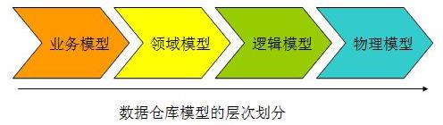

- 业务建模：生成业务模型，主要解决业务层面的分解和程序化
- 领域建模：生成领域模型，主要对业务模型进行抽象处理，生成领域概念模型
- 逻辑建模：生成逻辑模型，主要是将领域模型的概念实体以及实体之间的关系进行数据库层次的逻辑化
- 物理建模：生成物理模型，主要解决逻辑模型针对不同关系型数据库的物理化以及性能等一些具体的技术问题

### 为什么需要数据模型？

`重要性；能解决的问题`

> - **进行全面的业务梳理，改进业务流程**：在业务模型建设的阶段，能够帮助我们的企业或者是管理机关对本单位的业务进行全面的梳理。通过业务模型的建设，我们应该能够全面了解该单位的业务架构图和整个业务的运行情况，能够将业务按照特定的规律进行分门别类和程序化，同时，帮助我们进一步的改进业务的流程，提高业务效率，指导我们的业务部门的生产。
> - **建设全方位的数据视角，消灭信息孤岛和数据差异（数据同步）**：通过数据仓库的模型建设，能够为企业提供一个整体的数据视角，不再是各个部门只是关注自己的数据，而且通过模型的建设，勾勒出了部门之间内在的联系，帮助消灭各个部门之间的信息孤岛的问题，更为重要的是，通过数据模型的建设，能够保证整个企业的数据的一致性，各个部门之间数据的差异将会得到有效解决
> - **解决业务的变动和数据仓库的灵活性**：通过数据模型的建设，能够很好的分离出底层技术的实现和上层业务的展现。当上层业务发生变化时，通过数据模型，底层的技术实现可以非常轻松的完成业务的变动，从而达到整个数据仓库系统的灵活性
> - **帮助数据仓库系统本身的建设**：通过数据仓库的模型建设，开发人员和业务人员能够很容易的达成系统建设范围的界定，以及长期目标的规划，从而能够使整个项目组明确当前的任务，加快整个系统建设的速度

### 如何建设数据模型

首先来了解一下整个数据仓库的数据模型应该包含的几个部分。从下图我们可以很清楚地看到，整个数据模型的架构分成 5 大部分
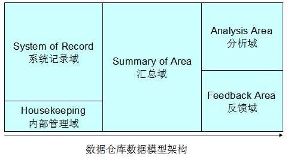

整个数据仓库的数据模型可以分为大概 5 大部分：

- 系统记录域（System of Record）：主要的数据仓库业务数据存储区，数据模型在这里**保证了数据的一致性**。
- 内部管理域（Housekeeping）：主要存储数据仓库用于内部管理的元数据，数据模型在这里能够帮助进行**统一的元数据的管理**。
- 汇总域（Summary of Area）：数据来自于系统记录域的汇总，数据模型在这里保证了分析域的主题分析的性能，**满足了部分的报表查询**。
- 分析域（Analysis Area）：数据模型主要用于各个业务部分的具体的主题业务分析。这部分数据模型可以单独存储在相应的数据集市中。
- 反馈域（Feedback Area）：可选项，这部分数据模型主要用于相应前端的反馈数据，数据仓库可以视业务的需要设置这一区域。

****

****

# 第二章：数据仓库架构基础

## 基本架构

****

1. 数仓架构定义：==数据仓库架构理解成**构成数据仓库的组件及其之间的关系**==
2. 下图为**数仓架构图**，下面详细说明**图中各组件及其所起作用**
   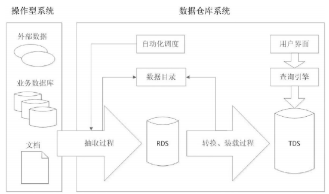
   - 操作型系统
     - 数据组成：数据由各种形式的业务数据组成，这其中可能有关系数据库、TXT 或CSV 文件、HTML 或 XML 文档，还可能存在外部系统的数据，比如网络爬虫抓取来的互联网数据等，数据可能是结构化、半结构化、非结构化的。**这些数据经过抽取、转换和装载(ETL)过程进入数据仓库系统**
   - 数据仓库系统
     - ETL过程
       - 抽取过程：负责从操作型系统获取据。该过程一般**不做据聚合和汇总**，但是会**按照主题进行集成**，物理上是**将操作型系统的数据全量或增量复制到数据仓库系统的 RDS 中**
       - 转换、装载过程：将数据进行清洗、过滤、汇总、统一格式化等一系列转换操作，使数据转为适合查询的格式，然后装在进数据仓库系统的TDS中
     - RDS(raw data stores)：原始数据存储
       - 该组件存在原因：ETL过程中的bug或系统中的其他错误不可避免，保留原始数据**有利于追踪并修改这些错误**。
       - 能**满足数仓用户查询细节数据的需求**，细节数据的粒度和操作型系统的相同，用户可以查询RDS中的数据而不必影响业务系统的正常运行
       - 逻辑概念
     - TDS(transformed data stores)：转换后的数据存储
       - ==真正的数据仓库中的数据==，大量用户会在TDS数据集上处理日常的查询
       - 同RDS一样也为逻辑概念
     - 自动化调度组件：自动定期重复执行ETL过程
     - 数据目录：元数据存储
       - 提供数据仓库中数据的清单：存储的数据类型、数据集的构建区别、数据最后访问或更新时间等
       - 通过数据目录感知数据是如何被操作和转换的
     - 查询引擎组件：实际执行用户查询
     - 用户界面：最终用户所使用的程序接口，如GUI软件或浏览器

## 主要数据仓库架构

### 数据集市架构

****

数据集市是**按主题域组织的数据集合**，用于支持部门级数据决策

1. 独立数据集市：单一主题域，无需考虑企业级别的信息共享与集成
   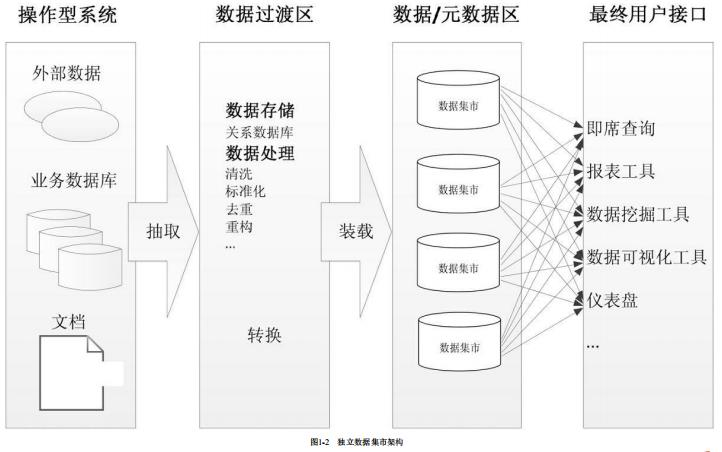
   - 特点：周期短、见效快，但无法满足跨部门或跨主题域分析
2. 从属数据集市
   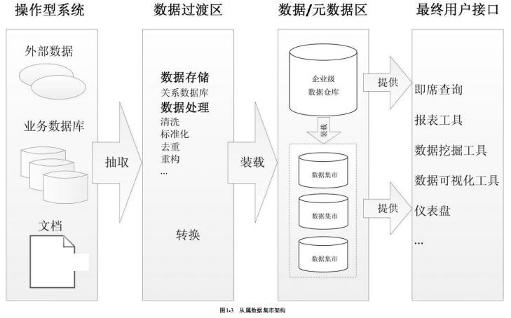
   - 数据来源于数据仓库，数仓中的数据经过整合、重构、汇总后传递给从属数据集市
   - 优点：性能（数仓查询性能出现问题时，可建立从属数据集市将数据转移到数据集市中）、安全（每个部门可控制自己的数据）、数据一致（因为数据都来自数据仓库，很好的消除了数据不一致的情况）

### Inmon架构

****

Inmon企业信息工厂架构图，组件及其功能
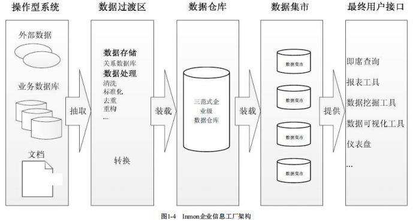

- **应用系统**：组织中的操作型系统，用来支撑业务。收集业务处理过程中产生的销售、市场、材料、物流等数据，并将数据以各种形式进行存储。操作型系统也叫源系统，为数据仓库提供数据。
- **ETL过程**：ETL过程从操作型系统抽取据，然后将数据转换成一种标准形式，最终将转换后的数据装载到企业级数据仓库中。ETL是周期性运行的批处理过程。
- **企业级数据仓库**：是该架构中的<u>核心组件</u>。正如Inmon数据仓库所定义的，企业级数据仓库是一个细节数据的集成资源库。其中的数据以最低粒度级别被捕获，<u>存储在满足三范式设计的关系数据库中</u>。
- **部门级数据集市**：是面向主题数据的部门级视图。数据从企业级数据仓库取。数据在进入部门数据集市时可能进行聚合。数据集市使用多维模型设计，用于数据分析。重要的一点是，所有的报表工具、BI工具或其他数据分析应用都从数据集市查询数据，而不是直接查询企业级数据仓库。

### Kimball数仓架构

****

Kimball数据仓库架构如图所示
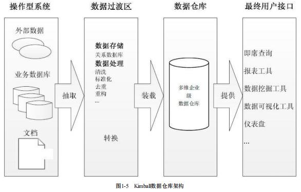

==Kimball与lnmon两种架构的主要区别在于核心数据仓库的设计和建立==。<u>Kimball的数据仓库包含高粒度的企业数据，使用多维模型设计，这也意味着数据仓库由星型模式的维度表和事实表构成。</u>分析系统或报表工具可以直接访问多维数据仓库里的数据。在此架构中的数据集市也与lnmon 中的不同。<u>这里的数据集市是一个逻辑概念，只是多维数据仓库中的主题域划分，并没有自己的物理存储，也可以说是虚拟的数据集市</u>。

### 混合型数据仓库架构

****

混合型书仓库架构图：
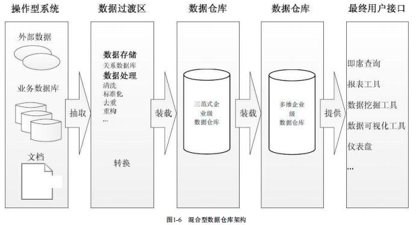

所谓的混合型结构，指的是在一个数据仓库环境中，联合使用Inmon和Kimball两种架构。从架构图可以看到，这种架构将Inmon方法中的数据集市部分替换成了一个多维数据仓库，而数据集市则是多维数据仓库上的逻辑视图。**使用这种架构的好处是，既可以利用规范化设计消除数据冗余，保证数据的粒度足够细;又可以利用多维结构更灵活地在企业级实现报表和分析。**

## 数据建模方法

### inmon模式（范式建模）

****

#### 概念

范式建模是从上而下建立数据模型，即从数据源到数仓再到数据集市逐层处理。此模式下的数据源往往是异构的。这里主要的数据处理工作集中在对异构数据的清洗，包括数据类型的检验，数据值范围检验以及其他复杂规则

#### 流程

inmon通常以数据源头为导向

1. 首先，探索性的去获取尽量符合预期的数据，尝试将数据按照预期划分为不同的表需求
2. 其次，明确数据清洗规则后将各任务通过ETL由stage层（数据过渡层）转化到DW层，将数据抽象为实体-关系模型
3. 接着，完成DW数据治理后，可以将数据输出到数据集市中做基本的数据组合
4. 最后，将数据集市中的数据输出到BI系统中去辅助具体业务

#### 特点

在这种场景下，数据无法从 stage 层直接输出到 dm 层，必须先通过 ETL 将数据的格式清洗后放入 dw 层，再从 dw 层选择需要的数据组合输出到 dm 层。在 Inmon 模式中，并不强调事实表和维度表的概念，因为数据源变化的可能性较大，需要更加强调数据的清洗工作，从中抽取实体-关系。

#### 层次划分

- 高层模型：ERD(实体关系图)，是实体关系的高度抽象，主要用于确定各实体（或主题）及其之间的关系
- 中间层：数据集成(DIS)，用于对主要数据分组，设置数据的链接，确定主键、属性和关系
- 底层模型：物理模型，用于设计关系表，在这一层上，确定数据的粒度、对数据进行分区、定义引用、创建索引等。

#### 示例

见文档

### Inmon模式（范式建模）VS   Kimball模式（维度建模）

****

1. 架构设计

   - Inmon 架构的思想在于**自上而下**的构建数据模型。以数据源头开始，数据以瀑布流式的向下流动，**更加注重数据清洗**。**其核心思想在于数仓分层**。（换言之就是，**尽量将某一主题域的所有数据都考虑到数据建模中**。这样设计的数据模型的**覆盖面会更广**，但是数据模型的设计会困难）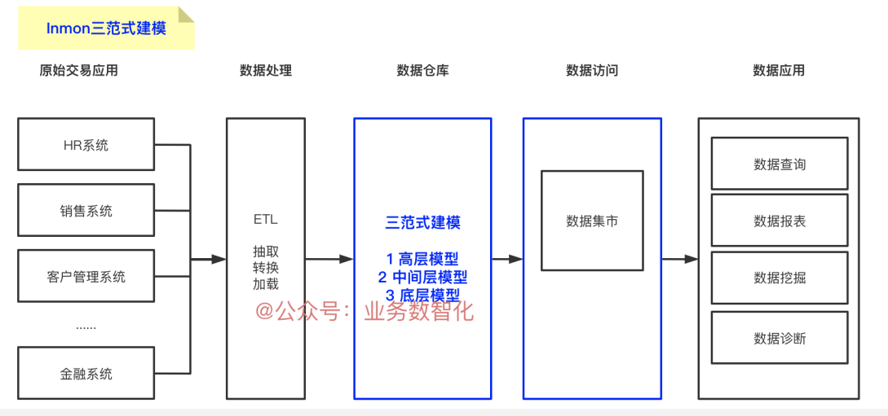
   - Kimball 架构的思想在于**自下而上**的构建数据模型。**以具体业务诉求为出发点**，设计数据模型，其**核心思想在于维度建模**。（即根据业务需求找到关注的数据指标，基于关注的数据指标设计数据模型，这样设计的数据模型会更加的独立，但可能会导致数据模型过多发展）
     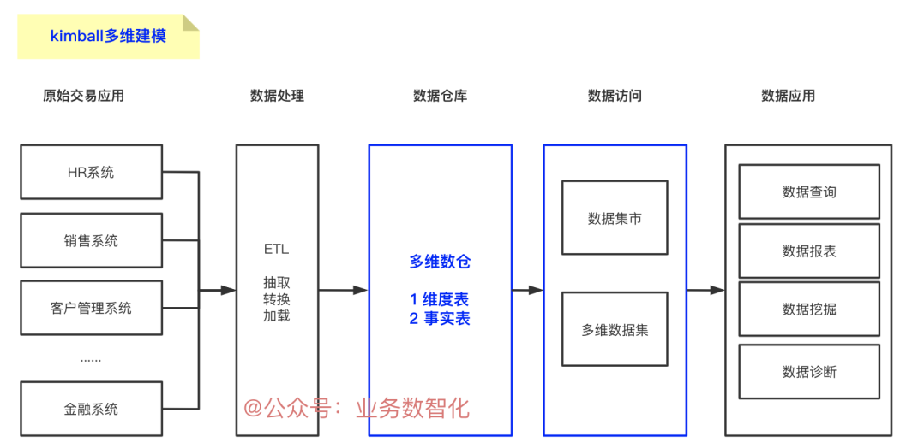

2. 实现特点

   - Inmon 的方式，规范性较好，数据集成和数据一致性方面得到处理，适用于较为大型的企业级、战略级的规划。但对团队的要求较高，且实现周期较长、成每种方法都有各自的特点，并且会适用于不同的环境中。具体选择哪种数据仓库设计方法取决于组织的业务目标、业务特性、时间、成本、不同组织单元之间的相互依赖级别。本高昂。具体可根据企业的规模、项目规划、预算、团队等角度进行综合考虑。
   - Kimball 方式对团队技术水平要求不太高，更易于实现，从小型的主题域数据集市建设起，但在逐步建设过程中，联合维度数据仓库的一致性较难控制，适用于战术层级的规划，或是有迫切的目标需要实现

   

## 企业数仓架构的演进之路

# 第三章：数据仓库设计基础

## 关系数据模型

### 1.关系数据模型的结构

### 2.关系数据模型的完整性

### 3.关系数据模型的规范化（重点）

规范化方法对表进行分解，消除冗余，避免异常更新，提高数据完整性

**什么是范式？**简言之就是，数据库设计对数据的存储性能，还有开发人员对数据的操作都有莫大的关系。所以建立科学的、规范的数据库是需要满足一些规范的来优化数据数据存储方式，在关系型数据库中这些规范就可以称为范式。

- 第一范式：表中的列只能含有原子性（不可再分）的值
- 第二范式：满足第一范式，没有部分依赖(将表中的字段分解成只有完全依赖的各个表格)
- 第三范式：满足第二范式，没有传递依赖（每个属性都跟主键有直接关系而不是间接关系。a-->b-->c属性是不符合第三范式的）

## 维度数据模型

**基础概念**

维度数据模型（Dimensiomal modeling,DM）是一套技术和概念的集合，用于数据仓库建设。维度模型是一种趋向于支持最终用户对数据仓库进行查询的设计技术，是围绕性能和易理解性构建的。

事实和维度是两个维度模型中的核心概念。

事实表示对业务数据的度量，而维度是观察数据的角度。事实通常是数字类型的，可以进行聚合和计算，而维度通常是一组层次关系或描述信息，用来定义事实。例如，销售金额是一个事实，38而销售时间、销售的产品、购买的顾客、商店等都是销售事实的维度。

维度模型按照业务流程领域即主题域建立，例如进货、销售、库存、配送等。

不同的主题域可能共享某些维度，为了提高数据操作的性能和数据一致性，需要使用一致性维度，例如几个主题域间共享维度的复制。术语“==一致性维度==”源自 Kimball，指的是具有相同属性和内容的维度

### 1.建模过程

- **选择业务过程**：组织完成的微观活动：如检索、竞价、展现、点击
- **声明粒度**：如何描述事实表中每个行的内容：如客户单次检索
- **确认维度**：业务人员如何描述来自业务过程度量事件的数据
- **确认事实**：过程的度量是什么？时间、IP、来源、受理者等

声明粒度，为业务最小活动单元或不同维度组合。

以共同粒度从多个组织业务过程合并度量的事实表称为合并事实表。需注意，来自多个业务过程的事实合并到事实表时必须要有同样等级的粒度

**示例**:电商场景为例说明各步骤

- 业务过程：下订单
- 粒度：每笔订单（拆分为单个物品）
- 维度：地域、年龄等可供分析的角度
- 事实/度量：订单金额等可用于分析的数据

### 2.维度规范化

对维度的规范化(又叫雪花化)，可以去除冗余属性，是对非规范化维度做的规范化处理。一个非规范化维度对应一个维度表，规范化后，一个维度会对应多个维度表，维度被严格地以子维度的形式连接在一起。实际上，在很多情况下，维度规范化后的结构等同于一个低范式级别的关系型结构

设计维度数据模型时，会因为如下原因而不对维度做规范化处理：

- 规范化会增加表的数量，使结构更复杂
- 不可避免的多表连接，使查询更复杂
- 查询性能原因

### 3.建模特点

- 易理解
- 高性能：倾向于非规范化，能提高查询性能
- 可扩展

### 4.星型模型（重点记忆）

**概念**

星型模型是由事实表和维度表组成，一个星型模型可以有一个或多个事实表，每个事实表引用任意数量的维度表。

星型模型将业务过程分为事实和维度。事实包含业务的度量，是定量的数据，如销售价格、销售数量等。维度是对事实数据属性的描述，如日期、产品、客户、地理位置等是维度

**事实表**

事实表<u>记录了特定事件的数字化的考量</u>，==一般由数字值和指向维度表的外键组成==。通常会把事实表的粒度级别设计得比较低，使得事实表可以记录很原始的操作型事件，但这样做的负面影响是累加大量记录可能会更耗时。

三种类型的事实表：

- 事务事实表：记录特定事件的事实。如销售
- 快照事实表：记录给定时间点的事实。如月底账户余额
- 累积快照事实表：记录给定时间点的聚合事实。如当月总的销售金额

**维表**

维表的记录数通常比事实表少，但每条记录包含有大量用于描述事实数据的属性字段。维度表可以定义各种各样的特性。

常见的维度表有：时间维表、地理维表、人员维表等

**优点**

星型模型为非规范化的，在设计开发过程中不受范式规则的约束

- 简化查询
- 简化报表逻辑
- 该模式下简答查询能提高聚合操作的性能
- 可提升只读报表类应用的性能

**缺点**

- 不能保证数据的完整性
- 对于分析需求来说不够灵活

### 5.雪花模型（重点记忆）

**概念**

与星型模式相同，雪花模式也是**由事实表和维度表所组成**。所谓的“雪花化”就是**将星型模式中的维度表进行规范化处理**。==当所有的维度表完成规范化后，就形成了以事实表为中心的雪花型结构，即雪花模式。==

最大特点：减少数据冗余

**维表规范化的具体做法：把低基数的属性从维度表中移除形成单独的表**

基数指的是一个字段中不同值的个数，如主键列具有唯一值，所以有最高的基数，而像性别这样的列基数就很低。

在雪花模式中，一个维度被规范化成多个关联的表，而在星型模式中，每个维度由一个单一的维度表所表示。一个规范化的维度对应一组具有层次关系的维度表，而事实表作为雪花模式里的子表，存在具有层次关系的多个父表。

**优点**

实际上，星型模式是雪花模式的一个特例(维度没有多个层级)。某些条件下，雪花模式更具优势:

-  一些 OLAP 多维数据库建模工具专为雪花模型进行了优化
- 规范化的维度属性节省存储空间

**缺点**

- 维度属性规范化增加了查询的连接操作和复杂度
- 不能确保数据的完整性

> 星型模型因为数据的冗余所以很多统计查询不需要做外部的连接，因此一般情况下效率比雪花型模型要高

### 6.星座模型

**维表是共享状态的，可以被多个事实表关联使用**，这种模式可以看做星型模式的汇集，因而称作星系模式或者事实星座模式。

## Data Vault模型（了解）

# 第四章：Kimball维度建模

## 维度建模生命周期

Kimball生命周期：关注业务需求，为用户展现维度结构数据，过程可管理，迭代开发项目。

Kimball生命周期架构：
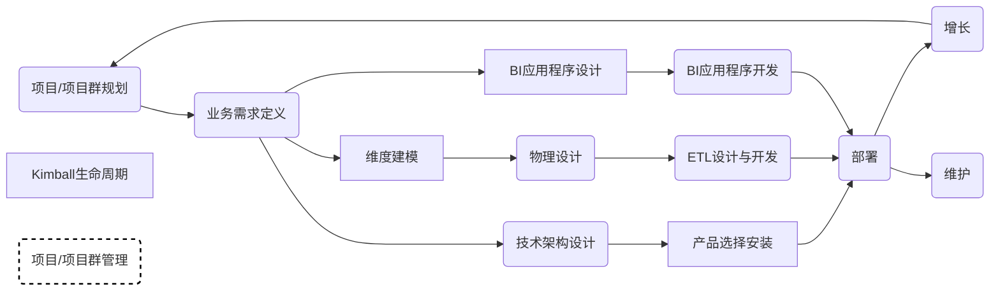
## 事实表设计

### 事实的类型

- 可加事实：该度量可按照和事实表相关联的任意维度进行汇总
- 半可加事实：该度量在某些维度下不可加，或者是汇总起来无意义
- 不可加事实：该度量在与事实表相关联的任意维度都不可进行汇总

### 总线架构、一致性维度、一致性事实

**总线架构**

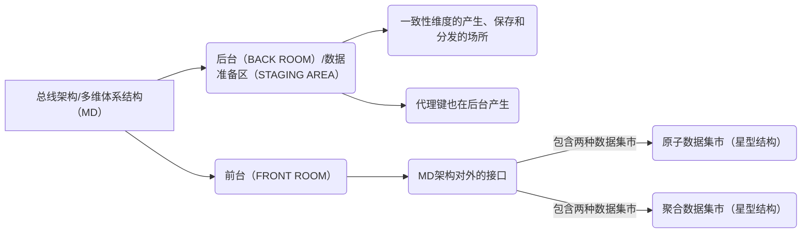

**一致性维度**

能解决的问题：在多维体系结构中，没有物理上的数据仓库，由物理上的数据集市组合成逻60辑上的数据仓库。而且数据集市的建立是可以逐步完成的，最终组合在一起，成为一个数据仓库。如果分步建立数据集市的过程出现了问题，数据集市就会变成孤立的集市，不能组合成数据仓库

在后台产生、建立并同步复制到各个数据集市，不同数据集市维度保持一致的要点。

一致性维度的内容和普通维度并没有本质上区别，都是经过数据清洗和整合后的结果。

在同一集市内，一致性维度是指两个维度如果有关系，要么是完全一样的，要么就是一个维度在数学意义上是另一个维度的子集

**一致性事实**

在建立多个数据集市时，完成一致性维度的工作就已经完成了一致性的 80%－90%的工作量。余下的工作就是建立一致性事实。

一致性事实和一致性维度有些不同，一致性维度是由专人维护在后台（Back Room），发生修改时同步复制到每个数据集市，而事实表一般不会在多个数据集市间复制。

需要查询多个数据集市中的事实时，一般通过交叉探查（drill across）来实现。 为了能在多个数据集市间进行交叉探查，一致性事实主要需要保证两点：第一个是 KPI 的定义及计算方法要一致，第二个是事实的单位要一致性。如果业务要求或事实上就不能保持一致的话，建议不同单位的事实分开建立字段保存。

这样，`一致性维度将多个数据集市结合在一起，一致性事实保证不同数据集市间的事实数据可以交叉探查，一个分布式的数据仓库就建成了`。

### 事务事实表

### 周期事实表

### 累计快照事实表

### 三种事实表的区别（重点）

|            | 事务事实表             | 周期快照事实表                   | 累积快照事实表                       |
| ---------- | ---------------------- | -------------------------------- | ------------------------------------ |
| 时期/时间  | 离散事务时间点         | 以有规律的、可预测的间隔产生快照 | 用于时间跨度不确定的不断变化的工作流 |
| 日期维度   | 事务日期               | 快照日期                         | 相关业务涉及的多个日期               |
| 粒度       | 每行代表实体的一个事务 | 每行代表某时间周期的一个实体     | 每行代表一个实体的生命周期           |
| 事实       | 事务事实               | 累积事实                         | 相关业务过程事实和时间间隔事实       |
| 事实表加载 | 插入                   | 插入                             | 插入与更新                           |
| 事实表更新 | 不更新                 | 不更新                           | 业务过程变更时更新                   |

## 维度表设计

**概念**

在维度建模中，把度量成为事实，将环境称为维度。

维度属性指的就是维度的列。一般是我们在数据分析时用到的过滤条件、分组、排序等，所以维度属性越丰富，可以观察的角度就越多。

**设计方法**

维度的设计过程，就是维度属性的确定过程。

- 选择维度或者新建维度
- 确定维度主来源表
- 确定相关维表
- 确定维度属性

**维度的层级结构**

维度是有层次的，也是反范式的

数据钻取。数据钻取分为上钻（维度减少）和下钻（维度增多）。简单来说就是想点开年份看详细的月份或者天数据，就叫下钻；如果由每天的维度变为看季度、年维度，那就是上钻。

**一致性维度和交叉探查**

交叉探查：将不同数据域（不同业务模块的数据）的事实数据，根据同一个维度做合并的情况就叫交叉探查

**一致性维度**：Kimball 的数据仓库总线架构提供了种分解企业级数据仓库规划

任务的合理方法，通过构建企业范围内一致性维度和事实来构建总线架构。意思

是`维度建模要求必须有一致性维度`。换句话说维度是统一设计的，每个维度表都

是唯一不重复的，要做到全局通用。否则会导致数据查询的时候不一致甚至错误。

如何保证有一致性维度呢？

- 共享维度
- 一致性上钻
- 交叉属性

## 维度设计高级主题

### 维度整合

### 维度拆分

## 处理缓慢变化维度属性（重点掌握)

- 原样保留或重写
- 增加新行
- 增加新属性
- 快照存储
- 历史拉链存储

# 第七章：基于OneData的数据仓库方法论

## 概念

如何建设高效的数据模型和体系，对这些数据进行有序和有结构地分类组织和存储，避免重复建设和数据不一致性，保证数据的规范性，一直是大数据系统建设不断追求的方向。

OneData 即是阿里巴巴内部进行数据整合及管理的方法体系和工具。

## 指导思想

借助该统一化的数据整合和管理方法，构架了阿里巴巴的数据公共层。

此公共层的设计理念遵循**维度建模**思想。`数据模型的维度设计主要以维度建模理论为基础，基于维度数据模型总结架构，构建一致性维度和事实`。

其核心的指导实施方针：

- 首先，要进行充分的业务调研和需求分析
- 其次，进行数据总体架构设计，主要是根据数据域对数据进行划分；按照维度建模理论，构建总线矩阵，抽象出业务过程和维度
- 再次，对报表需求进行抽象整理出相关指标体系，使用OneData工具完成指标规范定义和模型设计
- 最后，是代码研发和运维

## 业务调研

## 架构设计

### 数据域的划分

`数据域是指面向业务分析，将业务过程或者维度进行抽象的集合，一般数据域和应用系统（功能模块）有联系可以考虑将同一个功能模块系统的业务过程划分到一个数据域`

`业务过程可以概括为一个个不可拆分的行为事件`

`在划分数据域时，既能涵盖当前所有的业务需求，又能在新业务进入时无影响地被包含进已有的数据域中或者扩展新的数据域`

### 构建总线矩阵

进行充分的业务调研和需求调研后，就要构建总线矩阵，要做两件事：

- 明确每个数据域下都有哪些业务过程
- 业务过程都与哪些维度相关，并通过总线矩阵定义每个数据域下的业务过程和维度
- 

### 规范定义

### 模型设计

### 架构总结

## 指标体系搭建

### 指标体系的核心结构

### 指标体系的数据规范

# 第八章：企业级数据架构设计原则与规范

##  主题域划分原则

### 按照业务或业务过程划分

业务是指的功能模块/业务线。

业务过程：指企业的业务活动实践，如下单、支付、退款都是业务过程。一个业务过程是一个不可拆分的行为事件，通俗的讲，业务过程就是企业活动中的事件。

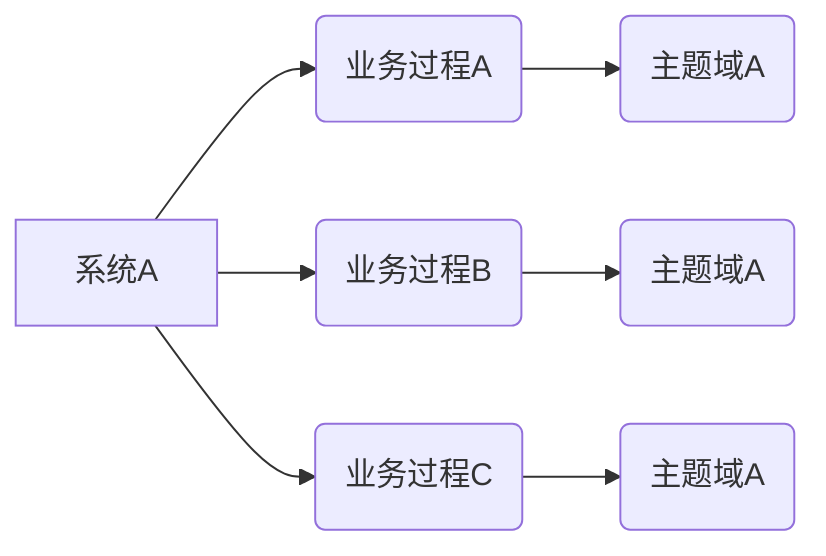

### 按照数据域划分

数据域是指面向业务分析，将业务过程或者维度进行抽象的集合。其中，业

务过程可以概括为一个个不可拆分的行为事件，在业务过程下，可以定义指标，

维度是指度量的环境，如买家下单事件，买家是维度。为保障整个体系的生命力，

数据域是需要抽象提炼，并且长期维护和数据的，但不轻易变动。在划分数据域域

时，既能涵盖当前所有的业务需求，又能在新业务进入时无影响地被包含进已有

的数据域中和扩展新的数据域。举个例子：

| 数据域     | 业务过程                     |
| ---------- | ---------------------------- |
| 会员店铺域 | 注册、登录、装修、开店、关店 |
| 商品域     |                              |
| 日志域     |                              |
| 交易域     |                              |
| 服务域     |                              |
| 采购域     |                              |

## 数据模型设计原则

- 高内聚、低耦合
- 核心模型和扩展模型要分离
- 公共处理

****

****

# 面试要点

## 第一章：基础概念

1. 数据仓库的四个特点-必须掌握
2. 数据仓库和数据库的区别
3. 数据模型的概念-弄清楚即可
4. 数据仓库设计的目的（为什么要有数据仓库）

## 第二章：数据仓库基础架构

1. 常见的数据仓库架构有哪些？设计思路是什么样的？
2. Inmon、Kimball两种数仓架构的特点
3. 讲一下你们公司当前数据建设的情况、所处的阶段、存在什么样的问题

## 第三张：数据仓库设计基础

1. 介绍几种数据模型以及其特点
2. 请介绍一下第一、二、三范式。
3. 列举一下你使用过的逆范式化设计，并说明这样做的目的？(逆 1nf-hive 里面的 map 结构；逆 2nf-log 日志表，做 PV、UV；逆 3nf-宽表设计)
4. 请说明一下维度建模的过程。
5. 请举例说明一下星型模型、雪花模型、星座模型，并说明它们各自的优缺点。

## 第四章：Kimball维度建模

1. 请说明一下你了解哪几种事实表？说说它们各自的特点和应用场景。

2. 维度设计过程中有什么经验分享一下？

3. 如何处理缓慢变化维度？

## 第五章：数据仓库的实施步骤

1. 请描述一下数仓建模的基本流程。

2. 在数据处理的各个阶段，你使用过哪些工具。

3. 数据质量包括哪些方面？

****

****

# 名词解释

## 粒度

：数据的细节程度或汇总程度，细节程度越高，粒度级别越低

例如，销售库里的销售额, 可以是一天一个值, 也可以是一个月一个值, 4甚至一年一个值, 这就是**相对于时间维度表的粒度**。

粒度也不是越细越好, 也要综合分析

## 数据中台

：数据中台就是一套方法论，是指通过数据技术，对海量数据进行采集、计算、存储、加工，同时统一标准和口径。数据中台把数据统一之后，会形成标准数据，再进行存储，形成数据大数据资产层，进而为客户提供高效服务。这些服务跟企业的业务有较强的关联性，是这个企业独有的且能复用的，它是企业业务和数据的沉淀，其不仅能降低重复建设、减少烟囱式协作的成本，也是差异化竞争优势在

   数据中台的愿景是打造数据驱动的智能企业。

数据中台的核心，是避免数据的重复计算，通过数据服务化，提高数据的共享能力，赋能数据应用。

 数据中台的方法论核心是OneData，OneService。

OneData 体系的目标是构建统一的数据规范标准，让数据成为一种资产，而不是成本。资产和成本的差别在于资产是可以沉淀的，是可以被复用的。成本是消耗性质的、是临时的、无法被复用的。

OneService，数据即服务，强调数据中台中的数据应该是通过 API 接口的方式被访问。

API 接口一方面对应用开发屏蔽了底层数据存储，使用统一标准的 API 接口查询数据，提高了数据接入的速度。另一方面，对于数据开发，提高了数据应用的管理效率，建立了表到应用的链路关系。

总的来说，数据中台吸收了传统数据仓库、数据湖、大数据平台的优势，同时又解决了数据共享的难题，通过数据实现数据价值的落地。

**数据仓库和数据中台有什么区别呢？**

在这里稍微做个描述：数据仓库的主要场景是支持管理决策和业务分析，而数据中台则是将数据服务化之后提供给业务系统，目标是将数据能力渗透到各个业务环节，不限于决策分析类场景。数据中台包含数据仓库的完整内容，它将已建好的数据仓库当成数据源，对接已有数据建设成果，当然也可以基于数据中台提供的能力，通过汇聚、加工、治理各类数据源，构建全新的离线或实时数据仓库

维度是度量的环境，如用户导航事件，用户是维度。？？？？

我的理解：度量是指此次导航事件，环境是指此次导航事件是用户产生的导航事件，此处的环境是用户。

如果上述理解正确：导航事件能作为度量吗，度量一般不都是数值类型的吗，导航事件作为度量该怎么理解

若度量是具体的数值，而维度可以理解为该具体数值列的字段名称

