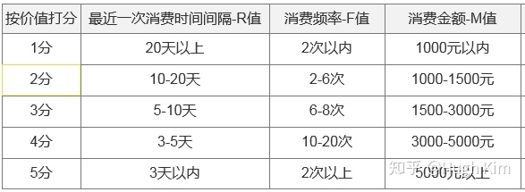

# 章节导学

## 前三章：业务通识架构

1.指标

`站在产品运营和数据开发的角度看待业务`

重点记忆：电商数据指标

为什么要做这个业务。

2.产品设计策略

`站在产品经理的角度看业务`

简单了解 ：：人-货-场，用户画像，类目

重点记忆：订单流转

3.电商业务系统

整章节都要重点理解记忆

业务架构可以重点掌握

重点把握业务的架构、业务的流程、业务系统

## 四到九章：项目开发阶段

4.宏观角度介绍数仓项目架构   ：：：先把本章的那内容吸收好

各主题域建设的背景、架构、建设、成果都要很好的理解记忆

5.按照简历的写法，结合项目经验进行总结和提取得到的

以分层架构为基础才能进行基本的数据建设

**数据建设部分需要动手操作实践**

建设成果以量化的指标进行讲解，可以写到自己的自己的简历上

按照项目的形式进行讲解的，可以在进一步完善的基础上充当主题域建设的项目，数仓建设案例

6.和5类似

好好学习，，，维度建模的相关知识融入学习

7.主题域建设基本都是分层讲解

8.交易主题域--------更通用的主题域建设

最重要的，

表字段更很多，代码更加复杂，尽可能多自己动手

9.融合企业数据的应用场景


项目不同点：

配置，表开发，未成体积的

优势：先介绍结构，再介绍各层。基础技术知识和项目开发结合起来。具备整体的架构思维。


## 第十章：节点部署

大数据开发平台

操作一下：：：每家公司不同：：：配置只需要照葫芦画瓢。

****

****

# 第一章：业务指标体系

## 运营指标

`从运营的角度看业务`

### 用户获取

1. 渠道到达量
   - 又称曝光量，产品推广页中有多少用户浏览
   - 广告点击率称为CTR，广告点击量/广告浏览量

2. 渠道转化率
   - CPC:（按点击付费）(cost per click)根据广告被点击的次数收费
   - CPM:（按展示付费）(cost per mile)每千人成本，按多少人看到广告计费
   - CPT:（按时长付费）(cost per time)是一种以时间来计费的广告
   - CPS:（按销售付费）(cost per sales)以实际销售产品数量计费
   - CPA:（按行为付费）(cost per action)指每行动成本，按用户行为计价，行为能是下载、能是购买订单

3. 渠道ROI
   - Return On Investment

4. 日应用下载量
5. 日新增用户数
   - 新增用户数是用户获取的核心指标
   - 分类：自然增长、推广增长

6. 用户获客成本
7. 一次会话用户数
   - 一次会话用户，指新用户下载完 App，仅打开过产品一次，且该次使用时长在 2 分钟以内


### 用户活跃度（重点理解）

`活跃数和活跃率是产品市场大小和健康程度`

1. 日活跃用户、月活跃用户
2. PV、UV
3. 用户会话次数
   - aka “session”，**用户在时间窗口内的所有行为的集合**
   - 网页端的时间窗口一般为30分钟，无硬性标准。
4. 用户访问时长
   - 一次会话持续的时间

5. 功能使用率
   - 例如：文章的点赞率和评论率
   - 例如：视频网站的核心功能使用率是视频播放量和视频播放时长


### 用户留存（重点掌握）

`用户留存是产品能够可持续发展`

1. 留存率
2. 用户流失率
3. 退出率

### 营销

### 传播/活动

### 营收


## 电商数据指标（重点掌握）

`从数据开发的角度看业务`/`有思维导图`

### 用户

### 流量

### 搜索

### 商品

### 订单

### 营销

****


# 第二章：电商产品设计策略

`从产品经理的角度看业务`

## 电商中的人、货、场

**在互联网中的新型“人、货、场”应该是找到全网最精准的用户，为这些用户定制个性化的服务和商品，最后通过合理的营销手段触达这些用户**

## 电商领域——人

## 电商领域——货 

## 电商领域——场


# 第三章：电商业务系统介绍（重点掌握）

`站在产品经理的角度 `；

`电商全流程中的每个流程节点都是一个独立的、庞大的系统，本文只是介绍各个系统之间的流转关系和基本职责`

## 基本业务架构

- 电商本质上都是买卖双方围绕商品交易履约的过程
- 本章以**自营电商为探讨方向**
- 自营电商能力=平台电商能力+采购、仓储、履约等实体环节

### 业务架构


上图是一个完整自营电商的业务过程，包含一件商品交付给消费者所需经历的所有环节。

能从供应商，电商平台、消费者三个角色阐述，也可分为线下实体环节和线上系统环节。

按线下实体环节进一步抽象后，将自营电商划分为4部分：

- 从供应商采购产品
- 采购产品入仓存储管理
- 商品上架到电商平台销售
- 根据销售订单进行履约配送

业务流程图：


### 系统流程

熟悉业务流程后，再梳理业务环节的所需的系统。**整个系统按采销仓配的业务边界进行划分，再结合C端购买流程==完整的大型电商系统流程图**


以下四个流程都是对流程图中的 部分节点进行解释：

#### 入驻&采购流程

- 入驻：
- 开店：
- 供应商入驻
- 供应商发货
- 库存

#### 销售流程

- 发布商品
- 定价
- 上架
- 促销
- 活动页搭建

#### 黄金流程

`用户视角下购买商品时所经历的页面，包括搜索——列表——商品详情页——购物车——提单页`；`很多公司内部也叫交易主流程或交易动线`

> 黄金流程是价格和促刺奥德主要体现环节，因此在黄金流程中，对价格和促销的设计尤为重要，包括优惠价格的高亮突出，促销标识的设计，购物车的凑单分组等，对转化有直接影响

- 生成订单
- 预占库存
- 收银台
- 支付对账

#### 订单寻源履约中心

`订单寻源系统的具体职责：将电商系统生成的数以万计的订单，按时下发给最合适的库房进行生产`

- 订单拆分
- 订单转移
- 针对虚拟订单
- 针对厂商直发订单和POP订单
- 针对自营订单
- 履约控制
- 订单下传


## 业务系统核心功能


- **用户端系统**：负责用户选购商品的需求，核心系统包括注册/登录、黄金流程和个人中心等；用户端系统属于前台系统，在产品设计上更注重用户体验、数据分析等。
-  **运营系统**：承载了内部运营的能力，核心系统包括用户管理、商品管理、价格管理以及营销管理等。
- **交易履约系统**：交易履约系统是一个中枢系统，向上承载订单交易，向下控制生产履约，核心系统有订单中心和寻源履约中心，属于电商系统中比较黑盒的部分，界面较少，更多的是底层逻辑。
- **供应链与生产系统**：供应链系统即进销存系统，在很多企业中统称ERP，主要负责商品的采购、库存的管理等、仓储管理（WMS）以及运输管理（TMS）。
- **基础平台**：基础平台是业务系统之外的系统，主要包括员工账号管理、主数据、财务系统、商家管理系统、以及服务市场和开放平台等。
- **BI系统**：平行于电商的其他系统，采集各个系统产生的数据，加工处理后反哺其他系统，提供各类数据分析能力。

将电商系统和大型超市做类比：

- 用户端系统即超市本身、首页是超市入口、搜索是导购牌、列表是货架、购物车仍是购物车、提单是出口收银台，负责承载消费者的选购下单需求
- 运营系统是超市营销导购人员，负责引导消费者购物，负责定制商品价格、发布促销活动，CMS系统是超市的DM单、易拉宝。运营系统向上支撑各渠道、各终端的销售需求，向下对接订单系统和交易履约系统
- 交易履约系统是超市调度员，对消费者的订单负责，当超市缺货时，及时从附近仓库调货，或想工厂订货，保证消费者的订单能及时履约
- 供应链与生产系统是超市的幕后工作者，包括采购员、库管、配送员等

### 登录模块与账号体系

账号体系是维系用户与平台之间的枢纽，用户提供价值、平台提供服务。

账号体系的存在价值：

- 提供系统的持续迭代能力，为后期产品扩张铺垫
- 加强账户相关功能模块可行性，保证系统的稳定性
- 账户融合能力提升，产品生态布局一站式账户通行证

账号体系的分类：

- **自定义账号**：“账号+密码”，缺点是增加用户记忆负担，将会被替代
- **邮箱账号**：“邮箱号+密码”，解决记忆负担问题，缺点用户认证冗长，淡出视野
- **手机账号体系**：安全性高，利于平台精细化运营，登录注册流程合为一体。缺点：验证码短信收费，换手机号的情况
- **第三方账号体系**：第三方登录，授权方便，缺点平台无法形成自身的账号体系，依托于第三方有一定风险（第三方倒闭等），可引导手机号绑定弥补

### 商品系统与商品中心

商品系统是负责管路与商品有关的数据和能力的系统，概括为：

- 负责创建和管理商品的系统
- 负责创建和管理分类、品牌、属性以及其他所有商品相关的数据的系统
- 负责对前台展示以及相关上下游系统提供商品能力的系统

商品系统是其他系统的依赖：

- 从商品采购到库存管理，

- 从商品自身的创建、上下架管理到商品定价以及前台展示，

- 从促销活动到下单支付，

- 从订单生产到履约配送，

  电商中的每个流程都与商品相关。所有上下游系统之间，商品数据必须是统一的、通用的、标准化的品系统在很大程度上必须具备中心化服务的能力，因此商品系统也是所有系统中最优先需要设计成**中心化服务**的系统。


如图商品中心的核心模块可抽象成4个：

- 商品分类：用于创建分类、管理分类，为商品以及其他系统提供分类能力
- 商品品牌：用于创建品牌、管理品牌，为商品以及其他系统提供品牌能力
- 商品属性：用于创建属性、管理属性，为商品以及其他系统提供属性能力
- 商品：       用于创建商品、管理商品，为其他系统提供商品能力

分类、品牌和属性作为商品的基础组成部分，三者共同组成了商品

商品中心**最基本的职能**是向上支撑前台各个环节的商品查询、展示功能，同时向下为价格中心、营销中心、订单中心、履约中心、采购系统、库存中心、仓储以及运输等下游系统提供商品能力和服务，保证电商体系下所有系统对于商品数据的输入和输出的统一。

### 商品价值与商家后台

商家对平台价值主要体现在：

- 贡献平台的GMV
- 贡献平台的营收
- 贡献平台活跃性：卖家也可能在平台充当买家的角色

商家后台：商家自然需要有一套独立的操作后台（系统）。商家后台涉及三个层面，且以**由底往上**的顺序流转进行，大体可以概括为此三层：**操作层，数据层，运营层**


### 交易系统核心功能

交易的本质是一个**信息流、物流和资金流的转换过程**，商家通过平台展示商品信息，用户获取商品信息后做出购买决策，用户付钱交换商家提供的商品和服务，商家通过物流或快递把货权转移给用户，如果用户对商家交付的商品或服务不满意可以根据平台运营规则进行退换货处理

具体的业务过程为：


为了让记录的信息成结构性，故把承载不同阶段的业务信息的对象会分为：

1. 订单——记录交易双方的主体信息、交易品信息、交易的关键节点信息以及订单本身特有的信息；

   - 订单的基本信息结构
     
   - 订单状态一般用于表达订单的声明周期，如图：
     
     - 待审核状态为可选节点
   - 开票信息指的是用户在下单是选择的开票类型以及提交的开票资料，普票和增值税、个人和企业其所需的开票资料不同。
   - 支付信息只记录支付时间以及支付流水号，该流水号是能够贯穿交易、支付以及第三方的一个表示
   - 订单结算信息结构
     
   - 收货人则指的是收货人的名称、手机号以及地址信息。物流信息明细一般都是通过第三方接口获取，再记录到系统中。
   - 交易品明细，需要注意，订单中记录的交易品明细一定是**下单那一刻确认的交易品信息**，包括交易品的基本信息、价格信息、数量等。这就要求我们在系统中需要有交易品版本的管理，能够准确的记录在某一个时间段内，任何一个交易品的准确信息。
     订单交易品明细的信息结构：
     在整个信息结构中最难的时如何获取优惠、折扣和抵扣，而在一般的系统设计的逻辑步骤如下（以优惠券优惠为例）：
     
   - 拆单
     - 拆单主要为了满足在财务结算以及物流发货上的相关需求，也能够让每个商家更好的完成履约
     - 在电商的交易、物流流程中有可能需要拆单的环节有：购物车、订单提交、发货/配送、发包裹
     - 前两个环节属于交易业务内，后两个环节属于物流配送环节，在此我们仅对前两个环节的拆单进行说明。
     - 交易模式拆单是因为其在订单确认时需要进行操作和展示的信息完全与普通交易不一样

2. 发货单——记录卖家对订单履约过程的信息；

   - 订单履约业务从商家进行发货操作开始，一直到用户签收并完成订单为止

   - 首先我们能够满足一个订单多次发货、多个订单合并发货这些场景

   - 其次在电商系统对接了物流系统后，我们需要能够做到发货单具备路由的功能，即系统能够根据客户的地址和仓库的地址、货物在仓库的库存情况以及仓库业务处理的能力等因素进行自动选择，以达到库存效益和用户体验之间的最大收益

     发货路由的整体流程

3. 退款单——记录退换货信息处理过程的完整的信息；

   - 退款业务分为三大类：仅退款、退货退款、换货
   - 在业务中订单支付后只要进入待发货（待审核，也可）状态以后，在**订单状态**为已完成之前，都能发生退款业务。具体场景如下：
     - 商家还未发货，用户购买的商品不是自己需要的，申请退款，可对已提交的订单中的部分商品进行退款，也可整单进行退款；
     - 商家已发货，但用户还未签收时用户进行退款申请，可对订单中的部分商品进行退款或整单进行退款；
     - 用户已经签收，但订单还未进入已完成状态时用户进行退款申请，可对订单中的部分商品或整单进行退款；

4. 资金流水——记录用户付款、商家收款、商家退款、用户收款以及与订单的关系的信息


### 营销系统核心功能

促销活动的目的

- 拉新
- 去库存
- 扩大品牌知名度
- 推新
- 与其他平台竞争
- 提高客单价与客单量


## 业务数据库

### 用户模块

1. 账号体系概念
   - 账号体系的字段
     
     - 用户唯一标识（UserID，简称UID）：用户唯一标识（UID）为系统配置，一般为数字组成，不对用户可见。用户在注册为系统的账号后，则自动生成，不可更改，与每个用户一一对应。
     - 开放账户（OpenID）：借助第三方网站url验证用户身份，当用户第三方授权登录成功，系统通过获取用户的open ID生成user ID,同时也读取用户在第三方网站的身份昵称以及头像，该昵称可作为首次的账号名。
2. 账号体系的核心流程
   - 注册流程
   - 登录流程
   - 找回密码流程
   - 风控流程
3. 账号体系的合并与打通
   - 账号体系的合并：在一个系统内，一个用户的多个账号合并成为同一个账号
     - 同类型指的是注册类型相同，如都是用手机号注册
     - 不同类型指的是注册类型不同，账号用手机号、邮箱等注册
       
   - 账号体系的打通：在不同的系统，账号数据的互通
     - 单向打通指的是一个系统有权使用另外一个系统的部分数据，这里的“有权使用”我们可以理解为“授权”
     - 双向打通指的是两个不同的系统，数据相通，多用于合作模式的系统，情况不多
       
4. 核心业务表:用户基础信息表
   ``` sql
   CREATE TABLE `user_userinfo` (  
     `userid` varchar(6) NOT NULL DEFAULT '-' COMMENT '用户ID',  
     `username` varchar(20) NOT NULL DEFAULT '-' COMMENT '用户名称',  
     `userpassword` varchar(100) NOT NULL DEFAULT '-' COMMENT '密码',  
     `sex` int(11) NOT NULL DEFAULT '0' COMMENT '性别',  
     `usermoney` int(11) NOT NULL DEFAULT '0' COMMENT '账号余额',  
     `frozenmoney` int(11) NOT NULL DEFAULT '0' COMMENT '近一个月的花费的总的金额',  
     `addressid` varchar(20) NOT NULL DEFAULT '-' COMMENT '用户地址ID，0表示没有获取地址',  
     `regtime` varchar(20) NOT NULL DEFAULT '-' COMMENT '注册时间',  
     `lastlogin` varchar(20) NOT NULL DEFAULT '-' COMMENT '最后登录时间',  
     `lasttime` date NOT NULL COMMENT '系统下载最后时间'  
   ) ENGINE=InnoDB DEFAULT CHARSET=utf8 COMMENT='用户表'; 
   ```


### 商品模块

1. 分类管理

   - 分类可以帮助消费者更方便快捷地找到想要的商品

   - 分类管理的核心设计思想是：**前后台分离，多对多映射**

     - 前后台分离

       - 后台分类主要**面向平台管理**，主要逻辑是结构化的管理逻辑。（如卫裤在后台分类为服装类）

       - 前台分类主要**面向用户端使用**，为运营提供运营空间，为用户购物提供便捷，主要逻辑是运营和用户体验。（如卫裤在前台分类，归为“冬季新品”，主要考虑运营效果以及用户是否更好的找到商品）

     - 多对多映射

       - 前台分类必须以后台分类为基础，创建前台分类时，必须要先选择后台分类

       - 前台分类和后台分类之间是多对多的映射关系，即一个前台分类可选多个后台分类，不同前台分类可选同一个后台分类

         

2. 品牌管理
   `主要分为两部分功能，即品牌的创建和品牌的管理`

   - 品牌创建
     - 平台侧主动创建：初期按照各个品类直接初始化到系统中去
     - 入驻到平台的第三方商家申请品牌

   - 品牌管理
     - 即品牌自身的查询、修改、停用等功能
     - 注意：品牌修改或停用时，也要校验品牌下没有关联的数据，否则不能操作修改或停用

3. 属性管理

   - 属性是什么？——属性指商品所特有的性质，如颜色属性、尺码属性、规格属性等。
   - 属性的作用？——属性也是将商品进行**分类和聚合**的必要且重要的方法，类目和品牌只能在一定程度上将海量的商品进行分类，比如用户在京东购买“家电”，可以通过类目（如：电视、空调）、品牌（如：格力）来查询想要的产品（如：小米电视），但是当用户想进一步快速定位到最准确的意向结果（如小米电视55寸4K版），类目和品牌就显得不够用了，因此如果想**实现更细颗粒度的划分**，只能通过属性的方式来实现。
   - 属性结构：属性组>属性>属性值
     
     - 属性组：将大量属性分类，便于管理，如手机的“外观属性”、“性能属性”等 ；
     - 属性：即属性名，指具体的属性，如颜色、版本、运行内存；
     - 属性值：指属性的具体值，如颜色属性的属性值有：红色、黄色、绿；

4. 商品管理

   - 商品管理模块主要负责创建商品、管理商品，为其他系统提供商品能力，是商品中心最核心的模块，同时商品管理也依赖分类、品牌、属性三个模块。以创建商品为例，创建商品时需要填写的字段中，最重要的就是选择分类、品牌、属性，可以说商品是建立在分类模块、品牌模块和属性模块之上的模块。
     
   - 两个概念
     - **SPU**(Standard Product Unit)——标准化产品单元。是商品信息聚合的最小单位，是一组可复用、易检索的标准化信息的集合，该集合描述了一个产品的特性。通俗点讲，属性值、特性相同的商品就可以称为一个SPU
     - **SKU**(stock keeping unit)——SKU即库存进出计量的单位，可以是以件、盒、托盘等为单位；SKU是一个可以售卖的商品。<u>通俗地讲，SPU定位一个产品，SKU定位为商品</u>。
     - 例如手机这个类目下，iPhone 13就是一个SPU，iPhone 13 256G 黑色就是一个SKU（京东的SKU还会加上公开版等属性）一般情况下，基础属性可以看成是spu的属性，如手机的屏幕尺寸、CPU型号、像素等基础属性；销售属性以及仓储物流属性存储在sku上，如颜色、版本等销售属性。

5. 商品创建流程

   - SKU信息表
     ``` sql
     CREATE TABLE `product_sku` (  
       `id` bigint(20) NOT NULL AUTO_INCREMENT COMMENT 'skuId',  
       `spu_id` bigint(20) DEFAULT NULL COMMENT 'spuId',  
       `name` varchar(255) DEFAULT NULL COMMENT 'sku名称',  
       `catagory_id` bigint(20) DEFAULT NULL COMMENT '所属分类id',  
       `brand_id` bigint(20) DEFAULT NULL COMMENT '品牌id',  
       `default_image` varchar(255) DEFAULT NULL COMMENT '默认图片',  
       `title` varchar(255) DEFAULT NULL COMMENT '标题',  
       `subtitle` varchar(2000) DEFAULT NULL COMMENT '副标题',  
       `price` decimal(18,4) DEFAULT NULL COMMENT '价格',  
       `weight` int(20) DEFAULT NULL COMMENT '重量（克）',  
       PRIMARY KEY (`id`)  
     ) ENGINE=InnoDB AUTO_INCREMENT=11 DEFAULT CHARSET=utf8 COMMENT='sku信息';  
     ```

   - SKU属性表
     ``` sql
     CREATE TABLE `product_sku_attr_value` (  
       `id` bigint(20) NOT NULL AUTO_INCREMENT COMMENT 'id',  
       `sku_id` bigint(20) DEFAULT NULL COMMENT 'sku_id',  
       `attr_id` bigint(20) DEFAULT NULL COMMENT 'attr_id',  
       `attr_name` varchar(200) DEFAULT NULL COMMENT '销售属性名',  
       `attr_value` varchar(200) DEFAULT NULL COMMENT '销售属性值',  
       `sort` int(11) DEFAULT NULL COMMENT '顺序',  
       PRIMARY KEY (`id`)  
     ) ENGINE=InnoDB AUTO_INCREMENT=31 DEFAULT CHARSET=utf8 COMMENT='sku销售属性&值';
     ```

   - SPU信息表
     ``` sql
     CREATE TABLE `product_spu` (  
       `id` bigint(20) NOT NULL AUTO_INCREMENT COMMENT '商品id',  
       `name` varchar(200) DEFAULT NULL COMMENT '商品名称',  
       `category_id` bigint(20) DEFAULT NULL COMMENT '所属分类id',  
       `brand_id` bigint(20) DEFAULT NULL COMMENT '品牌id',  
       `publish_status` tinyint(4) DEFAULT NULL COMMENT '上架状态[0 - 下架，1 - 上架]',  
       `create_time` datetime DEFAULT NULL COMMENT '创建时间',  
       `update_time` datetime DEFAULT NULL COMMENT '更新时间',  
       PRIMARY KEY (`id`)  
     ) ENGINE=InnoDB AUTO_INCREMENT=12 DEFAULT CHARSET=utf8 COMMENT='spu信息'; 
     ```

   - SPU属性表
     ``` sql
     CREATE TABLE `product_spu_attr_value` (  
       `id` bigint(20) NOT NULL AUTO_INCREMENT COMMENT 'id',  
       `spu_id` bigint(20) DEFAULT NULL COMMENT '商品id',  
       `attr_id` bigint(20) DEFAULT NULL COMMENT '属性id',  
       `attr_name` varchar(200) DEFAULT NULL COMMENT '属性名',  
       `attr_value` varchar(200) DEFAULT NULL COMMENT '属性值',  
       `sort` int(11) DEFAULT NULL COMMENT '顺序',  
       PRIMARY KEY (`id`)  
     ) ENGINE=InnoDB AUTO_INCREMENT=37 DEFAULT CHARSET=utf8 COMMENT='spu属性值';
     ```

   - 商品类别表
     ```  sql
     CREATE TABLE `product_category` (  
       `id` bigint(20) NOT NULL AUTO_INCREMENT COMMENT '分类id',  
       `name` char(50) DEFAULT NULL COMMENT '分类名称',  
       `parent_id` bigint(20) DEFAULT NULL COMMENT '父分类id',  
       `status` tinyint(4) DEFAULT NULL COMMENT '是否显示[0-不显示，1显示]',  
       `sort` int(11) DEFAULT NULL COMMENT '排序',  
       `icon` char(255) DEFAULT NULL COMMENT '图标地址',  
       `unit` char(50) DEFAULT NULL COMMENT '计量单位',  
       PRIMARY KEY (`id`)  
     ) ENGINE=InnoDB AUTO_INCREMENT=1433 DEFAULT CHARSET=utf8mb4 COMMENT='商品三级分类';  
     ```

   - 商品品牌表
     ``` sql
     CREATE TABLE `product_brand` (  
       `id` bigint(20) NOT NULL AUTO_INCREMENT COMMENT '品牌id',  
       `name` char(50) DEFAULT NULL COMMENT '品牌名',  
       `logo` varchar(2000) DEFAULT NULL COMMENT '品牌logo',  
       `status` tinyint(4) DEFAULT NULL COMMENT '显示状态[0-不显示；1-显示]',  
       `first_letter` char(1) DEFAULT NULL COMMENT '检索首字母',  
       `sort` int(11) DEFAULT NULL COMMENT '排序',  
       `remark` longtext COMMENT '备注',  
       PRIMARY KEY (`id`)  
     ) ENGINE=InnoDB AUTO_INCREMENT=4 DEFAULT CHARSET=utf8 COMMENT='品牌';  
     ```

     

### 商家模块

1. 商家入驻流程
   

2. 商家退店流程
   

3. 核心业务表

   - 店铺信息表
     ``` sql
     CREATE TABLE `shop_base_info` (  
       `shop_id` varchar(20) NOT NULL DEFAULT '-' COMMENT '店铺ID',  
       `shop_name` varchar(20) NOT NULL DEFAULT '-' COMMENT '店铺名称',  
       `shop_status` int(11) NOT NULL DEFAULT '0' COMMENT '营业状态(0在线营业1暂时歇业2停业)'  
     ) ENGINE=InnoDB DEFAULT CHARSET=utf8 COMMENT='店铺表';
     ```

     

### 交易模块

1. 交易业务流程
   三个流程：
   

2. 提交订单流程
   

3. 支付订单流程
   

4. 处理订单流程

   - 我们先来看看完整订单字段：

     1. **订单信息**
        - 订单编号
        - 订单类型：可以分为“自己购买/好友代付/任务活动”等。
          标记订单类型有两个目的：
          一是不同的订单类型在客户端和后台可能有不同的页面展示和操作流程，
          二是可以进行数据统计并分析；
          所以订单类型可以分得越细越好。
        - 订单备注：这个字段在后台订单详情里可以放在较显眼的位置，以防工作人员漏掉。

     2. **商品信息**
        - 商品编号：添加商品时的编号，方便查找商品（但在数据库里不是商品的唯一ID，因为商家数量够大时会产生重复的情况，但又不能做防止重复的限制）
        - 商品名称：商品名称是较大概率会产生重复的情况；从商家的角度来说，名称怎么取，与搜索引擎和推荐商品的匹配程度具有相当大的关联。
        - sku（商品的属性规格）
        - 购买数量
        - 商品来源

     

     3. **金额信息**：商品结算价、抵扣、邮费、实际支付金额、支付方式

     4. **用户信息**
        - 账户信息（昵称/账号）
        - 收货人信息（收货人姓名/电话/地区/详细地址）

     5. **时间信息**：下单时间、支付时间、发货时间、确认收货时间

     6. **操作信息**：操作账号、操作时间、操作内容

   - 

5. 退货退款流程
   

6. 核心业务表

   - 订单表
     ``` sql
     CREATE TABLE `trade_order` (  
       `id` bigint(20) NOT NULL AUTO_INCREMENT COMMENT 'id',  
       `user_id` bigint(20) DEFAULT NULL COMMENT 'member_id',  
       `order_sn` char(32) DEFAULT NULL COMMENT '订单号',  
       `coupon_id` bigint(20) DEFAULT NULL COMMENT '使用的优惠券',  
       `create_time` datetime DEFAULT NULL COMMENT '创建时间',  
       `username` varchar(200) DEFAULT NULL COMMENT '用户名',  
       `total_amount` decimal(18,4) DEFAULT NULL COMMENT '订单总额',  
       `pay_amount` decimal(18,4) DEFAULT NULL COMMENT '应付总额',  
       `freight_amount` decimal(18,4) DEFAULT NULL COMMENT '运费金额',  
       `promotion_amount` decimal(18,4) DEFAULT NULL COMMENT '促销优化金额（促销价、满减、阶梯价）',  
       `integration_amount` decimal(18,4) DEFAULT NULL COMMENT '积分抵扣金额',  
       `coupon_amount` decimal(18,4) DEFAULT NULL COMMENT '优惠券抵扣金额',  
       `discount_amount` decimal(18,4) DEFAULT NULL COMMENT '后台调整订单使用的折扣金额',  
       `pay_type` tinyint(4) DEFAULT NULL COMMENT '支付方式【1->支付宝；2->微信；3->银联； 4->货到付款；】',  
       `source_type` tinyint(4) DEFAULT NULL COMMENT '订单来源[0->PC订单；1->app订单]',  
       `status` tinyint(4) DEFAULT NULL COMMENT '订单状态【0->待付款；1->待发货；2->已发货；3->已完成；4->已关闭；5->无效订单】',  
       `delivery_company` varchar(64) DEFAULT NULL COMMENT '物流公司(配送方式)',  
       `delivery_sn` varchar(64) DEFAULT NULL COMMENT '物流单号',  
       `auto_confirm_day` int(11) DEFAULT NULL COMMENT '自动确认时间（天）',  
       `integration` int(11) DEFAULT NULL COMMENT '可以获得的积分',  
       `growth` int(11) DEFAULT NULL COMMENT '可以获得的成长值',  
       `bill_type` tinyint(4) DEFAULT NULL COMMENT '发票类型[0->不开发票；1->电子发票；2->纸质发票]',  
       `bill_header` varchar(255) DEFAULT NULL COMMENT '发票抬头',  
       `bill_content` varchar(255) DEFAULT NULL COMMENT '发票内容',  
       `bill_receiver_phone` varchar(32) DEFAULT NULL COMMENT '收票人电话',  
       `bill_receiver_email` varchar(64) DEFAULT NULL COMMENT '收票人邮箱',  
       `receiver_name` varchar(100) DEFAULT NULL COMMENT '收货人姓名',  
       `receiver_phone` varchar(32) DEFAULT NULL COMMENT '收货人电话',  
       `receiver_post_code` varchar(32) DEFAULT NULL COMMENT '收货人邮编',  
       `receiver_province` varchar(32) DEFAULT NULL COMMENT '省份/直辖市',  
       `receiver_city` varchar(32) DEFAULT NULL COMMENT '城市',  
       `receiver_region` varchar(32) DEFAULT NULL COMMENT '区',  
       `receiver_address` varchar(200) DEFAULT NULL COMMENT '详细地址',  
       `confirm_status` tinyint(4) DEFAULT NULL COMMENT '确认收货状态[0->未确认；1->已确认]',  
       `delete_status` tinyint(4) DEFAULT NULL COMMENT '删除状态【0->未删除；1->已删除】',  
       `use_integration` int(11) DEFAULT NULL COMMENT '下单时使用的积分',  
       `payment_time` datetime DEFAULT NULL COMMENT '支付时间',  
       `delivery_time` datetime DEFAULT NULL COMMENT '发货时间',  
       `receive_time` datetime DEFAULT NULL COMMENT '确认收货时间',  
       `comment_time` datetime DEFAULT NULL COMMENT '评价时间',  
       `modify_time` datetime DEFAULT NULL COMMENT '修改时间',  
       `remark` varchar(500) DEFAULT NULL COMMENT '订单备注',  
       PRIMARY KEY (`id`)  
     ) ENGINE=InnoDB AUTO_INCREMENT=30836 DEFAULT CHARSET=utf8 COMMENT='订单';  
     ```

   - 订单项表
     ``` sql
     CREATE TABLE `trade_order_item` (  
       `id` bigint(20) NOT NULL AUTO_INCREMENT COMMENT 'id',  
       `order_id` bigint(20) DEFAULT NULL COMMENT 'order_id',  
       `order_sn` char(32) DEFAULT NULL COMMENT 'order_sn',  
       `spu_id` bigint(20) DEFAULT NULL COMMENT 'spu_id',  
       `spu_name` varchar(255) DEFAULT NULL COMMENT 'spu_name',  
       `spu_pic` varchar(500) DEFAULT NULL COMMENT 'spu_pic',  
       `spu_brand` varchar(200) DEFAULT NULL COMMENT '品牌',  
       `category_id` bigint(20) DEFAULT NULL COMMENT '商品分类id',  
       `sku_id` bigint(20) DEFAULT NULL COMMENT '商品sku编号',  
       `sku_name` varchar(255) DEFAULT NULL COMMENT '商品sku名字',  
       `sku_pic` varchar(500) DEFAULT NULL COMMENT '商品sku图片',  
       `sku_price` decimal(18,4) DEFAULT NULL COMMENT '商品sku价格',  
       `sku_quantity` int(11) DEFAULT NULL COMMENT '商品购买的数量',  
       `sku_attrs_vals` varchar(500) DEFAULT NULL COMMENT '商品销售属性组合（JSON）',  
       `promotion_amount` decimal(18,4) DEFAULT NULL COMMENT '商品促销分解金额',  
       `coupon_amount` decimal(18,4) DEFAULT NULL COMMENT '优惠券优惠分解金额',  
       `integration_amount` decimal(18,4) DEFAULT NULL COMMENT '积分优惠分解金额',  
       `real_amount` decimal(18,4) DEFAULT NULL COMMENT '该商品经过优惠后的分解金额',  
       `gift_integration` int(11) DEFAULT NULL COMMENT '赠送积分',  
       `gift_growth` int(11) DEFAULT NULL COMMENT '赠送成长值',  
       PRIMARY KEY (`id`)  
     ) ENGINE=InnoDB DEFAULT CHARSET=utf8 COMMENT='订单项信息';
     ```

   - 支付信息表
     ``` sql
     CREATE TABLE `trade_payment_info` (  
       `id` bigint(20) NOT NULL AUTO_INCREMENT COMMENT 'id',  
       `order_sn` char(32) DEFAULT NULL COMMENT '订单号（对外业务号）',  
       `order_id` bigint(20) DEFAULT NULL COMMENT '订单id',  
       `trade_no` varchar(50) DEFAULT NULL COMMENT '交易流水号',  
       `total_amount` decimal(18,4) DEFAULT NULL COMMENT '支付总金额',  
       `subject` varchar(200) DEFAULT NULL COMMENT '交易内容',  
       `payment_status` varchar(20) DEFAULT NULL COMMENT '支付状态',  
       `create_time` datetime DEFAULT NULL COMMENT '创建时间',  
       `confirm_time` datetime DEFAULT NULL COMMENT '确认时间',  
       `callback_content` varchar(4000) DEFAULT NULL COMMENT '回调内容',  
       `callback_time` datetime DEFAULT NULL COMMENT '回调时间',  
       PRIMARY KEY (`id`)  
     ) ENGINE=InnoDB DEFAULT CHARSET=utf8 COMMENT='支付信息表'; 
     ```

   - 退款信息表
     ``` sql
     CREATE TABLE `trade_refund_info` (  
       `id` bigint(20) NOT NULL AUTO_INCREMENT COMMENT 'id',  
       `order_return_id` bigint(20) DEFAULT NULL COMMENT '退款的订单',  
       `refund` decimal(18,4) DEFAULT NULL COMMENT '退款金额',  
       `refund_sn` varchar(64) DEFAULT NULL COMMENT '退款交易流水号',  
       `refund_status` tinyint(1) DEFAULT NULL COMMENT '退款状态',  
       `refund_channel` tinyint(4) DEFAULT NULL COMMENT '退款渠道[1-支付宝，2-微信，3-银联，4-汇款]',  
       `refund_content` varchar(5000) DEFAULT NULL,  
       PRIMARY KEY (`id`)  
     ) ENGINE=InnoDB DEFAULT CHARSET=utf8 COMMENT='退款信息'; 
     ```

     

### 营销模块

`到原文档了解`

1. 活动信息录入

2. 促销规则设置

3. 活动下发方式

4. 活动选品及提报

5. 参与促销的订单计算

6. 营销数据报表

7. 核心业务表

   - 优惠券表
     ``` sql
     CREATE TABLE `market_coupon` (  
       `id` bigint(20) NOT NULL AUTO_INCREMENT COMMENT 'id',  
       `coupon_type` tinyint(1) DEFAULT NULL COMMENT '优惠卷类型[0->全场赠券；1->会员赠券；2->购物赠券；3->注册赠券]',  
       `coupon_img` varchar(2000) DEFAULT NULL COMMENT '优惠券图片',  
       `coupon_name` varchar(100) DEFAULT NULL COMMENT '优惠卷名字',  
       `num` int(11) DEFAULT NULL COMMENT '数量',  
       `amount` decimal(18,4) DEFAULT NULL COMMENT '金额',  
       `per_limit` int(11) DEFAULT NULL COMMENT '每人限领张数',  
       `min_point` decimal(18,4) DEFAULT NULL COMMENT '使用门槛',  
       `start_time` datetime DEFAULT NULL COMMENT '开始时间',  
       `end_time` datetime DEFAULT NULL COMMENT '结束时间',  
       `use_type` tinyint(1) DEFAULT NULL COMMENT '使用类型[0->全场通用；1->指定分类；2->指定商品]',  
       `note` varchar(200) DEFAULT NULL COMMENT '备注',  
       `publish_count` int(11) DEFAULT NULL COMMENT '发行数量',  
       `use_count` int(11) DEFAULT NULL COMMENT '已使用数量',  
       `receive_count` int(11) DEFAULT NULL COMMENT '领取数量',  
       `enable_start_time` datetime DEFAULT NULL COMMENT '可以领取的开始日期',  
       `enable_end_time` datetime DEFAULT NULL COMMENT '可以领取的结束日期',  
       `code` varchar(64) DEFAULT NULL COMMENT '优惠码',  
       `member_level` tinyint(1) DEFAULT NULL COMMENT '可以领取的会员等级[0->不限等级，其他-对应等级]',  
       `publish` tinyint(1) DEFAULT NULL COMMENT '发布状态[0-未发布，1-已发布]',  
       PRIMARY KEY (`id`)  
     ) ENGINE=InnoDB AUTO_INCREMENT=101 DEFAULT CHARSET=utf8 COMMENT='优惠券信息';  
     ```

   - 优惠券与产品关系表
     ``` sql
     CREATE TABLE `market_coupon_spu` (  
       `id` bigint(20) NOT NULL AUTO_INCREMENT COMMENT 'id',  
       `coupon_id` bigint(20) DEFAULT NULL COMMENT '优惠券id',  
       `spu_id` bigint(20) DEFAULT NULL COMMENT 'spu_id',  
       `spu_name` varchar(255) DEFAULT NULL COMMENT 'spu_name',  
       PRIMARY KEY (`id`)  
     ) ENGINE=InnoDB DEFAULT CHARSET=utf8 COMMENT='优惠券与产品关联'; 
     ```

     

# 第四章：企业级数据仓库项目架构

## 项目背景

## 技术方案设计

## 数据分主题域建设

# 第五章：用户主题域建设

## 建设背景

### 业务背景

### 技术背景

## 数仓架构

## 数据建设

### ods层数据

#### 核心表数据介绍

****

对字段探查，获取分布情况

``` sql

select   
    sex  
    --通过对比查看是否有重复的userid
    ,count(userid) as user_cnt  
    ,count(distinct userid) as user_cnt1  
from ods_commerce.ods_user_userinfo  
group by sex  
;  
```


## 建设成果

## 相关知识

# 第六章：商品主题域建设

## 建设背景

### 业务背景

1. 商品相关数据分散在多个系统中，业务侧从商品维度进行分析时，需要从多处获取数据，而且信息统一和整合，不同的业务方获取的数据存在差异
2. 下游业务需要从商品的各个维度去统计相关的指标时，无法获取完整、准确的数据，导致数据存在多套不同的统计结果。

### 技术背景

1.由于历史原因，公司存在两套商品系统，老系统最后会合并到新系统里面去，但是在数据层面，需要同时兼容处理两套商品数据。

2.将散落在各个地方的商品数据进行整合，统一构建商品主题的维表，在公司层面数据的一致性、准确性会得到保障。

## 数据架构

## 数据建设

### ods层数据

#### 核心表数据结构

表一：spu信息表
    ``` sql
        DROP TABLE IF EXISTS ods_product_spu;
        CREATE TABLE IF NOT EXISTS ods_product_spu(
            id BIGINT COMMENT '商品id',
            name STRING COMMENT '商品名称',
            category_id BIGINT COMMENT '所属分类id',
            brand_id BIGINT COMMENT '品牌id',
            publish_status INT COMMENT '上架状态[0 - 下架，1 - 上架]',
            create_time STRING COMMENT '创建时间',
            update_time STRING COMMENT '更新时间',
        ) COMMENT 'spu信息' STORED AS orc;
    ```


表二：spu属性表
``` sql
DROP TABLE IF EXISTS ods_product_spu_attr_value;
CREATE TABLE IF NOT EXISTS ods_product_spu_attr_value(
    id BIGINT COMMENT 'id',
    spu_id BIGINT COMMENT '商品id',
    attr_id BIGINT COMMENT '属性id',
    attr_name STRING COMMENT '属性名',
    attr_value STRING COMMENT '属性值',
    sort INT COMMENT '顺序'
) COMMENT 'spu属性值' STORED AS orc;
```

表三：sku信息表
    ``` sql
      DROP TABLE IF EXISTS ods_product_sku;
        CREATE TABLE IF NOT EXISTS ods_product_sku(
            id BIGINT COMMENT 'skuId',
            spu_id BIGINT COMMENT 'spuID',
            name STRING COMMENT 'sku名称',
            category_id BIGINT COMMENT '所属分类id',
            brand_id BIGINT COMMENT '品牌id',
            default_image STRING COMMENT '默认图片',
            title STRING COMMENT '标题',
            subtitle STRING COMMENT '副标题',
            price DOUBLE COMMENT '价格',
            weight INT COMMENT '重量（克）',
        ) COMMENT 'sku信息' STORED AS orc;
    ```


表四：sku属性表
    ``` sql
        DROP TABLE IF EXISTS ods_product_sku_attr_value;
        CREATE TABLE IF NOT EXISTS ods_product_sku_attr_value(
            id BIGINT COMMENT 'id',
            sku_id BIGINT COMMENT 'sku_id',
            attr_id BIGINT COMMETN 'attr_id',
            attr_name STRING COMMENT '销售属性名',
            attr_value STRING COMMENT '销售属性值',
            sort INT COMMENT '顺序'
        ) COMMENT 'sku销售属性&值' SOTORED AS orc;
    ```


表五：品牌信息表
    ``` sql
    DROP TABLE IF EXISTS ods_product_brand;
    CREATE TABLE IF NOT EXISTS ods_product_brand (
      id BIGINT COMMENT '品牌id',
      name STRING COMMENT '品牌名',
      logo STRING COMMENT '品牌logo',
      status INT COMMENT '显示状态[0-不显示；1-显示]',
      first_letter STRING COMMENT '检索首字母',
      sort INT COMMENT '排序',
      remark string COMMENT '备注'
    ) COMMENT '品牌'  STORED AS orc;
    ```

表六：商品分类表：**把三级分类叠加在一起，每行记录该类的id和name，还有该类的父类。每行是一个分类的层级。**
    ``` sql
    DROP TABLE IF EXISTS ods_product_category;
    CREATE TABLE IF NOT EXISTS ods_product_category(
        id BIGINT COMMENT '分类id',
        name STRING COMMENT '分类名称',
        parent_id BIGINT COMMENT '父类id',
        status INT COMMENT '是否显示[0 - 不显示，1 - 显示]',
        sort INT COMMENT '排序',
        icon STRING COMMENT '图标地址',
        unit STRING COMMENT '计量单位'
    ) COMMENT '商品三级分类' STORED AS orc;
    ```

表七：行政区划分
    ``` sql
    DROP TABLE IF EXISTS ods_regioninfo;
    CREATE TABLE IF NOT EXISTS ods_regioninfo (
      regionid STRING COMMENT '地区ID',
      parentid STRING COMMENT '父级区域ID',
      regionname STRING COMMENT '地区名称',
      regiontype INT COMMENT '区域类别（0国家/1省份/2城市/3区县）',
      agencyid INT COMMENT '无用字段',
      pt STRING COMMENT '系统更新时间'
    ) COMMENT '行政区划表'  STORED AS orc;
    ```

#### 核心表的开发代码

#### 核心表的数据介绍

### dim层数据

#### 核心表数据结构

 part1: sku 商品维度表

****

表数据结构：

```sql
  DROP TABLE IF EXISTS dim_commerce.dim_sku_detailed_info_full;
  CREATE TABLE IF NOT EXISTS dim_commerce.dim_sku_detailed_info_full(
      sku_id BIGINT COMMENT '商品id'	,
      sku_name STRING COMMENT '商品名称',
      catagory_id STRING COMMENT '所属三级分类id',
      catagory_name STRING COMMENT '所属三级分类名称',
      brand_id BIGINT COMMENT '品牌id',
      brand_name STRING COMMENT '品牌名称',
      sku_default_image STRING COMMENT '默认图片',
      sku_title STRING COMMENT '标题',  
      sku_subtitle STRING COMMENT '副标题', 
      sku_price DOUBLE COMMENT '价格', 
      spu_id BIGINT COMMENT 'spu商品id', 
      spu_name STRING COMMENT 'spu商品名称',
      sku_attrs array<struct<attr_id:BIGINT,attr_name:STRING,attr_value:STRING>> COMMENT 'sku平台属性'
  ) COMMENT 'sku 商品维度表' STORED AS orc;
  
```

 核心代码：

```sql
with product_sku as (
    select
      id,
      spu_id,
      name,
      catagory_id,
      brand_id,
      default_image,
      title,
      subtitle,
      price,
      weight
    from
      ods_commerce.ods_product_sku
),
product_spu as (
    select
      id as spu_id,
      name as spu_name
    from
      ods_commerce.ods_product_spu
),
product_category as (
  select
    id as category_id,
    name as catagory_name
  from
    ods_commerce.ods_product_category
),
product_brand as (
  select
    id as brand_id,
    name as brand_name
  from
    ods_commerce.ods_product_brand
),
sku_attr_value as (
    select 
      sku_id,
      collect_set(name_struct('attr_id', attr_id, 'attr_name', attr_name, 'attr_value', attr_value)) as sku_attrs
    from
     ods_commerce.ods_product_sku_attr_value
    group by
      sku_id
)
insert overwrite table dim_commerce.dim_sku_detailed_info_full
select
  id as sku_id,
    name as sku_name,
  product_sku.catagory_id,
  product_category.catagory_name,
  product_sku.brand_id,
  product_brand.brand_name,
  default_image as sku_default_image,
  title as sku_title,
  subtitle as sku_subtitle,
  price as sku_price,
  product_sku.spu_id,
  product_spu.spu_name,
  sku_attr_value.sku_attrs
from
  product_sku
  left join product_spu on product_sku.spu_id = product_spu.spu_id
  left join product_category on product_sku.catagory_id = product_category.category_id
  left join product_brand on product_sku.brand_id = product_brand.brand_id
  left join sku_attr_value on product_sku.id = sku_attr_value.sku_id
```


part2: spu 商品维度表

****

表结构：
``` sql
    DROP TABLE IF EXISTS dim_commerce.dim_spu_detailed_info_full;
    CREATE TABLE IF NOT EXISTS dim_commerce.dim_spu_detailed_info_full(
        spu_id BIGINT COMMENT 'spu商品id',
        spu_name STRING COMMENT 'spu商品名称',
        spu_publish_status INT COMMENT '上架状态',
        spu_create_time STRING COMMENT '创建时间',
        spu_update_time STRING COMMENT '更新时间',
        category_id BIGINT COMMENT '所属三级分类id',
        category_name BIGINT COMMET '所属三级分类名称',
        brand_id BIGINT COMMENT '品牌id',
        brand_name STRING COMMENT '品牌名称',
        spu_attrs array<struct<col1:BIGINT,col2:STRING,col3:STRING>> COMMENT 'spu 平台属性'    
    ) COMMENT 'spu商品维度表' STORED AS orc;
```

核心代码：

   ``` sql
   with product_spu as (
       select 
         id as spu_id,
         name as spu_name,
         category_id,
         brand_id,
         public_status as spu_public_status,
         create_time as spu_create_time,
         update_time as spu_update
       from
         ods_commerce.ods_product_spu
   ),
   product_category as  (
       select 
         id as category_id,
         name as category_name
       from
         ods_commerce.ods_product_category
   ),
   product_brand as (
     select
       id as brand_id,
       name as brand_name
     from
       ods_commerce.ods_product_brand
   ),
   spu_attr_value as (
     select
       spu_id,
       -- 推荐使用named_struct函数，对字段进行重命名，方便字段名查找
       collect_set(struct(attr_id, attr_name, attr_value)) as spu_attrs
     from
       ods_commerce.ods_product_spu_attr_value
     group by
       spu_id
   )
   insert overwrite table dim_commerce.dim_spu_detailed_info_full
   select
     product_spu.spu_id,
     spu_name,
     spu_publish_status,
     spu_create_time,
     spu_update_time,
     product_spu.category_id,
     product_category.category_name,
     product_spu.brand_id,
     product_brand.brand_name,
     spu_attr_value.spu_attrs
   from
     product_spu
     left join product_category on product_spu.category_id = product_category.category_id
     left join product_brand on product_spu.brand_id = product_brand.brand_id
     left join spu_attr_value on product_spu.spu_id = spu_attr_value.spu_id
   ;
   ```


part3: 品牌维度表

****

表结构：
    ``` sql
    DROP TABLE IF EXISTS dim_commerce.dim_brand_detailed_info_full;
    CREATE TABLE IF NOT EXISTS dim_commerce.dim_brand_detailed_info_full(
        id BIGINT COMMENT '品牌id',
        name STRING COMMENT '品牌名称',
        logo STRING COMMENT '品牌logo',
        update_time STRING COMMENT '更新时间',
    ) COMMENT '品牌维度表' STORED AS orc;
    ```

核心代码：

``` sql
-- 两表的合并，来自不同系统的两表进行字段的统一，合并
insert overwrite table dim_commerce.dim_brand_detailed_info_full
select 
  id,
  name,
  logo,
  '20220529' as update_time
from
  ods_commerce.ods_product_brand
union all
select
  cast(supplierid as bigint) as id,
  brandtype as name,
  '' as logo,
  pt as update_time
from
  ods_commerce.ods_product_goodsbrand;
```


part4:商品分类维度表

****

表结构：
   ``` sql
   DROP TABLE IF EXISTS dim_commerce.dim_category_detailed_info_full;
   CREATE TABLE IF NOT EXISTS dim_commerce.dim_category_detailed_info_full(
     category_3_id BIGINT COMMENT '三级分类id', 
     category_3_name string COMMENT '三级分类名称', 
     category_2_id bigint COMMENT '二级分类id', 
     category_2_name string COMMENT '二级分类名称', 
     category_1_id bigint COMMENT '一级分类id', 
     category_1_name string COMMENT '一级分类名称'
     ) COMMENT '商品分类维度表'
   STORED AS orc;
   ```

 核心代码：每行都存储了父类的id，有了父类id的则直接通过父类id去关联就行了

``` sql
insert overwrite table  dim_commerce.dim_category_detailed_info_full
select
  a.id as category_3_id,
  a.name as category_3_name,
  -- a为第三类，a的父类id自然就是第二类的id
  a.parent_id as category_2_id, 
  b.name as category_2_name,
  b.parent_id as category_1_id,
  c.name as category_1_name
from
  ods_commerce.ods_product_category a
  inner join ods_commerce.ods_product_category b on a.parent_id = b.id
  inner join ods_commerce.ods_product_category c on b.parent_id = c.id;
```

知识点：维度退化的使用，怎么从一张表内拆出多个字段?


part5:goods维度表

*****

表结构：
    ``` sql
    DROP TABLE IF EXISTS dim_commerce.dim_goods_detailed_info_full;
    CREATE TABLE IF NOT EXISTS dim_commerce.dim_goods_detailed_info_full(
        goodsid STRING COMMENT '商品id',
        brand_id STRING,
        markid STRING COMMENT '专场ID(商品售卖位置)',
        goodstag STRING COMMENT '进货渠道，档口的名字',
        brand_name STRING COMMENT '品牌名称（不用，脱敏严重）',
        customtag STRING COMMENT '商品详情',
        goodsname STRING COMMENT '竞价排名，BH为公司的补货',
        clickcount INT COMMENT '商品的点击次数',
        clickcr INT COMMENT '-',
        goodsnumber INT COMMENT '货号',
        goodsweight INT COMMENT '商品重量',
        marketprice double COMMENT '进货价，成本', 
        shopprice double COMMENT '售价', 
        addtime string COMMENT '新款建档时间，在数据库里', 
        isonsale int COMMENT '是否在售（1在售，0否）', 
        sales int COMMENT '真实的销量+刷单的销量', 
        realsales int COMMENT '实际销量', 
        extraprice double COMMENT '特别价格（促销价）', 
        goodsno string COMMENT '货号ID，一个商品ID可能对应多个货号ID', 
        update_time string COMMENT '更新时间', 
        category_3_id int COMMENT '三级分类id', 
        category_3_name string COMMENT '三级分类名称', 
        category_2_id int COMMENT '二级分类id', 
        category_2_name string COMMENT '二级分类名称', 
        category_1_id int COMMENT '一级分类id', 
        category_1_name string COMMENT '一级分类名称'
    ) COMMENT 'goods维度表' STORED AS orc;
    ```

核心代码：

``` sql
spark.sql("""
insert overwrite table dim_commerce.dim_goods_detailed_info_full
select
  goodsid,
  typeid as brand_id,
  markid,
  goodstag,
  brandtag as brand_name,
  customtag,
  goodsname,
  clickcount,
  clickcr,
  goodsnumber,
  goodsweight,
  marketprice,
  shopprice,
  addtime,
  isonsale,
  sales,
  realsales,
  extraprice,
  goodsno,
  dt as update_time,
  nvl(category_base.category_3_id, 650) as category_3_id,
  nvl(category_base.category_3_name, 'T恤') as category_3_name,
  nvl(category_base.category_2_id, 76) as category_2_id,
  nvl(category_base.category_2_name, '女装') as category_2_name,
  nvl(category_base.category_1_id, 9) as category_1_id,
  nvl(category_base.category_1_name, '服饰内衣') as category_1_name
from
  ods_commerce.ods_product_goodsinfo2 goods
  left join dim_commerce.dim_category_detailed_info_full category_base on goods.goodsname = category_base.category_3_name
""")
```


part6.地区维度表

****

表结构：
   ``` sql 
   DROP TABLE IF EXISTS dim_commerce.dim_region_info_full;
   CREATE TABLE IF NOT EXISTS `dim_commerce.dim_region_info_full`(
     `county_id` string COMMENT '区县id', 
     `county_name` string COMMENT '区县名称' , 
     `city_id` string COMMENT '城市id' , 
     `city_name` string COMMENT '城市名称' , 
     `province_id` string COMMENT '省份id' , 
     `province_name`  string COMMENT '省份名称' , 
     `country_id`  string COMMENT '国家id', 
     `country_name` string  COMMENT '国家名称',
     `update_time` string COMMENT '更新时间' 
     )COMMENT '地区维度表'
   STORED AS orc;
   ```

核心代码：

``` sql
-- 和品牌分类维度表类似
insert overwrite table dim_commerce.dim_region_info_full
select
 a.regionid as county_id,
 a.regionname as county_name,
 b.regionid as city_id,
 b.regionname as city_name,
 c.regionid as country_id,
 c,regionname as country_name
 a.pt as update_time
from
  ods_commerce.ods_regioninfo a
  inner join ods_commerce.ods_regioninfo b on a.parentid = b.regionid
  inner join ods_commerce.ods_regioninfo c on b.parentid = c.regionid
  inner join ods_commerce.ods_regioninfo d on c.parentid = d.regionid
  ;
  -- 将维度的属性层次合并到单个维度中的操作成为反规范化
```


#### 涉及的基础知识

# 第七章：商户主题数据域建设

## 建设背景

## 数据架构

## 数据建设

### ods层

店铺表：
``` sql
DROP TABLE IF EXISTS ods_shop_base_info;
CREATE TABLE IF NOT EXISTS ods_shop_base_info(
    shop_id STRING COMMENT '店铺id',
    shop_name STRING COMMENT '店铺名称',
    shop_status INT COMMENT '营业状态（0在线营业1暂时歇业2停业）'
) COMMENT '店铺表' STORED AS textfile;
```

店铺商品表：

``` sql
DROP TABLE IF EXISTS ods_shop_spu_info;
CREATE TABLE IF NOT EXISTS ods_shop_spu_info(
    shop_id STRING COMMENT '店铺id',
    shop_name STRING COMMENT '店铺名称',
    spu_id INT COMMENT '商品ID',
) COMMENT '店铺商品表' STORED AS textfile;
```

### dim层&dwd层数据

核心表的数据结构：

表一：店铺信息表

****

``` sql
DROP TABLE IF EXISTS dim_commerce.dim_shop_base_info_ss;
CREATE TABLE IF NOT EXISTS dim_commerce.dim_shop_base_info_ss(
    shop_id STRING COMMENT '店铺id',
    shop_name STRING COMMENT '店铺名称',
    shop_status INT COMMENT '营业状态（0在线营业1暂时歇业2停业）',
)
COMMENT '店铺信息表'
PARTITIONED BY (dt STRING COMMENT '数据日期')
STORED AS orc;
```

``` sql
set hive.exec.dynamic.partition.mode=nonstrict;
insert overwrite table dim_commerce.dim_shop_base_info_ss partition(dt)
select
  shop_id,
  shop_name,
  shop_status,
  date_sub(current_date(), 1) as dt
from 
  ods_commerce.ods_shop_base_info;
```


表二：店铺商品表

``` sql
DROP TABLE IF EXISTS dwd_commerce.dwd_shop_spu_info_ss;
CREATE TABLE IF NOT EXISTS dwd_commerce.dwd_shop_spu_info_ss (
    shop_id STRING COMMENT '',
    shop_name STRING COMMENT '',
    spu_id INT COMMENT '',
    spu_name STRING COMMENT ''
)
COMMENT '店铺商品表'
PARTITIONED BY (dt STRING COMMENT '日期数据')
STORED AS orc;
```

``` sql
set hive.exec.dynamic.partition.mode=nonstrict;
insert overwrite table dwd_commerce.dwd_shop_spu_info_ss partition(dt)
select
  a.shop_id,
  a,shop_name,
  a.spu_id,
  c.goodsname as spu_name,
  date_sub(current_date(), 1) as dt
from ods_commerce.ods_shop_spu_info as a
join (
    select shop_id, shop_status
    from dim_commerce.dim_shop_base_info_ss
    where dt=date_sub(current_date(), 1) and shop_stauts in (0,1)
) as b
on a.shop_id = b.shop_id
left join (
    select goodsid, max(goodsname) as goodsname
    from ods_commerce.ods_product_goodsinfo
    where goodsname is not null
    group by goodsid
) as c -- 此次对脏数据进行处理
on a.spu_id = c.goodsid
;
```


### dws层数据

****

表一：店铺订单统计汇总表

``` sql
DROP TABLE IF EXISTS dws_commerce.dws_shop_order_summary_full;
CREATE TABLE IF NOT EXISTS dws_commerce.dws_shop_order_summary_full (
  `shop_id` STRING COMMENT '店铺ID',
  `shop_name` STRING COMMENT '店铺名称',
  `order_cnt` BIGINT COMMENT '下单次数',
  `order_num` BIGINT COMMENT '下单件数',
  `order_coupon_cnt` BIGINT COMMENT '使用优惠券下单次数',
  `order_total_amount` DECIMAL(20,4) COMMENT '下单订单总额',
  `order_pay_amount` DECIMAL(20,4) COMMENT '下单应付总额',
  `order_freight_amount` DECIMAL(20,4) COMMENT '下单运费金额',
  `order_promotion_amount` DECIMAL(20,4) COMMENT '下单促销优化总金额（促销价、满减、阶梯价）',
  `order_integration_amount` DECIMAL(20,4) COMMENT '下单积分抵扣总金额',
  `order_coupon_amount` DECIMAL(20,4) COMMENT '下单优惠券抵扣总金额',
  `order_discount_amount` DECIMAL(20,4) COMMENT '下单后台调整订单使用的折扣总金额',
  `refund_payment_cnt` BIGINT COMMENT '被退款次数',
  `refund_payment_num` BIGINT COMMENT '被退款件数',
  `refund_payment_amount` DECIMAL(20,4) COMMENT '被退款金额',
  `browse_cnt` BIGINT COMMENT '商品浏览次数',
  `collection_cnt` BIGINT COMMENT '商品收藏次数',
  `shopping_cart_cnt` BIGINT COMMENT '商品加入购物车次数'
  )COMMENT "店铺订单统计汇总表"
stored as orc
;
```

``` sqL
set hive.exec.dynamic.partition.mode=nonstrict;
insert overwrite table  dws_commerce.dws_shop_order_summary_full
select
  shop_id,
  shop_name,
  sum(order_cnt) as order_cnt,
  sum(order_num) as order_num,
  sum(order_coupon_cnt) as order_coupon_cnt,
  sum(order_total_amount) as order_total_amount,
  sum(order_pay_amount) as order_pay_amount,
  sum(order_freight_amount) as order_freight_amount,
  sum(order_promotion_amount) as order_promotion_amount,
  sum(order_integration_amount) as order_integration_amount,
  sum(order_coupon_amount) as order_coupon_amount,
  sum(order_discount_amount) as order_discount_amount,
  sum(refund_payment_cnt) as refund_payment_cnt,
  sum(refund_payment_num) as refund_payment_num,
  sum(refund_payment_amount) as refund_payment_amount,
  sum(browse_cnt) as browse_cnt,
  sum(collection_cnt) as collection_cnt,
  sum(shopping_cart_cnt) as shopping_cart_cnt
from
  dwd_commerce.dwd_shop_spu_info_ss a
  left join dws_commerce.dws_sku_summary_full b on a.spu_id = b.spu_id
  where a.dt='2022-07-25' and a.shop_name is not null
group by
  shop_id,
  shop_name;
```

表二：店铺商品统计汇总表

``` sql
DROP TABLE IF EXISTS dws_commerce.dws_shop_spu_order_summary_full;
CREATE TABLE TABLE IF NOT EXISTS dws_commerce.dws_shop_spu_order_summary_full(
    shop_id STRING COMMENT '店铺ID',
    shop_name STRING COMMENT '店铺名称',
    spu_id STRING COMMENT 'spu_id',
    order_cnt BIGINT COMMENT '下单次数',
    order_num BIGINT COMMENT '下单件数'
) COMMENT '店铺商品的统计汇总表' STORED AS ORC;
```

``` SQL
INSERT OVERWRITE TABLE dws_commerce.dws_shop_spu_order_summary_full
select
  a.shop_id,
  a.shop_name,
  a.spu_id,
  sum(order_cnt) as order_cnt,
  sum(order_num) as order_num
from
  dwd_commerce.dwd_shop_spu_info_ss a
  left join dws_commerce.dws_sku_summary_full b on a.spu_id = b.spu_id
where a.dt = '2022-07-25' and a.shop_name is not null
group by
  a.shop_id,
  a.shop_name,
  a.spu_id
;
```

### ads层数据

店铺商品的下单排名表

``` sql
DROP TABLE IF EXISTS ads_commerce.ads_shop_spu_order_rank_full;
CREATE TABLE IF NOT EXISTS ads_commerce.ads_shop_spu_order_rank_full(
    `shop_id` STRING COMMENT '店铺ID',
    `shop_name` STRING COMMENT '店铺名称',
    `spu_id` STRING COMMENT 'spu_id',
    order_cnt BIGINT COMMENT '下单次数',
    order_num BIGINT COMMENT '下单件数',
    rnk BIGINT COMMENT '排名'
) COMMENT '店铺商品的下单排名表' STORED AS ORC;
```

``` SQL
INSERT OVERWRITE TABLE ads_commerce.ads_shop_spu_order_rank_full
select
  shop_id,
  shop_name,
  spu_id,
  order_cnt,
  order_num,
  rnk
from (
    select
        shop_id,
        shop_name,
        spu_id,
        order_cnt,
        order_num,
        row_number() over (partition by shop_id order by order_cnt desc) as rnk
    from
        dws_commerce.dws_shop_spu_order_summary_full
) as tmp 
where rnk <
```


# 第八章：交易主题数据域建设

## 数据建设

### ods层

ods层数据基本上都是从MySQL中间直接同步过来的，过程中并未做处理

``` sql
-- 订单项信息：订单下的每个商品交易的详细信息表
DROP TABLE IF EXISTS ods_trade_order_item;
CREATE TABLE IF NOT EXISTS ods_trade_order_item(
    id BIGINT COMMENT 'id',
    order_id BIGINT COMMENT 'order_id',
    -- 订单流水号
    order_sn STRING COMMENT 'order_sn',
    spu_id BIGINT COMMENT 'spu_id',
    spu_pic STRING COMMENT 'spu_pic',
    spu_brand STRING COMMENT '品牌',
    category_id BIGINT COMMENT '商品分类id',
    sku_id BIGINT COMMENT '商品sku编号',
    sku_name STRING COMMENT '商品sku名称',
    sku_pic STRING COMMENT '商品sku图片',
    sku_price DOUBLE COMMENT '商品价格',
    sku_quantity INT COMMENT '商品购买数量',
    sku_attrs_vals STIRNG COMMENT '商品销售属性组合（JSON）',
    promotion_amount DOUBLE COMMENT '商品促销分解金额',
    coupon_amount DOUBLE COMMENT '优惠券优惠分解',
    integration_amount DOUBLE COMMENT '积分优惠券分解金额',
    real_amount DOUBLE COMMENT '该商品经过优惠后的分解金额',
    gift_integration INT COMMENT '赠送积分',
    gift_growth INT COMMENT '赠送成长值',
) COMMENT '订单项信息' STORED AS textfile;
```

``` sql
-- 订单表：记录订单的详细信息
DROP TABLE IF EXISTS ods_trade_order2;
CREATE TABLE IF NOT EXISTS ods_trade_order2 (
    id BIGINT COMMENT 'id',
    user_id BIGINT COMMENT 'member_id',
    order_sn STRING COMMENT '订单号 ',
    coupon_id BIGINT COMMENT '使用的优惠券',
    create_timeSTRING COMMENT '创建时间',
    username STRING COMMENT '用户名',
    total_amount DOUBLE COMMENT '订单总额',
    pay_amount DOUBLE COMMENT '应付总额',
    frieght_amount DOUBLE COMMENT '运费金额',
    promotion_amount DOUBLE COMMENT '促销优化金额(促销价、满减、阶梯价)',
    integration_amount DOUBLE COMMENT '积分抵扣金额', 
    coupon_amount DOUBLE COMMENT '优惠抵扣金额',
    discount_amount DOUBLE COMMENT '后台调整订单使用的折扣金额',
    pay_type INT COMMENT '支付方式【1->支付宝；2->微信；3->银联； 4->货到付款；】',
      source_type INT COMMENT '订单来源[0->PC订单；1->app订单]',
      status INT COMMENT '订单状态【0->待付款；1->待发货；2->已发货；3->已完成；4->已关闭；5->无效订单】',
      delivery_company STRING COMMENT '物流公司(配送方式)',
      delivery_sn STRING COMMENT '物流单号',
      auto_confirm_day INT COMMENT '自动确认时间（天）',
      integration INT COMMENT '可以获得的积分',
      growth INT COMMENT '可以获得的成长值',
      bill_type INT COMMENT '发票类型[0->不开发票；1->电子发票；2->纸质发票]',
      bill_header STRING COMMENT '发票抬头',
      bill_content STRING COMMENT '发票内容',
      bill_receiver_phone STRING COMMENT '收票人电话',
      bill_receiver_email STRING COMMENT '收票人邮箱',
      receiver_name STRING COMMENT '收货人姓名',
      receiver_phone STRING COMMENT '收货人电话',
      receiver_post_code STRING COMMENT '收货人邮编',
      receiver_province STRING COMMENT '省份/直辖市',
      receiver_city STRING COMMENT '城市',
      receiver_region STRING COMMENT '区',
      receiver_address STRING COMMENT '详细地址',
      confirm_status INT COMMENT '确认收货状态[0->未确认；1->已确认]',
      delete_status INT COMMENT '删除状态【0->未删除；1->已删除】',
      use_integration INT COMMENT '下单时使用的积分',
      payment_time STRING COMMENT '支付时间',
      delivery_time STRING COMMENT '发货时间',
      receive_time STRING COMMENT '确认收货时间',
      comment_time STRING COMMENT '评价时间',
    modify_time STRING COMMENT '修改时间',
    remark STRING COMMENT '订单备注'
) COMMENT '订单' STORED AS textfile;
```

``` sql
-- 商品退款信息表
DROP TABLE IF EXISTS ods_trade_refund_info;
CREATE TABLE IF NOT EXISTS ods_trade_refund_info (
    id BIGONT COMMENT 'id',
    order_return_id BIGINT COMMENT '退款的订单',
    refund DOUBLE COMMENT '退款的金额',
    refund_sn STRING COMMENT '退款交易流水号',
    refund_status INT COMMENT '退款状态',
    refund_channel INT COMMENT '退款渠道[1-支付宝，2-微信，3-银联，4-汇款]',
    refund_content STRING COMMENT ''
)  COMMENT '退款信息'STORED AS textfile;
```


### dwd层

``` sql 
-- part1：订单项明细事实表
DROP TABLE IF EXISTS dwd_commerce.dwd_trade_order_item_detail_d ;
CREATE TABLE IF NOT EXISTS dwd_commerce.dwd_trade_order_item_detail_d (
    
)
```


### dws层

### ads层

``` sql
-- 不同时间内的订单汇总统计

```


# 第九章：营销主题数据建设

## 数据建设

### ods层

``` sql
-- 优惠券信息表
DROP TABLE IF EXISTS ods_market_coupon;
CREATE TABLE IF NOT EXISTS ods_market_coupon (
    id BIGINT COMMENT 'id',
    coupon_type INT COMMENT '优惠券类型[0-全场赠券；1-会员赠券；2-购物赠券；3-注册赠券]',
    coupon_img STRING COMMENT '优惠券图片',
    coupon_name STRING COMMENT '优惠券名字',
    num INT COMMENT '数量',
    amount DOUBLE COMMENT '金额',
    per_limit INT COMMENT '每人限领张数',
    min_point DOUBLE COMMENT '使用门槛',
    start_time STRING COMMENT '开始时间',
    end_time STRING COMMENT '结束时间',
    use_type INT COMMENT '使用类型[0-全场通用；1-指定分类；2-指定商品]',
    note STRING COMMENT '备注',
    publish_count INT COMMENT '发行数量',
    use_count INT COMMENT '已使用数量',
    receive_count INT COMMENT '领取数量',
    enable_start_time STRING COMMENT '可以领取的开始日期',
    enable_end_time STIRNG COMMENT '可以领取的结束时间',
    code STRING COMMENT '优惠码',
    member_level INT COMMENT '可以领取的会员等级[0-不限等级；其它-对应等级]',
    publish INT COMMENT '发布状态[0-未发布；1-已发布]'  
) COMMENT '优惠券信息'STORED AS textfile;
```

``` sql
-- 表2:优惠券分类关联表
DROP TABLE IF EXISTS ods_market_coupon_spu_category;
CREATE TABEL IF NOT EXISTS ods_market_coupon_spu_category (
    id BIGINT COMMENT 'id',
    coupon_id BIGINT COMMENT '优惠券id',
    category_id BIGINT COMMENT '产品分类id',
    category_name STIRNG COMMENT '产品分类名称'
) COMMENT '优惠券分类关联' STORED AS textfile;
```

### dim层数据

``` sql
-- part1:优惠券基础数据表的构建
DROP TABLE IF EXISTS dim_commerce.dim_market_coupon_info_full;
CREATE TABLE IF NOT EXISTS dim_commerce.dim_market_coupon_info_full(
    coupon_id BIGINT COMMENT 'id',
    coupon_type INT COMMENT '优惠券类型[0-全程赠券；1-会员赠券；2-购物赠券；3-注册赠券]',
    coupon_img STRING COMMENT '优惠券图片',
    coupon_name STRING COMMENT '优惠券名字',
    num INT COMMENT '数量',
    amount DOUBLE COMMENT '金额',
    per_limit INT COMMENT '每人限领张数',
    min_point DOUBLE COMMENT '使用门槛',
    start_time STRING COMMENT '开始时间',
    end_time STRING COMMENT '结束时间',
    use_type INT COMMENT '使用类型[0-全场通用；1-指定类型；2-指定商品]',
    note STRING COMMENT '备注',
    publish_count INT COMMENT '发行数量',
    use_count INT COMMENT '已使用数量',
    receive_count INT COMMENT '领取数量',
    enable_start_time STRING COMMENT '可以领取的开始时间',
    enable_end_time STRING COMMENT '可以领取的结束日期',
    code STRING COMMENT '优惠码',
    member_level INT COMMENT '可以领取的会员等级[0-不限等级，其它-对应等级]',
    publish INT COMMENT '发布状态[0-未发布；1-已发布]',
    category_id BIGITN COMMENT '产品分类id',
    category_name STRING COMMENT '产品分类名称'
) COMMENT '优惠券基础信息表' STORED AS orc;
```

``` sql
INSERT OVERWRITE TABLE dim_commerce.dim_market_coupon_info_full
select
  a.id as coupon_id,
  coupon_type,
  coupon_img,
  coupon_name,
  num,
  amount,
  per_limit,
  min_point,
  start_time,
  end_time,
  use_type,
  note,
  publish_count,
  use_count,
  receive_count,
  enable_start_time,
  enable_end_time,
  code,
  member_level,
  publish,
  b.category_id,
  b.category_name
from ods_commerce.ods_market_coupon as a
left join ods_commerce.ods_market_coupon_spu_category as b
on a.id = b.coupon_id
;
```

### dwd层

``` sql
-- 优惠券-商品关系表
DROP TABLE IF EXISTS dwd_commerce.dwd_market_coupon_spu_d;
CREATE TABLE IF NOT EXISTS dwd_commerce.dwd_market_coupon_spu_d (
    id BIGINT COMMENT '优惠券',
    coupon_id BIGINT COMMENT '优惠券id',
    coupon_name STRING COMMENT '优惠券名称',
    spu_id BIGINT COMMENT '商品id',
    spu_name STRING COMMENT '商品名称'
) COMMENT '优惠券与产品关联关系表'
PARTITIONED BY (dt string comment '日期')
STORED AS orc;
```

``` sql
set hive.exec.dynamic.partiton.mode = nonstrict;
insert overwrite table dwd_commerce.dwd_market_coupon_spu_d partition(dt)
select 
  a.id,
  a.coupon_id,
  b.coupon_name,
  a.spu_id,
  a.spu_name,
  date_sub(current_date(),1) as dt
from ods_commerce.ods_market_coupon_spu as a
left join dim_commerce.dim_market_coupon_info_full as b
on a.coupon_id=b.coupon_id
;
```

### dws层

``` sql
-- part3:优惠券使用情况统计表
DROP TABLE IF EXISTS dws_commerce.dws_market_coupon_order_d;
CREATE TABLE IF NOT EXISTS dws_commerce.dws_market_coupon_order_d (
    coupon_type INT COMMENT '优惠券类型[1-全程赠券；1-会员赠券；2-购物赠券；3-注册赠券]',
    coupon_id BIGINT COMMENT '优惠券id',
    coupon_name STRING COMMENT '优惠券名称',
    receiver_province STRING COMMENT '省份/直辖市',
    receiver_city STRING COMMENT '城市',
    coupon_amount DOUBLE COMMENT '优惠券抵扣金额',
    coupon_order_cnt BIGINT COMMENT '用券订单数',
    coupon_refund_cnt BIGINT COMMENT '用券退单数'
)
COMMENT '优惠券使用情况统计表'
PARTITIONDE BY (dt string comment '日期')
STORED AS orc;
```

``` sql
set hive.exec.dynamic.partition.mode=nonstrict;
insert overwrite table dws_commerce.dws_market_coupon_order_d partition(dt)
select
  a.coupon_type,
  a.coupon_id,
  coalesce(a.coupon_name,concat('优惠券',a.coupon_id)) as coupon_name,
  coalesce(b.receiver_province,'0') as receiver_province,
  coalesce(b.receiver_city,'0') as receiver_city,
  sum(b.coupon_amount) as coupon_amount.
  count(distinct b.order_id) as coupon_order_cnt,
  count(distinct if(b.is_refund=1,b.order,null)) as coupon_refund_cnt,
  date_sub(current_date(),1) as dt
from dim_commerce.dim_market_coupon_info_full as a
join dwd_commerce.dwd_trade_order_info_detail_d as b
on a.coupon_id = b.coupon_id
group by
a.coupon_type,
a.coupon_id,
coalesce(a.coupon_name,concat('优惠券',a.coupon_id)),
coalesce(b.receiver_province,'0'),
coalesce(b.receiver_city,'0')
; 
```

### ads层数据

``` sql
-- 应用层的统计表
-- 场景1：获取每种类别的消费券在每个省份、每个城市的下单排名前3的数据，要求输出券类型、券ID和名称、省份、城市、下单订单数、排名
DROP TABLE IF EXISTS ads_commerce.ads_market_coupon_analysis_d;
CREATE TABLE IF NOT EXISTS ads_commerce.ads_market_coupon_analysis_d (
    coupon_type INT COMMENT '优惠券类型[0-全称赠券；1-会员赠券；2-购物赠券；3-注册赠券]',
    coupon_id BIGINT COMMENT '优惠券id',
    coupon_name STRING COMMENT '优惠券名称',
    receiver_province STRING COMMENT '省份/直辖市',
    receiver_city STRING COMMENT '城市',
    coupon_order_cnt BIGINT COMMENT '用券订单数',
    rank BIGINT COMMENT '用券订单量排名'
) COMMENT '优惠券使用情况分析表'
STORED AS orc
;


-- 核心代码
with tmp as(
    select
      coupon_type,
      coupon_id,
      coupon_name,
      receiver_province,
      receiver_city,
      coupon_order_cnt,
      row_number() over (partition by coupon_type,receiver_province,receiver_city order by coupon_order_cnt desc) as rnk 
    from dws_commerce.dws_market_coupon_order_d
)
insert overwrite table ads_commerce.ads_market_coupon_analysis_d
select
  coupon_type,
  coupon_id,
  coupon_name,
  receiver_province,
  receiver_city,
  coupon_order_cnt,
  rnk
from tmp where rnk <= 3
;

--验证数据：OK
select * from ads_commerce.ads_market_coupon_analysis_d limit 10;
```

``` sql
-- 场景2：获取消费券在每个省份、每个城市的下单数排名前3的数据，要求输出省份、城市、下单订单数、排名，目的是为了看优惠券在各个城市的投放效果
DROP TABLE IF EXISTS ads_commerce.ads_market_coupon_city_d;
CREATE TABLE IF NOT EXISTS ads_commerce.ads_market_coupon_city_d (
    receiver_province STRING COMMENT '省份/直辖市',
    receiver_city STRING COMMENT '城市',
    coupon_order_cnt BIGINT COMMENT '用券订单数',
    rank BIGINT COMMENT '用券订单量排名'
)
COMMENT '优惠券在各个城市的使用情况统计表' 
STORED AS orc;

-- 核心代码
with ta as (
    select
      receiver_province
      ,receiver_city
      ,sum(coupon_order_cnt) as coupon_order_cnt
    from dws_commerce.dws_market_coupon_order_d
    group by receiver_province,receiver_city
) 
, tb as (
    select
      receiver_province,
      receiver_city,
      coupon_order_cnt,
      row_number() over (partition by receiver_province,receiver_city order by coupon_order_cnt desc) as rnk
    from ta
) 
insert overwrite table ads_commerce.ads_market_coupon_city_d
select
  receiver_province,
  receiver_city,
  coupon_order_cnt,
  rnk
from tb where rnk<=3;
```


# 第十章：数据节点部署

## SQL任务调度部署

## spark任务调度部署

## hive UDF 部署使用

****

****


# 面试要点

## 第一章：业务指标体系

1. 请简要说明一下常见的 5 种广告付费模式。

   > CPC:（按点击付费）(cost per click)根据广告被点击的次数收费
   >
   > CPM:（按展示付费）(cost per mile)每千人成本，按多少人看到广告计费
   >
   > CPT:（按时长付费）(cost per time)是一种以时间来计费的广告
   >
   > CPS:（按销售付费）(cost per sales)以实际销售产品数量计费
   >
   > CPA:（按行为付费）(cost per action)指每行动成本，按用户行为计价，行为能是下载、能是购买订单

2. 在成熟的运营体系下，会将活跃用户再细分为哪些类别？

   > 成熟的运营体系，会将活跃用户在细分为：
   >
   > 新用户
   >
   > 活跃用户
   >
   > 忠诚用户：长期活跃
   >
   > 不活跃用户
   >
   > 流失用户：长期不活跃
   >
   > 回流用户：曾经不活跃或流失，后来又打开产品的活跃用户

3. 请解释一下什么是留存率？新增留存率、活跃留存率怎么计算？15 日留存率、15 日内留存率的区别是什么？

   > 留存率：仍旧使用的用户/当初的总用户量
   >
   > 新增留存率：新增用户的仍然活跃的用户。=新用户中仍旧活跃用户数/新增用户数
   >
   > 活跃留存率：窗口时间后仍活跃的用户数/初始活跃用户数
   >
   > 15日留存率和15日内留存率的区别：
   >
   > - 前者是第十六天的活跃用户数/第一天用户数
   > - 后者是15天内任意一天回到产品 的比例。15天内的用户数**相加去重**后/第一天的用户数。

4. 请简要介绍一下衡量用户价值指数的 RMF 模型。

   > - RMF分别是**最近一次消费时间间隔（Recency）**、**消费金额（Monetary）**、**消费频率（Frequency）**3各指标的缩写
   >
   > 1. **（R）：**用户最近一次消费距离现在的时间 ，上一次消费离得越近，R的值越小，用户价值越高。
   > 2. **（F）：**用户一段时间内消费了多少次，购买频率越高，F的值越大，用户价值越高。
   > 3. **（M）：**用户一段时间内的消费金额，消费金额越高，M的值越大，用户价值越高。
   >
   > - 根据以上RMF三个维度，能将用户分为**8类**，及相应的精细化手段：
   >   - 重要价值用户：提供VIP服务
   >   - 重要发展用户：需要提高消费频率
   >   - 重要保护用户：提高复购率
   >   - 重要挽留用户：需要挽回用户
   >   - 一般价值用户
   >   - 一般发展用户
   >   - 一般保持用户
   >   - 一般挽留用户
   > - RMF分析方法可以**对不同价值的用户使用不同的营销策略**，把企业优先的产品资源发挥到最大的效果，即**产品运行中的精细化运营方向**。

5. 请解释一下客单价、GMV、复购率等指标的含义。

6. 请介绍一下电商中常见的用户指标（10 种）。

7. 请介绍一下电商中常见的流量指标（10 种）。

8. 请介绍一下电商中常见的搜索指标（10 种）。

9. 请介绍一下电商中常见的商品指标（10 种）。

10.请介绍一下电商指标体系中常见的订单交易指标（10 种）。

## 第二章：电商产品设计策略

1.请解释一下电商中的“人-货-场”对应的具体含义。

2.在电商环境中，业务通常需要重点关注哪 6 大类指标。

3.请简要描述一下什么是用户画像？用户画像通常包括哪些数据？

4.电商的商品管理面向哪三类角色，他们在平台上分别具备什么操作能力？

5.商品类目分为前台类目和后台类目，两种类目在使用场景上有什么不同？

6.SPU 和 SKU 分别是什么？举个例子说明一下。

7.请简述一下用户下订单路径，并且说明一下在各个环节涉及到哪些数据？

8.请简述一下营销活动触达给用户的 5 种常见模式。

## 第三章：电商业务系统介绍

1. 请讲一下电商业务架构的核心模块。

   > 可从供应商、电商平台、消费者三个角色阐述。还要补充说明数据相关

2. 请简述一下电商业务系统的核心流程。

   > 入驻&采购流程、销售流程、黄金流程、订单寻源履约中心。再展开来阐述。重点描述黄金流程

3. 请简述一下商品系统、商品中心的核心功能。

   > 是什么？具体功能。图内的流程。

4.  请简述一下商家后台的核心功能。

5.  请简述一下交易系统的核心功能。

6. 请简述一下营销系统的核心功能。

   > 作用、营销类型

7. 请说明一下商品信息表里面有哪些核心的字段。

   > 

8. 请举例说明 SPU 与 SKU 的区别

   > 业务场景+案例

9. 请说明一下用户在交易过程中涉及的业务过程，并对每个过程展开描述。

   > 黄金流程（叫粗略，细致的在交易模块）+

10. 请说一下你在做交易数据过程中核心用到的数据表有哪些？

    > 核心业务表

## 第四章：企业级数据仓库项目建设

1. 请介绍一下项目的业务背景、技术背景。

2. 请介绍一下项目中核心的业务过程。

3. 请介绍一下项目整体架构，并对每个主题域的数据建设做简要说明。

****

****


# 知识拓展

## AARRR模型

用户生命周期的用户增长模型，AKA海盗模型。掠夺式增长，五级漏斗模型。

## RMF模型

### 一. 什么是RFM分析方法

RFM是3个指标的缩写，最近一次消费时间间隔（Recency），消费频率（Frequency），消费金额（Monetary）。3个指标业务不同，定义也不同，要根据业务来灵活定义。

1. **最近一次消费时间间隔（R）：**是指用户最近一次消费距离现在的时间 ，最近一次消费时间间隔（R），上一次消费离得越近，也就是R的值越小，用户价值越高。
2. **消费频率（F）：**是指用户一段时间内消费了多少次，购买频率越高，也就是F的值越大，用户价值越高。
3. **消费金额（M）：**是指用户一段时间内的消费金额，消费金额越高，也就是M的值越大，用户价值越高。

我们把这3个指标按价值从低到高排序，并把这3个指标作为XYZ坐标轴，就可以把空间分为8部分。


我们把这个图里对应的RFM这3个值对应的价值是高还是低，对应到下面这张表里的用户分类的规则


### 二. RFM分析方法的作用

“某产品的销量大幅度下跌，经过数据分析后，发现几个原本为产品贡献了80%的收入的用户流失”，这就是没有对用户群体进行价值分类的情况。是对全部用户采取了一样的运营策略，没有是识别出有价值的用户群体。

RMF分析方法可以对不同价值的用户使用不同的营销策略，把企业优先的产品资源发挥到最大的效果。这就是产品运营中的精细化运营方向。

比如针对第1类重要价值用户，这类用户最近一次消费较近，消费频率高，消费金额高，就需要要提供vip增值服务，我们日常生活中接触到的会员服务就是这方面的经典案例。


### 三. 如何运用RFM分析方法

**3.1 计算R、F、M值**

要得到R、F、M这3个指标，一般需要数据的3个字段：用户ID、消费时间、消费金额。


上图为例假设现在时间为2020年1月30日，分析最近30天的用户，用户最近一次消费是2020.01.26与现在时间的间隔是4天。在最近30天消费了2次，总共消费金额是5000元。 用这个方法，假如我们这个案例里计算出的是下面表格里的R、F、M值，并在表格里加了3列，用于后面对计算出的R、F、M3个值打分


**第2步）给R、F、M按价值打分，计算价值平均值**

将R、F、M3个指标分别按价值从小到大分为1-5分。 在上个案例中将最近消费时间间隔（R）距离越近价值越大，大于20天的打1分，10-20天的打2分，5-10天打2分，3-5天打4分，3天以内打5分。




1. 最近一次消费时间间隔（R），上一次消费离得越近，也就是R的值越小，用户价值越高。
2. 消费频率（F），购买频率越高，也就是F值越大，用户价值越高。
3. 消费金额（M），消费金额越高，也就是M值越大，用户价值越高。

具体实际业务中，如何定义打分的范围，要根据具体的业务来灵活定，没有统一的标准。

根据这个打分规则，带入到案例中计算出的R、F、M值表格里的R值分类、F值分类、M值分类，并计算三个分值的平均值：


**第3步）用户分类在表格里对用户进行打分**

分别用于记录R、F、M3个值是高于平均值，还是低于平均值，并根据是否高于平均值进行“高”“低”打分。然后根据用户分类表格里定义的规则进行比较，就可以得出用户属于哪种类别


总结之前的内容：再结合文章最考试的分类图，在坐标轴的中心，可以理解为某个指标价值的平均值。


### 四. 精细化运营

用户分类后，如何精细化运营呢？ 对用户分类以后要做什么呢？那就是针对每类用户如何制定运营策略，需要具体公司业务不同制定不一样的策略

- 1）重要价值用户，RFM三个值都很高，要提供vip服务
- 2）重要发展用户，消费频率低，但是其他两个值很高，就要想办法提高他的消费频率
- 3）重要保持用户，最近消费距离现在时间较远，也就是F值低，但是消费频次和消费金额高。这种用户，是一段时间没来的忠实客户。应该提高复购率
- 4）重要挽留客户，最近消费时间距离现在较远、消费频率低，但消费金额高。这种用户，即将流失，要调查清楚哪里出了问题，并想办法挽回。

通过RFM分析方法来分析用户，对用户进行精细化运营。不断将用户转化为重要价值用户


### 五. 注意事项

1）R、F、M指标定义，不同业务定义不同。要根据具体业务灵活应用。比如下图描述用户使用产品的案例，不同的业务指标


2）第2个注意事项是，R、F、M按价值确定打分的规则


FRM打分的规则可以与业务部门沟通，或者使用聚类的方法对R、F、M的值进行分类，然后给每个类别打分。根据具体业务灵活来调整每个分数的范围是多少？例如下图的两种标签体系


## 电商分类

电商按类型分类，分为**B2C** 型和 **B2B2C** 型，天猫、京东、拼多多均属于B2B2C型，即“平台对商家，商家对用户”；而B2C型，即“商家对用户”，一般为某企业直采直销型，不通过第三方平台，如华为商城、小米商城。


## CMS系统


## 状态机


## pop

所谓POP，其英文全称为Platform Open Plan，直译成中文叫“平台开放计划”，人们也常把POP店称作“第三方卖家”。


## adhoc(即席查询)

> 本身是拉丁文，意思是for this.

能够在足够短的时间内完成海量数据的 query，的确功劳巨大。此处的 Kylin 虽然也还是 OLAP 的一种，但解决的首要问题是查询[响应时间](https://www.zhihu.com/search?q=响应时间&search_source=Entity&hybrid_search_source=Entity&hybrid_search_extra={"sourceType"%3A"answer"%2C"sourceId"%3A2849362610})的问题，而不是方便不会 SQL 的用户的问题。即席等待，无需离席，是真的 “即席”。