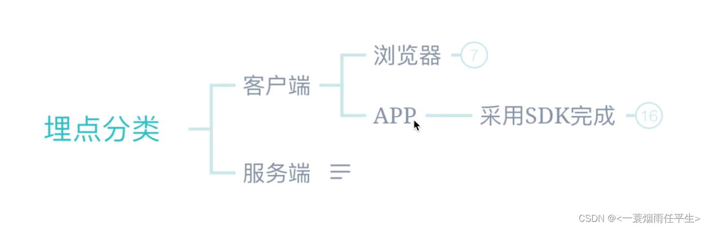
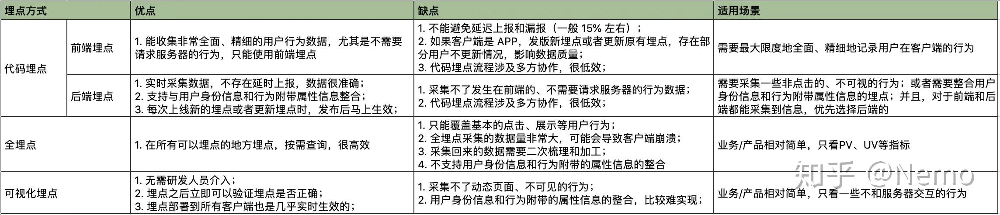
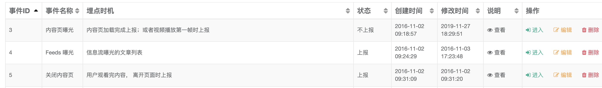
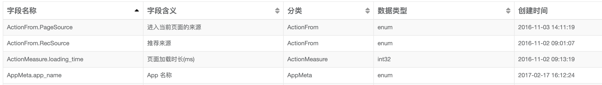
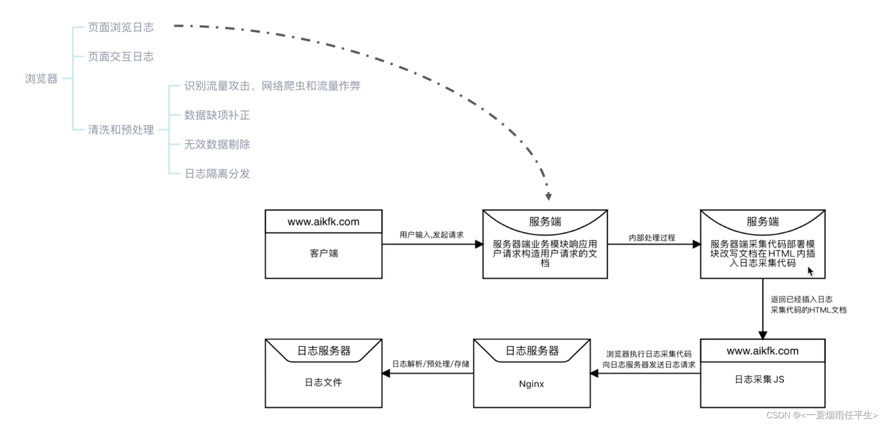
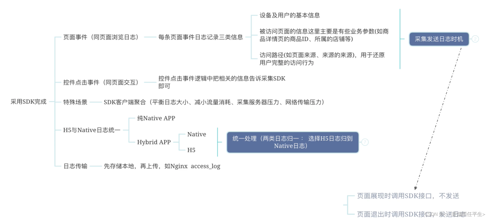
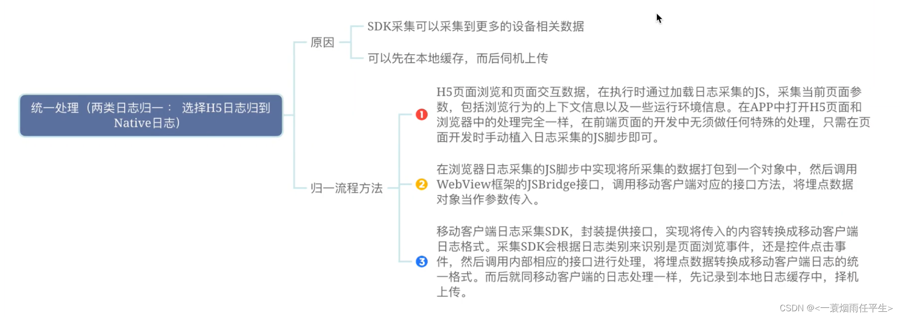

# 0.埋点前提

埋点的前提是我们知道自己需要什么样的数据；

埋点就是将我们关心的数据保存下来的技术；

# 1. 埋点

**什么是埋点？**

**埋点**是数据采集中的一个统称，通常也叫做事件追踪（Event Tracking），它主要针对特定用户行为或事件进行捕获、处理和发送的相关技术及其实施过程。埋点是为了满足快捷、高效、丰富的数据应用而做的用户行为过程及结果记录。数据埋点是一种常用的数据采集的方法。埋点是数据的来源，采集的数据可以分析网站/APP的使用情况，用户行为习惯等，是建立用户画像、用户行为路径等数据产品的基础。

> 举个例子，我们有个落地页，我们想知道有多少人来到了落地页，多少人看完了落地页的文案素材，多少人点击了转化按钮最终完成了转化。那么我们就需要记录每一个用户的访问记录、浏览行为记录、转化按钮点击记录等等。
>
> 在埋点里，这些用户的行为记录，就是事件。
>
> 如果我们想进一步分析，不同类型（男女老幼）、不同来源的用户，转化率之间的区别时，我们还需要在用户访问记录里，增加一些信息，例如用户性别、年龄、来源等等。这些信息，我们称之为属性。
>
> **事件和属性，就构成了埋点的基础。**
>
> 假设我们完整记录下了所有用户，在我们产品里的所有行为和属性时，理论上，我们就能够分析所有用户的行为习惯、产品效果。

# 2 埋点的作用

精准运营

用户画像

数据分析与挖掘

# 3 埋点分类

- **客户端埋点**：需要接入客户端的埋点SDK， 将实际的埋点代码嵌入到用户实际访问的页面中，一般用于采集用户的行为流等等，比如点击按钮，访问页面等等。
- **服务端埋点**：服务端埋点的原理和客户端埋点大体类似，只不过将埋点的主体放到了服务端，通过接入服务端的SDK后，在服务端代码中调用埋点API进行相关的埋点。两种分类各有各的好处和缺点，可以结合实际的需求来选择哪一种方式埋点。

# 4 埋点方式

1. **代码埋点**：将上报的逻辑，直接写到业务代码里

   - 前端埋点，基本上是由客户端、前端页面，直接将用户的行为记录下来，进行上报。因此可以记录得非常详细齐全，一些本地完成的操作，也可以得到上报。
   - 后端埋点，是将用户与服务端的交互记录进行上报。由于服务端记录比较精准，因而这种数据一般都比较可靠。而且一些没有发生在用户界面上的操作变化，也能通过后端埋点记录下来，比如商品库存的变化。

2. **可视化埋点**：它本质上也是前端全埋点，用只不过是要求用户以可视化的方式选择具体的埋点元素。只有当用户选定后，系统才会进行埋点上报，否则就不处理。

3. **全埋点**=无埋点
   将预先定义的某类事件（通常包括这四种事件类型：APP启动、APP关闭、页面访问、元素点击），通过SDK实现完全自动上报。比如当用户访问本产品的任何页面时，都会自动上报PV数据。

   自动上报数据时，会将页面的名称、按钮的名称等作为属性信息上报，方便我们理解用户访问了哪个页面，点击了什么按钮。

   当然，这也就意味着页面和按钮名称需要尽可能统一好理解。

   > 实现全埋点时，需要规范页面和元素的命名规则。比如**淘宝就通过SPM码规范，来标识具体的页面和元素**。
   >
   > SPM码的全称是 super position model（超级位置模型），它通过五个字符串，将一个页面功能位置，唯一标识出来，下面是一个SPM码的格式：
   >
   > SPM=SPMA.SPMB.SPMC.SPMD.SPME
   >
   > - SPMA 唯一标识一个站点
   > - SPMB 唯一标识某站点的一个页面
   > - SPMC 唯一标识某页面的一个区块
   > - SPMD 唯一标识某区块的一个具体位置
   > - SPME 随机生成的字串，跟时间有关系，在循环页面计算时可以区分点击的时序
   >
   > 举个具体的例子：
   >
   > SPM=smpc.home.top-news1.6.1600337661320wCquJhc
   >
   > 这个SPM码，就表明位置是smpc站点——首页——置顶新闻——第6位的内容
   >
   > 有了这个SPM码，我们就能自动编码产品里的每一个页面和位置。通过配合SPM位置编码，全埋点基本上就可以实现全APP内，页面浏览数据的记录。甚至还可以通过页面的前后跳转关系，记录页面转化率。

# 5.埋点的流程

当然，完整记录所有的数据，几乎不太可能。我们只能根据需求，记录我们定义好的少部分数据信息。**这个定义和记录的过程，就是我们常说的埋点流程。**

> 比如前文所说的：想知道有多少用户来到了落地页（分不同性别年龄来看），多少人看完了落地页的文案素材，多少人最终完成了转化。
>
> 下一步，我们就可以将这些数据，拆分成具体的事件和需要上报的属性。比如：
>
> - 访问落地页事件：当用户访问落地页时上报用户ID、性别、年龄、访问时间等数据
> - 落地页浏览事件：当用户到达落地页末尾时上报用户ID、浏览时间等数据
> - 转化事件：当用户点击「购买」按钮时上报用户ID、转化事件等数据
> - ......
>
> 事件以表格的形式进行记录，如下：
>
> 
>
> 字段就是属性，形式如下：
>
> 
>
> 前文提到过，事件和属性构成了埋点的基础，这里算是一个具体的案例。
>
> 当然，**上述的拆分过程，一般是由数据分析师或数据产品完成。接下来，我们需要将这些事件和属性，告诉业务开发，让他们在代码里增加上报逻辑（这里以代码埋点为例）。在这些事件发生时，将对应的上报信息，上报到数据服务器。**
>
> **一旦到了数据服务器，我们就可以通过SQL等工具，完成数据提取和分析了**。

## 5.1客户端浏览器数据埋点流程

## 5.2APP端的数据埋点流程

**H5日志与Native日志归一方式：**

# 6.埋点常见问题

- **数据不准**：前端埋点很容易出现这个问题，因为上报的链路非常长，用户可能由于网络原因、本地机器原因，未能上报成功，或者部分成功。想要完全杜绝这个问题基本上不可能，客户端天然就会有5%左右的数据偏差。对于精度要求特别高的内容，我们需要参考服务端的数据。
- **口径不统一**：举个例子，iOS和安卓的同一个事件，两端的名称不同。这样会带来分析的问题。解决这个问题，需要在埋点验收的环节，尽量做到彻底。
- **不用常规的埋点方法**：
  - 只使用三方工具：很多团队会图省事，采用三方工具来埋点，比如直接采用友盟、百度统计这样的第三方统计工具，通过嵌入 App SDK 或 JS SDK，来直接查看统计数据。这种方式只能采集很基础的数据，比如页面访问，按钮点击等等，但是想分析各个维度的情况，分析服务端的库存、订单情况，就基本上无法实现。
  - 只使用业务数据库：希望用业务数据库来完成数据分析，理论上可行，但是由于业务数据库面向OLTP的业务事务过程，很多中间数据不会保存，很多分析没办法做。而且性能上完全不支持大规模的数据分析，跑起来非常慢。
  - 通过web日志做分析：web日志很多时候仅仅是为了记录错误信息，而不是为了分析。因此仅仅通过这种方式来分析，是肯定不够的。

# 7.埋点管理系统

**为什么要对埋点进行管理？埋点管理的价值？**

- 埋点流程管理：如果要**新增埋点，可以由需求方发起，提交审批，然后通过后数据分析师进行埋点设计，数据开发进行实现**。这样流程更加规范。
- 事件和属性的理解（业务映射）：每个埋点到底是什么含义，触发机制是什么，这些信息不能纯靠人记，也不能从代码里看。我们需要一个管理平台，将这些内容记录下来，方便查阅和理解。甚至还可以监控它们的使用情况。
  - 事件信息：每个事件是否启动、数据量如何、修改记录、类别
  - 属性信息：数据监控、映射名称、属性管理
- 数据过滤和处理：对于一些明显错误的数据，我们可以设定一些数据过滤规则（如IP黑名单、事件属性、用户属性等），如果不符合条件，则将数据删除，不进行上报。

# 8.埋点应用

对一般的业务来说，通常会使用**前端+后端埋点的组合**方式：

- **前端**记录用户的行为日志，采用<u>全埋点+代码埋点</u>的综合模式，对页面访问等基础事件，全面记录和上报。对一些功能事件，增加专门的埋点事件。
- **后端**同步各项精准的业务数据日志，建立维度信息表，确保数据的准确性和全面性。

配合上埋点系统，持续对埋点数据进行管理，为数据分析、业务数据使用，提供源源不断的弹药。

# 9.埋点注意事项

埋点方案提前设计，与开发同步

做好测试，避免白埋

确定埋点标识唯一性，避免数据重复