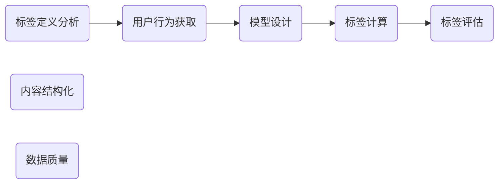
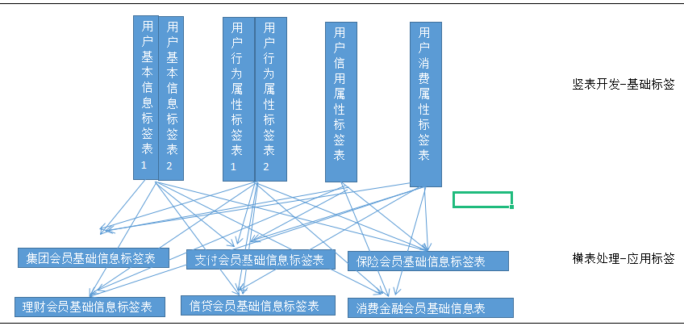

# 导学

 信贷数仓

- 架构
- 核心表
- 核心字段
- 核心指标

## 总体

项目目的：

业务

- 业务过程：
- 业务架构
- 业务开展
- 公司架构

技术架构

- 系统架构
- 数据分层
- 模型设计
- 数据流转

画像处理流程

## 细节

标签体系

- 分类
- 有哪些标签

标签开发

- 如何开发标签？RMF/客户消费层级（比较难的标签）
- 核心的表：标签表、任务表、进度表
- 核心的代码：完成标签计算的业务处理流程

标签的存储

- 哪些场景下适用那些数据库？要理解透

标签的管理

- 生命周期
- 流程：如何判断下线？如何下线？

标签的使用

1. 熟悉画像基础知识
2. 熟悉互联网金融行业业务和标签体系
3. 掌握标签开发和存储
4. 了解相关平台使用

# 第一章：

# 第二章：

1. 业务是如何开展的？
2. 公司内部的组织架构？

# 第三章：用户搭建指标体系

标签体系：就是分类，对全集的分类，把内容或用户依据统一的规则分到不同的类别中去，类与类之间彼此有联系，这便构成了标签体系

标签划分：横向和纵向。 一、二、三级为主分类标签，四级为业务标签（标签实体）、五级属性标签

<u>要能描述出体系内的具体标签</u>

## 按维度划分

`金融行业要关心用户的那些属性或那些行为？`（从四类标签体系中具体的标签回答）

### 1.用户属性维度指标体系

### 2.用户行为维度指标体系

### 3.用户信用维度指标体系

### 4.用户消费维度指标体系

## 按业务划分 标签体系

### 1.集团会员基础标签体系

表格中标黄的背诵

### 2.支付会员标签

<u>账号特征</u>

生命周期

<u>消费场景</u>

行为特征

### 3.保险会员标签

个人业务信息

行为特征

<u>投保</u>

<u>理赔</u>

营销

### 4.信贷会员标签

个人业务信息

行为特征

贷前

贷中

贷后

### 5.理财会员标签

个人业务信息

生命周期

行为特征

### 6.消费金融标签

个人业务信息

行为特征

贷前

贷中

贷后

## 统计方式分类

统计类标签

规则类标签

预测挖掘类标签

# 第四章：用户标签开发

**涉及的的工作**

-用户画像标签表结构设计

-标签的开发

-元数据管理（管理标签元数据，第六章详细介绍）

-数据同步同不同库中

-标签准确性校验（质量保障）

-ETL 调度流设计（高效、稳定保障每日数据的加工）

## 标签设计流程

## 标签表模型设计

表结构设计重点考虑：存储那些信息、如何存储信息（数据分区）、如何应用（如何抽取标签）

1.横表：一个key，跟上所有标签

2.竖表：把标签拆出来，有多少标签就有多少行
                 带来的是查询方面的问题

3.横表+竖表：

## 需要开发的表模型

基础标签表

