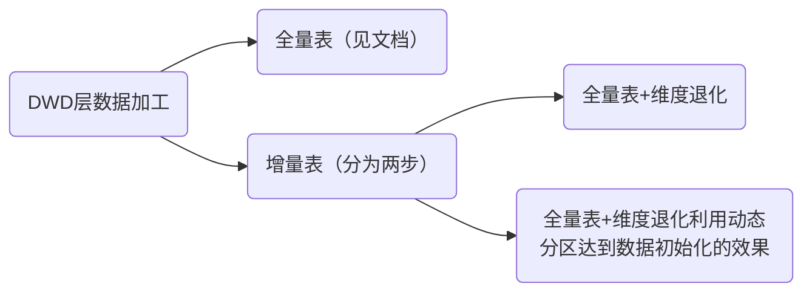

## 学习方法

从数仓架构图切入理解项目

- 数仓价值：数仓是干什么的、支撑什么应用
- 横向分层：ods……
- 纵向分域：用户域、商品域……
- 技术架构


## 信贷项目必须掌握的点

数仓架构

- 各层定位及边界
- 技术组件及定位
- 业务系统及数据源类型
- 数仓在企业的定位及价值
- 下游系统及职责定位

业务流程

- 贷前
- 贷中
- 贷后

数据应用

- BI报表
- 用户画像
- 数据服务
- 数据下发

模型开发

- 模型设计
- 命名规范
- 模型开发


## 信贷业务流程及细节介绍

==区别==
`进件平台`后：

- 申请进件是授信业务过程
- 支用申请是借款业务过程


风控（重要）

风控主要是包括反欺诈和识别信用风险两个方面，另外一个方面，信贷风控又可以分为贷前风控、贷中风控和贷后风控三个环节。


数仓分层架构（图片）是整个项目的核心，面试重点

分层方法和包含信息-->数据的流转过程

数据源：各系统讲解

ods：

dwd:

dws:宽表和窄表的优缺点、应用场景？


数仓分层的作用：


各层的概念、基础知识+具体的操作示例


ods层：增量同步分为创建时间同步和更新时间同步两种，具体有什么区别？没太理解（从代码的角度）

创建时间同步关注的是数据的新增；

更新时间同步关注的是数据的变更；


维度退化问题：如何判断是否需要退化，使用多？或者其他因素

具体退化到那一层或者表？

如何退化？确定退化的数据后直接加载到目标表中？

只有在dwd层才有维度退化？


dwd中的表分为三种：增量、全量、拉链表


dwd层：



清洗的规范和策略都是要清楚的，逻辑也要知道


## 指标

指标：dws层：维度+统计周期+修饰词=派生指标

 

不同的指标在不同的维度下去分析。


四个主要的业务过程：

授信：dwd_credit_apply_df

- 授信申请id
- cust_id	客户号
- 手机号
- 授信申请日期
- 授信申请额度
- 授信申请状态（成功、失败、申请中）		
- 额度id	

额度：dwd_lmt_df

- 额度号
- 总额度
- 当前可用额度
- 已使用额度
- 额度生效时间
- 额度失效时间

借款：dwd_loan_apply_df

- 借款申请id
- cust_id
- 手机号
- 借款申请日期
- 借款申请状态
- 借款申请金额
- 额度id

放款：dwd_fangkuan_df

- 放款流水号
- cust_id
- 手机号
- 放款日期
- 放款金额
- 放款状态

``` sql

select
	count(
        dis
        --  时间维度
        case when apply_dt >='2022-01-01'
        cust_id
    )
from 
	dwd_credit_apply_df
where 
	-- 时间维度
group by 
	city_id,产品，渠道
```


## 报表：

报表一：授信通过率监控报表

```sql
dwd_credit_apply_df	授信申请日全量表
	cust_id	客户号
	credit_apply_date	授信申请日期
	credit_apply_channel	授信申请渠道
	credit_apply_amount	授信申请额度
	credit_apply_status	授信申请状态

-- 这种写法把条件限制在了产品A/B，并不符合dws的建设，
-- 例如要拓展到产品A/B/C,指标会对应不上
insert overwrite into dws_credit_channel_1d
select
	credit_apply_date
	,credit_apply_channel
	-- 授信申请人数
	,count(distint cust_id) as credit_apply_num
	-- 授信申请成功人数
	,count(distinct case when credit_apply_status='成功' then cust_id end) as credit_apply_succe_num
	-- 授信申请成功率
	,count(distinct case when credit_apply_status='成功' then cust_id end)/count(distint cust_id) as credit_apply_succe_rate
	-- 平均授信额度
	,avg(credit_apply_amount) as avg_credit_apply_amount
from dwd_credit_apply_df
where product_code in ('产品A','产品B')
group by credit_apply_date,credit_apply_channel

-- 因此可以采用维度退化
select
	credit_apply_date
	,credit_apply_channel
	-- 授信申请人数
	,count(distint case when product_code in ('产品A','产品B') then cust_id end) as credit_apply_num
	-- 授信申请成功人数
	,count(distinct case when credit_apply_status='成功' then cust_id end) as credit_apply_succe_num
	-- 授信申请成功率
	,count(distinct case when credit_apply_status='成功' then cust_id end)/count(distint cust_id) as credit_apply_succe_rate
	-- 平均授信额度
	,avg(credit_apply_amount) as avg_credit_apply_amount
from dwd_credit_apply_df
group by credit_apply_date,credit_apply_channel
```


项目需求：数据服务需求：

```sql
insert overwrite into ads_user_equipment_register_id
select
	register_date,--注册日期
	equipment_id, --设备id
	count(distinct phone_no) as phone_cnt --手机号数量
from dwd_user_register_info_df
where pt_date='2022-10-01'
group by register_date,equipment_id;
	
```

